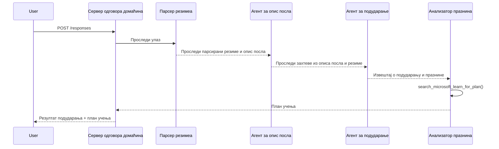

# Модул 3 - Конфигуришите инструкције, окружење и инсталирајте зависности

⏱️ ~15 минута

У овом модулу ћете трансформисати скафолдовани шаблон у **ваш** мулти-агентски ток рада - подешавањем променљивих окружења, писањем инструкција агента, додавањем MCP алата, повезивањем графа тока рада и инсталацијом зависности.

> **Референца:** Комплетан радни код је у [`PersonalCareerCopilot/main.py`](../../../../../workshop/lab02-multi-agent/PersonalCareerCopilot/main.py). Користите га као референцу приликом изградње вашег сопственог графа тока рада и блокова упита.

---

## Како четири агента функционишу заједно


```mermaid
sequenceDiagram
    participant User
    participant Server as Сервер одговора домаћина
    participant RP as Парсер резимеа
    participant JD as Агент за опис посла
    participant MA as Агент за подударање
    participant GA as Анализатор празнина

    User->>Server: POST /responses
    Server->>RP: Проследи улаз
    RP-->>JD: Проследи парсирани резиме и опис посла
    JD-->>MA: Проследи захтеве из описа посла и резиме
    MA-->>GA: Извештај о подударању и празнине
    GA->>GA: search_microsoft_learn_for_plan()
    GA-->>Server: План учења
    Server-->>User: Резултат подударања + план учења
```

---

## Корак 1: Конфигуришите променљиве окружења

1. Отворите **`.env`** фајл у корену вашег пројекта (креиран од стране скафолд чаробњака).
2. Замените места за унос са вашим стварним вредностима из Лабораторије 01.

<details open>
<summary><strong>🅰️ Путања А - Foundry претплата</strong></summary>

```env
FOUNDRY_PROJECT_ENDPOINT=https://<your-account>.services.ai.azure.com/api/projects/<your-project>
AZURE_AI_MODEL_DEPLOYMENT_NAME=gpt-4.1-mini
```

> **Где пронаћи вредности:** Погледајте [Лабораторија 01, Модул 1](../../lab01-single-agent/docs/01-setup.md#deploy-a-model--assign-rbac).

</details>

<details open>
<summary><strong>🅱️ Путања Б - Foundry Локално</strong></summary>

```env
FOUNDRY_PROJECT_ENDPOINT=http://localhost:5273/v1
AZURE_AI_MODEL_DEPLOYMENT_NAME=phi-4-mini
```

> Сва извршења инференције се одвијају на вашем рачунару - ниједан податак не напушта ваш уређај. Покрените `foundry model list` да бисте потврдили тачан алијас модела. Једини одлазни захтев је позив MCP алата ка `https://learn.microsoft.com/api/mcp`.

> **Где пронаћи вредности:** Погледајте [Лабораторија 01, Модул 1 - локална путања](../../lab01-single-agent/docs/01-setup.md#step-2-set-up-based-on-your-access).

</details>

> **Безбедност:** Никада не комитујте `.env` у систем контроле верзија. Требало би да већ буде у `.gitignore`.

---

## Корак 2: Напишите инструкције за агенте

Инструкције дефинишу улогу сваког агента, формат излаза и правила. Отворите `main.py` и дефинишите (или замените) четири константе инструкција - цели низови су у [`PersonalCareerCopilot/main.py`](../../../../../workshop/lab02-multi-agent/PersonalCareerCopilot/main.py).

### 2.1 `RESUME_PARSER_INSTRUCTIONS`
Парсирају резиме у структуирани профил кандидата **и** копирају опис посла дословно у `[JOB DESCRIPTION PASS-THROUGH]`. Обе означене секције морају се појавити у излазу.

> **Зашто пројекција?** Са `context_mode="last_agent"`, ResumeParser је **једини** агент који види оригиналну поруку корисника. Ако не копира опис посла даље, следећи агенти никада неће видети те информације.

### 2.2 `JOB_DESCRIPTION_INSTRUCTIONS`
Чита `[PARSED RESUME]` и `[JOB DESCRIPTION PASS-THROUGH]` из ResumeParser излаза. Излази `[JD REQUIREMENTS]` (структуирани захтеви) и `[PARSED RESUME PASS-THROUGH]` (дословна копија резимеа за MatchingAgent).

### 2.3 `MATCHING_AGENT_INSTRUCTIONS`
Чита `[JD REQUIREMENTS]` и `[PARSED RESUME PASS-THROUGH]`. Производи извештај о оцени усклађености (0–100) са детаљном анализом, упареним вештинама, недостајућим вештинама и усклађивањем искуства.

### 2.4 `GAP_ANALYZER_INSTRUCTIONS`
Чита извештај о усклађености. За **сваки** недостајући скилл, позива `search_microsoft_learn_for_plan` да дохвати Microsoft Learn ресурсе. Производи једну детаљну картицу празнине по вештини плус учењачки план недеља по недеља.

---

## Корак 3: Додајте MCP алат

GapAnalyzer позива [Microsoft Learn MCP сервер](https://learn.microsoft.com/azure/foundry/agents/how-to/tools/model-context-protocol) да дохвати праве ресурсе учења за сваку празнину у вештинама. Цела функција `search_microsoft_learn_for_plan` је у [`PersonalCareerCopilot/main.py`](../../../../../workshop/lab02-multi-agent/PersonalCareerCopilot/main.py).

Региструјте алат на GapAnalyzer-у приликом креирања агента:

```python
gap_analyzer = Agent(
    client=client,
    instructions=GAP_ANALYZER_INSTRUCTIONS,
    name="GapAnalyzer",
    tools=[search_microsoft_learn_for_plan],
)
```

> Погледајте [`PersonalCareerCopilot/main.py`](../../../../../workshop/lab02-multi-agent/PersonalCareerCopilot/main.py) за комплетан `WorkflowBuilder` граф са `FoundryChatClient`, `AgentExecutor` и свим позивима `add_edge()`.

---

## Корак 4: Креирајте виртуелно окружење и инсталирајте зависности

> ⚠️ **Не прескакајте овај корак.** Без инсталираних зависности, F5 дебагирање неће успети.

### 4.1 Креирајте виртуелно окружење

```powershell
python -m venv .venv
```

### 4.2 Активирајте га

| ОС | Команда |
|----|---------|
| **Windows (PowerShell)** | `.\.venv\Scripts\Activate.ps1` |
| **Windows (CMD)** | `.venv\Scripts\activate.bat` |
| **macOS / Linux** | `source .venv/bin/activate` |

Требало би да видите `(.venv)` у вашој терминалској линији.

### 4.3 Инсталирајте зависности

```powershell
pip install -r requirements.txt
```

### 4.4 Проверите

```powershell
pip list | Select-String "agent-framework|mcp|debugpy"
```

Очекује се: `agent-framework-foundry`, `agent-framework-foundry-hosting`, `mcp` и `debugpy` су на списку.

---

## Корак 5: Потврдите аутентификацију

<details open>
<summary><strong>🅰️ Путања А - Azure акредитиви</strong></summary>

```powershell
az account show --query "{name:name, id:id}" --output table
```

Ако ово не успе, покрените [`az login`](https://learn.microsoft.com/cli/azure/authenticate-azure-cli-interactively).

Сва четири агента деле један `FoundryChatClient` и један `DefaultAzureCredential`. Ако аутентификација ради за једног, радиће за све.

</details>

<details open>
<summary><strong>🅱️ Путања Б - Foundry Локално</strong></summary>

Локално тестирање не захтева аутентификацију.

</details>

---

### ✅ Контролна тачка

> Не настављајте на Модул 04 док: **(1)** `(.venv)` није видљив у вашој линији упита И **(2)** `pip install -r requirements.txt` није успешно завршен.

- [ ] `.env` садржи валидне именове крајњих тачака и модела (не смеју бити места за унос)
- [ ] Све 4 константе инструкција агената дефинисане у `main.py` (ResumeParser, JD Agent, MatchingAgent, GapAnalyzer)
- [ ] MCP алат `search_microsoft_learn_for_plan` дефинисан и регистрован на GapAnalyzer-у
- [ ] Креирани `FoundryChatClient` + 4 `Agent` + 4 `AgentExecutor` објекти у `main()`
- [ ] `WorkflowBuilder` гради исправан секвенцијални граф са свим 3 позива `add_edge()`
- [ ] Виртуелно окружење креирано и активирано (`(.venv)` видљив у линији упита)
- [ ] `pip install -r requirements.txt` завршен без грешака
- [ ] **Путања А:** `az account show` успешно ИЛИ икона налога у VS Code показује пријављени налог

---

**Претходно:** [02 - Scaffold Multi-Agent Project](02-scaffold-multi-agent.md) · **Следеће:** [04 - Orchestration Patterns →](04-orchestration-patterns.md)

---

<!-- CO-OP TRANSLATOR DISCLAIMER START -->
**Изјава о одрицању одговорности**:
Овај документ је преведен коришћењем услуге за аутоматски превод [Co-op Translator](https://github.com/Azure/co-op-translator). Иако тежимо тачности, имајте у виду да аутоматски преводи могу садржати грешке или нетачности. Оригинални документ на његовом изворном језику треба сматрати ауторитативним извором. За критичне информације препоручује се професионални људски превод. Нисмо одговорни за било каква неспоразума или погрешна тумачења која произилазе из коришћења овог превода.
<!-- CO-OP TRANSLATOR DISCLAIMER END -->