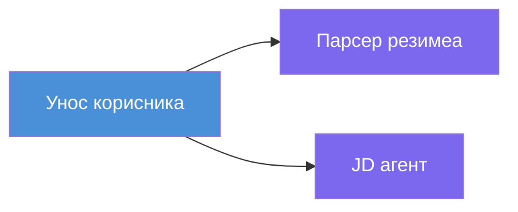
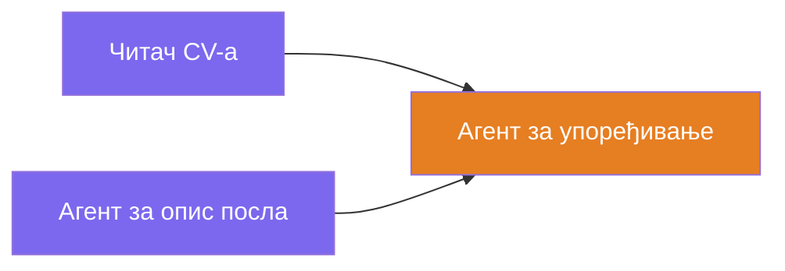
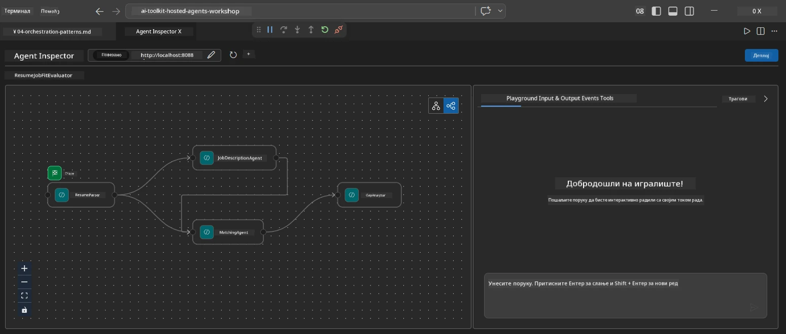
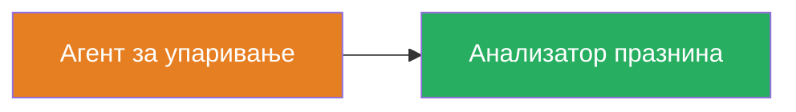
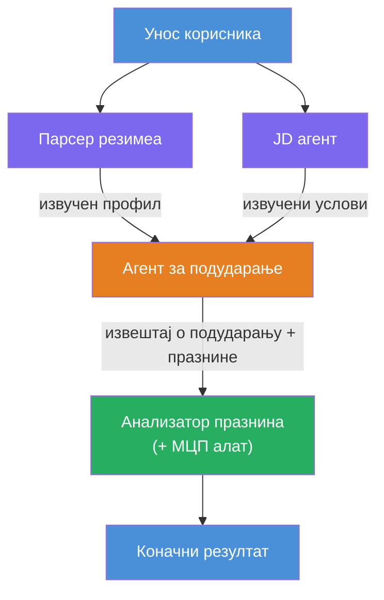
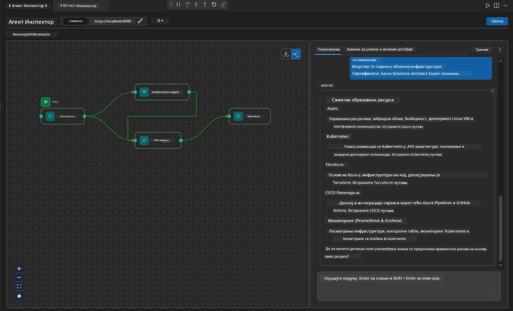

# Модул 4 - Обрасци оркестрације

У овом модулу истражујете обрасце оркестрације коришћене у Resume Job Fit Evaluator и учите како да читате, модификујете и проширите граф радног тока. Разумевање ових образаца је кључно за отклањање проблема у протоку података и изградњу ваших [виšе-агентских радних токова](https://learn.microsoft.com/agent-framework/workflows/).

---

## Образац 1: Fan-out (паралелно разгранaвање)

Први образац у радном току је **fan-out** - један улаз се истовремено шаље више агената.


У коду, ово се дешава јер је `resume_parser` `start_executor` - он прво прими поруку корисника. Затим, пошто оба `jd_agent` и `matching_agent` имају ивице од `resume_parser`, оквир рутитује излаз `resume_parser` ка оба агента:

```python
.add_edge(resume_parser, jd_agent)         # Резултат ResumeParser-а → JD агент
.add_edge(resume_parser, matching_agent)   # Резултат ResumeParser-а → MatchingAgent
```

**Зашто ово ради:** ResumeParser и JD Agent обрађују различите аспекте истог улаза. Покретање њих паралелно смањује укупно кашњење у односу на покретање секвенцијално.

### Када користити fan-out

| Примена | Пример |
|---------|--------|
| Независне подзадатке | Парсирање резимеа у односу на парсирање JD |
| Редундантност / гласање | Два агента анализирају исте податке, трећи бира најбољи одговор |
| Излаз у више формата | Један агент генерише текст, други генерише структуирани JSON |

---

## Образац 2: Fan-in (агрегација)

Други образац је **fan-in** - излази више агената се сакупљају и шаљу једном доњем агенту.


У коду:

```python
.add_edge(resume_parser, matching_agent)   # Излаз ResumeParser-а → MatchingAgent
.add_edge(jd_agent, matching_agent)        # Излаз JD Agent-а → MatchingAgent
```

**Кључно понашање:** Када агент има **две или више улазних ивица**, оквир аутоматски чека да **сви** горњи агенти заврше пре него што покрене доњи агент. MatchingAgent не почиње док ResumeParser и JD Agent не заврше оба.

### Шта MatchingAgent прима

Оквир спаја излазе свих горњих агената. Улаз MatchingAgent-а изгледа овако:

```
[ResumeParser output]
---
Candidate Profile:
  Name: Jane Doe
  Technical Skills: Python, Azure, Kubernetes, ...
  ...

[JobDescriptionAgent output]
---
Role Overview: Senior Cloud Engineer
Required Skills: Python, Azure, Terraform, ...
...
```

> **Напомена:** Тачан формат спајања зависи од верзије оквира. Упутства за агента треба написати тако да се носи са структурираним и неструктурираним улазом с горњег нивоа.



---

## Образац 3: Секвенцијални ланац

Трећи образац је **секвенцијално ланчање** - излаз једног агента директно се прослеђује следећем.


У коду:

```python
.add_edge(matching_agent, gap_analyzer)    # Излаз MatchingAgent → GapAnalyzer
```

Ово је најједноставнији образац. GapAnalyzer прима оцену уклапања, усклађене/недостајуће вештине и празнине од MatchingAgent-а. Он затим позива [MCP алат](https://learn.microsoft.com/azure/foundry/agents/how-to/tools/model-context-protocol) за сваку празнину да би повукао ресурсе са Microsoft Learn.

---

## Потпун граф

Комбинација сва три обрасца даје цео радни ток:


### Временска линија извршења

```mermaid
gantt
    title Временска линија извршавања агента
    dateFormat X
    axisFormat %s

    section Паралелно
    Resume Parser       :rp, 0, 3
    JD Agent            :jd, 0, 2

    section Серијски
    Matching Agent      :ma, 3, 5
    Gap Analyzer        :ga, 5, 9
```


> Укупно вренме је отприлике `max(ResumeParser, JD Agent) + MatchingAgent + GapAnalyzer`. GapAnalyzer је обично најспорији јер прави више позива MCP алату (по празнини).

---

## Читање WorkflowBuilder кода

Ево целе функције `create_workflow()` из `main.py`, са објашњењима:

```python
def create_workflow(resume_parser, jd_agent, matching_agent, gap_analyzer):
    workflow = (
        WorkflowBuilder(
            name="ResumeJobFitEvaluator",

            # Први агент који добија унос корисника
            start_executor=resume_parser,

            # Агент(и) чији излаз постаје коначни одговор
            output_executors=[gap_analyzer],
        )
        # Распаљивање: Излаз ResumeParser иде и ка JD Agent-у и ка MatchingAgent-у
        .add_edge(resume_parser, jd_agent)
        .add_edge(resume_parser, matching_agent)

        # Спајање: MatchingAgent чека и ResumeParser и JD Agent
        .add_edge(jd_agent, matching_agent)

        # Секвенцијално: Излаз MatchingAgent-а иде у GapAnalyzer
        .add_edge(matching_agent, gap_analyzer)

        .build()
    )
    return workflow.as_agent()
```

### Табела резимеа ивица

| # | Ивица | Образац | Ефекат |
|---|-------|---------|--------|
| 1 | `resume_parser → jd_agent` | Fan-out | JD Agent добија излаз ResumeParser-а (плус оригинални улаз корисника) |
| 2 | `resume_parser → matching_agent` | Fan-out | MatchingAgent добија излаз ResumeParser-а |
| 3 | `jd_agent → matching_agent` | Fan-in | MatchingAgent добија и излаз JD Agent-а (чека оба) |
| 4 | `matching_agent → gap_analyzer` | Секвенцијално | GapAnalyzer добија извештај о уклапању + листу празнина |

---

## Модификовање графа

### Додавање новог агента

Да бисте додали петог агента (нпр. **InterviewPrepAgent** који генерише питања за интервју на основу анализе празнина):

```python
# 1. Дефиниши упутства
INTERVIEW_PREP_INSTRUCTIONS = """\
You are the Interview Prep Agent.
Given a gap analysis and fit report, generate 10 targeted interview questions
the candidate should prepare for.
"""

# 2. Креирај агента (унутар async with блока)
AzureAIAgentClient(
    project_endpoint=PROJECT_ENDPOINT,
    model_deployment_name=MODEL_DEPLOYMENT_NAME,
    credential=credential,
).as_agent(
    name="InterviewPrepAgent",
    instructions=INTERVIEW_PREP_INSTRUCTIONS,
) as interview_prep,

# 3. Додај ивице у create_workflow()
.add_edge(matching_agent, interview_prep)   # прими извештај о уклапању
.add_edge(gap_analyzer, interview_prep)     # такође прими картице јаза

# 4. Ажурирај output_executors
output_executors=[interview_prep],  # сада коначни агент
```

### Промена редоследа извршења

Да би JD Agent радио **после** ResumeParser-а (секвенцијално уместо паралелно):

```python
# Уклони: .add_edge(resume_parser, jd_agent)  ← већ постоји, задржати га
# Уклони имплицитни паралелизам тако што jd_agent неће директно примати унос корисника
# start_executor прво шаље resume_parser-у, а jd_agent добија
# излаз resume_parser-а преко ивице. Ово их чини секвенцијалним.
```

> **Важно:** `start_executor` је једини агент који добија сирови улаз корисника. Сви остали агенти примају излаз са својих горњих ивица. Ако желите да агент такође добије сирови улаз корисника, мора имати ивицу од `start_executor`.

---

## Честе грешке у графу

| Грешка | Симптом | Поправка |
|--------|---------|----------|
| Недостаје ивица до `output_executors` | Агент ради али је излаз празан | Проверите да ли постоји пут од `start_executor` до сваког агента у `output_executors` |
| Циклична зависност | Бесконачна петља или истек времена | Проверите да ниједан агент не шаље назад горњем агенту |
| Агент у `output_executors` без улазне ивице | Празан излаз | Додајте бар једну ивицу `add_edge(source, that_agent)` |
| Више `output_executors` без fan-in | Излаз садржи само одговор једног агента | Користите једног излазног агента који агрегира, или прихватите више излаза |
| Недостаје `start_executor` | `ValueError` при изградњи | Увек наведите `start_executor` у `WorkflowBuilder()` |

---

## Отklanjanje грешака у графу

### Коришћење Agent Inspector-а

1. Покрените агента локално (F5 или терминал - видите [Модул 5](05-test-locally.md)).
2. Отворите Agent Inspector (`Ctrl+Shift+P` → **Foundry Toolkit: Open Agent Inspector**).
3. Пошаљите тест поруку.
4. У панелу одговора инспектора тражите **стриминг излаз** - показује допринос сваког агента по реду.



### Коришћење логовања

Додајте логовање у `main.py` да пратите проток података:

```python
import logging
logger = logging.getLogger("resume-job-fit")

# У функцији create_workflow(), након израде:
logger.info("Workflow graph built with edges: RP→JD, RP→MA, JD→MA, MA→GA")
```

Логови сервера показују редослед извршења агената и позиве MCP алата:

```
INFO:resume-job-fit:Starting Resume -> Job Fit Evaluator HTTP server...
INFO:resume-job-fit:Server running on http://localhost:8088
INFO:agent_framework:Executing agent: ResumeParser
INFO:agent_framework:Executing agent: JobDescriptionAgent
INFO:agent_framework:Waiting for upstream agents: ResumeParser, JobDescriptionAgent
INFO:agent_framework:Executing agent: MatchingAgent
INFO:agent_framework:Executing agent: GapAnalyzer
INFO:agent_framework:Tool call: search_microsoft_learn_for_plan(skill="Kubernetes")
POST https://learn.microsoft.com/api/mcp → 200
INFO:agent_framework:Tool call: search_microsoft_learn_for_plan(skill="Terraform")
POST https://learn.microsoft.com/api/mcp → 200
```

---

### Контролна листа

- [ ] Можете идентификовати три обрасца оркестрације у радном току: fan-out, fan-in и секвенцијални ланац
- [ ] Разумете да агенти са више улазних ивица чекају да сви горњи агенти заврше
- [ ] Можете читати `WorkflowBuilder` код и повезати сваки позив `add_edge()` са визуелним графом
- [ ] Разумете временску линију извршења: паралелни агенти раде први, затим агрегација, потом секвенцијално
- [ ] Знате како да додате новог агента у граф (дефинишете упутства, креирате агента, додате ивице, ажурирате излаз)
- [ ] Можете идентификовати честе грешке у графу и њихове симптоме

---

**Претходно:** [03 - Configure Agents & Environment](03-configure-agents.md) · **Следеће:** [05 - Test Locally →](05-test-locally.md)

---

<!-- CO-OP TRANSLATOR DISCLAIMER START -->
**Ограничење одговорности**:  
Овај документ је преведен коришћењем AI преводилачке услуге [Co-op Translator](https://github.com/Azure/co-op-translator). Иако тежимо прецизности, молимо вас да имате на уму да аутоматски преводи могу садржати грешке или нетачности. Оригинални документ на његовом изворном језику треба сматрати ауторитетним извором. За критичне информације препоручује се професионални људски превод. Нисмо одговорни за било каква неспоразума или погрешне тумачења настале коришћењем овог превода.
<!-- CO-OP TRANSLATOR DISCLAIMER END -->