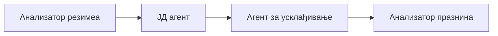
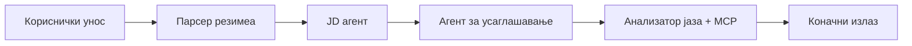

# Модул 4 - Обрасци оркестрације

⏱️ ~10 мин

У овом модулу истражујете обрасце оркестрације који се користе у Resume Job Fit Evaluator-у и учите како да читате, модификујете и проширујете график рада. Разумевање ових образаца је кључно за проналажење и исправљање грешака у току података и за изградњу сопствених [мулти-агентских радних токова](https://learn.microsoft.com/agent-framework/workflows/).

---

## Образац 1: Редоследни ланац

Основни образац у радном току је **редоследни ланац** - излаз сваког агента директно иде као улаз наредном.


```mermaid
flowchart LR
    RP[Анализатор резимеа] --> JD[ЈД агент]
    JD --> MA[Агент за усклађивање]
    MA --> GA[Анализатор празнина]
```

У коду, сваки `add_edge()` позив креира један корак у ланцу:

```python
.add_edge(resume_executor, jd_executor)       # РезимеПарсер излаз → ЈД Агент
.add_edge(jd_executor, matching_executor)     # ЈД Агент излаз → МаћингАгент
.add_edge(matching_executor, gap_executor)    # МаћингАгент излаз → ГапАнализер
```

> **Зашто редоследни, а не фан-аут/фан-ин?** `WorkflowBuilder` користи **OR-семантику** за улазне везе: извршилац доле активира се чим било који претходник заврши. Ако би `matching_executor` имао две улазне везе (од `resume_executor` и `jd_executor`), активирао би се два пута - једном када ResumeParser заврши и поново када JD Agent заврши - што би узроковало да GapAnalyzer такође ради два пута и да се излаз појави два пута. Редоследна линија потпуно избегава овај проблем.

## Образац 2: Прослеђивање садржаја

Пошто `context_mode="last_agent"` значи да сваки извршилац види само излаз свог **директног претходника**, агенти у редоследном ланцу морају експлицитно проследити све податке који су потребни агенатима доле у ланцу.

У овом радном току:
- **ResumeParser** копира JD дословно у `[JOB DESCRIPTION PASS-THROUGH]` (тако да га JD Agent може пронаћи).
- **JD Agent** копира `[PARSED RESUME]` дословно у `[PARSED RESUME PASS-THROUGH]` (тако да MatchingAgent може упоредити оба профила).

```
ResumeParser output
└─ [PARSED RESUME]               ← extracted by JD Agent
└─ [JOB DESCRIPTION PASS-THROUGH] ← extracted by JD Agent

JD Agent output
└─ [JD REQUIREMENTS]             ← extracted by MatchingAgent
└─ [PARSED RESUME PASS-THROUGH]  ← extracted by MatchingAgent
```

Сваки сегмент прослеђивања мора бити копиран **дословно** - сажимање или парафразирање кваре агента који се ослања на то.

---

## Комплетан график

Комбинација образаца редоследног ланца и прослеђивања садржаја производи цео радни ток:


```mermaid
flowchart LR
    U[Кориснички унос] --> RP[Парсер резимеа]
    RP --> JD[JD агент]
    JD --> MA[Агент за усаглашавање]
    MA --> GA[Анализатор јаза + MCP]
    GA --> O[Коначни излаз]
```

Agent Inspector приказује ову исту структуру графа када агент ради локално. Погледајте [Модул 5 - Тестирање Локално](05-test-locally.md) за снимке екрана.

---

## Читање кода WorkflowBuilder-а

Целу функцију `create_workflow()` можете наћи у [`PersonalCareerCopilot/main.py`](../../../../../workshop/lab02-multi-agent/PersonalCareerCopilot/main.py). Три позива `add_edge()` граде редоследну линију:

| # | Веза | Ефекат |
|---|-------|---------|
| 1 | `resume_executor → jd_executor` | JD Agent прима `[PARSED RESUME]` + `[JOB DESCRIPTION PASS-THROUGH]` |
| 2 | `jd_executor → matching_executor` | MatchingAgent прима `[JD REQUIREMENTS]` + `[PARSED RESUME PASS-THROUGH]` |
| 3 | `matching_executor → gap_executor` | GapAnalyzer прима извештај о уклопљености + листу празнина |

---

## Модификовање графика

### Додавање новог агента

Да бисте додали петог агента (нпр. **InterviewPrepAgent** након GapAnalyzer-а):

1. Дефинишите константу `INTERVIEW_PREP_INSTRUCTIONS`.
2. Креирајте објекте `Agent` + `AgentExecutor` (исти образац као за постојећа четири).
3. Додајте `.add_edge(gap_executor, interview_exec)` у `WorkflowBuilder`.
4. Ажурирајте `output_executors=[interview_exec]`.

> **Важно:** `start_executor` је једини агент који прима сиров кориснички улаз. Сви остали агенти примају излаз од свог горњег улаза.

---

## Честа грешка у графику

| Грешка | Симптом | Поправка |
|--------|---------|---------|
| Недостаје веза ка `output_executors` | Агенти раде али излаз је празан | Проверите да ли постоји пут од `start_executor` до сваког агента у `output_executors` |
| Циклична зависност | Бесконачна петља или истек времена | Проверите да ни један агент не упућује назад према горњем агенту |
| Агент у `output_executors` без улазне везе | Празан излаз | Додајте бар један `add_edge(source, that_agent)` |
| Више `output_executors` без фан-ин | Излаз садржи само одговор једног агента | Користите појединачног излазног агента који агрегира, или прихватајте више излаза |
| Недостаје `start_executor` | `ValueError` приликом изградње | Увек назначите `start_executor` у `WorkflowBuilder()` |

---

## Дебаговање графика

### Коришћење Agent Inspectora

1. Покрените агента локално са Ф5.
2. Отворите Agent Inspector (`Ctrl+Shift+P` → **Foundry Toolkit: Open Agent Inspector**).
3. Пошаљите тест поруку.
4. У панелу за одговоре Inspector-а погледајте **стриминг излаз** - приказује допринос сваког агента у низу.


### Коришћење логовања

Додајте логовање у `main.py` да бисте пратили ток података:

```python
import logging
logger = logging.getLogger("resume-job-fit")

# У функцији main(), након изградње радног тока:
logger.info("Workflow graph built with edges: RP→JD, JD→MA, MA→GA")
```

Логови сервера приказују редослед извршења агената и позиве MCP алата:

```
INFO:agent_framework:Executing agent: ResumeParser
INFO:agent_framework:Executing agent: JobDescriptionAgent
INFO:agent_framework:Executing agent: MatchingAgent
INFO:agent_framework:Executing agent: GapAnalyzer
INFO:agent_framework:Tool call: search_microsoft_learn_for_plan(skill="Kubernetes")
POST https://learn.microsoft.com/api/mcp → 200
INFO:agent_framework:Tool call: search_microsoft_learn_for_plan(skill="Terraform")
POST https://learn.microsoft.com/api/mcp → 200
```

---

### Контролна тачка

- [ ] Можете препознати два обрасца оркестрације у радном току: редоследни ланац и прослеђивање садржаја
- [ ] Разумете зашто `context_mode="last_agent"` захтева експлицитан пренос података између агената
- [ ] Можете читати код `WorkflowBuilder` и повезати сваки `add_edge()` позив са визуелним графиком
- [ ] Знате како да додате новог агента на крај линије
- [ ] Можете препознати честе грешке у графику и њихове симптоме

---

**Претходни:** [03 - Конфигурисање агената и окружења](03-configure-agents.md) · **Следећи:** [05 - Тестирање Локално →](05-test-locally.md)

---

<!-- CO-OP TRANSLATOR DISCLAIMER START -->
**Изјава о одрицању одговорности**:
Овај документ је преведен коришћењем услуге за аутоматски превод [Co-op Translator](https://github.com/Azure/co-op-translator). Иако тежимо тачности, имајте у виду да аутоматски преводи могу садржати грешке или нетачности. Оригинални документ на његовом изворном језику треба сматрати ауторитативним извором. За критичне информације препоручује се професионални људски превод. Нисмо одговорни за било каква неспоразума или погрешна тумачења која произилазе из коришћења овог превода.
<!-- CO-OP TRANSLATOR DISCLAIMER END -->