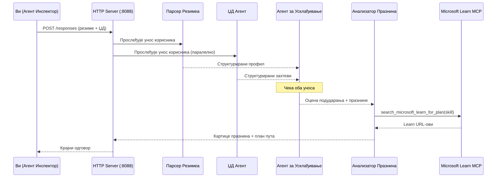
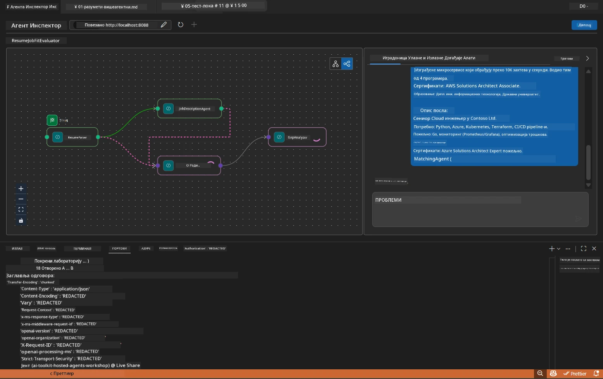

# Модул 5 - Локално тестирање (Више агената)

У овом модулу покрећете мулти-агентни ток рада локално, тестирате га са Agent Inspector и проверите да ли сва четири агента и MCP алат раде исправно пре него што их деплојујете на Foundry.

### Шта се дешава током локалног теста


---

## Корак 1: Покрените агент сервер

### Опција А: Користећи VS Code task (препоручено)

1. Притисните `Ctrl+Shift+P` → укуцајте **Tasks: Run Task** → изаберите **Run Lab02 HTTP Server**.
2. Task покреће сервер са прикљученим debugpy на порту `5679` и агентом на порту `8088`.
3. Сачекајте да се појави следећи излаз:

```
INFO:resume-job-fit:Starting Resume -> Job Fit Evaluator HTTP server...
INFO:resume-job-fit:Server running on http://localhost:8088
```

### Опција Б: Ручно преко терминала

```powershell
cd workshop\lab02-multi-agent\PersonalCareerCopilot
```

Активирајте виртуелно окружење:

**PowerShell (Windows):**
```powershell
.\.venv\Scripts\Activate.ps1
```

**macOS/Linux:**
```bash
source .venv/bin/activate
```

Покрените сервер:

```powershell
python -m debugpy --listen 127.0.0.1:5679 -m agentdev run main.py --verbose --port 8088
```

### Опција Ц: Користећи F5 (debug режим)

1. Притисните `F5` или идите на **Run and Debug** (`Ctrl+Shift+D`).
2. Изаберите **Lab02 - Multi-Agent** конфигурацију лансирања из падајућег менија.
3. Сервер ће почети да ради са пуном подршком за breakpoint-ове.

> **Савет:** Debug режим вам омогућава да поставите breakpoint-ове унутар `search_microsoft_learn_for_plan()` да бисте прегледали одговоре MCP, или унутар низа инструкција агента да видите шта сваки агент добија.

---

## Корак 2: Отворите Agent Inspector

1. Притисните `Ctrl+Shift+P` → укуцајте **Foundry Toolkit: Open Agent Inspector**.
2. Agent Inspector се отвара у табу прегледача на `http://localhost:5679`.
3. Требало би да видите агентски интерфејс спреман за примање порука.

> **Ако Agent Inspector не успе да се отвори:** Уверите се да је сервер потпуно покренут (видите "Server running" у лог-у). Ако је порт 5679 заузет, погледајте [Модул 8 - Решавање проблема](08-troubleshooting.md).

---

## Корак 3: Покрените smoke тестове

Покрените ова три теста по реду. Сваки тест проверава постепено више делова тока рада.

### Тест 1: Основни резиме + опис посла

Налепите следеће у Agent Inspector:

```
Resume:
Jane Doe
Senior Software Engineer with 5 years of experience in Python, Django, and AWS.
Built microservices handling 10K+ requests/second. Led a team of 4 developers.
Certifications: AWS Solutions Architect Associate.
Education: B.S. Computer Science, State University.

Job Description:
Senior Cloud Engineer at Contoso Ltd.
Required: Python, Azure, Kubernetes, Terraform, CI/CD pipelines.
Preferred: Go, monitoring (Prometheus/Grafana), cost optimization.
Experience: 5+ years in cloud infrastructure.
Certifications: Azure Solutions Architect Expert preferred.
```

**Очекујућа структура излаза:**

Одговор треба да садржи излаз свих четири агента у низу:

1. **Излаз Resume Parser-а** - Структурирани профил кандидата са вештинама груписаним по категоријама
2. **Излаз JD агента** - Структурирани захтеви са раздвојеним обавезним и жељеним вештинама
3. **Излаз Matching агента** - Оцена погодности (0-100) са детаљним разлагањем, пронађене вештине, недостајуће вештине, празнине
4. **Излаз Gap Analyzer-а** - Појединачне картице празнина за сваки недостатак са Microsoft Learn URL адресама



### Шта проверити у Тесту 1

| Провера | Очекује се | Прошао? |
|---------|------------|---------|
| Одговор садржи оцену погодности | Број између 0-100 са разлагањем | |
| Листиране пронађене вештине | Python, CI/CD (делимично), итд. | |
| Листиране недостајуће вештине | Azure, Kubernetes, Terraform, итд. | |
| Постоје картице празнина за сваки недостатак | Једна картица по вештини | |
| Microsoft Learn URL-ови су присутни | Прави `learn.microsoft.com` линкови | |
| Нема порука о грешкама у одговору | Чист и структурирани излаз | |

### Тест 2: Проверите извршење MCP алата

Док Тест 1 ради, проверите **терминал сервера** за MCP записе у лог-у:

```
GET https://learn.microsoft.com/api/mcp → 405 (Method Not Allowed)
POST https://learn.microsoft.com/api/mcp → 200
DELETE https://learn.microsoft.com/api/mcp → 405 (Method Not Allowed)
```

| Запис у логу | Значење | Очекује се? |
|--------------|----------|-------------|
| `GET ... → 405` | MCP клијент тестира GET током иницијализације | Да - нормално |
| `POST ... → 200` | Реални позив алата ка Microsoft Learn MCP серверу | Да - ово је стварни позив |
| `DELETE ... → 405` | MCP клијент тестира DELETE током чишћења | Да - нормално |
| `POST ... → 4xx/5xx` | Позив алата није успео | Не - видети [Решавање проблема](08-troubleshooting.md) |

> **Кључно:** Линије `GET 405` и `DELETE 405` су **очекивано понашање**. Брините само ако `POST` позиви враћају статусе различите од 200.

### Тест 3: Узорак са високим степеном погодности

Налепите резиме који блиско одговара опису посла да бисте проверили како GapAnalyzer рукује сценаријима високог степена погодности:

```
Resume:
Alex Chen
Senior Cloud Engineer with 7 years of experience.
Skills: Python, Azure (AKS, Functions, DevOps), Kubernetes, Terraform, CI/CD (GitHub Actions, Azure Pipelines), Go, Prometheus, Grafana, cost optimization.
Certifications: Azure Solutions Architect Expert, Azure DevOps Engineer Expert.
Led infrastructure migration to Azure for 3 enterprise clients.
Education: M.S. Computer Science, Tech University.

Job Description:
Senior Cloud Engineer at Contoso Ltd.
Required: Python, Azure, Kubernetes, Terraform, CI/CD pipelines.
Preferred: Go, monitoring (Prometheus/Grafana), cost optimization.
Experience: 5+ years in cloud infrastructure.
Certifications: Azure Solutions Architect Expert preferred.
```

**Очекујемо понашање:**
- Оцена погодности треба да буде **80+** (већина вештина одговара)
- Картице празнина треба да се фокусирају на припрему за интервју, а не на основно учење
- Инструкције GapAnalyzer-а кажу: "Ако је fit >= 80, фокусирај се на припрему за интервју"

---

## Корак 4: Проверите потпуност излаза

Након покретања тестова, уверите се да излаз испуњава следеће критеријуме:

### Контролна листа структуре излаза

| Секција | Агенс | Присутно? |
|---------|-------|-----------|
| Профил кандидата | Resume Parser | |
| Техничке вештине (груписане) | Resume Parser | |
| Преглед улоге | JD Agent | |
| Обавезне и жељене вештине | JD Agent | |
| Оцена погодности са разлагањем | Matching Agent | |
| Пронађене / Недостајуће / Делимичне вештине | Matching Agent | |
| Картица празнина за сваку недостајућу вештину | Gap Analyzer | |
| Microsoft Learn URL-ови на картицама празнина | Gap Analyzer (MCP) | |
| Редослед учења (бројчано) | Gap Analyzer | |
| Резиме временске линије | Gap Analyzer | |

### Уобичајени проблеми у овој фази

| Проблем | Узрок | Решење |
|---------|--------|--------|
| Само 1 картица празнина (остале скраћене) | Недостаје CRITICAL блок у инструкцијама GapAnalyzer-а | Додајте пасус `CRITICAL:` у `GAP_ANALYZER_INSTRUCTIONS` - видети [Модул 3](03-configure-agents.md) |
| Нема Microsoft Learn URL-ова | MCP endpoint није доступан | Проверите интернет конекцију. Уверите се да је `MICROSOFT_LEARN_MCP_ENDPOINT` у `.env` постављен на `https://learn.microsoft.com/api/mcp` |
| Празан одговор | `PROJECT_ENDPOINT` или `MODEL_DEPLOYMENT_NAME` није подешено | Проверите вредности у `.env` фајлу. Покрените `echo $env:PROJECT_ENDPOINT` у терминалу |
| Оцена погодности је 0 или недостаје | MatchingAgent није примао податке из претходних корака | Проверите да ли постоје `add_edge(resume_parser, matching_agent)` и `add_edge(jd_agent, matching_agent)` у `create_workflow()` |
| Агент се покрене али одмах изађе | Грешка при импорту или недостаје зависност | Покрените `pip install -r requirements.txt` поново. Проверите терминал за stack trace-ове |
| Грешка `validate_configuration` | Недостајуће environment променљиве | Креирајте `.env` фајл са `PROJECT_ENDPOINT=<ваш-endpoint>` и `MODEL_DEPLOYMENT_NAME=<ваш-модел>` |

---

## Корак 5: Тестирање са својим подацима (опционо)

Пробајте да залепите свој резиме и прави опис посла. Ово помаже да се провери:

- Агенти раде са различитим форматима резимеа (хронолошки, функционални, хибридни)
- JD Agent ради са различитим стиловима описа посла (тачке, пасуси, структурирано)
- MCP алат враћа релевантне ресурсе за стварне вештине
- Картице празнина су персонализоване према вашем специфичном профилу

> **Напомена о приватности:** При локалном тестирању ваши подаци остају на вашем рачунару и шаљу се само вашој Azure OpenAI деплојмент инстанци. Не бележе се нити чувају у инфраструктури радионице. Користите замене имена ако више волите (нпр. "Јана Доу" уместо стварног имена).

---

### Контролна тачка

- [ ] Сервер успешно покренут на порту `8088` (лог приказује "Server running")
- [ ] Agent Inspector отворен и повезан са агентом
- [ ] Тест 1: Комплетан одговор са оценом погодности, пронађеним/недостајућим вештинама, картицама празнина и Microsoft Learn URL адресама
- [ ] Тест 2: MCP логови показују `POST ... → 200` (позиви алата су успели)
- [ ] Тест 3: Кандидат са високим степеном погодности добија оцену 80+ са препорукама фокусираним на припрему
- [ ] Све картице празнина присутне (по једна за сваки недостатак, нема скраћивања)
- [ ] Нема грешака или stack trace-ова у терминалу сервера

---

**Претходно:** [04 - Orchestration Patterns](04-orchestration-patterns.md) · **Следеће:** [06 - Deploy to Foundry →](06-deploy-to-foundry.md)

---

<!-- CO-OP TRANSLATOR DISCLAIMER START -->
**Изјава о одрицању одговорности**:  
Овaј документ је преведен коришћењем AI сервиса за превођење [Co-op Translator](https://github.com/Azure/co-op-translator). Иако се трудимо да превод буде тачан, молимо вас да имате у виду да аутоматизовани преводи могу садржати грешке или нетачности. Изворни документ на његовом оригиналном језику треба сматрати ауторитетним извором. За критичне информације препоручује се професионални људски превод. Не сносимо одговорност за било каква неспоразума или погрешна тумачења која могу произаћи из коришћења овог превода.
<!-- CO-OP TRANSLATOR DISCLAIMER END -->