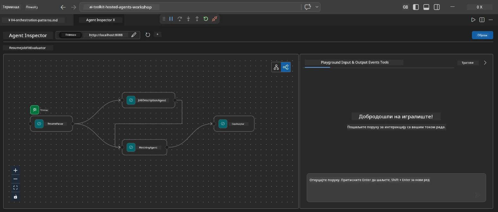
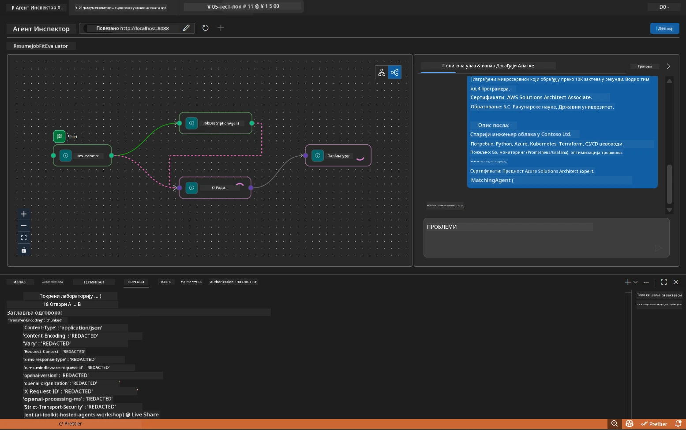
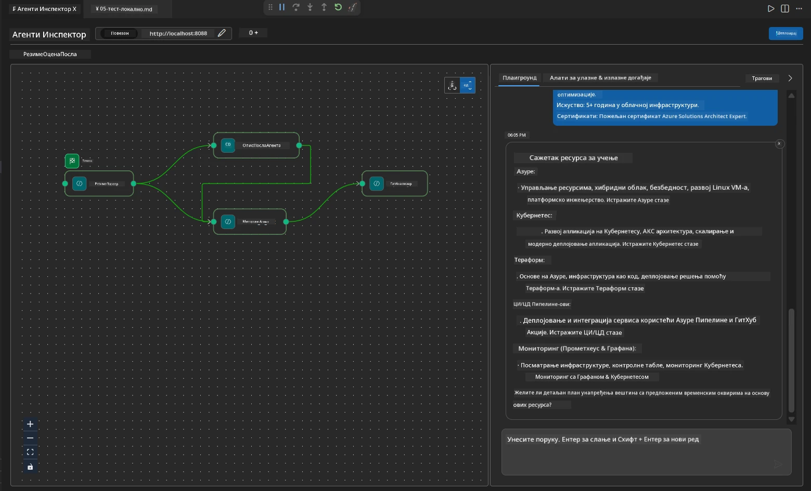

# Модул 5 - Локално тестирање

⏱️ ~15 мин

У овом модулу покрећете мулти-агентски ток рада локално, тестирате га са Agent Inspector-ом и проверите да ли сви четири агенти и алат MCP исправно функционишу пре распоређивања.

---

## Корак 1: Покрените агент сервер

### Опција А: Коришћење VS Code task-а (препоручено)

1. Отворите `workshop/lab02-multi-agent/PersonalCareerCopilot/` као свој VS Code фолдер.
2. Притисните `Ctrl+Shift+P` → укуцајте **Tasks: Run Task** → изаберите **Run Agent HTTP Server**.
3. Задак покреће сервер са debugpy прикљученим на порт `5679` и агентом на порту `8088`.
4. Сачекајте да се у излазном прозору прикаже:

```
INFO:resume-job-fit:Starting Resume -> Job Fit Evaluator HTTP server...
INFO:resume-job-fit:Server running on http://localhost:8088
```

### Опција Б: Коришћење дугмета F5 (режим дебага)

1. Притисните `F5` → изаберите **Debug Local Agent HTTP Server**.
2. Сервер се покреће са пуном подршком за тачке прекида - корисно за инспекцију одговора MCP-а или излаза агената.

---

## Корак 2: Отворите Agent Inspector

1. Притисните `Ctrl+Shift+P` → укуцајте **Foundry Toolkit: Open Agent Inspector**.
2. Agent Inspector се отвори као панел у VS Code-у повезан на `http://localhost:8088`.
3. Требало би да видите агентски интерфејс спреман за пријем порука.



> **Ако Agent Inspector не отвори:** Проверите да ли је сервер у потпуности покренут (видите "Server running" у евиденцији). Ако је порт 5679 заузет, погледајте [Модул 8 - Решавање проблема](08-troubleshooting.md).

---

## Корак 2б: (Опционо) Отворите визуализатор тока рада

Foundry Toolkit укључује визуализатор тока рада у реалном времену који приказује како агенти интерагују како графикон извршава. Ово је посебно корисно за дебаговање мулти-агента.

1. Притисните `Ctrl+Shift+P` → укуцајте **Foundry Toolkit: Open Visualizer for Hosted Agents**.
2. Отвориће се нови VS Code таб који приказује уживо граф извршавања.
3. Као што шаљете поруке у Agent Inspector-у, визуализатор се аутоматски ажурира - зелени чворови показују завршене агенте, а анимирана ивице приказују проток података између њих.

> **Конфликт портова:** Ако је порт визуализатора већ у употреби, промените га у VS Code подешавањима → **Extensions** → **Microsoft Foundry Configuration** → **Hosted Agents: Visualizer Port**.

---

## Корак 3: Покрените smoke тестове

Покрените ова три теста по реду. Сваки тест постепено проверава све више ток рада.

### Тест 1: Основни резиме + опис посла

Налепите следеће у Agent Inspector:

```
Resume:
Jane Doe
Senior Software Engineer with 5 years of experience in Python, Django, and AWS.
Built microservices handling 10K+ requests/second. Led a team of 4 developers.
Certifications: AWS Solutions Architect Associate.
Education: B.S. Computer Science, State University.

Job Description:
Senior Cloud Engineer at Contoso Ltd.
Required: Python, Azure, Kubernetes, Terraform, CI/CD pipelines.
Preferred: Go, monitoring (Prometheus/Grafana), cost optimization.
Experience: 5+ years in cloud infrastructure.
Certifications: Azure Solutions Architect Expert preferred.
```

**Очекује се структура одговора:**

Одговор треба да садржи излаз свих четири агента узастопно:

1. **Излаз Resume Parser-а** - Два означена дела: `[PARSED RESUME]` (профил кандидата са груписаним вештинама) и `[JOB DESCRIPTION PASS-THROUGH]` (буквални текст JD који се шаље JD агенту)
2. **Излаз JD агента** - Структурирани захтеви са одвојеним обавезним и пожељним вештинама
3. **Излаз Matching агента** - Поен о прикладности (0-100) са разлагањем, упарене вештине, недостајуће вештине, празнине
4. **Излаз Gap Analyzer-а** - Појединачне картице празнина за сваку недостајућу вештину, свака са Microsoft Learn URL-овима





### Шта проверити у Тесту 1

| Проверити | Очекује се | Прошао? |
|---------|------------|---------|
| Одговор садржи поен о прикладности | Број између 0-100 са разлагањем | |
| Наведене су упарене вештине | Python, CI/CD (делимично), итд. | |
| Наведене су недостајуће вештине | Azure, Kubernetes, Terraform, итд. | |
| Постоје картице празнина за сваку недостајућу вештину | Једна картица по вештини | |
| Присутни су Microsoft Learn URL-ови | Прави `learn.microsoft.com` линкови | |
| Нема порука о грешкама у одговору | Чист структурирани излаз | |

### Тест 2: Један случај - кандидат са високим поеном прикладности

Налепите резиме који блиско одговара JD-у како бисте проверили да GapAnalyzer правилно обрађује сценарије са високим поеном:

```
Resume:
Alex Chen
Senior Cloud Engineer with 7 years of experience.
Skills: Python, Azure (AKS, Functions, DevOps), Kubernetes, Terraform, CI/CD (GitHub Actions, Azure Pipelines), Go, Prometheus, Grafana, cost optimization.
Certifications: Azure Solutions Architect Expert, Azure DevOps Engineer Expert.
Led infrastructure migration to Azure for 3 enterprise clients.
Education: M.S. Computer Science, Tech University.

Job Description:
Senior Cloud Engineer at Contoso Ltd.
Required: Python, Azure, Kubernetes, Terraform, CI/CD pipelines.
Preferred: Go, monitoring (Prometheus/Grafana), cost optimization.
Experience: 5+ years in cloud infrastructure.
Certifications: Azure Solutions Architect Expert preferred.
```

**Очекује се понашање:**
- Поен о прикладности треба да буде **80+** (већина вештина се поклапа)
- Картице Празнина треба да се фокусирају на завршне припреме / спремност за интервју, а не на основно учење
- Упутства GapAnalyzer-а кажу: „Ако је поен >= 80, фокусирати се на завршне припреме/спремност за интервју“

---

## Корак 4: Тестирајте са својим подацима (опционо)

Покушајте да налепите свој резиме и стварни опис посла. Ово помаже да проверите:

- Агенти обрађују различите формате резимеа (хронолошки, функционални, хибридни)
- JD агент обрађује различите стилове JD-а (тачке, параграфи, структурирано)
- MCP алат враћа релевантне ресурсе за праве вештине
- Картице празнина су персонализоване према вашој конкретној позадини

> **Приватност - Пут А (Foundry cloud):** Текст резимеа и JD-а се шаље у вашу Azure OpenAI инсталацију ради инференце. Не бележи се и не чува у инфраструктури радионице. Користите имена замене (нпр. „Јане Дое“) ако желите.
>
> **Приватност - Пут Б (Foundry Local):** Све четири инференце агената се извршавају потпуно на вашем уређају. Ваш резиме и текст описa посла **никада не напушта ваш уређај**. Једини спољни позив је MCP алат који преузима ресурсе са `https://learn.microsoft.com/api/mcp`; тај упит садржи само назив вештине, не и ваше личне податке.

---

### Контролна тачка

- [ ] Сервер је успешно покренут на порту `8088` (у запису пише "Server running")
- [ ] Agent Inspector је отворен и повезан са агентом
- [ ] Тест 1: Комплетан одговор са поеном о прикладности, упареним/недостајућим вештинама, картицама празнина и Microsoft Learn URL-овима
- [ ] Тест 2: Кандидат са високим поеном добија 80+ са препорукама фокусираним на завршне припреме
- [ ] Све картице празнина су присутне (по једна за сваку недостајућу вештину, без скраћивања)
- [ ] Нема грешака или трага грешака у терминалу сервера

---

**Претходно:** [04 - Обрасци оркестрације](04-orchestration-patterns.md) · **Следеће:** [06 - Распоређивање у Foundry →](06-deploy-to-foundry.md)

---

<!-- CO-OP TRANSLATOR DISCLAIMER START -->
**Изјава о одрицању одговорности**:
Овај документ је преведен коришћењем услуге за аутоматски превод [Co-op Translator](https://github.com/Azure/co-op-translator). Иако тежимо тачности, имајте у виду да аутоматски преводи могу садржати грешке или нетачности. Оригинални документ на његовом изворном језику треба сматрати ауторитативним извором. За критичне информације препоручује се професионални људски превод. Нисмо одговорни за било каква неспоразума или погрешна тумачења која произилазе из коришћења овог превода.
<!-- CO-OP TRANSLATOR DISCLAIMER END -->