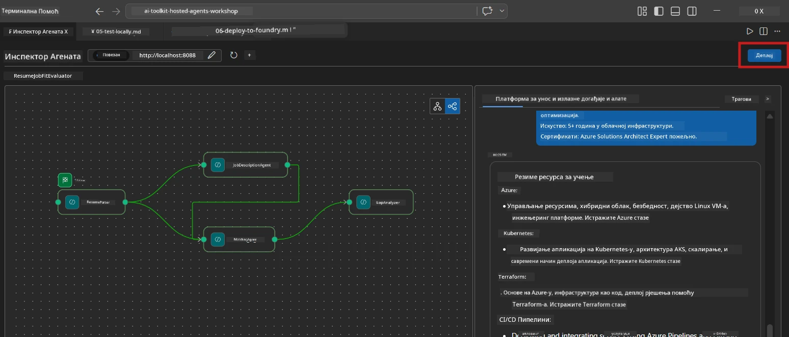
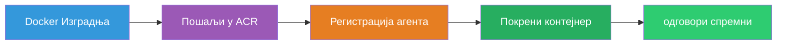
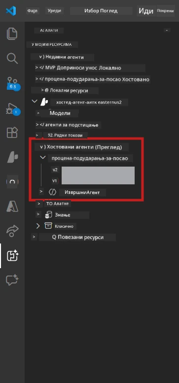

# Модул 6 - Деплој на Foundry Agent Service

У овом модулу ћете депловати ваш локално тестиран мулти-агентски ток рада на [Microsoft Foundry](https://learn.microsoft.com/azure/foundry/agents/concepts/hosted-agents) као **Hosted Agent**. Процес деплоја гради Docker контејнер слику, пуштује је у [Azure Container Registry (ACR)](https://learn.microsoft.com/azure/container-registry/container-registry-intro) и креира верзију hosted агентa у [Foundry Agent Service](https://learn.microsoft.com/azure/foundry/agents/how-to/publish-agent).

> **Кључна разлика у односу на Лаб 01:** Процес деплоја је идентичан. Foundry третира ваш мулти-агентски ток рада као једног hosted агента - комплексност је унутар контејнера, али је површина деплоја иста са `/responses` крајњом тачком.

---

## Провера предуслова

Пре деплоја проверите сваки од наведених ставки:

1. **Агент пролази локалне smoke тестове:**
   - Завршили сте сва 3 теста у [Модул 5](05-test-locally.md) и ток рада је произвео комплетан излаз са картицама и Microsoft Learn УРЛ-овима.

2. **Имате [Azure AI User](https://learn.microsoft.com/azure/foundry/concepts/rbac-foundry) улогу:**
   - Додељено у [Лаб 01, Модул 2](../../lab01-single-agent/docs/02-create-foundry-project.md). Потврдите:
   - [Azure Portal](https://portal.azure.com) → ваш Foundry **пројекат** ресурс → **Access control (IAM)** → **Role assignments** → потврдите да је **[Azure AI User](https://aka.ms/foundry-ext-project-role)** наведен за ваш налог.

3. **Пријављени сте у Azure у VS Code-у:**
   - Проверите икону Налога у доњем левом углу VS Code-а. Треба да буде видљиво ваше корисничко име.

4. **`agent.yaml` има исправне вредности:**
   - Отворите `PersonalCareerCopilot/agent.yaml` и проверите:
     ```yaml
     environment_variables:
       - name: PROJECT_ENDPOINT
         value: ${PROJECT_ENDPOINT}
       - name: MODEL_DEPLOYMENT_NAME
         value: ${MODEL_DEPLOYMENT_NAME}
     ```
   - Оне морају одговарати env варијаблама које ваш `main.py` чита.

5. **`requirements.txt` има исправне верзије:**
   ```
   agent-framework-azure-ai==1.0.0rc3
   agent-framework-core==1.0.0rc3
   azure-ai-agentserver-agentframework==1.0.0b16
   azure-ai-agentserver-core==1.0.0b16
   debugpy
   agent-dev-cli --pre
   ```

---

## Корак 1: Покрените деплој

### Опција А: Деплој из Agent Inspector-а (препоручено)

Ако је агент покренут преко F5 са отвореним Agent Inspector-ом:

1. Погледајте у **горњи десни угао** панела Agent Inspector-а.
2. Кликните на дугме **Deploy** (икона облака са стрелицом нагоре ↑).
3. Отвориће се чаробњак за деплој.



### Опција Б: Деплој из Command Palette-а

1. Притисните `Ctrl+Shift+P` да отворите **Command Palette**.
2. Откуцајте: **Microsoft Foundry: Deploy Hosted Agent** и изаберите то.
3. Отвориће се чаробњак за деплој.

---

## Корак 2: Конфигуришите деплој

### 2.1 Изаберите циљни пројекат

1. Падајући мени приказује ваше Foundry пројекте.
2. Изаберите пројекат који сте користили током радионице (нпр. `workshop-agents`).

### 2.2 Изаберите фајл контейнер агента

1. Бићете питани да изаберете улазну тачку агента.
2. Идите до `workshop/lab02-multi-agent/PersonalCareerCopilot/` и одаберите **`main.py`**.

### 2.3 Конфигуришите ресурсе

| Постављање | Препоручена вредност | Напомене |
|------------|---------------------|----------|
| **CPU**    | `0.25`              | Подразумевано. Мулти-агентски токови рада не захтевају више CPU јер су позиви модела I/O bound |
| **Memory** | `0.5Gi`             | Подразумевано. Повећајте на `1Gi` ако додате алате за обраду великих података |

---

## Корак 3: Потврдите и деплујте

1. Чаробњак приказује резиме деплоја.
2. Прегледајте и кликните **Confirm and Deploy**.
3. Пратите напредак у VS Code-у.

### Шта се дешава током деплоја

Пратите VS Code **Output** панел (изаберите "Microsoft Foundry" из падајућег менија):


1. **Docker build** - Гради контејнер из вашег `Dockerfile`:
   ```
   Step 1/6 : FROM python:3.14-slim
   Step 2/6 : WORKDIR /app
   ...
   Successfully built abc123def456
   ```

2. **Docker push** - Пуштује слику у ACR (1-3 минута при првом деплоју).

3. **Регистрација агента** - Foundry креира hosted агента користећи метаподатке из `agent.yaml`. Име агента је `resume-job-fit-evaluator`.

4. **Покретање контејнера** - Контејнер се покреће у Foundry-јевој управљаној инфраструктури са системском управљаном идентитетом.

> **Први деплој је спорији** (Docker пуштује све слојеве). Накнадни деплоји користе кеширане слојеве и бржи су.

### Напомене специфичне за мулти-агент

- **Свa четири агента су унутар једног контејнера.** Foundry види једног hosted агента. WorkflowBuilder граф се извршава изнутра.
- **Позиви MCP иду ка споља.** Контејнер треба интернет приступ да достигне `https://learn.microsoft.com/api/mcp`. Foundry-јева управљана инфраструктура то подразумевано омогућава.
- **[Managed Identity](https://learn.microsoft.com/python/api/overview/azure/identity-readme#managed-identity-support).** У hosted окружењу, `get_credential()` у `main.py` враћа `ManagedIdentityCredential()` (јер је `MSI_ENDPOINT` постављен). Ово је аутоматски.

---

## Корак 4: Проверите статус деплоја

1. Отворите **Microsoft Foundry** бочну траку (кликните на Foundry икону у Activity Bar-у).
2. Проширите **Hosted Agents (Preview)** испод вашег пројекта.
3. Пронађите **resume-job-fit-evaluator** (или име вашег агента).
4. Кликните на име агента → проширите верзије (нпр. `v1`).
5. Кликните на верзију → проверите **Container Details** → **Status**:



| Статус        | Значење                             |
|---------------|-----------------------------------|
| **Started** / **Running** | Контејнер ради, агент је спреман    |
| **Pending**   | Контејнер се покреће (сачекајте 30-60 секунди) |
| **Failed**    | Контејнер није успео да се покрене (проверите логове - видети доле) |

> **Старт мулти-агентa траје дуже** него код једног агента јер контејнер креира 4 инстанце агената при покретању. "Pending" траје до 2 минута, што је нормално.

---

## Уобичајене грешке при деплоју и њихова решења

### Грешка 1: Дозвола одбијена - `agents/write`

```
Error: lacks the required data action 
Microsoft.CognitiveServices/accounts/AIServices/agents/write
```

**Решење:** Доделите **[Azure AI User](https://learn.microsoft.com/azure/foundry/concepts/rbac-foundry)** улогу на нивоу **пројекта**. Погледајте [Модул 8 - Решавање проблема](08-troubleshooting.md) за упутства корак по корак.

### Грешка 2: Docker није покренут

```
Error: Docker build failed / Cannot connect to Docker daemon
```

**Решење:**
1. Покрените Docker Desktop.
2. Сачекајте поруку "Docker Desktop is running".
3. Проверите: `docker info`
4. **Windows:** Проверите да ли је WSL 2 backend омогућен у Docker Desktop подешавањима.
5. Покушајте поново.

### Грешка 3: pip install пада током Docker build

```
Error: Could not find a version that satisfies the requirement agent-dev-cli
```

**Решење:** `--pre` флаг у `requirements.txt` се другачије обрађује у Docker-у. Уверите се да ваш `requirements.txt` има:
```
agent-dev-cli --pre
```

Ако Docker и даље пада, направите `pip.conf` или проследите `--pre` као аргумент за билд. Погледајте [Модул 8](08-troubleshooting.md).

### Грешка 4: MCP алат не ради у hosted агенту

Ако Gap Analyzer престане да производи Microsoft Learn УРЛ-ове након деплоја:

**Узрок:** Мрежна политика можда блокира излазни HTTPS са контејнера.

**Решење:**
1. Обично није проблем са подразумеваном конфигурацијом Foundry-а.
2. Ако се дешава, проверите да ли Foundry пројект има виртуелну мрежу са NSG који блокира излазни HTTPS.
3. MCP алат има уграђене резевне УРЛ-ове, тако да ће агент и даље производити излаз (без уживо УРЛ-ова).

---

### Контролна тачка

- [ ] Команда за деплој је успешно извршена у VS Code-у
- [ ] Агент се појављује под **Hosted Agents (Preview)** у Foundry бочној траци
- [ ] Име агента је `resume-job-fit-evaluator` (или ваш одабрани назив)
- [ ] Статус контејнера показује **Started** или **Running**
- [ ] (Ако има грешака) Идентификована је грешка, примењено решење и успешан поновни деплој

---

**Претходни:** [05 - Test Locally](05-test-locally.md) · **Следећи:** [07 - Verify in Playground →](07-verify-in-playground.md)

---

<!-- CO-OP TRANSLATOR DISCLAIMER START -->
**Одрицање од одговорности**:  
Овај документ је преведен коришћењем AI услуге за превођење [Co-op Translator](https://github.com/Azure/co-op-translator). Иако се трудимо да превод буде прецизан, имајте у виду да аутоматски преводи могу садржати грешке или нетачности. Оригинални документ на његовом изворном језику треба сматрати ауторитетним извором. За критичне информације препоручује се професионални људски превод. Нисмо одговорни за било какве неспоразуме или погрешне тумачења настале употребом овог превода.
<!-- CO-OP TRANSLATOR DISCLAIMER END -->