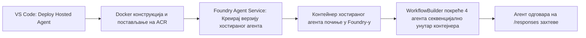
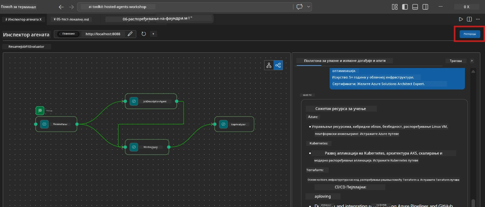

# Модул 6 - Деплој на Foundry Agent сервис

⏱️ ~10 мин

У овом модулу, деплојујете ваш локално тестиран мулти-агентски ток рада на [Microsoft Foundry](https://learn.microsoft.com/azure/foundry/agents/concepts/hosted-agents) као **Hosted Agent**. Процес деплоја гради Docker контејнер слику, пушује је у [Azure Container Registry (ACR)](https://learn.microsoft.com/azure/container-registry/container-registry-intro), и креира верзију hosted агента у [Foundry Agent Service](https://learn.microsoft.com/azure/foundry/agents/how-to/publish-agent).

> **Кључна разлика у односу на Лаб 01:** Процес деплоја је идентичан. Foundry третира ваш мулти-агентски ток као један hosted агент - сложеност је унутар контејнера, али је површина деплоја иста `/responses` крајња тачка.

### Деплој пипелина


```mermaid
flowchart LR
    A[VS Code: Deploy Hosted Agent] --> B[Docker конструкција и постављање на ACR]
    B --> C[Foundry Agent Service: Креирај верзију хостираног агента]
    C --> D[Контейнер хостираног агента почиње у Foundry-у]
    D --> E[WorkflowBuilder покреће 4 агента секвенцијално унутар контејнера]
    E --> F[Агент одговара на /responses захтеве]
```

---

## Провера предуслова

Пре деплоја, проверите сваки од наведених услова:

1. **Агент је прошао локалне smoke тестове:**
   - Завршили сте сва 3 теста из [Модула 5](05-test-locally.md) и ток рада је произвео комплетан излаз са gap cards и Microsoft Learn URL-овима.

2. **Имате [Foundry User](https://learn.microsoft.com/azure/foundry/concepts/rbac-foundry) улогу** (за деплој је потребна најмање **Foundry Project Manager** на нивоу пројекта):

   > **Напомена:** Foundry RBAC улоге су недавно преименоване - **Foundry User**, **Foundry Owner**, и **Foundry Project Manager** су раније били Azure AI User, Azure AI Owner, и Azure AI Project Manager. ИД улога и дозволе су непромењени.

   - Потврдите у [Azure портал](https://portal.azure.com) → ваш Foundry **project** ресурс → **Access control (IAM)** → **Role assignments** → потврдите да је **Foundry User** (или виши) наведен за ваш налог.

3. **Пријављени сте у Azure преко VS Code:**
   - Проверите икону налога у доњем левом углу VS Code. Треба да видите име вашег налога.

4. **`agent.yaml` има исправне вредности:**
   - Отворите `PersonalCareerCopilot/agent.yaml` и проверите:
     ```yaml
     environment_variables:
       - name: AZURE_AI_MODEL_DEPLOYMENT_NAME
         value: ${AZURE_AI_MODEL_DEPLOYMENT_NAME}
     ```
   - `FOUNDRY_PROJECT_ENDPOINT` **није** наведен овде - Foundry га убацује у време извршавања. Потребно је декларативно само `AZURE_AI_MODEL_DEPLOYMENT_NAME`.

5. **`requirements.txt` садржи исправне верзије:**
   ```
   agent-framework-foundry
   agent-framework-foundry-hosting
   mcp<2,>=1.24.0
   debugpy
   ```

---

## Корак 1: Покретање деплоја

### Опција A: Деплој из Agent Inspector-а (рекомандовано)

Ако је агент покренут преко F5 са отвореним Agent Inspector-ом:

1. Погледајте у **горњи десни угао** панела Agent Inspector-а.
2. Кликните на дугме **Deploy** (икона облака са стрелицом нагоре ↑).
3. Отвориће се чаробњак за деплој.



### Опција B: Деплој преко Command Palette-а

1. Притисните `Ctrl+Shift+P` да отворите **Command Palette**.
2. Укуцајте: **Foundry Toolkit: Deploy Hosted Agent** и изаберите ту опцију.
3. Отвориће се чаробњак за деплој.

---

## Корак 2: Конфигурисање деплоја

### 2.1 Избор циљног пројекта

1. Приказује се падајућа листа ваших Foundry пројеката.
2. Изаберите пројекат који сте користили током радионице (нпр. `workshop-agents`).

### 2.2 Избор фајла агента у контејнеру

1. Бићете упитани да изаберете улазну тачку агента.
2. Идите до `workshop/lab02-multi-agent/PersonalCareerCopilot/` и одаберите **`main.py`**.

### 2.3 Конфигурисање ресурса

| Подешавање | Препоручена вредност | Напомене |
|---------|------------------|-------|
| **Метод деплоја** | **Container** (препоручено) или **Code** | Container гради Docker слику; Code отпрема извор као ZIP (preview) |
| **Registry контејнера** | **Подразумевани ACR** | Foundry креира и управља једним за вас |
| **CPU** | `0.25` | Подразумевано. Мулти-агентски токови не захтевају више CPU јер су позиви моделу I/O интензивни |
| **Memory** | `0.5Gi` | Подразумевано. Појачати на `1Gi` ако додате велике алате за обраду података |

---

## Корак 3: Потврда и деплој

1. Чаробњак приказује резиме деплоја.
2. Прегледајте га и кликните **Confirm and Deploy**.
3. Пратите напредак у VS Code.

### Шта се дешава током деплоја

Пратите VS Code **Output** панел (изаберите "Microsoft Foundry" из падајућег менија):

1. **Docker build** - Гради контејнер из вашег `Dockerfile`
   ```
   Step 1/6 : FROM python:3.12-slim
   Step 2/6 : WORKDIR /app
   ...
   Successfully built abc123def456
   ```

2. **Docker push** - Пушује слику у ACR (1-3 минута при првом деплоју).

3. **Регистрација агента** - Foundry креира hosted агента користећи метаподаци из `agent.yaml`. Име агента је `resume-job-fit-evaluator`.

4. **Покретање контејнера** - Контејнер се покреће у Foundryјевој менеджисаној инфраструктури са системски управљаном идентитетом.

> **Први деплој је спорији** (Docker пушује све слојеве). Накнадни деплоји користе кеширане слојеве и бржи су.

### Напомене специфичне за мулти-агенте

- **Сва четири агента се налазе у једном контејнеру.** Foundry види један hosted агент. Граф WorkflowBuilder-а се извршава интерно.
- **MCP позиви иду на спољашњу мрежу.** Контејнер треба приступ интернету да би достигао `https://learn.microsoft.com/api/mcp`. Foundryјева инфраструктура то пружа подразумевано.
- **[Managed Identity](https://learn.microsoft.com/azure/foundry/agents/concepts/agent-identity).** Foundry аутоматски креира **посебан Entra идентитет по агенту** за сваки Hosted агент у време деплоја. У hosted окружењу, `DefaultAzureCredential` аутоматски резолуира на овај агент идентитет - није потребна ручна конфигурација managed identity.

---

## Корак 4: Провера статуса деплоја

1. Отворите плочу **Microsoft Foundry** (кликните на Foundry икону у Activity Bar-у).
2. Проширите **Hosted Agents (Preview)** под вашим пројектом.
3. Пронађите **resume-job-fit-evaluator** (или име вашег агента).
4. Кликните на име агента → проширите верзије (нпр. `v1`).
5. Кликните на верзију → проверите **Container Details** → **Status**:


| Статус | Значење |
|--------|---------|
| **active** | Агент ради и спреман је да прихвати захтеве |
| **creating** | Контејнер се покреће (сачекајте 30–60 секунди) |
| **failed** | Контејнер није успео да се покрене (погледајте логове - виде испод) |

> **Напомена:** VS Code бочна трака може приказати ознаке као "Running" или "Started" док underlying API статус користи `active`/`creating`. Обе означавају исти статус.

> **Покретање мулти-агента траје дуже** од једног агента јер контејнер креира 4 инстанце агената при старту. `creating` до 2 минута је нормално.

---

## Уобичајене грешке при деплоју и решења

### Грешка 1: Permission denied - `agents/write`

```
Error: lacks the required data action 
Microsoft.CognitiveServices/accounts/AIServices/agents/write
```

**Решење:** Доделите **[Foundry User](https://learn.microsoft.com/azure/foundry/concepts/rbac-foundry)** улогу (раније **Azure AI User**) на нивоу **пројекта**. Погледајте [Модул 8 - Решавање проблема](08-troubleshooting.md) за детаљна упутства.

### Грешка 2: Docker није покренут

```
Error: Docker build failed / Cannot connect to Docker daemon
```

**Решење:**
1. Покрените Docker Desktop.
2. Саачекајте да пише "Docker Desktop is running".
3. Потврдите: `docker info`
4. **Windows:** Уверите се да је WSL 2 backend омогућен у Docker Desktop подешавањима.
5. Покушајте поново.

### Грешка 3: pip install падне током Docker складиштења

```
Error: Could not find a version that satisfies the requirement agent-framework-foundry
```

**Решење:** Потврдите да `requirements.txt` одговара:
```
agent-framework-foundry
agent-framework-foundry-hosting
mcp<2,>=1.24.0
debugpy
```

Ако се грешка и даље јавља, могуће је да ваша Docker мрежа блокира PyPI. Проверите `docker info` за proxy конфигурације.

### Грешка 4: MCP алат не ради у hosted агенту

Ако Gap Analyzer престане да производи Microsoft Learn URL-ове након деплоја:

**Узрок:** Мрежна политика може блокирати одлазни HTTPS са контејнера.

**Решење:**
1. Обично ово није проблем са Foundryјевом подразумеваном конфигурацијом.
2. Ако се деси, проверите да ли Foundry project's виртуелна мрежа има NSG који блокира одлазни HTTPS.
3. MCP алат има уграђене fallback URL-ове, тако да ће агент и даље производити излаз (без живих URL-ова).

---

### Контролна тачка

- [ ] Команда за деплој је завршена без грешака у VS Code
- [ ] Агент се појављује под **Hosted Agents (Preview)** у Foundry бочној траци
- [ ] Име агента је `resume-job-fit-evaluator` (или ваше изабрано име)
- [ ] Статус контејнера приказује **Started** или **Running**
- [ ] (Ако су се појавиле грешке) Утврдио/ла сте грешку, применили решење и успешно поново деплојујете

---

**Претходно:** [05 - Тестирање локално](05-test-locally.md) · **Следеће:** [07 - Верификација у Playground-у →](07-verify-in-playground.md)

---

<!-- CO-OP TRANSLATOR DISCLAIMER START -->
**Изјава о одрицању одговорности**:
Овај документ је преведен коришћењем услуге за аутоматски превод [Co-op Translator](https://github.com/Azure/co-op-translator). Иако тежимо тачности, имајте у виду да аутоматски преводи могу садржати грешке или нетачности. Оригинални документ на његовом изворном језику треба сматрати ауторитативним извором. За критичне информације препоручује се професионални људски превод. Нисмо одговорни за било каква неспоразума или погрешна тумачења која произилазе из коришћења овог превода.
<!-- CO-OP TRANSLATOR DISCLAIMER END -->