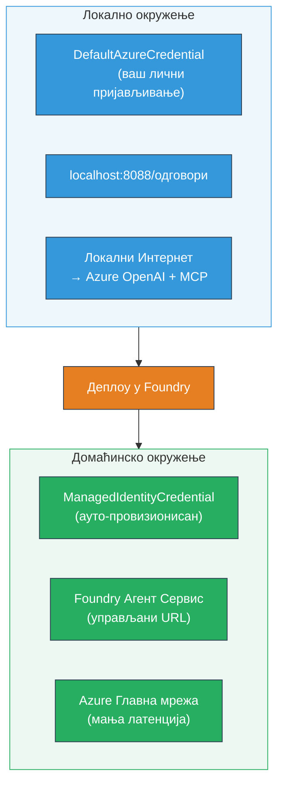

# Модул 7 - Верификација у Плаигроунд-у

У овом модулу тестирате ваш распоређени мулти-агентски ток рада у оба **VS Code** и **[Foundry портала](https://ai.azure.com)**, потврђујући да агент понаша идентично као при локалном тестирању.

---

## Зашто верификовати након распореда?

Ваш мулти-агентски ток рада је савршено радио локално, па зашто поново тестирати? Хостовано окружење се разликује на више начина:


| Разлика | Локално | Хостовано |
|-----------|-------|--------|
| **Идентификација** | [`DefaultAzureCredential`](https://learn.microsoft.com/azure/developer/python/sdk/authentication/credential-chains#defaultazurecredential-overview) (ваш лични пријавни налог) | [`ManagedIdentityCredential`](https://learn.microsoft.com/python/api/overview/azure/identity-readme#managed-identity-support) (аутоматски обезбеђено) |
| **Ендпоинт** | `http://localhost:8088/responses` | [Foundry Agent Service](https://learn.microsoft.com/azure/foundry/agents/concepts/hosted-agents) ендпоинт (управљани URL) |
| **Мрежа** | Локална машина → Azure OpenAI + MCP излазни саобраћај | Azure конацни мрежни пренос (нижа латенција између услуга) |
| **MCP конективност** | Локални интернет → `learn.microsoft.com/api/mcp` | Контейнер излазни саобраћај → `learn.microsoft.com/api/mcp` |

Ако је било која системска променљива погрешно конфигурисана, РБАК је другачији, или је MCP излазни саобраћај блокиран, ухватићете то овде.

---

## Опција А: Тестирање у VS Code Плаигроунд-у (препоручено прво)

[Foundry екстензија](https://marketplace.visualstudio.com/items?itemName=TeamsDevApp.vscode-ai-foundry) укључује интегрисани Плаигроунд који вам омогућава да ћаскате са вашим распореденим агентом без напуштања VS Code-а.

### Корак 1: Пронађите ваш хостовани агент

1. Кликните на **Microsoft Foundry** икону у VS Code **Activity Bar** (лева бочна трака) да отворите Foundry панел.
2. Проширите ваш повезани пројекат (нпр. `workshop-agents`).
3. Проширите **Hosted Agents (Preview)**.
4. Требало би да видите име вашег агента (нпр. `resume-job-fit-evaluator`).

### Корак 2: Изаберите верзију

1. Кликните на име агента да проширите његове верзије.
2. Кликните на верзију коју сте распореди (нпр. `v1`).
3. Отвориће се **панел са детаљима** који приказује Детаље о Контејнеру.
4. Потврдите да је статус **Started** или **Running**.

### Корак 3: Отворите Плаигроунд

1. У панелу са детаљима кликните на дугме **Playground** (или десни клик на верзију → **Open in Playground**).
2. Интерфејс за ћаскање ће се отворити у VS Code табу.

### Корак 4: Покрените ваше примарне тестове

Користите иста 3 теста из [Модула 5](05-test-locally.md). Унесите сваки поруку у улазно поље Плаигроунд-а и притисните **Send** (или **Enter**).

#### Тест 1 - Потпуни резиме + JD (стандардни ток)

Налепите комплетан резиме + JD упит из Модула 5, Тест 1 (Jane Doe + Senior Cloud Engineer у Contoso Ltd).

**Очекује се:**
- Оцена погодности са објашњењем (скала од 100 поена)
- Секција подудараних вештина
- Секција недостајућих вештина
- **Једна картица за празнину по недостајућој вештини** са Microsoft Learn URL-овима
- Путоказ учења са временском линијом

#### Тест 2 - Брзи кратки тест (минимални унос)

```
RESUME: 3 years Python developer, knows Django and PostgreSQL, no cloud experience.

JOB: Cloud DevOps Engineer requiring AWS, Kubernetes, Terraform, CI/CD. 5 years needed.
```

**Очекује се:**
- Нижа оцена погодности (< 40)
- Искрена процена са корацима за учење
- Више картица са празнинама (AWS, Kubernetes, Terraform, CI/CD, празнина у искуству)

#### Тест 3 - Кандидат високог степена погодности

```
RESUME:
10 years Azure Cloud Architect. AZ-305 certified. Expert in AKS, Terraform, Azure DevOps, 
Azure Functions, Helm, Prometheus, Grafana, Python, Go. Led platform team of 8.

JOB:
Senior Cloud Engineer. Required: AKS, Terraform, Azure DevOps, Python. Preferred: Helm, Go.
5+ years experience. AZ-305 preferred.
```

**Очекује се:**
- Висока оцена погодности (≥ 80)
- Фокус на спремност за интервју и усавршавање
- Мало или нема картица за празнине
- Кратка временска линија фокусирана на припрему

### Корак 5: Упоредите са локалним резултатима

Отворите ваше белешке или прегледач таб из Модула 5 где сте сачували локалне одговоре. За сваки тест:

- Да ли одговор има **исту структуру** (оцена погодности, картице празнина, путоказ)?
- Да ли следи **исту шему бодовања** (подела на 100 поена)?
- Да ли су **Microsoft Learn URL-ови** и даље присутни у картицама за празнине?
- Да ли има **једну картицу за празнину по недостајућој вештини** (не скраћено)?

> **Мале разлике у формулацији су нормалне** - модел је нередуктиван. Фокусирајте се на структуру, доследност бодовања и коришћење MCP алата.

---

## Опција Б: Тестирање у Foundry Порталу

[Foundry портал](https://ai.azure.com) пружа веб-базирани плаигроунд који је користан за дељење са тимским колегама или заинтересованим странама.

### Корак 1: Отворите Foundry портал

1. Отворите прегледач и идите на [https://ai.azure.com](https://ai.azure.com).
2. Пријавите се са истим Azure налогом који сте користили током радионице.

### Корак 2: Пронађите ваш пројекат

1. На почетној страници потражите **Recent projects** на левој бочној траци.
2. Кликните на име вашег пројекта (нпр. `workshop-agents`).
3. Ако га не видите, кликните на **All projects** и претражите га.

### Корак 3: Пронађите ваш распореди агент

1. У левој навигацији пројекта кликнете на **Build** → **Agents** (или пронађите одељак **Agents**).
2. Требало би да видите листу агената. Пронађите ваш распоређени агент (нпр. `resume-job-fit-evaluator`).
3. Кликните на име агента да отворите страницу са детаљима.

### Корак 4: Отворите Плаигроунд

1. На страници са детаљима агента погледајте горњу траку са алаткама.
2. Кликните на **Open in playground** (или **Try in playground**).
3. Отвориће се интерфејс за ћаскање.

### Корак 5: Покрените исте примарне тестове

Поновите сва 3 теста из одељка Плаигроунд у VS Code-у изнад. Упоредите сваки одговор са локалним резултатима (Модул 5) и резултатима из VS Code Плаигроунд-а (Опција А изнад).

---

## Специфична верификација за мулти-агенте

Поред основне исправности, верификујте ове мулти-агентске понашања:

### Извршење MCP алата

| Провера | Како верификовати | Услов за пролазак |
|-------|---------------|----------------|
| Позиви MCP успевају | Картице за празнине садрже `learn.microsoft.com` URL-ове | Реални URL-ови, не поруке о паду |
| Више MCP позива | Свака High/Medium приоритетна празнина има ресурсе | Не само прва картица празнине |
| MCP fallback ради | Ако URL-ови недостају, проверавати fallback текст | Агент и даље производи картице празнина (са или без URL-ова) |

### Координација агената

| Провера | Како верификовати | Услов за пролазак |
|-------|---------------|----------------|
| Сва 4 агента су радила | Излаз садржи оцена погодности И картице празнина | Оцена долази од MatchingAgent, картице од GapAnalyzer |
| Паралелно ширење | Време одговора је разумно (< 2 мин) | Ако је > 3 мин, паралелно извршење можда не ради |
| Интегритет тока података | Картице празнина реферишу вештине из извештаја о подударању | Нема халуцинација вештина које нису у JD |

---

## Рубрика валидације

Користите ову рубрику да оцените понашање вашег мулти-агентског тока рада у хостованом окружењу:

| # | Критеријум | Услов за пролазак | Пролаз |
|---|----------|---------------|-------|
| 1 | **Функционална исправност** | Агент одговара на резиме + JD са оценом погодности и анализом празнина | |
| 2 | **Доследност бодовања** | Оцена користи скалу од 100 поена са објашњењем | |
| 3 | **Потпуност картица празнина** | Једна картица по недостајућој вештини (није скраћена или спојена) | |
| 4 | **Интеграција MCP алата** | Картице садрже праве Microsoft Learn URL-ове | |
| 5 | **Структурна доследност** | Структура излаза је иста у локалном и хостованом окружењу | |
| 6 | **Време одговора** | Хостовани агент одговара у року од 2 минута за потпуну процену | |
| 7 | **Без грешака** | Није било HTTP 500 грешака, временских ограничења или празних одговора | |

> "Пролаз" значи да су свих 7 критеријума задовољена за сва 3 примарна теста у најмање једном плаигроунд-у (VS Code или портал).

---

## Решавање проблема са Плаигроунд-ом

| Симптом | Веровао узрок | Поправка |
|---------|-------------|-----|
| Плаигроунд се не учитава | Статус контејнера није "Started" | Вратите се на [Модул 6](06-deploy-to-foundry.md), проверите статус распореда. Чекајте ако је "Pending" |
| Агент враћа празан одговор | Невезан назив модела у распореду | Проверите да ли `agent.yaml` → `environment_variables` → `MODEL_DEPLOYMENT_NAME` одговара вашем распореденом моделу |
| Агент враћа поруку о грешци | Недостаје [RBAC](https://learn.microsoft.com/azure/foundry/concepts/rbac-foundry) дозвола | Доделите **[Azure AI User](https://aka.ms/foundry-ext-project-role)** на нивоу пројекта |
| Нема Microsoft Learn URL-ова у картицама празнина | MCP излазни саобраћај блокиран или MCP сервер није доступан | Проверите да ли контејнер може да приступи `learn.microsoft.com`. Погледајте [Модул 8](08-troubleshooting.md) |
| Само 1 картица празнине (скраћена) | Недостаје упутство "CRITICAL" у GapAnalyzer-у | Прегледајте [Модул 3, Корак 2.4](03-configure-agents.md) |
| Оцена погодности значајно другачија од локалне | Другачији модел или инструкције распоређене | Упоредите env променљиве у `agent.yaml` са локалном `.env`. Редеплоу-јте ако је потребно |
| "Agent not found" у Порталу | Распоред још се шири или није успео | Чекајте 2 минута, освежите страницу. Ако и даље недостаје, поново распореди из [Модул 6](06-deploy-to-foundry.md) |

---

### Контролна листа

- [ ] Тестирано агента у VS Code Плаигроунд-у - сви 3 примарна теста су прошла
- [ ] Тестирано агента у [Foundry порталу](https://ai.azure.com) Плаигроунд-у - сви 3 примарна теста су прошла
- [ ] Одговори су структурно у складу са локалним тестирањем (оцена погодности, картице празнина, путоказ)
- [ ] Microsoft Learn URL-ови су присутни у картицама празнина (MCP алат ради у хостованом окружењу)
- [ ] Једна картица по недостајућој вештини (без скраћивања)
- [ ] Није било грешака или временских ограничења током тестирања
- [ ] Попуњена рубрика валидације (свих 7 критеријума је прошло)

---

**Претходно:** [06 - Deploy to Foundry](06-deploy-to-foundry.md) · **Следеће:** [08 - Troubleshooting →](08-troubleshooting.md)

---

<!-- CO-OP TRANSLATOR DISCLAIMER START -->
**Одрицање од одговорности**:  
Овај документ је преведен коришћењем AI услуге за превођење [Co-op Translator](https://github.com/Azure/co-op-translator). Иако тежимо тачности, молимо вас да имате на уму да аутоматски преводи могу садржати грешке или нетачности. Изворни документ на свом матерњем језику треба сматрати коначним и поузданим извором. За критичне информације препоручује се професионални превод од стране стручњака. Нисмо одговорни за било каква неспоразума или погрешна тумачења која произилазе из коришћења овог превода.
<!-- CO-OP TRANSLATOR DISCLAIMER END -->