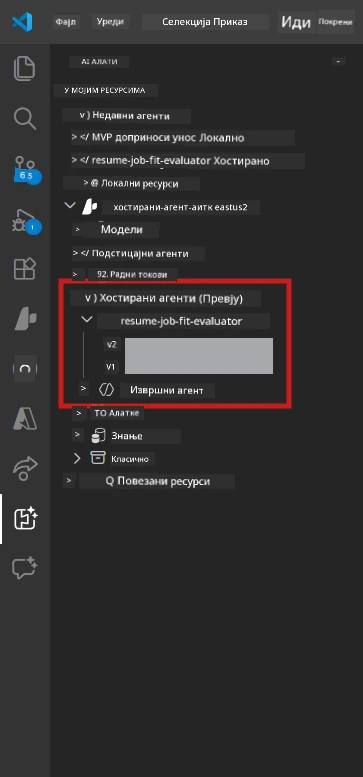

# Модул 7 - Верификација у Плаyгроунд-у

⏱️ ~10 минута

У овом модулу тестирате ваш распоређени мултиагентски ток пословања у VS Code и Foundry Порталу, потврђујући да агент ради исто као и при локалном тестирању.

---

## Зашто поново тестирати после распоређивања?

Хостовано окружење се разликује од локалног у неколико важних аспеката:

| | Локално | Хостовано |
|--|-------|-----------|
| **Идентификација** | Ваша лична пријава (`DefaultAzureCredential`) | Посебни Идентитет за агента у Entra-у (аутоматски креиран при распоређивању) |
| **Ендпоинт** | `http://localhost:8088/responses` | URL управљан Foundry Agent Service-ом |
| **Мрежа** | Ваш уређај → Azure OpenAI + MCP | Azure кичмена мрежа (мања латенција) |

Погрешно подешена околна варијабла, RBAC проблем или блокиран MCP исходни позив би се овде прво појавио.

---

## Опција А: Тестирање у VS Code Плаyгроунд-у (препоручено прво)

### Корак 1: Навигација до вашег хостованог агента

1. Кликните на икону **Foundry Toolkit** у Activity Bar.
2. Проширите ваш пројекат → **Hosted Agents (Preview)** → пронађите вашег агента.



### Корак 2: Изаберите верзију

1. Кликните на агента да проширите његове верзије.
2. Кликните `v1` → проверите да је статус **active** (страна трака може приказивати "Running" или "Started" - оба указују на спремно стање).

### Корак 3: Отворите Плаyгроунд

1. Кликните **Playground** (или десни клик на верзију → **Open in Playground**).
2. Отвориће се прозор за ћаскање у фиоци VS Code-а.

### Корак 4: Покрените ваше smoke тестове

Користите иста 3 теста из [Модул 5](05-test-locally.md). Укуцајте сваку поруку у Pлаyгроунд улазни оквир и притисните **Send** (или **Enter**).

#### Тест 1 - Пуно CV + JD (стандардни ток)

Налепите пуну поруку "резиме + JD" из Модула 5, Тест 1 (Jane Doe + Senior Cloud Engineer у Contoso Ltd).

**Очекује се:**
- Скор погодности са разлагањем математикума (на скали од 100 поена)
- Секција Подударајућих Вештина
- Секција Недостајућих Вештина
- **Једна карта за сваки недостајући вештини** са Microsoft Learn линковима
- Путоказ учења са временском линијом

#### Тест 2 - Брзи кратки тест (минималан унос)

```
RESUME: 3 years Python developer, knows Django and PostgreSQL, no cloud experience.

JOB: Cloud DevOps Engineer requiring AWS, Kubernetes, Terraform, CI/CD. 5 years needed.
```

**Очекује се:**
- Нижа оцена погодности (< 40)
- Искрена процена са фазним планом учења
- Више карти недостатака (AWS, Kubernetes, Terraform, CI/CD, празнина у искуству)

#### Тест 3 - Кандидат са високим степеном погодности

```
RESUME:
10 years Azure Cloud Architect. AZ-305 certified. Expert in AKS, Terraform, Azure DevOps, 
Azure Functions, Helm, Prometheus, Grafana, Python, Go. Led platform team of 8.

JOB:
Senior Cloud Engineer. Required: AKS, Terraform, Azure DevOps, Python. Preferred: Helm, Go.
5+ years experience. AZ-305 preferred.
```

**Очекује се:**
- Висок резултат погодности (≥ 80)
- Фокус на спремност за интервју и уређење
- Мало или без карти недостатака
- Кратак временски оквир усмерен на припрему

### Корак 5: Упоредите са локалним резултатима

Отворите ваше белешке или картицу претраживача из Модула 5 у којој сте сачували локалне одговоре. За сваки тест:

- Да ли одговор има **исту структуру** (скора погодности, карте недостатака, план)?
- Да ли прати **исту шему бодовања** (распад на 100 поена)?
- Да ли **Microsoft Learn URL-ови** још увек постоје у картама недостатака?
- Да ли постоји **једна карта по недостајућој вештини** (није скраћена)?

> **Мале разлике у формулацији су нормалне** - модел није детерминистички. Фокусирајте се на структуру, доследност бодовања и коришћење MCP алата.

---

## Опција Б: Тестирање у Foundry Порталу

[Foundry Портал](https://ai.azure.com) пружа веб-базиран плаyгроунд користан за дељење са тимом или заинтересованим странама.

### Корак 1: Отворите Foundry Портал

1. Отворите претраживач и идите на [https://ai.azure.com](https://ai.azure.com).
2. Пријавите се са истим Azure налогом који сте користили током радионице.

### Корак 2: Навигирајте до вашег пројекта

1. На почетној страници потражите **Недавне пројекте** на левој страни.
2. Кликните на име вашег пројекта (нпр. `workshop-agents`).
3. Ако га не видите, кликните **Сви пројекти** и пронађите га.

### Корак 3: Пронађите ваш распоређени агент

1. У левој навигацији пројекта, кликните **Build** → **Agents** (или потражите одељак **Agents**).
2. Требало би да видите листу агената. Пронађите вашег распоређеног агента (нпр. `resume-job-fit-evaluator`).
3. Кликните на име агента да отворите страницу са детаљима.

### Корак 4: Отворите Плаyгроунд

1. На страници са детаљима агента погледајте горњи тулбар.
2. Кликните **Open in playground** (или **Try in playground**).
3. Отвориће се интерфејс за ћаскање.

### Корак 5: Покрените исте smoke тестове

Поновите сва 3 теста из одељка VS Code Плаyгроунд изнад. Упоредите сваки одговор са локалним резултатима (Модул 5) и резултатима из VS Code Плаyгроунд-а (Опција А изнад).

---

## Верификација специфична за мулти-агенте

Поред основне исправности, проверите ове понашање специфично за мулти-агенте:

### Извршење MCP алата

| Провера | Како проверити | Услов проласка |
|-------|---------------|----------------|
| MCP позиви успевају | Карте недостатака садрже `learn.microsoft.com` URL-ове | Реални URL-ови, а не поруке за резервну опцију |
| Више MCP позива | Сваки средњи/виши приоритет недостатака има ресурсе | Не само прва карта недостатака |
| Ради резервна опција MCP | Ако URL-ови недостају, проверите резервну поруку | Агент ипак производи карте недостатака (са или без URL-ова) |

### Координација агената

| Провера | Како проверити | Услов проласка |
|-------|---------------|----------------|
| Сва 4 агента су радили | Излаз садржи score погодности И карте недостатака | Score долази од MatchingAgent, карте од GapAnalyzer-а |
| Секвенцијално извршење | Време одговора је разумно (< 2 мин) | Ако је > 3 мин, проверите грешке у терминал логу |
| Интегритет тока података | Карте недостатака реферишу вештине из извештаја за подударање | Нема халицинаторних вештина које нису у JD-у |

---

## Рубрика за валидацију

Користите ову рубрику за евалуацију хостованог понашања вашег мулти-агентског тока:

| # | Критеријум | Услов проласка | Пролаз? |
|---|----------|---------------|-------|
| 1 | **Функционална исправност** | Агент одговара на резиме + JD са резултатом погодности и анализом недостатака | |
| 2 | **Доследност бодовања** | Резултат користи скалу од 100 поена са разлагањем математикума | |
| 3 | **Потпуност карти недостатака** | Једна карта по недостајућој вештини (није скраћена или комбинована) | |
| 4 | **Интеграција MCP алата** | Карте укључују праве Microsoft Learn URL-ове | |
| 5 | **Структурна доследност** | Излазна структура одговара између локалног и хостованог извршења | |
| 6 | **Време одговора** | Хостовани агент одговара у року од 2 минута за пуну процену | |
| 7 | **Нема грешака** | Без HTTP 500 грешки, тајмаута или празних одговора | |

> "Пролаз" значи да су свих 7 критеријума испуњена за сва 3 smoke теста у најмање једном плаyгроунд-у (VS Code или Портал).

---

## Решавање проблема у плаyгроунду

| Симптом | Веровантан узрок | Поправка |
|---------|--------------|-------|
| Плаyгроунд се не учитава | Контейнер није у стању `active` | Вратите се на [Модул 6](06-deploy-to-foundry.md), проверите статус распоређивања. Сачекајте ако је `creating` |
| Агент враћа празан одговор | Неслагање имена модела за распоређивање | Проверите да ли `agent.yaml` → `environment_variables` → `AZURE_AI_MODEL_DEPLOYMENT_NAME` одговара вашем распоређеном моделу |
| Агент враћа поруку о грешци | Недостаје [RBAC](https://learn.microsoft.com/azure/foundry/concepts/rbac-foundry) дозвола | Доделите **[Foundry User](https://aka.ms/foundry-ext-project-role)** (раније Azure AI User) на нивоу пројекта |
| Нема Microsoft Learn URL-ова у картама недостатака | MCP исходни позив блокиран или MCP сервер недоступан | Проверите да ли контејнер може приступити `learn.microsoft.com`. Погледајте [Модул 8](08-troubleshooting.md) |
| Само 1 карта недостатака (скраћена) | Налози GapAnalyzer-а недостаје "CRITICAL" блок | Прегледајте [Модул 3, Корак 2.4](03-configure-agents.md) |
| Резултат погодности драстично другачији од локалног | Распоређен другачији модел или упутства | Упоредите `agent.yaml` env варс са локалном `.env`. Поново распоредите ако је потребно |
| "Agent not found" у Порталу | Распоређивање је још увек у току или није успело | Сачекајте 2 минута, освежите страницу. Ако је и даље недостаје, поново распоредите из [Модул 6](06-deploy-to-foundry.md) |

---

### Контролна тачка

- [ ] Тестирани агент у VS Code Плаyгроунд-у - сва 3 smoke теста су прошла
- [ ] Тестирани агент у [Foundry Порталу](https://ai.azure.com) Плаyгроунд-у - сва 3 smoke теста су прошла
- [ ] Одговори су структурно доследни са локалним тестирањем (score погодности, карте недостатака, путоказ)
- [ ] Microsoft Learn URL-ови су присутни у картама недостатака (MCP алат ради у хостованом окружењу)
- [ ] Једна карта по недостајућој вештини (никакво скраћивање)
- [ ] Нема грешака или тајмаута током тестирања
- [ ] Попуњена рубрика за валидацију (сва 7 критеријума су прошла)

---

**Претходно:** [06 - Deploy to Foundry](06-deploy-to-foundry.md) · **Следеће:** [08 - Troubleshooting →](08-troubleshooting.md)

---

<!-- CO-OP TRANSLATOR DISCLAIMER START -->
**Изјава о одрицању одговорности**:
Овај документ је преведен коришћењем услуге за аутоматски превод [Co-op Translator](https://github.com/Azure/co-op-translator). Иако тежимо тачности, имајте у виду да аутоматски преводи могу садржати грешке или нетачности. Оригинални документ на његовом изворном језику треба сматрати ауторитативним извором. За критичне информације препоручује се професионални људски превод. Нисмо одговорни за било каква неспоразума или погрешна тумачења која произилазе из коришћења овог превода.
<!-- CO-OP TRANSLATOR DISCLAIMER END -->