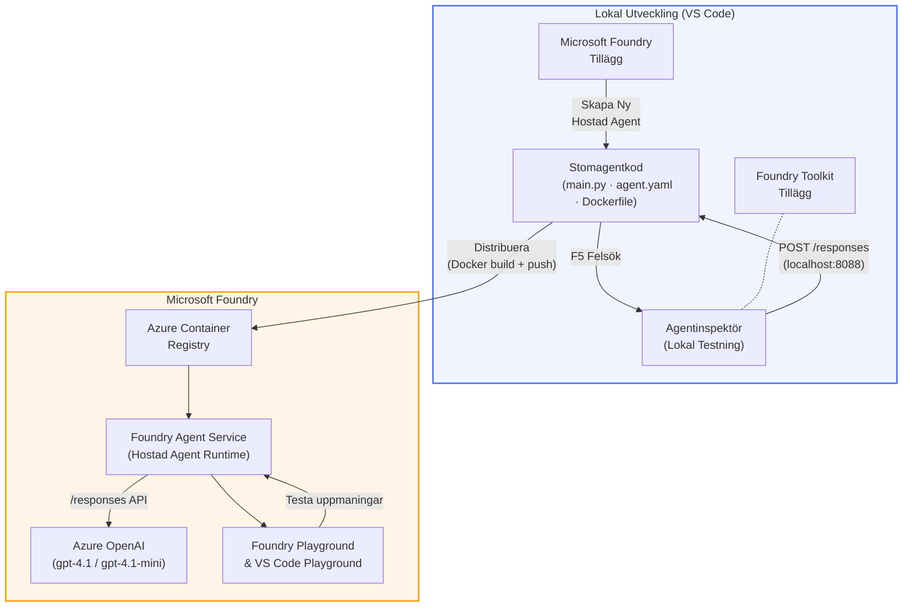

# Foundry Toolkit + Foundry Hosted Agents Workshop

[](https://www.python.org/)
[](https://github.com/microsoft/agents)
[](https://learn.microsoft.com/azure/ai-foundry/agents/concepts/hosted-agents/)
[](https://ai.azure.com/)
[](https://learn.microsoft.com/azure/ai-services/openai/)
[](https://learn.microsoft.com/cli/azure/install-azure-cli)
[](https://learn.microsoft.com/azure/developer/azure-developer-cli/install-azd)
[](https://www.docker.com/)
[](https://marketplace.visualstudio.com/items?itemName=ms-windows-ai-studio.windows-ai-studio)
[](LICENSE)

Bygg, testa och distribuera AI-agenter till **Microsoft Foundry Agent Service** som **Hosted Agents** – helt från VS Code med hjälp av **Microsoft Foundry extension** och **Foundry Toolkit**.

> **Hosted Agents är för närvarande i förhandsversion.** Stödda regioner är begränsade – se [regiontillgänglighet](https://learn.microsoft.com/azure/foundry/agents/concepts/hosted-agents#region-availability).

> Mappen `agent/` i varje labb skapas **automatiskt** av Foundry extension – därefter anpassar du koden, testar lokalt och distribuerar.

<!-- CO-OP TRANSLATOR LANGUAGES TABLE START -->
[Arabic](../ar/README.md) | [Bengali](../bn/README.md) | [Bulgarian](../bg/README.md) | [Burmese (Myanmar)](../my/README.md) | [Chinese (Simplified)](../zh-CN/README.md) | [Chinese (Traditional, Hong Kong)](../zh-HK/README.md) | [Chinese (Traditional, Macau)](../zh-MO/README.md) | [Chinese (Traditional, Taiwan)](../zh-TW/README.md) | [Croatian](../hr/README.md) | [Czech](../cs/README.md) | [Danish](../da/README.md) | [Dutch](../nl/README.md) | [Estonian](../et/README.md) | [Finnish](../fi/README.md) | [French](../fr/README.md) | [German](../de/README.md) | [Greek](../el/README.md) | [Hebrew](../he/README.md) | [Hindi](../hi/README.md) | [Hungarian](../hu/README.md) | [Indonesian](../id/README.md) | [Italian](../it/README.md) | [Japanese](../ja/README.md) | [Kannada](../kn/README.md) | [Khmer](../km/README.md) | [Korean](../ko/README.md) | [Lithuanian](../lt/README.md) | [Malay](../ms/README.md) | [Malayalam](../ml/README.md) | [Marathi](../mr/README.md) | [Nepali](../ne/README.md) | [Nigerian Pidgin](../pcm/README.md) | [Norwegian](../no/README.md) | [Persian (Farsi)](../fa/README.md) | [Polish](../pl/README.md) | [Portuguese (Brazil)](../pt-BR/README.md) | [Portuguese (Portugal)](../pt-PT/README.md) | [Punjabi (Gurmukhi)](../pa/README.md) | [Romanian](../ro/README.md) | [Russian](../ru/README.md) | [Serbian (Cyrillic)](../sr/README.md) | [Slovak](../sk/README.md) | [Slovenian](../sl/README.md) | [Spanish](../es/README.md) | [Swahili](../sw/README.md) | [Swedish](./README.md) | [Tagalog (Filipino)](../tl/README.md) | [Tamil](../ta/README.md) | [Telugu](../te/README.md) | [Thai](../th/README.md) | [Turkish](../tr/README.md) | [Ukrainian](../uk/README.md) | [Urdu](../ur/README.md) | [Vietnamese](../vi/README.md)

> **Föredrar du att klona lokalt?**
>
> Detta repository innehåller över 50 språköversättningar vilket avsevärt ökar nedladdningsstorleken. För att klona utan översättningar, använd sparsamt uttag:
>
> **Bash / macOS / Linux:**
> ```bash
> git clone --filter=blob:none --sparse https://github.com/microsoft-foundry/Foundry_Toolkit_for_VSCode_Lab.git
> cd Foundry_Toolkit_for_VSCode_Lab
> git sparse-checkout set --no-cone '/*' '!translations' '!translated_images'
> ```
>
> **CMD (Windows):**
> ```cmd
> git clone --filter=blob:none --sparse https://github.com/microsoft-foundry/Foundry_Toolkit_for_VSCode_Lab.git
> cd Foundry_Toolkit_for_VSCode_Lab
> git sparse-checkout set --no-cone "/*" "!translations" "!translated_images"
> ```
>
> Detta ger dig allt du behöver för att slutföra kursen med mycket snabbare nedladdning.
<!-- CO-OP TRANSLATOR LANGUAGES TABLE END -->

---

## Arkitektur


**Flöde:** Foundry extension skapar agenten → du anpassar kod & instruktioner → testar lokalt med Agent Inspector → distribuerar till Foundry (Docker-image pushas till ACR) → verifierar i Playground.

---

## Vad du kommer att bygga

| Labb | Beskrivning | Status |
|-----|-------------|--------|
| **Labb 01 - Enkel Agent** | Bygg **"Förklara Som om Jag Var en Chef"-Agenten**, testa den lokalt, och distribuera till Foundry | ✅ Tillgänglig |
| **Labb 02 - Multi-Agent Arbetsflöde** | Bygg **"CV → Jobbfitsbedömare"** - 4 agenter samarbetar för att bedöma CV-passform och generera en lärandeplan | ✅ Tillgänglig |

---

## Möt Executive Agent

I denna workshop kommer du att bygga **"Förklara Som om Jag Var en Chef"-Agenten** - en AI-agent som tar komplicerat tekniskt jargong och översätter det till lugna, styrelserumsredo sammanfattningar. För ärligt talat, ingen i ledningsgruppen vill höra om "trådpoolutmattning orsakad av synkrona anrop introducerade i v3.2."

Jag byggde denna agent efter alltför många tillfällen där mitt perfekt formulerade post-mortem fick svaret: *"Så… är webbplatsen nere eller inte?"*

### Hur det fungerar

Du matar in en teknisk uppdatering. Den ger tillbaka en chefssammanfattning – tre punkter, inget jargong, inga stackspår, inget existentiellt mörker. Bara **vad som hände**, **affärspåverkan**, och **nästa steg**.

### Se det i aktion

**Du säger:**
> "API-latensen ökade på grund av trådpoolutmattning orsakad av synkrona anrop som introducerades i v3.2."

**Agenten svarar:**

> **Sammanfattning för chefen:**
> - **Vad som hände:** Efter senaste uppdateringen blev systemet långsammare.
> - **Affärspåverkan:** Vissa användare upplevde förseningar vid användning av tjänsten.
> - **Nästa steg:** Ändringen har rullats tillbaka och en fix förbereds innan ny distribution.

### Varför denna agent?

Det är en väldigt enkel, enskild syftes-agent – perfekt för att lära sig hosted agent-arbetsflödet från början till slut utan att fastna i komplexa verktygskedjor. Och ärligt? Varje tekniskt team skulle ha nytta av en sådan här.

---

## Workshopstruktur

```
📂 Foundry_Toolkit_for_VSCode_Lab/
├── 📄 README.md                      ← You are here
├── 📂 ExecutiveAgent/                ← Standalone hosted agent project
│   ├── agent.yaml
│   ├── Dockerfile
│   ├── main.py
│   └── requirements.txt
└── 📂 workshop/
    ├── 📂 lab01-single-agent/        ← Full lab: docs + agent code
    │   ├── README.md                 ← Hands-on lab instructions
    │   ├── 📂 docs/                  ← Step-by-step tutorial modules
    │   │   ├── 00-prerequisites.md
    │   │   ├── 01-install-foundry-toolkit.md
    │   │   ├── 02-create-foundry-project.md
    │   │   ├── 03-create-hosted-agent.md
    │   │   ├── 04-configure-and-code.md
    │   │   ├── 05-test-locally.md
    │   │   ├── 06-deploy-to-foundry.md
    │   │   ├── 07-verify-in-playground.md
    │   │   └── 08-troubleshooting.md
    │   └── 📂 agent/                 ← Reference solution (auto-scaffolded by Foundry extension)
    │       ├── agent.yaml
    │       ├── Dockerfile
    │       ├── main.py
    │       └── requirements.txt
    └── 📂 lab02-multi-agent/         ← Resume → Job Fit Evaluator
        ├── README.md                 ← Hands-on lab instructions (end-to-end)
        ├── 📂 docs/                  ← Step-by-step tutorial modules
        │   ├── 00-prerequisites.md
        │   ├── 01-understand-multi-agent.md
        │   ├── 02-scaffold-multi-agent.md
        │   ├── 03-configure-agents.md
        │   ├── 04-orchestration-patterns.md
        │   ├── 05-test-locally.md
        │   ├── 06-deploy-to-foundry.md
        │   ├── 07-verify-in-playground.md
        │   └── 08-troubleshooting.md
        └── 📂 PersonalCareerCopilot/ ← Reference solution (multi-agent workflow)
            ├── agent.yaml
            ├── Dockerfile
            ├── main.py
            └── requirements.txt
```

> **Observera:** Mappen `agent/` i varje labb genereras av **Microsoft Foundry extension** när du kör `Microsoft Foundry: Create a New Hosted Agent` från Command Palette. Filerna anpassas sedan med din agents instruktioner, verktyg och konfiguration. Labb 01 guidar dig genom att återskapa detta från början.

---

## Komma igång

### 1. Klona repository

```bash
git clone https://github.com/microsoft-foundry/Foundry_Toolkit_for_VSCode_Lab.git
cd Foundry_Toolkit_for_VSCode_Lab
```

### 2. Sätt upp en Python-virtuell miljö

```bash
python -m venv venv
```

Aktivera den:

- **Windows (PowerShell):**
  ```powershell
  .\venv\Scripts\Activate.ps1
  ```
- **macOS / Linux:**
  ```bash
  source venv/bin/activate
  ```

### 3. Installera beroenden

```bash
pip install -r workshop/lab01-single-agent/agent/requirements.txt
```

### 4. Konfigurera miljövariabler

Kopiera exempel på `.env`-filen i agentmappen och fyll i dina värden:

```bash
cp workshop/lab01-single-agent/agent/.env.example workshop/lab01-single-agent/agent/.env
```

Redigera `workshop/lab01-single-agent/agent/.env`:

```env
AZURE_AI_PROJECT_ENDPOINT=https://<your-account>.services.ai.azure.com/api/projects/<your-project>
MODEL_DEPLOYMENT_NAME=<your-model-deployment-name>
```

### 5. Följ workshopens labb

Varje labb är självständigt med egna moduler. Börja med **Labb 01** för att lära dig grunderna, sedan går du vidare till **Labb 02** för arbetsflöden med flera agenter.

#### Labb 01 - Enkel Agent ([fullständiga instruktioner](workshop/lab01-single-agent/README.md))

| # | Modul | Länk |
|---|--------|------|
| 1 | Läs förutsättningarna | [00-prerequisites.md](workshop/lab01-single-agent/docs/00-prerequisites.md) |
| 2 | Installera Foundry Toolkit & Foundry extension | [01-install-foundry-toolkit.md](workshop/lab01-single-agent/docs/01-install-foundry-toolkit.md) |
| 3 | Skapa ett Foundry-projekt | [02-create-foundry-project.md](workshop/lab01-single-agent/docs/02-create-foundry-project.md) |
| 4 | Skapa en hosted agent | [03-create-hosted-agent.md](workshop/lab01-single-agent/docs/03-create-hosted-agent.md) |
| 5 | Konfigurera instruktioner & miljö | [04-configure-and-code.md](workshop/lab01-single-agent/docs/04-configure-and-code.md) |
| 6 | Testa lokalt | [05-test-locally.md](workshop/lab01-single-agent/docs/05-test-locally.md) |
| 7 | Distribuera till Foundry | [06-deploy-to-foundry.md](workshop/lab01-single-agent/docs/06-deploy-to-foundry.md) |
| 8 | Verifiera i playground | [07-verify-in-playground.md](workshop/lab01-single-agent/docs/07-verify-in-playground.md) |
| 9 | Felsökning | [08-troubleshooting.md](workshop/lab01-single-agent/docs/08-troubleshooting.md) |

#### Labb 02 - Multi-Agent Arbetsflöde ([fullständiga instruktioner](workshop/lab02-multi-agent/README.md))

| # | Modul | Länk |
|---|--------|------|
| 1 | Förutsättningar (Labb 02) | [00-prerequisites.md](workshop/lab02-multi-agent/docs/00-prerequisites.md) |
| 2 | Förstå multi-agent arkitektur | [01-understand-multi-agent.md](workshop/lab02-multi-agent/docs/01-understand-multi-agent.md) |
| 3 | Skapa multi-agent projekt | [02-scaffold-multi-agent.md](workshop/lab02-multi-agent/docs/02-scaffold-multi-agent.md) |
| 4 | Konfigurera agenter & miljö | [03-configure-agents.md](workshop/lab02-multi-agent/docs/03-configure-agents.md) |
| 5 | Orkestreringsmönster | [04-orchestration-patterns.md](workshop/lab02-multi-agent/docs/04-orchestration-patterns.md) |
| 6 | Testa lokalt (multi-agent) | [05-test-locally.md](workshop/lab02-multi-agent/docs/05-test-locally.md) |
| 7 | Distribuera till Foundry | [06-deploy-to-foundry.md](workshop/lab02-multi-agent/docs/06-deploy-to-foundry.md) |
| 8 | Verifiera i playground | [07-verify-in-playground.md](workshop/lab02-multi-agent/docs/07-verify-in-playground.md) |
| 9 | Felsökning (multi-agent) | [08-troubleshooting.md](workshop/lab02-multi-agent/docs/08-troubleshooting.md) |

---

## Underhållare

<table>
<tr>
    <td align="center"><a href="https://github.com/ShivamGoyal03">
        <br />
        <sub><b>Shivam Goyal</b></sub>
    </a><br />
    </td>
</tr>
</table>

---

## Krävd behörighet (snabbreferens)

| Scenario | Krävd roller |
|----------|--------------|
| Skapa nytt Foundry-projekt | **Azure AI Owner** på Foundry-resursen |
| Distribuera till befintligt projekt (nya resurser) | **Azure AI Owner** + **Contributor** på prenumerationen |
| Distribuera till fullständigt konfigurerat projekt | **Reader** på konto + **Azure AI User** på projekt |

> **Viktigt:** Azure `Owner` och `Contributor`-roller inkluderar endast *hanterings*-behörigheter, inte *utvecklings* (dataåtgärds)-behörigheter. Du behöver **Azure AI User** eller **Azure AI Owner** för att bygga och distribuera agenter.

---

## Referenser

- [Snabbstart: Distribuera din första värdbaserade agent (VS Code)](https://learn.microsoft.com/azure/foundry/agents/quickstarts/quickstart-hosted-agent)
- [Vad är värdbaserade agenter?](https://learn.microsoft.com/azure/foundry/agents/concepts/hosted-agents)
- [Skapa arbetsflöden för värdbaserade agenter i VS Code](https://learn.microsoft.com/azure/foundry/agents/how-to/vs-code-agents-workflow-pro-code)
- [Distribuera en värdbaserad agent](https://learn.microsoft.com/azure/foundry/agents/how-to/deploy-hosted-agent)
- [RBAC för Microsoft Foundry](https://learn.microsoft.com/azure/foundry/concepts/rbac-foundry)
- [Exempel på agent för arkitekturgranskning](https://github.com/Azure-Samples/agent-architecture-review-sample) - Värdbaserad agent i verkliga världen med MCP-verktyg, Excalidraw-diagram och dubbel distribution

---

## Licens

[MIT](../../LICENSE)

---

<!-- CO-OP TRANSLATOR DISCLAIMER START -->
**Ansvarsfriskrivning**:  
Detta dokument har översatts med hjälp av AI-översättningstjänsten [Co-op Translator](https://github.com/Azure/co-op-translator). Även om vi strävar efter noggrannhet, var god observera att automatiska översättningar kan innehålla fel eller brister. Det ursprungliga dokumentet på dess modersmål ska betraktas som den auktoritativa källan. För kritisk information rekommenderas professionell mänsklig översättning. Vi ansvarar inte för eventuella missförstånd eller feltolkningar som uppstår vid användning av denna översättning.
<!-- CO-OP TRANSLATOR DISCLAIMER END -->