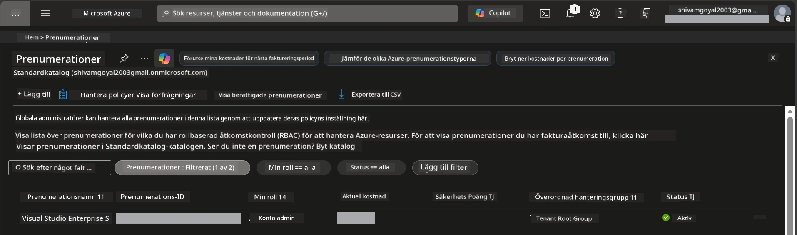

# Modul 0 - Förutsättningar

Innan du börjar workshopen, bekräfta att du har följande verktyg, åtkomst och miljö redo. Följ varje steg nedan – hoppa inte över något.

---

## 1. Azure-konto och prenumeration

### 1.1 Skapa eller verifiera din Azure-prenumeration

1. Öppna en webbläsare och gå till [https://azure.microsoft.com/free/](https://azure.microsoft.com/free/).
2. Om du inte har ett Azure-konto, klicka på **Start free** och följ registreringsflödet. Du behöver ett Microsoft-konto (eller skapa ett) och ett kreditkort för identitetsverifiering.
3. Om du redan har ett konto, logga in på [https://portal.azure.com](https://portal.azure.com).
4. I portalen klickar du på bladet **Prenumerationer** i vänstermenyn (eller sök "Subscriptions" i sökfältet högst upp).
5. Verifiera att du ser minst en **Aktiv** prenumeration. Notera **Prenumerations-ID** – du kommer att behöva det senare.



### 1.2 Förstå de nödvändiga RBAC-rollerna

[Hosted Agent](https://learn.microsoft.com/azure/foundry/agents/concepts/hosted-agents) distribution kräver **dataåtgärds**behörigheter som standardrollerna Azure `Owner` och `Contributor` **inte** inkluderar. Du behöver en av dessa [rollkombinationer](https://learn.microsoft.com/azure/foundry/concepts/rbac-foundry#built-in-roles):

| Scenario | Krävs roller | Var de ska tilldelas |
|----------|--------------|---------------------|
| Skapa nytt Foundry-projekt | **Azure AI Owner** på Foundry-resurs | Foundry-resurs i Azure-portalen |
| Distribuera till befintligt projekt (nya resurser) | **Azure AI Owner** + **Contributor** på prenumeration | Prenumeration + Foundry-resurs |
| Distribuera till fullt konfigurerat projekt | **Reader** på konto + **Azure AI User** på projekt | Konto + Projekt i Azure-portalen |

> **Viktigt:** Azure `Owner` och `Contributor`-roller täcker endast *hanterings*behörigheter (ARM-operationer). Du behöver [**Azure AI User**](https://learn.microsoft.com/azure/foundry/concepts/rbac-foundry#built-in-roles) (eller högre) för *dataåtgärder* som `agents/write`, vilket krävs för att skapa och distribuera agenter. Du kommer att tilldela dessa roller i [Modul 2](02-create-foundry-project.md).

---

## 2. Installera lokala verktyg

Installera varje verktyg nedan. Efter installation, verifiera att det fungerar genom att köra kontrollkommandot.

### 2.1 Visual Studio Code

1. Gå till [https://code.visualstudio.com/](https://code.visualstudio.com/).
2. Ladda ner installationsprogrammet för ditt OS (Windows/macOS/Linux).
3. Kör installationsprogrammet med standardinställningar.
4. Öppna VS Code för att bekräfta att det startar.

### 2.2 Python 3.10+

1. Gå till [https://www.python.org/downloads/](https://www.python.org/downloads/).
2. Ladda ner Python 3.10 eller senare (3.12+ rekommenderas).
3. **Windows:** Under installationen, markera **"Add Python to PATH"** på första skärmen.
4. Öppna en terminal och verifiera:

   ```powershell
   python --version
   ```

   Förväntad output: `Python 3.10.x` eller högre.

### 2.3 Azure CLI

1. Gå till [https://learn.microsoft.com/cli/azure/install-azure-cli](https://learn.microsoft.com/cli/azure/install-azure-cli).
2. Följ installationsinstruktionerna för ditt OS.
3. Verifiera:

   ```powershell
   az --version
   ```

   Förväntat: `azure-cli 2.80.0` eller högre.

4. Logga in:

   ```powershell
   az login
   ```

### 2.4 Azure Developer CLI (azd)

1. Gå till [https://learn.microsoft.com/azure/developer/azure-developer-cli/install-azd](https://learn.microsoft.com/azure/developer/azure-developer-cli/install-azd).
2. Följ installationsinstruktionerna för ditt OS. I Windows:

   ```powershell
   winget install microsoft.azd
   ```

3. Verifiera:

   ```powershell
   azd version
   ```

   Förväntat: `azd version 1.x.x` eller högre.

4. Logga in:

   ```powershell
   azd auth login
   ```

### 2.5 Docker Desktop (valfritt)

Docker behövs bara om du vill bygga och testa containerbilden lokalt före distribution. Foundry-tillägget hanterar containerbyggen under distribution automatiskt.

1. Gå till [https://docs.docker.com/get-docker/](https://docs.docker.com/get-docker/).
2. Ladda ner och installera Docker Desktop för ditt operativsystem.
3. **Windows:** Säkerställ att WSL 2-backend är valt under installationen.
4. Starta Docker Desktop och vänta tills ikonen i systemfältet visar **"Docker Desktop is running"**.
5. Öppna en terminal och verifiera:

   ```powershell
   docker info
   ```

   Detta ska skriva ut Docker-systeminfo utan fel. Om du ser `Cannot connect to the Docker daemon`, vänta några extra sekunder tills Docker startat helt.

---

## 3. Installera VS Code-tillägg

Du behöver tre tillägg. Installera dem **innan** workshopen börjar.

### 3.1 Microsoft Foundry för VS Code

1. Öppna VS Code.
2. Tryck på `Ctrl+Shift+X` för att öppna panelen för tillägg.
3. Skriv **"Microsoft Foundry"** i sökrutan.
4. Hitta **Microsoft Foundry for Visual Studio Code** (utgivare: Microsoft, ID: `TeamsDevApp.vscode-ai-foundry`).
5. Klicka på **Install**.
6. Efter installation ska du se ikonen för **Microsoft Foundry** i aktivitetsfältet (vänstra sidofältet).

### 3.2 Foundry Toolkit

1. I tilläggspanelen (`Ctrl+Shift+X`), sök efter **"Foundry Toolkit"**.
2. Hitta **Foundry Toolkit** (utgivare: Microsoft, ID: `ms-windows-ai-studio.windows-ai-studio`).
3. Klicka på **Install**.
4. Ikonen för **Foundry Toolkit** ska visas i aktivitetsfältet.

### 3.3 Python

1. I tilläggspanelen, sök efter **"Python"**.
2. Hitta **Python** (utgivare: Microsoft, ID: `ms-python.python`).
3. Klicka på **Install**.

---

## 4. Logga in i Azure från VS Code

[Microsoft Agent Framework](https://learn.microsoft.com/agent-framework/overview/) använder [`DefaultAzureCredential`](https://learn.microsoft.com/azure/developer/python/sdk/authentication/credential-chains#defaultazurecredential-overview) för autentisering. Du måste vara inloggad i Azure i VS Code.

### 4.1 Logga in via VS Code

1. Titta längst ner till vänster i VS Code och klicka på ikonen **Konton** (personsilhuett).
2. Klicka på **Sign in to use Microsoft Foundry** (eller **Sign in with Azure**).
3. Ett webbläsarfönster öppnas - logga in med det Azure-konto som har åtkomst till din prenumeration.
4. Återgå till VS Code. Du ska se ditt kontonamn längst ner till vänster.

### 4.2 (Valfritt) Logga in via Azure CLI

Om du installerat Azure CLI och föredrar CLI-baserad autentisering:

```powershell
az login
```

Detta öppnar en webbläsare för inloggning. Efter inloggning, ange rätt prenumeration:

```powershell
az account set --subscription "<your-subscription-id>"
```

Verifiera:

```powershell
az account show --query "{name:name, id:id, state:state}" --output table
```

Du ska se ditt prenumerationsnamn, ID och status = `Enabled`.

### 4.3 (Alternativ) Service principal-autentisering

För CI/CD eller delade miljöer, sätt dessa miljövariabler istället:

```powershell
$env:AZURE_TENANT_ID = "<your-tenant-id>"
$env:AZURE_CLIENT_ID = "<your-client-id>"
$env:AZURE_CLIENT_SECRET = "<your-client-secret>"
```

---

## 5. Förhandsgranskningsbegränsningar

Innan du går vidare, var medveten om aktuella begränsningar:

- [**Hosted Agents**](https://learn.microsoft.com/azure/foundry/agents/concepts/hosted-agents) är för närvarande i **offentlig förhandsgranskning** – inte rekommenderat för produktionsarbetsbelastningar.
- **Stödda regioner är begränsade** – kontrollera [regiontillgänglighet](https://learn.microsoft.com/azure/foundry/agents/concepts/hosted-agents#region-availability) innan du skapar resurser. Om du väljer en icke-stödd region, kommer distributionen att misslyckas.
- Paketet `azure-ai-agentserver-agentframework` är pre-release (`1.0.0b16`) – API:er kan ändras.
- Skalningsgränser: hosted agenter stödjer 0-5 repliker (inklusive skalning till noll).

---

## 6. Kontrollista före start

Gå igenom varje punkt nedan. Om något steg misslyckas, gå tillbaka och åtgärda innan du fortsätter.

- [ ] VS Code öppnas utan fel
- [ ] Python 3.10+ finns i din PATH (`python --version` visar `3.10.x` eller högre)
- [ ] Azure CLI är installerat (`az --version` visar `2.80.0` eller högre)
- [ ] Azure Developer CLI är installerat (`azd version` visar versionsinformation)
- [ ] Microsoft Foundry-tillägget är installerat (ikon syns i aktivitetsfältet)
- [ ] Foundry Toolkit-tillägget är installerat (ikon syns i aktivitetsfältet)
- [ ] Python-tillägget är installerat
- [ ] Du är inloggad i Azure i VS Code (kolla Konton-ikonen längst ner till vänster)
- [ ] `az account show` visar din prenumeration
- [ ] (Valfritt) Docker Desktop körs (`docker info` visar systeminfo utan fel)

### Kontrollstation

Öppna aktivitetsfältet i VS Code och bekräfta att du kan se både **Foundry Toolkit** och **Microsoft Foundry** sidofältvyer. Klicka på varje enskild för att verifiera att de laddas utan fel.

---

**Nästa:** [01 - Installera Foundry Toolkit & Foundry Extension →](01-install-foundry-toolkit.md)

---

<!-- CO-OP TRANSLATOR DISCLAIMER START -->
**Ansvarsfriskrivning**:
Detta dokument har översatts med hjälp av AI-översättningstjänsten [Co-op Translator](https://github.com/Azure/co-op-translator). Även om vi strävar efter noggrannhet, vänligen observera att automatiska översättningar kan innehålla fel eller brister. Det ursprungliga dokumentet på dess modersmål bör betraktas som den auktoritativa källan. För kritisk information rekommenderas professionell mänsklig översättning. Vi ansvarar inte för några missförstånd eller feltolkningar som uppstår från användningen av denna översättning.
<!-- CO-OP TRANSLATOR DISCLAIMER END -->