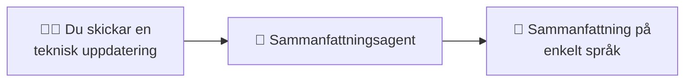

# Modul 0 - Introduktion

⏱️ ~10 min

> [!WARNING]
> **Förhandsvisning & Begränsningar:** [Hostade agenter](https://learn.microsoft.com/azure/foundry/agents/concepts/hosted-agents) är för närvarande i **offentlig förhandsversion** - rekommenderas inte för produktionsarbetsflöden. Var medveten om följande:
> - **Stödda regioner är begränsade** - kontrollera [regions-tillgänglighet](https://learn.microsoft.com/azure/foundry/agents/concepts/hosted-agents#region-availability) innan du skapar resurser. Om du väljer en region som inte stöds kommer distributionen att misslyckas.
> - Paketet `azure-ai-agentserver-agentframework` är en förhandsversion - API:er kan ändras mellan versioner.
> - Skalgränser: hostade agenter stödjer 0–5 repliker (inklusive skalning till noll).
> - Vissa funktioner som visas i denna workshop kan ändras när tjänsten närmar sig GA.

## Vad du kommer bygga

I denna workshop kommer du att bygga en **"Förklara som om jag vore en chef"**-agent - en hostad AI-agent som tar komplexa tekniska uppdateringar och omskriver dem som lättförståeliga chefs-sammanfattningar på engelska.

```mermaid
flowchart LR
    A["🧑‍💻 Du skickar en\nteknisk uppdatering"] --> B["🤖 Sammanfattningsagent"]
    B --> C["📝 Sammanfattning på\nenkelt språk"]
```

**Agenten använder:**
- **Microsoft Agent Framework** – för agentlogik och struktur
- **Foundry Toolkit för VS Code** – för att skapa mallar, testa lokalt och distribuera
- **En AI-modell** (t.ex. `gpt-4.1-mini/gpt-5-mini`) – för att generera sammanfattningarna

I slutet av denna labb kommer du att ha en fungerande agent som du kan testa lokalt via Agent Inspector, och eventuellt distribuera till molnet.

---

## Vad är hostade agenter?

En **hostad agent** är en AI-agent som körs som en hanterad tjänst i Microsoft Foundry. Istället för att sköta din egen infrastruktur paketerar du din agentkod i en container och Foundry hanterar skalning, hosting och exponering via en standard HTTP-endpoint.

| Koncept | Vad det betyder |
|---------|--------------|
| **Agent** | Din Python-kod som tar emot ett användarmeddelande, anropar en AI-modell och returnerar ett strukturerat svar |
| **Hostad** | Foundry kör din container åt dig - inga VM, inget Kubernetes, ingen infrastruktur att hantera |
| **Svarsprotokoll** | Ett standard HTTP API (`POST /responses`) som vilken klient som helst kan anropa för att interagera med din agent |
| **Agent Inspector** | Ett lokalt test-UI (inbygget i Foundry Toolkit) som låter dig chatta med din agent innan distribution |

I denna workshop går du från noll till en fullständigt hostad agent - eller stannar vid lokal testning om du föredrar.

---

## Välj din väg

> ⚠️ **Välj en väg innan du fortsätter.** Ditt val avgör vilka verktyg du installerar och vilka moduler som gäller. Du kan byta från Väg B → Väg A senare om du skaffar en prenumeration.

<strong>🅰️ Väg A - Azure-molnet (kräver Azure-prenumeration)</strong>

| | Detaljer |
|---|---|
| **Vem är detta för?** | Du har en aktiv Azure-prenumeration och kan skapa Foundry-resurser |
| **Modell** | Azure OpenAI via Foundry (t.ex. `gpt-4.1-mini/gpt-5-mini`) |
| **Behandlade moduler** | Alla moduler (00–07) |
| **Distribuera till molnet?** | ✅ Ja – fullständig end-to-end-distribution |

<strong>🅱️ Väg B - Lokalt / gratisnivå (ingen Azure-prenumeration krävs)</strong>

| | Detaljer |
|---|---|
| **Vem är detta för?** | MVP:er, studenter eller alla utan Azure-åtkomst |
| **Modell** | **Foundry Local** (gratis, körs på din maskin) |
| **Behandlade moduler** | Moduler 00–04 (hoppa över distribution & molnverifiering) |
| **Distribuera till molnet?** | ❌ Nej – endast lokal testning via Agent Inspector |

---

## Alla vägar: Nödvändiga verktyg

Installera varje verktyg nedan. Efter installation, verifiera att det fungerar genom att köra kontrollkommandot.

| # | Verktyg | Version | Installation | Verifiera (Förväntat resultat) |
|---|---------|---------|-------------|--------------------------------|
| 1 | **Visual Studio Code** | Senaste | [code.visualstudio.com](https://code.visualstudio.com/) | Öppnas utan fel |
| 2 | **Python** | 3.12 eller högre | [python.org/downloads](https://www.python.org/downloads/) | `python --version` $\rightarrow$ `Python 3.12.x` |
| 3 | **Foundry Toolkit för VS Code** | Senaste | Extension ID: `ms-windows-ai-studio.windows-ai-studio` | Foundry-ikon i aktivitetsfältet |
| 4 | **Python-tillägg för VS Code** | Senaste | Extension ID: `ms-python.python` | Installerad i tilläggspanelen |

> [!TIP]
> **Proffstips för installation:**
> - **Python PATH (Windows):** Kontrollera alltid **"Add Python to PATH"** på första sidan i Python-installationsprogrammet. Utan detta känns inte `python` igen i terminalen.
> - **Flera Python-versioner:** Om du har både Python 3.10 och 3.12 installerat, använd `python3.12 -m venv .venv` för att säkerställa att rätt version används för din virtuella miljö.
> - **Docker WSL 2 (Windows):** Vid installation av Docker Desktop, se till att **WSL 2 backend** är vald. Docker med Hyper-V är långsammare och kan orsaka problem med Foundry-containerbyggen.
> - **Docker startar inte?** Vänta 30–60 sekunder efter att du startat Docker Desktop. Kör `docker info` - om du ser "Cannot connect to the Docker daemon," håller Docker fortfarande på att starta upp.
> - **VS Code-tillägg laddas inte?** Efter installation av tillägg, ladda om fönstret: `Ctrl+Shift+P` → `Developer: Reload Window`.

> **Windows-användare:** Kontrollera **"Add Python to PATH"** under Python-installationen.

**Nästa:** [01 - Setup →](01-setup.md)

---

<!-- CO-OP TRANSLATOR DISCLAIMER START -->
**Ansvarsfriskrivning**:
Detta dokument har översatts med hjälp av AI-översättningstjänsten [Co-op Translator](https://github.com/Azure/co-op-translator). Även om vi strävar efter noggrannhet, var vänlig notera att automatiska översättningar kan innehålla fel eller brister. Det ursprungliga dokumentet på dess modersmål bör betraktas som den auktoritativa källan. För kritisk information rekommenderas professionell mänsklig översättning. Vi ansvarar inte för några missförstånd eller feltolkningar som uppstår till följd av användningen av denna översättning.
<!-- CO-OP TRANSLATOR DISCLAIMER END -->