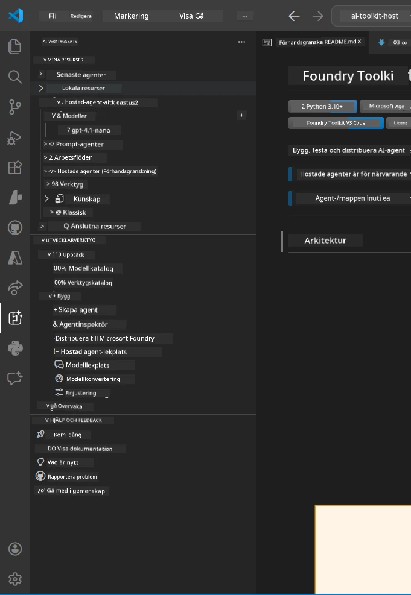
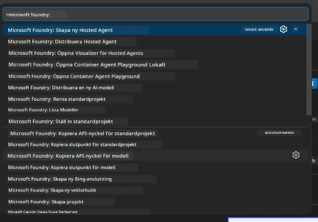

# Modul 1 - Installera Foundry Toolkit & Foundry Extension

Denna modul leder dig genom installation och verifiering av de två viktigaste VS Code-tilläggen för denna workshop. Om du redan installerade dem under [Modul 0](00-prerequisites.md), använd denna modul för att verifiera att de fungerar korrekt.

---

## Steg 1: Installera Microsoft Foundry Extension

**Microsoft Foundry for VS Code**-tillägget är ditt huvudsakliga verktyg för att skapa Foundry-projekt, distribuera modeller, skapa värdbaserade agenter och distribuera direkt från VS Code.

1. Öppna VS Code.
2. Tryck på `Ctrl+Shift+X` för att öppna **Extensions**-panelen.
3. Skriv i sökrutan högst upp: **Microsoft Foundry**
4. Leta efter resultatet med titeln **Microsoft Foundry for Visual Studio Code**.
   - Utgivare: **Microsoft**
   - Extension ID: `TeamsDevApp.vscode-ai-foundry`
5. Klicka på **Install**-knappen.
6. Vänta tills installationen är klar (du ser en liten indikator för framsteg).
7. Efter installation, titta på **Activity Bar** (den vertikala ikonlisten på vänster sida av VS Code). Du borde se en ny **Microsoft Foundry**-ikon (ser ut som en diamant/AI-ikon).
8. Klicka på **Microsoft Foundry**-ikonen för att öppna sidopanelen. Du bör se sektioner för:
   - **Resources** (eller Projects)
   - **Agents**
   - **Models**

> **Om ikonen inte visas:** Försök att ladda om VS Code (`Ctrl+Shift+P` → `Developer: Reload Window`).

---

## Steg 2: Installera Foundry Toolkit Extension

**Foundry Toolkit**-tillägget ger dig [**Agent Inspector**](https://learn.microsoft.com/azure/foundry/agents/how-to/vs-code-agents-workflow-pro-code) - ett visuellt gränssnitt för att testa och felsöka agenter lokalt - plus playground, modellhantering och utvärderingsverktyg.

1. I Extensionspanelen (`Ctrl+Shift+X`), rensa sökrutan och skriv: **Foundry Toolkit**
2. Hitta **Foundry Toolkit** i sökresultaten.
   - Utgivare: **Microsoft**
   - Extension ID: `ms-windows-ai-studio.windows-ai-studio`
3. Klicka på **Install**.
4. Efter installationen visas **Foundry Toolkit**-ikonen i Activity Bar (ser ut som en robot/glittrande ikon).
5. Klicka på **Foundry Toolkit**-ikonen för att öppna sidopanelen. Du bör se Foundry Toolkit välkomstskärm med alternativ för:
   - **Models**
   - **Playground**
   - **Agents**

---

## Steg 3: Verifiera att båda tilläggen fungerar

### 3.1 Verifiera Microsoft Foundry Extension

1. Klicka på **Microsoft Foundry**-ikonen i Activity Bar.
2. Om du är inloggad på Azure (från Modul 0), borde du se dina projekt listade under **Resources**.
3. Om du ombeds logga in, klicka på **Sign in** och följ autentiseringsflödet.
4. Bekräfta att du kan se sidopanelen utan fel.

### 3.2 Verifiera Foundry Toolkit Extension

1. Klicka på **Foundry Toolkit**-ikonen i Activity Bar.
2. Bekräfta att välkomstvyn eller huvudpanelen laddas utan fel.
3. Du behöver inte konfigurera något än – vi använder Agent Inspector i [Modul 5](05-test-locally.md).

### 3.3 Verifiera via Command Palette

1. Tryck på `Ctrl+Shift+P` för att öppna Command Palette.
2. Skriv **"Microsoft Foundry"** - du bör se kommandon som:
   - `Microsoft Foundry: Create a New Hosted Agent`
   - `Microsoft Foundry: Deploy Hosted Agent`
   - `Microsoft Foundry: Open Model Catalog`
3. Tryck på `Escape` för att stänga Command Palette.
4. Öppna Command Palette igen och skriv **"Foundry Toolkit"** - du bör se kommandon som:
   - `Foundry Toolkit: Open Agent Inspector`

> Om du inte ser dessa kommandon kan tilläggen vara felinstallerade. Försök avinstallera och installera om dem.

---

## Vad dessa tillägg gör i denna workshop

| Tillägg | Vad det gör | När du använder det |
|---------|-------------|---------------------|
| **Microsoft Foundry for VS Code** | Skapar Foundry-projekt, distribuerar modeller, **skapar [hosted agents](https://learn.microsoft.com/azure/foundry/agents/concepts/hosted-agents)** (genererar automatiskt `agent.yaml`, `main.py`, `Dockerfile`, `requirements.txt`), distribuerar till [Foundry Agent Service](https://learn.microsoft.com/azure/foundry/agents/overview) | Modulerna 2, 3, 6, 7 |
| **Foundry Toolkit** | Agent Inspector för lokal testning/felsökning, playground UI, modellhantering | Modulerna 5, 7 |

> **Foundry-tillägget är det mest kritiska verktyget i denna workshop.** Det hanterar hela livscykeln: scaffold → konfigurera → distribuera → verifiera. Foundry Toolkit kompletterar genom att erbjuda visuell Agent Inspector för lokal testning.

---

### Kontrollpunkt

- [ ] Microsoft Foundry-ikonen är synlig i Activity Bar
- [ ] Klick på ikonen öppnar sidopanelen utan fel
- [ ] Foundry Toolkit-ikonen är synlig i Activity Bar
- [ ] Klick på ikonen öppnar sidopanelen utan fel
- [ ] `Ctrl+Shift+P` → skriva "Microsoft Foundry" visar tillgängliga kommandon
- [ ] `Ctrl+Shift+P` → skriva "Foundry Toolkit" visar tillgängliga kommandon

---

**Föregående:** [00 - Prerequisites](00-prerequisites.md) · **Nästa:** [02 - Create Foundry Project →](02-create-foundry-project.md)

---

<!-- CO-OP TRANSLATOR DISCLAIMER START -->
**Ansvarsfriskrivning**:
Detta dokument har översatts med hjälp av AI-översättningstjänsten [Co-op Translator](https://github.com/Azure/co-op-translator). Även om vi strävar efter noggrannhet, vänligen var medveten om att automatiska översättningar kan innehålla fel eller felaktigheter. Det ursprungliga dokumentet på dess modersmål bör betraktas som den auktoritativa källan. För viktig information rekommenderas professionell mänsklig översättning. Vi ansvarar inte för några missförstånd eller feltolkningar som uppstår till följd av användningen av denna översättning.
<!-- CO-OP TRANSLATOR DISCLAIMER END -->