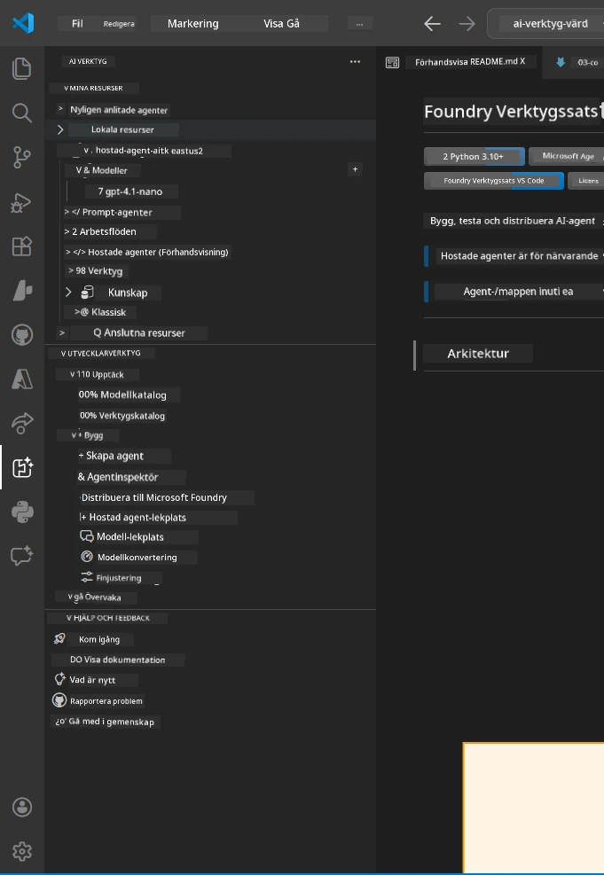
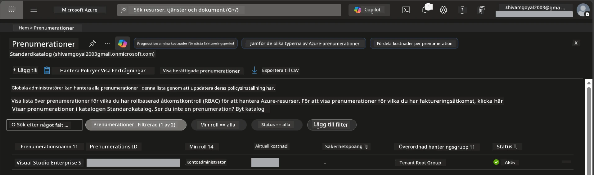
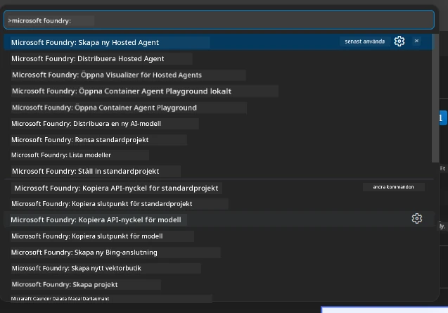
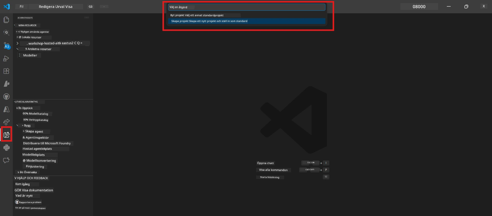
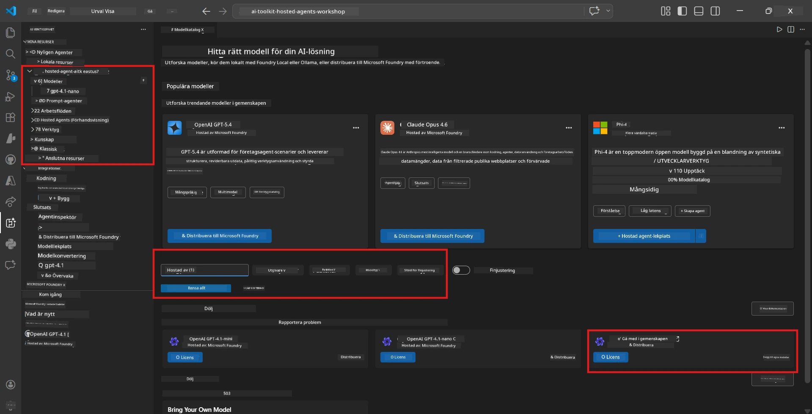
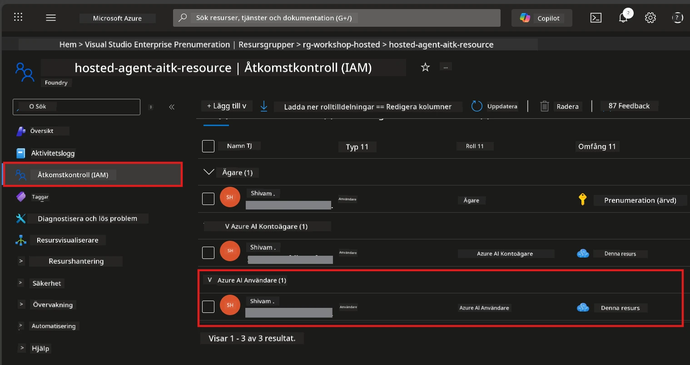

# Uppstart: Tillägg, Projekt & Modell

⏱️ ~15 min

I den här modulen installerar och verifierar du Foundry Toolkit-tillägget, skapar (eller ansluter till) ett Foundry-projekt och distribuerar en modell som din agent ska använda.

## Steg 1: Installera Foundry Toolkit

**Foundry Toolkit för VS Code** är huvudsakliga tillägget för denna workshop. Det erbjuder projektcreation, modellimplementering, agent-skelett, lokal testning (Agent Inspector) och molndistribution – allt från VS Code.

1. Öppna VS Code och tryck sedan `Ctrl+Shift+X` för att öppna **Extensions**-panelen.
2. Sök efter **Foundry Toolkit**.
3. Installera **Foundry Toolkit för VS Code** (Utgivare: Microsoft, ID: `ms-windows-ai-studio.windows-ai-studio`).
4. Efter installation visas **Foundry Toolkit**-ikonen i Aktivitetsfältet (vänstra sidofältet).

> *Notera: Aktivitetsfältet kan visa "AI TOOLKIT" i äldre versioner av tillägget. Funktionaliteten är densamma.*



## Steg 2: Ställ in beroende på din åtkomst

> **Välj din väg:** Expandera avsnittet nedan som matchar din konfiguration. Du behöver bara slutföra **en** väg.

<details>
<summary><strong>🅰️ Vägen A - Azure molnet (kräver Azure-prenumeration)</strong></summary>

### Azure CLI

1. Installera från [learn.microsoft.com/cli/azure/install-azure-cli](https://learn.microsoft.com/cli/azure/install-azure-cli).
2. Verifiera: `az --version` (förväntat 2.80.0+).
3. Logga in: `az login`

### Autentiseringsalternativ

[Microsoft Agent Framework](https://learn.microsoft.com/agent-framework/overview/) använder [`DefaultAzureCredential`](https://learn.microsoft.com/azure/developer/python/sdk/authentication/credential-chains#defaultazurecredential-overview) som försöker flera autentiseringsmetoder i ordning. Välj den som passar din miljö:

#### Alternativ 1: VS Code-konton (rekommenderas för workshops)
1. Klicka på **Accounts**-ikonen (personsilhuett) nere i vänstra hörnet i VS Code.
2. Välj **Sign in to use Microsoft Foundry** (eller **Sign in with Azure**).
3. En webbläsare öppnas - logga in med Azure-kontot som har tillgång till din prenumeration.
4. Återvänd till VS Code. Du ska se ditt kontonamn nere till vänster.

#### Alternativ 2: Azure CLI
```bash
az login
az account set --subscription "<your-subscription-id>"
```

#### Alternativ 3: Service Principal (Enterprise/CI)
För begränsade miljöer eller CI/CD pipelines, sätt dessa miljövariabler i din `.env`-fil:
```env
AZURE_TENANT_ID=<your-tenant-id>
AZURE_CLIENT_ID=<your-client-id>
AZURE_CLIENT_SECRET=<your-client-secret>
```

> **Hur `DefaultAzureCredential` fungerar:** Den försöker miljövariabler först, sedan managed identity, sedan VS Code-inloggning, sedan Azure CLI – och använder den som lyckas först. Se [credential chain docs](https://learn.microsoft.com/azure/developer/python/sdk/authentication/credential-chains#defaultazurecredential-overview).

### Azure Developer CLI (azd)

1. Installera: `winget install microsoft.azd` (Windows) eller se [installationsdokumentationen](https://learn.microsoft.com/azure/developer/azure-developer-cli/install-azd).
2. Verifiera: `azd version`
3. Logga in: `azd auth login`

### Docker Desktop (valfritt)

Docker behövs endast om du vill bygga containers lokalt. Foundry-tillägget hanterar bygge automatiskt vid distribution.

1. Installera från [docs.docker.com/get-docker](https://docs.docker.com/get-docker/).
2. Verifiera: `docker info`

### Azure-prenumeration & RBAC

1. Logga in på [portal.azure.com](https://portal.azure.com).
2. Navigera till **Subscriptions** och bekräfta att minst en är **Active**.
3. Notera ditt **Subscription ID** - du behöver det i Modul 01.



#### RBAC Scenariotabell

[Hosted Agent](https://learn.microsoft.com/azure/foundry/agents/concepts/hosted-agents) distribution kräver **data action**-behörigheter som standard Azure-rollerna `Owner` och `Contributor` **inte** inkluderar. Använd tabellen nedan för att avgöra vilka roller du behöver:

| Scenario | Krävs roller | Var de ska tilldelas |
|----------|--------------|---------------------|
| Skapa nytt Foundry-projekt | **Azure AI Owner** på Foundry-resurs | Foundry-resurs i Azure Portal |
| Distribuera till befintligt projekt (nya resurser) | **Azure AI Owner** + **Contributor** på prenumeration | Prenumeration + Foundry-resurs |
| Distribuera till fullständigt konfigurerat projekt | **Reader** på konto + **Azure AI User** på projekt | Konto + Projekt i Azure Portal |
| Endast lokal testning (ingen distribution) | **Azure AI User** på projekt | Projekt i Azure Portal |

> **Viktig punkt:** Azure `Owner` och `Contributor`-roller täcker endast *hanterings*behörigheter (ARM-operationer). Du behöver [**Azure AI User**](https://learn.microsoft.com/azure/foundry/concepts/rbac-foundry#built-in-roles) (eller högre) för *dataåtgärder* som `agents/write` som krävs för att skapa och distribuera agenter.

## Anslut eller skapa ett Foundry-projekt



1. Tryck `Ctrl+Shift+P` → skriv **Foundry Toolkit: Create Project** → välj det.
2. Välj din **Azure-prenumeration** från dropdown.
3. Välj eller skapa en **resursgrupp** (t.ex. `rg-hosted-agents-workshop`).
4. Välj en **region** som stödjer hosted agents: `East US`, `West US 2` eller `Sweden Central`. Se [regions tillgänglighet](https://learn.microsoft.com/azure/foundry/agents/concepts/hosted-agents#region-availability).
5. Ange ett projektnamn (t.ex. `workshop-agents`).
6. Vänta 2–5 minuter för provisionering. En progress-notifikation visas i VS Code.
7. När klart visas projektet i **Foundry Toolkit**-sidofältet under **MY RESOURCES**.



## Distribuera en modell & tilldela RBAC

Din hosted agent behöver en AI-modell för att generera svar.

#### Modellvalsmatris
Beroende på dina behov kan du välja från olika modellnivåer:

| Modell | Bäst för | Kostnad | Noteringar |
|--------|----------|---------|------------|
| `gpt-4.1` | Högkvalitativa, nyanserade svar | Högre | Bästa resultat, rekommenderas för sluttestning |
| `gpt-4.1-mini/gpt-5-mini` | Snabb iteration, lägre kostnad | Lägre | Bra för workshoputveckling och snabb testning |
| `gpt-4.1-nano` | Lättare uppgifter | Lägst | Mest kostnadseffektivt, men enklare svar |

1. Tryck `Ctrl+Shift+P` → **Foundry Toolkit: Open Model Catalog** (eller klicka **Model Catalog** i sidofältet under DEVELOPER TOOLS → Discover).
2. Sök efter **gpt-4.1** i katalogen.
3. Hitta **OpenAI GPT-4.1-mini** (eller `gpt-5-mini` för bättre kvalitet) och klicka på **Deploy**.



4. I distributionskonfigurationen:
   - **Deploymentsnamn:** Lämna standard eller ange ett eget namn. **Kom ihåg detta namn.**
   - **Mål:** Välj **Deploy to Foundry Toolkit** → välj ditt projekt.
5. Klicka på **Deploy** och vänta 1–3 minuter.

> **Rekommendation:** Använd `gpt-4.1-mini/gpt-5-mini` för workshopen - snabbt, prisvärt och ger bra resultat.

### Notera dina värden

Efter distribution, notera dessa två värden (du behöver dem i Modul 03):

| Värde | Var hittar du det |
|--------|------------------|
| **Projekt-endpoint** | Klicka på ditt projekt i sidofältet → detaljvyn visar URL (t.ex. `https://<account>.services.ai.azure.com/api/projects/<project>`) |
| **Namn på modell-distribution** | Expandera projekt → **Models** → namnet bredvid din distribuerade modell (t.ex. `gpt-4.1-mini/gpt-5-mini`) |

### Tilldela RBAC-roll

> ⚠️ **Det här är det vanligaste steget som missas.** Utan rätt roll kommer distributionen i Modul 05 att misslyckas.

#### Vilken roll behöver jag?
Beroende på ditt scenario behöver du följande rollkombinationer:

| Scenario | Krävs roller | Var de ska tilldelas |
|----------|--------------|---------------------|
| Skapa nytt Foundry-projekt | **Azure AI Owner** på Foundry-resurs | Foundry-resurs i Azure Portal |
| Distribuera till befintligt projekt (nya resurser) | **Azure AI Owner** + **Contributor** på prenumeration | Prenumeration + Foundry-resurs |
| Distribuera till fullständigt konfigurerat projekt | **Reader** på konto + **Azure AI User** på projekt | Konto + Projekt i Azure Portal |

**Viktig punkt:** Azure `Owner` och `Contributor`-roller täcker endast *hanterings*behörigheter. Du behöver **Azure AI User** (eller högre) för *dataåtgärder* som `agents/write` som krävs för att skapa och distribuera agenter.

1. Öppna [portal.azure.com](https://portal.azure.com).
2. Sök efter ditt **Foundry-projektnamn** → klicka på resultatet av typen **"Foundry Toolkit project"** (INTE överordnat konto).
3. Klicka på **Access control (IAM)** i den vänstra navigeringen.
4. Klicka på **+ Add** → **Add role assignment**.
5. **Roll-fliken:** Sök efter **Azure AI User**, välj det, klicka **Next**.
6. **Medlemmar-fliken:** Välj **User, group, or service principal** → klicka **+ Select members** → hitta och välj dig själv → klicka **Select**.
7. Klicka **Review + assign** → **Review + assign** igen.
8. **Vänta 1–2 minuter** på spridning.

> **Varför denna roll?** Azure `Owner`/`Contributor` ger endast hanteringsbehörigheter. **Azure AI User**-rollen ger `agents/write` dataåtgärden som krävs för att skapa och distribuera agenter. Se [Foundry RBAC-dokumentation](https://learn.microsoft.com/azure/foundry/concepts/rbac-foundry#built-in-roles).



</details>

<details>
<summary><strong>🅱️ Vägen B - Lokalt / gratisnivå (ingen Azure-prenumeration behövs)</strong></summary>

### Foundry Local

Foundry Local låter dig köra AI-modeller på din egen dator - inget molnkonto behövs. Du kan använda Foundry Local-modeller via Foundry Toolkit genom modellkatalogen på följande sätt:

1. Gå till Foundry Toolkit-tillägget.
2. I Foundry Toolkit-navigeringen gå till **Developer Tools** > välj **Model Catalog**
3. I det nya fönstret, välj **local** från navigeringsfältet.
4. Skrolla ner till **Phi 4 Mini,** och klicka på **lägg till-knappen**, en popup visas som indikerar att modellen laddas ner.
5. När modellen är nedladdad kan du gå vidare till nästa steg.

</details>

### ✅ Kontrollpunkt


- [ ] `Ctrl+Shift+P` → "Foundry Toolkit" visar tillgängliga kommandon
- [ ] Foundry Toolkit-tillägget installerat och sidofält laddas utan fel
- [ ] VS Code öppnas och körs korrekt
- [ ] `python --version` visar 3.10+
- [ ] Foundry Toolkit-ikonen synlig i VS Code Aktivitetsfält
- [ ] **Vägen A:** `az login` lyckas, prenumerationen är Aktiv
- [ ] **Vägen B:** Foundry Local körs (`foundry local status`)
- [ ] **Vägen A:** Foundry-projekt synligt i sidofält, modell distribuerad, Azure AI User-roll tilldelad
- [ ] **Vägen B:** Foundry Local körs med en modell
- [ ] Du har noterat din **endpoint** och **modell-distributionsnamn**


**Föregående:** [00 - Förutsättningar](00-prerequisites.md) · **Nästa:** [02 - Skapa Hosted Agent →](02-create-hosted-agent.md)

---

<!-- CO-OP TRANSLATOR DISCLAIMER START -->
**Ansvarsfriskrivning**:
Detta dokument har översatts med hjälp av AI-översättningstjänsten [Co-op Translator](https://github.com/Azure/co-op-translator). Även om vi strävar efter noggrannhet, var vänlig notera att automatiska översättningar kan innehålla fel eller brister. Det ursprungliga dokumentet på dess modersmål bör betraktas som den auktoritativa källan. För kritisk information rekommenderas professionell mänsklig översättning. Vi ansvarar inte för några missförstånd eller feltolkningar som uppstår till följd av användningen av denna översättning.
<!-- CO-OP TRANSLATOR DISCLAIMER END -->