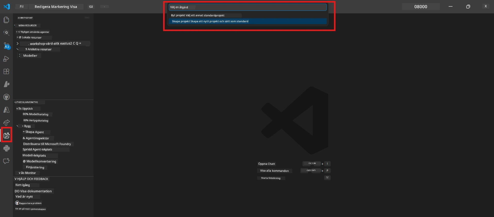
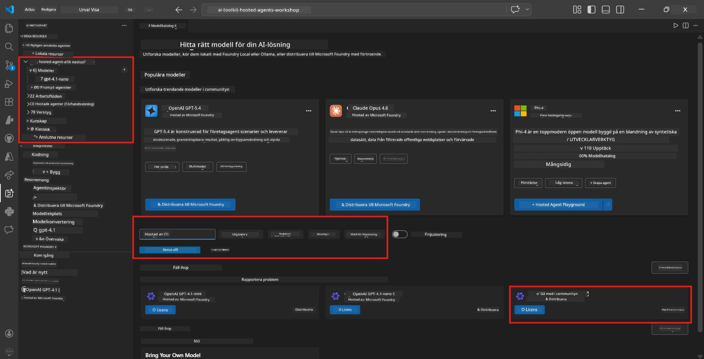
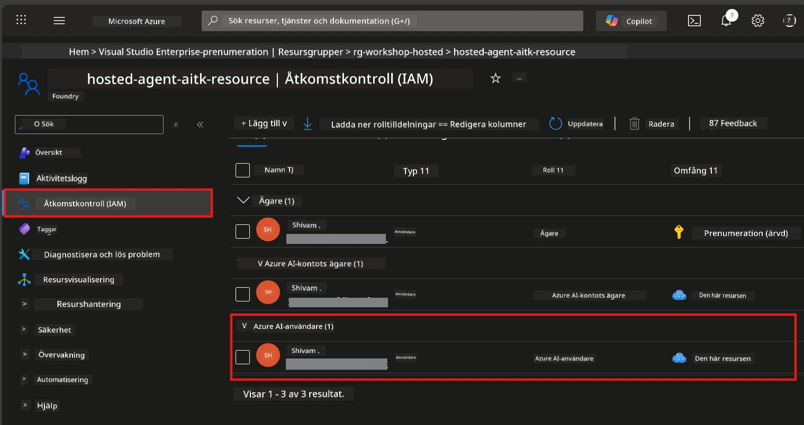

# Module 2 - Skapa ett Foundry-projekt & distribuera en modell

I den här modulen skapar du (eller väljer) ett Microsoft Foundry-projekt och distribuerar en modell som din agent kommer att använda. Varje steg är noggrant utskrivet – följ dem i ordning.

> Om du redan har ett Foundry-projekt med en distribuerad modell, hoppa till [Modul 3](03-create-hosted-agent.md).

---

## Steg 1: Skapa ett Foundry-projekt från VS Code

Du kommer att använda Microsoft Foundry-tillägget för att skapa ett projekt utan att lämna VS Code.

1. Tryck på `Ctrl+Shift+P` för att öppna **Command Palette**.
2. Skriv: **Microsoft Foundry: Create Project** och välj det.
3. En rullgardinsmeny visas – välj din **Azure-prenumeration** från listan.
4. Du blir ombedd att välja eller skapa en **resursgrupp**:
   - För att skapa en ny: skriv ett namn (t.ex. `rg-hosted-agents-workshop`) och tryck Enter.
   - För att använda en befintlig: välj den från rullgardinsmenyn.
5. Välj en **region**. **Viktigt:** Välj en region som stöder hosting-agenter. Kontrollera [regions-tillgänglighet](https://learn.microsoft.com/azure/foundry/agents/concepts/hosted-agents#region-availability) – vanliga val är `East US`, `West US 2` eller `Sweden Central`.
6. Ange ett **namn** för Foundry-projektet (t.ex. `workshop-agents`).
7. Tryck Enter och vänta på att provisioneringen ska slutföras.

> **Provisioneringen tar 2-5 minuter.** Du kommer att se en förloppsavisering i VS Codes nedre högra hörn. Stäng inte VS Code under provisioneringen.

8. När det är klart visar **Microsoft Foundry** sidofält ditt nya projekt under **Resources**.
9. Klicka på projektnamnet för att expandera det och bekräfta att det visar avsnitt som **Models + endpoints** och **Agents**.



### Alternativ: Skapa via Foundry-portalen

Om du föredrar att använda webbläsaren:

1. Öppna [https://ai.azure.com](https://ai.azure.com) och logga in.
2. Klicka på **Create project** på startsidan.
3. Ange ett projektnamn, välj din prenumeration, resursgrupp och region.
4. Klicka på **Create** och vänta på provisionering.
5. När projektet är skapat, återgå till VS Code – projektet bör visas i Foundry-sidofältet efter en uppdatering (klicka på uppdateringsikonen).

---

## Steg 2: Distribuera en modell

Din [hostade agent](https://learn.microsoft.com/azure/foundry/agents/concepts/hosted-agents) behöver en Azure OpenAI-modell för att generera svar. Du kommer att [distribuera en nu](https://learn.microsoft.com/azure/ai-foundry/openai/how-to/create-resource#deploy-a-model).

1. Tryck på `Ctrl+Shift+P` för att öppna **Command Palette**.
2. Skriv: **Microsoft Foundry: Open [Model Catalog](https://learn.microsoft.com/azure/ai-foundry/openai/concepts/models)** och välj det.
3. Modellkatalogen öppnas i VS Code. Bläddra eller använd sökfältet för att hitta **gpt-4.1**.
4. Klicka på modellkortet för **gpt-4.1** (eller `gpt-4.1-mini` om du vill ha lägre kostnad).
5. Klicka på **Deploy**.



6. I distributionskonfigurationen:
   - **Deployment name**: Lämna standard (t.ex. `gpt-4.1`) eller ange ett eget namn. **Kom ihåg detta namn** – du behöver det i Modul 4.
   - **Target**: Välj **Deploy to Microsoft Foundry** och välj det projekt du just skapade.
7. Klicka på **Deploy** och vänta på att distributionen slutförs (1-3 minuter).

### Välja modell

| Modell | Bäst för | Kostnad | Noteringar |
|--------|----------|---------|------------|
| `gpt-4.1` | Högkvalitativa, nyanserade svar | Högre | Bästa resultat, rekommenderas för slutlig testning |
| `gpt-4.1-mini` | Snabb iteration, lägre kostnad | Lägre | Bra för workshop-utveckling och snabb testning |
| `gpt-4.1-nano` | Lätta uppgifter | Lägst | Mest kostnadseffektivt, men enklare svar |

> **Rekommendation för denna workshop:** Använd `gpt-4.1-mini` för utveckling och testning. Det är snabbt, billigt och ger bra resultat för övningarna.

### Verifiera modelldistributionen

1. I **Microsoft Foundry** sidofält, expandera ditt projekt.
2. Titta under **Models + endpoints** (eller liknande avsnitt).
3. Du bör se din distribuerade modell (t.ex. `gpt-4.1-mini`) med status **Succeeded** eller **Active**.
4. Klicka på modelldistributionen för att se dess detaljer.
5. **Notera** dessa två värden – du behöver dem i Modul 4:

   | Inställning | Var den finns | Exempelvärde |
   |-------------|----------------|--------------|
   | **Project endpoint** | Klicka på projektnamnet i Foundry-sidofältet. Endpoint-URL visas i detaljvyn. | `https://<account>.services.ai.azure.com/api/projects/<project>` |
   | **Model deployment name** | Namnet som visas bredvid den distribuerade modellen. | `gpt-4.1-mini` |

---

## Steg 3: Tilldela nödvändiga RBAC-roller

Detta är det **vanligaste missade steget**. Utan rätt roller kommer distributionen i Modul 6 att misslyckas med ett behörighetsfel.

### 3.1 Tilldela dig själv rollen Azure AI User

1. Öppna en webbläsare och gå till [https://portal.azure.com](https://portal.azure.com).
2. I sökfältet högst upp, skriv namnet på ditt **Foundry-projekt** och klicka på det i resultaten.
   - **Viktigt:** Navigera till **projekt**-resursen (typ: "Microsoft Foundry project"), **inte** föräldrakontot/hub-resursen.
3. I projektets vänstermeny klickar du på **Access control (IAM)**.
4. Klicka på **+ Add** längst upp → välj **Add role assignment**.
5. På fliken **Role**, sök efter [**Azure AI User**](https://learn.microsoft.com/azure/foundry/concepts/rbac-foundry#built-in-roles) och välj den. Klicka på **Next**.
6. På fliken **Members**:
   - Välj **User, group, or service principal**.
   - Klicka på **+ Select members**.
   - Sök efter ditt namn eller e-post, välj dig själv och klicka på **Select**.
7. Klicka på **Review + assign** → och klicka på **Review + assign** igen för att bekräfta.



### 3.2 (Valfritt) Tilldela rollen Azure AI Developer

Om du behöver skapa ytterligare resurser inom projektet eller hantera distributioner programmässigt:

1. Upprepa ovanstående steg, men välj **Azure AI Developer** i steg 5 istället.
2. Tilldela denna roll på **Foundry-resursnivå (konto)**, inte bara på projektnivå.

### 3.3 Verifiera dina rolltilldelningar

1. På projektets sida för **Access control (IAM)** klickar du på fliken **Role assignments**.
2. Sök efter ditt namn.
3. Du bör se minst **Azure AI User** listad för projekttilldelningen.

> **Varför detta är viktigt:** Rollen [`Azure AI User`](https://learn.microsoft.com/azure/foundry/concepts/rbac-foundry#built-in-roles) ger datarättigheten `Microsoft.CognitiveServices/accounts/AIServices/agents/write`. Utan den ser du följande fel under distribution:
>
> ```
> Error: lacks the required data action 
> Microsoft.CognitiveServices/accounts/AIServices/agents/write 
> to perform POST /api/projects/{projectName}/assistants operation.
> ```
>
> Se [Modul 8 - Felsökning](08-troubleshooting.md) för mer information.

---

### Kontrollpunkt

- [ ] Foundry-projekt finns och är synligt i Microsoft Foundry-sidofältet i VS Code
- [ ] Minst en modell är distribuerad (t.ex. `gpt-4.1-mini`) med status **Succeeded**
- [ ] Du har noterat **project endpoint** URL och **model deployment name**
- [ ] Du har rollen **Azure AI User** tilldelad på **projektnivå** (verifiera i Azure Portal → IAM → Role assignments)
- [ ] Projektet finns i en [stödd region](https://learn.microsoft.com/azure/foundry/agents/concepts/hosted-agents#region-availability) för hostade agenter

---

**Föregående:** [01 - Installera Foundry Toolkit](01-install-foundry-toolkit.md) · **Nästa:** [03 - Skapa en hostad agent →](03-create-hosted-agent.md)

---

<!-- CO-OP TRANSLATOR DISCLAIMER START -->
**Ansvarsfriskrivning**:
Detta dokument har översatts med hjälp av AI-översättningstjänsten [Co-op Translator](https://github.com/Azure/co-op-translator). Även om vi strävar efter noggrannhet, var vänlig observera att automatiska översättningar kan innehålla fel eller inkonsekvenser. Det ursprungliga dokumentet på dess modersmål bör anses vara den auktoritativa källan. För kritisk information rekommenderas professionell mänsklig översättning. Vi ansvarar inte för några missförstånd eller feltolkningar som uppstår till följd av användningen av denna översättning.
<!-- CO-OP TRANSLATOR DISCLAIMER END -->