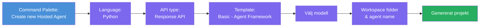
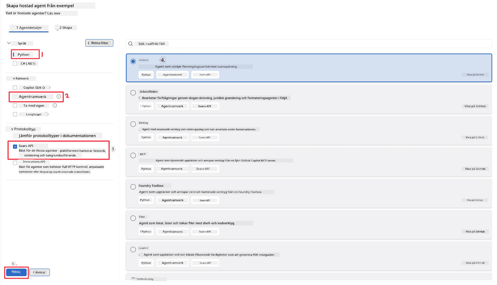
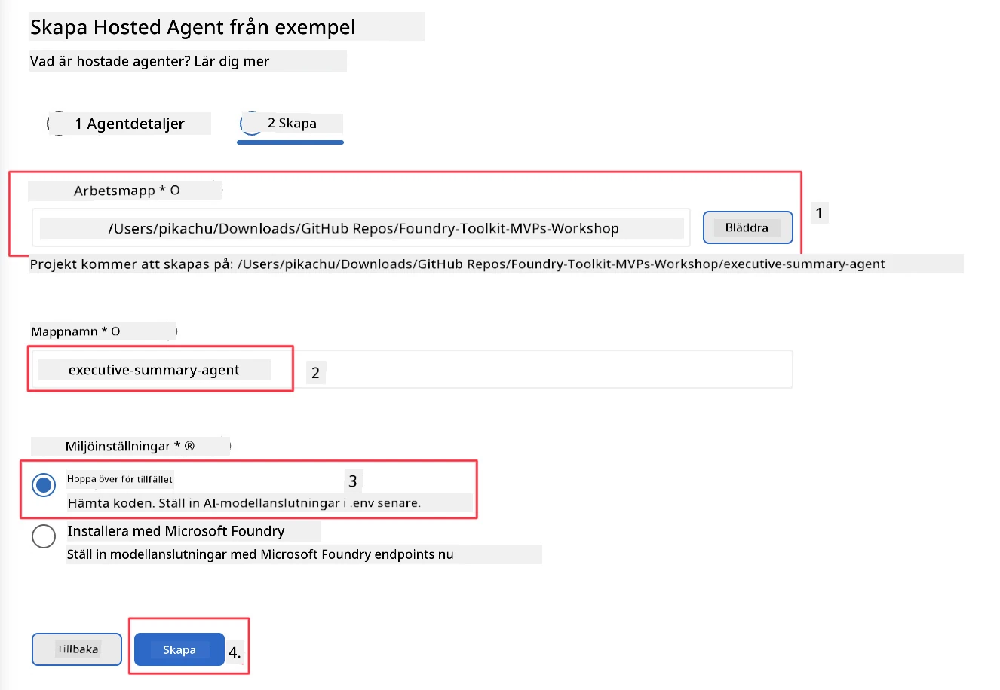

# Modul 2 - Skapa en ny hostad agent

⏱️ ~5 min

I denna modul använder du Foundry Toolkit för att **skapa ett grundläggande projekt för en hostad agent**. Grundstrukturen genereras - `agent.yaml`, `main.py`, `Dockerfile`, `requirements.txt` och VS Code debug-konfiguration - så att du kan fokusera på att anpassa agentens beteende.

> **Nyckelkoncept:** Mappen `agent/` i denna labb är ett exempel på vad Foundry Toolkit genererar. Du skriver inte dessa filer från grunden.

### Flöde för skapande av grundstruktur



---

## Steg 1: Öppna guiden för att skapa hostad agent

1. Tryck på `Ctrl+Shift+P` för att öppna **Command Palette**.
2. Skriv: **Foundry Toolkit: Create new Hosted Agent** och välj det.

> **Alternativ: Skapa via Foundry Portal**
> Om du föredrar webbläsaren kan du skapa ditt projekt på [https://ai.azure.com](https://ai.azure.com). När projektet är provisionerat, återvänd till VS Code och använd **Foundry Toolkit**-sidofältet för att ansluta till det.

> **Alternativ:** Klicka på **+**-ikonen bredvid **Hosted Agents (Preview)** i Foundry Toolkit-sidofältet.

## Steg 2: Välj inställningar



1. I vänstra navigations-/alternativdelen välj följande:

| Meny | Val | Anteckningar |
|--------|-----------|-------|
| **Language** | Python | C# stöds också |
| **Framework** | Agent Framework | Enkelt startläge med Agent Framework SDK |
| **API type** | Response API | `POST /responses` - konversationellt, med plattformsstyrd historik |
| **Template** | Basic | Enkelt startläge med Agent Framework SDK |

2. När du valt, klicka på **Next**



3. I nästa fönster, välj följande:

| Meny | Val | Anteckningar |
|--------|-----------|-------|
| **Workspace folder** | Välj en målplats | t.ex., `/workspace/Foundry_Toolkit_for_VSCode_Lab/` eller en undermapp i denna repo |
| **Agent name** | Ange ett namn | t.ex., `executive-summary-agent` |
| **Environment Setup** | hoppa över installation för nu |  |

Klicka på **create** för att skapa din agent. En ny mapp skapas med det hostade agentnamnet.

## Steg 3: Inspektera det genererade projektet

När grundstrukturen är klar, kontrollera att du ser dessa filer i Utforskaren (`Ctrl+Shift+E`):

```
📂 my-agent/
├── .env                ← Environment variables (placeholders)
├── .vscode/
│   ├── launch.json     ← Debug config (F5 → run + Agent Inspector)
│   └── tasks.json      ← VS Code task definitions
├── agent.yaml          ← Agent definition (kind: hosted)
├── Dockerfile          ← Container config for deployment
├── main.py             ← Agent entry point (your main code)
└── requirements.txt    ← Python dependencies
```

### Viktiga filer förklarade

| Fil | Syfte |
|------|---------|
| `agent.yaml` | Deklarerar agenten som `kind: hosted`, kartlägger miljövariabler, definierar protokollet `/responses` |
| `main.py` | Skapar en `FoundryChatClient` → omsluter i en `Agent` med instruktioner → tillhandahåller via `ResponsesHostServer` på port 8088 |
| `Dockerfile` | Använder `python:3.12-slim`, installerar beroenden, exponerar port 8088, kör `main.py` |
| `requirements.txt` | `agent-framework-foundry`, `agent-framework-foundry-hosting`, `mcp`, `debugpy` |

> **Viktigt:** Öppna den skapade agentmappen direkt i VS Code (själva mappen `agent/`) så att `.vscode/launch.json` och `tasks.json` fungerar korrekt för F5-debugging.

---

### ✅ Kontrollpunkt

- [ ] Grundstrukturerat projekt skapat med alla förväntade filer
- [ ] `agent.yaml` visar `kind: hosted` och `protocol: responses`
- [ ] `main.py` importerar `Agent`, `FoundryChatClient`, `ResponsesHostServer`
- [ ] Agentmappen är öppen i VS Code som arbetsrot

---

**Föregående:** [01 - Setup](01-setup.md) · **Nästa:** [03 - Konfigurera och koda →](03-configure-and-code.md)

---

<!-- CO-OP TRANSLATOR DISCLAIMER START -->
**Ansvarsfriskrivning**:
Detta dokument har översatts med hjälp av AI-översättningstjänsten [Co-op Translator](https://github.com/Azure/co-op-translator). Även om vi strävar efter noggrannhet, var vänlig notera att automatiska översättningar kan innehålla fel eller brister. Det ursprungliga dokumentet på dess modersmål bör betraktas som den auktoritativa källan. För kritisk information rekommenderas professionell mänsklig översättning. Vi ansvarar inte för några missförstånd eller feltolkningar som uppstår till följd av användningen av denna översättning.
<!-- CO-OP TRANSLATOR DISCLAIMER END -->