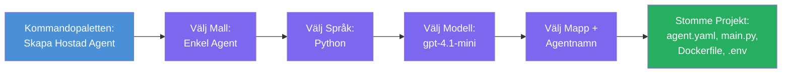

# Modul 3 - Skapa en ny hostad agent (Auto-genererad av Foundry Extension)

I denna modul använder du Microsoft Foundry-tillägget för att **skapa ett nytt [hosted agent](https://learn.microsoft.com/azure/foundry/agents/concepts/hosted-agents)-projekt**. Tillägget genererar hela projektstrukturen åt dig – inklusive `agent.yaml`, `main.py`, `Dockerfile`, `requirements.txt`, en `.env`-fil och en debug-konfiguration för VS Code. Efter skapandet anpassar du dessa filer med din agents instruktioner, verktyg och konfiguration.

> **Nyckelkoncept:** Mappen `agent/` i denna labb är ett exempel på vad Foundry-tillägget genererar när du kör detta scaffold-kommando. Du skriver inte dessa filer från grunden – tillägget skapar dem och sedan modifierar du dem.

### Flöde i scaffold-guiden


---

## Steg 1: Öppna guiden Skapa Hosted Agent

1. Tryck `Ctrl+Shift+P` för att öppna **Command Palette**.
2. Skriv: **Microsoft Foundry: Create a New Hosted Agent** och välj det.
3. Guiden för att skapa hostad agent öppnas.

> **Alternativ väg:** Du kan också nå denna guide från Microsoft Foundrys sidopanel → klicka på **+**-ikonen bredvid **Agents** eller högerklicka och välj **Create New Hosted Agent**.

---

## Steg 2: Välj mall

Guiden ber dig välja en mall. Du kommer att se alternativ som:

| Mall | Beskrivning | När man använder |
|----------|-------------|-------------|
| **Single Agent** | En agent med egen modell, instruktioner och valfria verktyg | Den här workshopen (Labb 01) |
| **Multi-Agent Workflow** | Flera agenter som samarbetar i sekvens | Labb 02 |

1. Välj **Single Agent**.
2. Klicka **Next** (eller valet går vidare automatiskt).

---

## Steg 3: Välj programmeringsspråk

1. Välj **Python** (rekommenderas för denna workshop).
2. Klicka **Next**.

> **C# stöds också** om du föredrar .NET. Scaffold-strukturen är liknande (använder `Program.cs` istället för `main.py`).

---

## Steg 4: Välj din modell

1. Guiden visar modeller som är distribuerade i ditt Foundry-projekt (från Modul 2).
2. Välj den modell du distribuerade – t.ex. **gpt-4.1-mini**.
3. Klicka **Next**.

> Om du inte ser några modeller, gå tillbaka till [Modul 2](02-create-foundry-project.md) och distribuera en först.

---

## Steg 5: Välj mappplats och agentnamn

1. En fil-dialog öppnas – välj en **målmapp** där projektet ska skapas. För denna workshop:
   - Om du startar nytt: välj vilken mapp som helst (t.ex. `C:\Projects\my-agent`)
   - Om du arbetar inom workshop-repon: skapa en ny undermapp under `workshop/lab01-single-agent/agent/`
2. Ange ett **namn** för den hostade agenten (t.ex. `executive-summary-agent` eller `my-first-agent`).
3. Klicka **Create** (eller tryck Enter).

---

## Steg 6: Vänta på att scaffoldingen slutförs

1. VS Code öppnar ett **nytt fönster** med det skapade projektet.
2. Vänta några sekunder tills projektet laddats helt.
3. Du bör se följande filer i Utforskaren (`Ctrl+Shift+E`):

```
📂 my-first-agent/
├── .env                ← Environment variables (auto-generated with placeholders)
├── .vscode/
│   └── launch.json     ← Debug configuration (F5 to run + Agent Inspector)
├── agent.yaml          ← Agent definition (kind: hosted)
├── Dockerfile          ← Container configuration for deployment
├── main.py             ← Agent entry point (your main code file)
└── requirements.txt    ← Python dependencies
```

> **Det här är samma struktur som mappen `agent/`** i denna labb. Foundry-tillägget genererar dessa filer automatiskt – du behöver inte skapa dem manuellt.

> **Workshop-notis:** I denna workshop-repo ligger mappen `.vscode/` i **rotmappen för arbetsytan** (inte inne i varje projekt). Den innehåller en gemensam `launch.json` och `tasks.json` med två debug-konfigurationer - **"Lab01 - Single Agent"** och **"Lab02 - Multi-Agent"** - där varje pekar till rätt labs `cwd`. När du trycker F5, välj konfigurationen som matchar labben du arbetar med från nedrullningsmenyn.

---

## Steg 7: Förstå varje genererad fil

Ta en stund att granska varje fil som guiden skapade. Att förstå dem är viktigt för Modul 4 (anpassning).

### 7.1 `agent.yaml` – Agentdefinition

Öppna `agent.yaml`. Den ser ut så här:

```yaml
# yaml-language-server: $schema=https://raw.githubusercontent.com/microsoft/AgentSchema/refs/heads/main/schemas/v1.0/ContainerAgent.yaml

kind: hosted
name: my-first-agent
description: >
  A hosted agent deployed to Microsoft Foundry Agent Service.
metadata:
  authors:
    - Microsoft
  tags:
    - Azure AI AgentServer
    - Microsoft Agent Framework
    - Hosted Agent
protocols:
  - protocol: responses
    version: v1
environment_variables:
  - name: AZURE_AI_PROJECT_ENDPOINT
    value: ${PROJECT_ENDPOINT}
  - name: AZURE_AI_MODEL_DEPLOYMENT_NAME
    value: ${MODEL_DEPLOYMENT_NAME}
dockerfile_path: Dockerfile
resources:
  cpu: '0.25'
  memory: 0.5Gi
```

**Viktiga fält:**

| Fält | Syfte |
|-------|---------|
| `kind: hosted` | Anger att detta är en hostad agent (container-baserad, distribuerad till [Foundry Agent Service](https://learn.microsoft.com/azure/foundry/agents/overview)) |
| `protocols: responses v1` | Agenten exponerar OpenAI-kompatibel `/responses` HTTP-endpoint |
| `environment_variables` | Kopplar `.env`-värden till container-miljövariabler vid distribution |
| `dockerfile_path` | Pekar på Dockerfilen som används för att bygga containerbilden |
| `resources` | CPU- och minnesallokering för containern (0.25 CPU, 0.5Gi minne) |

### 7.2 `main.py` – Agents ingångspunkt

Öppna `main.py`. Detta är huvudfilen i Python där din agentlogik finns. Scaffolden inkluderar:

```python
from agent_framework.azure import AzureAIAgentClient
from azure.ai.agentserver.agentframework import from_agent_framework
from azure.identity.aio import DefaultAzureCredential
```

**Viktiga imports:**

| Import | Syfte |
|--------|--------|
| `AzureAIAgentClient` | Kopplar till ditt Foundry-projekt och skapar agenter via `.as_agent()` |
| [`DefaultAzureCredential`](https://learn.microsoft.com/azure/developer/python/sdk/authentication/credential-chains#defaultazurecredential-overview) | Hanterar autentisering (Azure CLI, VS Code inloggning, managed identity eller service principal) |
| `from_agent_framework` | Paketerar agenten som en HTTP-server som exponerar `/responses`-endpointen |

Huvudflödet är:
1. Skapa credential → skapa klient → anropa `.as_agent()` för att få en agent (async context manager) → paketerar som server → kör

### 7.3 `Dockerfile` – Containerbild

```dockerfile
FROM python:3.14-slim

WORKDIR /app

COPY ./ .

RUN pip install --upgrade pip && \
    if [ -f requirements.txt ]; then \
        pip install -r requirements.txt; \
    else \
        echo "No requirements.txt found" >&2; exit 1; \
    fi

EXPOSE 8088

CMD ["python", "main.py"]
```

**Viktiga detaljer:**
- Använder `python:3.14-slim` som basbild.
- Kopierar alla projektfiler till `/app`.
- Uppgraderar `pip`, installerar beroenden från `requirements.txt` och misslyckas snabbt om filen saknas.
- **Exponerar port 8088** - detta är den obligatoriska porten för hostade agenter. Ändra inte denna.
- Startar agenten med `python main.py`.

### 7.4 `requirements.txt` – Beroenden

```
agent-framework-azure-ai==1.0.0rc3
agent-framework-core==1.0.0rc3
azure-ai-agentserver-agentframework==1.0.0b16
azure-ai-agentserver-core==1.0.0b16
debugpy
agent-dev-cli
```

| Paket | Syfte |
|---------|---------|
| `agent-framework-azure-ai` | Azure AI-integration för Microsoft Agent Framework |
| `agent-framework-core` | Kärnruntime för att bygga agenter (inkluderar `python-dotenv`) |
| `azure-ai-agentserver-agentframework` | Runtime för hostad agent-server till Foundry Agent Service |
| `azure-ai-agentserver-core` | Kärnabstraktioner för agent-server |
| `debugpy` | Python-debuggingstöd (möjliggör F5-debugging i VS Code) |
| `agent-dev-cli` | Lokal utvecklings-CLI för att testa agenter (används av debug/kör-konfigurationen) |

---

## Förstå agentprotokollet

Hostade agenter kommunicerar via **OpenAI Responses API**-protokollet. När agenten körs (lokalt eller i molnet) exponerar den en enda HTTP-endpoint:

```
POST http://localhost:8088/responses
Content-Type: application/json

{
  "input": "Your prompt here",
  "stream": false
}
```

Foundry Agent Service anropar denna endpoint för att skicka användarprompter och ta emot agentens svar. Detta är samma protokoll som OpenAI API använder, så din agent är kompatibel med vilken klient som helst som talar OpenAI Responses-formatet.

---

### Kontrollpunkt

- [ ] Scaffold-guiden slutfördes framgångsrikt och ett **nytt VS Code-fönster** öppnades
- [ ] Du kan se alla 5 filer: `agent.yaml`, `main.py`, `Dockerfile`, `requirements.txt`, `.env`
- [ ] Filen `.vscode/launch.json` finns (möjliggör F5-debugging – i denna workshop är den i rotmappen för arbetsytan med labbspecifika konfigurationer)
- [ ] Du har läst igenom varje fil och förstår dess syfte
- [ ] Du förstår att port `8088` är obligatorisk och att `/responses`-endpointen är protokollet

---

**Föregående:** [02 - Skapa Foundry-projekt](02-create-foundry-project.md) · **Nästa:** [04 - Konfigurera & Koda →](04-configure-and-code.md)

---

<!-- CO-OP TRANSLATOR DISCLAIMER START -->
**Ansvarsfriskrivning**:
Detta dokument har översatts med hjälp av AI-översättningstjänsten [Co-op Translator](https://github.com/Azure/co-op-translator). Även om vi strävar efter noggrannhet, vänligen var medveten om att automatiska översättningar kan innehålla fel eller felaktigheter. Det ursprungliga dokumentet på dess modersmål bör betraktas som den auktoritativa källan. För kritisk information rekommenderas professionell mänsklig översättning. Vi ansvarar inte för några missförstånd eller feltolkningar som uppstår till följd av användningen av denna översättning.
<!-- CO-OP TRANSLATOR DISCLAIMER END -->