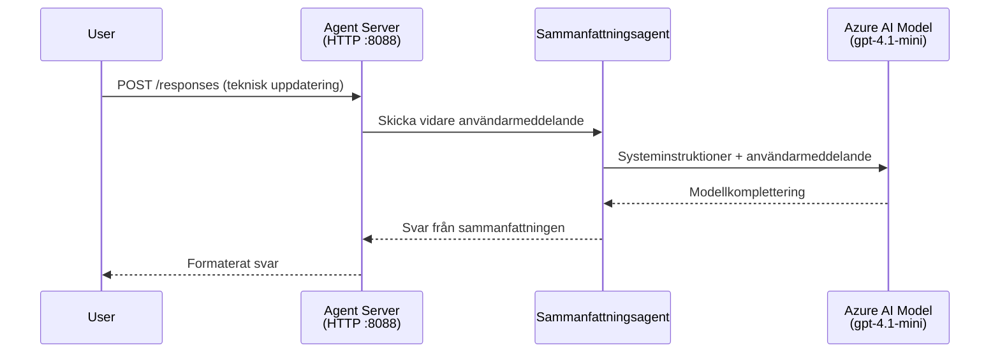
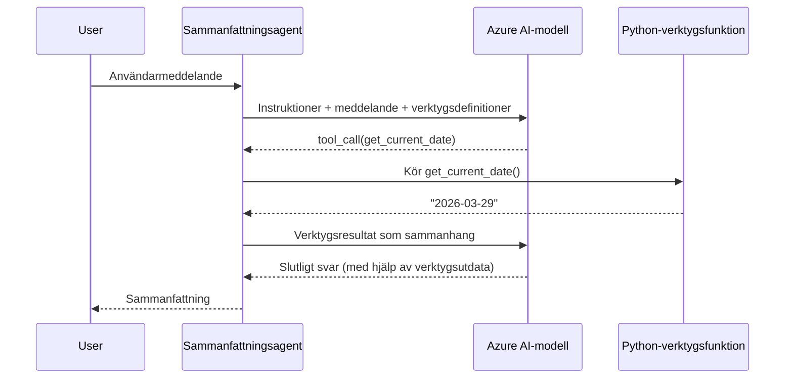

# Modul 4 - Konfigurera instruktioner, miljö & installera beroenden

I denna modul anpassar du de automatiskt skapade agentfilerna från Modul 3. Här förvandlar du den generiska scaffolden till **din** agent – genom att skriva instruktioner, ställa in miljövariabler, valfritt lägga till verktyg och installera beroenden.

> **Påminnelse:** Foundry-tillägget genererade dina projektfiler automatiskt. Nu modifierar du dem. Se [`agent/`](../../../../../workshop/lab01-single-agent/agent) mappen för ett komplett fungerande exempel på en anpassad agent.

---

## Hur komponenterna passar ihop

### Begärans livscykel (enkel agent)


> **Med verktyg:** Om agenten har registrerade verktyg kan modellen returnera ett verktygsanrop istället för en direkt svarsgenerering. Ramverket kör verktyget lokalt, matar tillbaka resultatet till modellen, och modellen genererar sedan det slutliga svaret.


---

## Steg 1: Konfigurera miljövariabler

Scaffolden skapade en `.env`-fil med platshållarvärden. Du behöver fylla i de riktiga värdena från Modul 2.

1. Öppna **`.env`**-filen i ditt scaffoldade projekt (den ligger i projektrotsmappen).
2. Ersätt platshållarvärdena med dina faktiska Foundry-projektdetaljer:

   ```env
   PROJECT_ENDPOINT=https://<your-account>.services.ai.azure.com/api/projects/<your-project>
   MODEL_DEPLOYMENT_NAME=gpt-4.1-mini
   ```

3. Spara filen.

### Var du hittar dessa värden

| Värde | Hur du hittar det |
|-------|-------------------|
| **Projektendpoint** | Öppna **Microsoft Foundry** sidofält i VS Code → klicka på ditt projekt → endpoint-URL visas i detaljvyn. Den ser ut som `https://<account-name>.services.ai.azure.com/api/projects/<project-name>` |
| **Modellutplaceringsnamn** | I Foundry sidofält, expandera ditt projekt → titta under **Models + endpoints** → namnet listas bredvid den utplacerade modellen (t.ex. `gpt-4.1-mini`) |

> **Säkerhet:** Lämna aldrig in `.env`-filen till versionskontroll. Den är redan inkluderad i `.gitignore` som standard. Om den inte är det, lägg till den:
> ```
> .env
> ```

### Hur miljövariabler flödar

Kedjan för mappning är: `.env` → `main.py` (läser via `os.getenv`) → `agent.yaml` (mappas till containerens miljövariabler vid drifttid).

I `main.py` läser scaffolden dessa värden så här:

```python
PROJECT_ENDPOINT = os.getenv("AZURE_AI_PROJECT_ENDPOINT") or os.getenv("PROJECT_ENDPOINT")
MODEL_DEPLOYMENT_NAME = os.getenv("AZURE_AI_MODEL_DEPLOYMENT_NAME", os.getenv("MODEL_DEPLOYMENT_NAME", "gpt-4.1-mini"))
```

Både `AZURE_AI_PROJECT_ENDPOINT` och `PROJECT_ENDPOINT` accepteras (men `agent.yaml` använder prefixet `AZURE_AI_*`).

---

## Steg 2: Skriv agentinstruktioner

Det här är det viktigaste anpassningssteget. Instruktionerna definierar din agents personlighet, beteende, utdataformat och säkerhetsbegränsningar.

1. Öppna `main.py` i ditt projekt.
2. Leta upp instruktionstexten (scaffolden inkluderar en standard/generisk).
3. Ersätt den med detaljerade, strukturerade instruktioner.

### Vad bra instruktioner inkluderar

| Komponent | Syfte | Exempel |
|-----------|-------|---------|
| **Roll** | Vad agenten är och gör | "Du är en sammanfattningsagent för ledningsöversikter" |
| **Målgrupp** | Vem svaren är till för | "Seniora ledare med begränsad teknisk bakgrund" |
| **Inmatningsdefinition** | Vilken sorts promptar den hanterar | "Tekniska incidentrapporter, driftuppdateringar" |
| **Utdataformat** | Exakt struktur på svaren | "Ledningssammanfattning: - Vad som hände: ... - Affärspåverkan: ... - Nästa steg: ..." |
| **Regler** | Begränsningar och vägran att svara | "Lägg INTE till information utöver vad som tillhandahållits" |
| **Säkerhet** | Förhindra missbruk och hallucination | "Om inmatningen är oklar, be om förtydligande" |
| **Exempel** | Inmatnings-/utmatningspar för att styra beteende | Inkludera 2-3 exempel med varierande inmatningar |

### Exempel: Instruktioner för Executive Summary Agent

Här är instruktionen som används i workshopens [`agent/main.py`](../../../../../workshop/lab01-single-agent/agent/main.py):

```python
AGENT_INSTRUCTIONS = """You are an "Explain Like I'm an Executive" agent.

Purpose:
Your job is to translate complex technical or operational information into
clear, concise, and outcome-focused summaries that can be easily understood
by non-technical executives.

Audience:
Senior leaders with limited technical background who care about impact,
risk, and what happens next.

What you must do:
- Rephrase the input so it is understandable to a non-technical audience
- Prioritize clarity, brevity, and outcomes over technical accuracy
- Remove technical jargon, logs, metrics, stack traces, and deep root-cause details
- Translate technical causes into simple cause-and-effect statements
- Explicitly call out business impact
- Always include a clear next step or action
- Maintain a neutral, factual, and calm executive tone
- Do NOT add new facts or speculate beyond the input

Standard Output Structure (always use this wording):

Executive Summary:
- What happened: <plain-language description>
- Business impact: <clear, non-technical impact>
- Next step: <clear action or mitigation>

Rules:
- Keep responses under 100 words
- Do NOT add facts beyond the input
- If input is unclear, ask for clarification
"""
```

4. Byt ut den befintliga instruktionstexten i `main.py` mot dina egna instruktioner.
5. Spara filen.

---

## Steg 3: (Valfritt) Lägg till egna verktyg

Hostade agenter kan köra **lokala Python-funktioner** som [verktyg](https://learn.microsoft.com/azure/foundry/agents/concepts/tool-catalog). Detta är en viktig fördel med kodbaserade hostade agenter jämfört med enbart promptagenter – din agent kan köra godtycklig serverlogik.

### 3.1 Definiera en verktygsfunktion

Lägg till en verktygsfunktion i `main.py`:

```python
from agent_framework import tool

@tool
def get_current_date() -> str:
    """Returns the current date in YYYY-MM-DD format."""
    from datetime import date
    return str(date.today())
```

`@tool`-dekoreraren gör en vanlig Python-funktion till ett agentverktyg. Docstringen blir verktygets beskrivning som modellen ser.

### 3.2 Registrera verktyget med agenten

När du skapar agenten med `.as_agent()` kontexten, skicka med verktyget som en parameter `tools`:

```python
async with AzureAIAgentClient(
    project_endpoint=PROJECT_ENDPOINT,
    model_deployment_name=MODEL_DEPLOYMENT_NAME,
    credential=credential,
).as_agent(
    name="my-agent",
    instructions=AGENT_INSTRUCTIONS,
    tools=[get_current_date],
) as agent:
    server = from_agent_framework(agent)
    await server.run_async()
```

### 3.3 Hur verktygsanrop fungerar

1. Användaren skickar en prompt.
2. Modellen avgör om ett verktyg behövs (baserat på prompt, instruktioner och verktygsbeskrivningar).
3. Om ett verktyg behövs, kör ramverket din Python-funktion lokalt (inne i containern).
4. Verktygets returvärde skickas tillbaka till modellen som kontext.
5. Modellen genererar slutligt svar.

> **Verktyg körs server-side** – de körs inuti din container, inte i användarens webbläsare eller i modellen. Det innebär att du kan nå databaser, API:er, filsystem eller vilket Python-bibliotek som helst.

---

## Steg 4: Skapa och aktivera en virtuell miljö

Innan du installerar beroenden, skapa en isolerad Python-miljö.

### 4.1 Skapa den virtuella miljön

Öppna en terminal i VS Code (`` Ctrl+` ``) och kör:

```powershell
python -m venv .venv
```

Detta skapar en `.venv`-mapp i din projektkatalog.

### 4.2 Aktivera den virtuella miljön

**PowerShell (Windows):**

```powershell
.\.venv\Scripts\Activate.ps1
```

**Kommandoprompt (Windows):**

```cmd
.venv\Scripts\activate.bat
```

**macOS/Linux (Bash):**

```bash
source .venv/bin/activate
```

Du ska se `(.venv)` visas i början av terminalprompten, vilket betyder att den virtuella miljön är aktiv.

### 4.3 Installera beroenden

Med den virtuella miljön aktiv, installera de nödvändiga paketen:

```powershell
pip install -r requirements.txt
```

Det installerar:

| Paket | Syfte |
|-------|-------|
| `agent-framework-azure-ai==1.0.0rc3` | Azure AI-integration för [Microsoft Agent Framework](https://learn.microsoft.com/agent-framework/overview/) |
| `agent-framework-core==1.0.0rc3` | Kärnruntime för att bygga agenter (inkluderar `python-dotenv`) |
| `azure-ai-agentserver-agentframework==1.0.0b16` | Runtime för hostad agentserver för [Foundry Agent Service](https://learn.microsoft.com/azure/foundry/agents/overview) |
| `azure-ai-agentserver-core==1.0.0b16` | Kärnabstraktioner för agentserver |
| `debugpy` | Python-debugging (möjliggör F5-debugging i VS Code) |
| `agent-dev-cli` | Lokal utvecklings-CLI för att testa agenter |

### 4.4 Verifiera installationen

```powershell
pip list | Select-String "agent-framework|agentserver"
```

Förväntad utdata:
```
agent-framework-azure-ai   1.0.0rc3
agent-framework-core       1.0.0rc3
azure-ai-agentserver-agentframework 1.0.0b16
azure-ai-agentserver-core  1.0.0b16
```

---

## Steg 5: Verifiera autentisering

Agenten använder [`DefaultAzureCredential`](https://learn.microsoft.com/azure/developer/python/sdk/authentication/credential-chains#defaultazurecredential-overview) som försöker flera autentiseringsmetoder i denna ordning:

1. **Miljövariabler** - `AZURE_CLIENT_ID`, `AZURE_TENANT_ID`, `AZURE_CLIENT_SECRET` (service principal)
2. **Azure CLI** - plockar upp din `az login`-session
3. **VS Code** - använder kontot du loggade in med i VS Code
4. **Managed Identity** - används när du kör i Azure (vid drifttid)

### 5.1 Verifiera för lokal utveckling

Minst en av dessa bör fungera:

**Alternativ A: Azure CLI (rekommenderas)**

```powershell
az account show --query "{name:name, id:id}" --output table
```

Förväntat: Visar ditt prenumerationsnamn och ID.

**Alternativ B: Inloggning i VS Code**

1. Titta längst ner till vänster i VS Code efter ikonen för **Konton**.
2. Om du ser ditt kontonamn är du autentiserad.
3. Om inte, klicka på ikonen → **Sign in to use Microsoft Foundry**.

**Alternativ C: Service principal (för CI/CD)**

```powershell
$env:AZURE_TENANT_ID = "<your-tenant-id>"
$env:AZURE_CLIENT_ID = "<your-client-id>"
$env:AZURE_CLIENT_SECRET = "<your-client-secret>"
```

### 5.2 Vanligt autentiseringsproblem

Om du är inloggad på flera Azure-konton, se till att rätt prenumeration är vald:

```powershell
az account set --subscription "<your-subscription-id>"
```

---

### Kontrollpunkt

- [ ] `.env`-filen har giltiga `PROJECT_ENDPOINT` och `MODEL_DEPLOYMENT_NAME` (inte platshållare)
- [ ] Agentinstruktioner är anpassade i `main.py` – de definierar roll, målgrupp, utdataformat, regler och säkerhetsbegränsningar
- [ ] (Valfritt) Egna verktyg är definierade och registrerade
- [ ] Den virtuella miljön är skapad och aktiverad (`(.venv)` syns i terminalprompten)
- [ ] `pip install -r requirements.txt` slutförs utan fel
- [ ] `pip list | Select-String "azure-ai-agentserver"` visar att paketet är installerat
- [ ] Autentiseringen är giltig – `az account show` returnerar din prenumeration ELLER du är inloggad i VS Code

---

**Föregående:** [03 - Skapa hostad agent](03-create-hosted-agent.md) · **Nästa:** [05 - Testa lokalt →](05-test-locally.md)

---

<!-- CO-OP TRANSLATOR DISCLAIMER START -->
**Ansvarsfriskrivning**:  
Detta dokument har översatts med hjälp av AI-översättningstjänsten [Co-op Translator](https://github.com/Azure/co-op-translator). Även om vi strävar efter noggrannhet, var vänlig observera att automatiska översättningar kan innehålla fel eller brister. Det ursprungliga dokumentet på dess modersmål bör betraktas som den auktoritativa källan. För kritisk information rekommenderas professionell mänsklig översättning. Vi ansvarar inte för eventuella missförstånd eller feltolkningar som uppstår från användningen av denna översättning.
<!-- CO-OP TRANSLATOR DISCLAIMER END -->