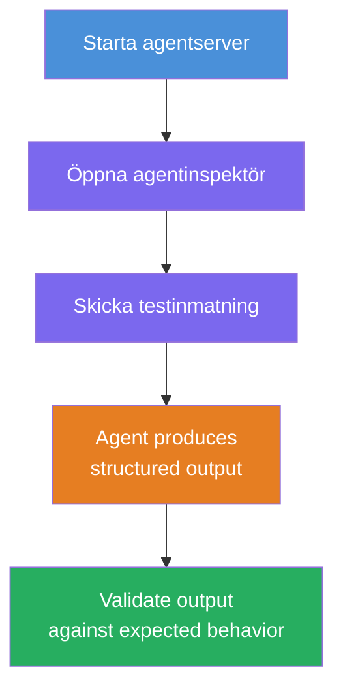
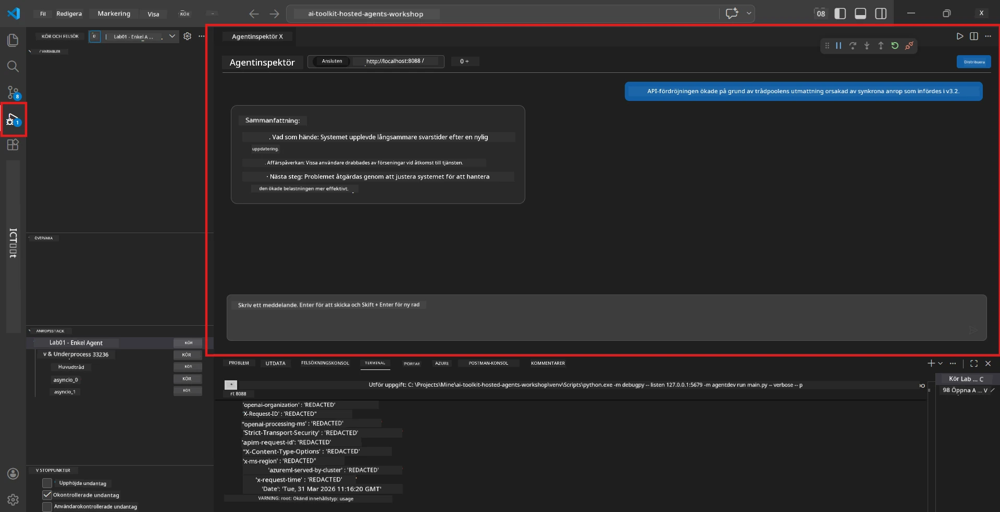
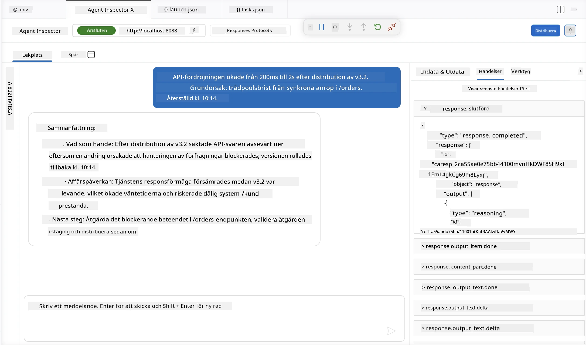

# Modul 4 - Testa lokalt

⏱️ ~10 min

I denna modul kör du din agent lokalt och verifierar att den fungerar korrekt med hjälp av **happy-path funktionstester**. Du kommer att använda Agent Inspector (visuellt gränssnitt) eller direkta HTTP-anrop för att bekräfta att agenten producerar strukturerade, korrekta svar.

### Lokal testningsflöde



---

## Alternativ 1: Tryck F5 - Debugga med Agent Inspector (rekommenderat)

### Starta debuggern

1. Öppna mappen **executive-summary-agent/** direkt i VS Code (`File → Open Folder`).
2. Öppna **Run and Debug**-panelen (`Ctrl+Shift+D`).
3. Välj **Debug Local Agent Server** från dropdown-menyn.
4. Tryck på **F5** (eller klicka på ▶ Start Debugging).

> ⚠️ **Viktigt: Välj din Python Interpreter**
> Om du får "ModuleNotFoundError" eller debuggern misslyckas med att starta, måste du tala om för VS Code att använda din virtuella miljö:
  > 1. Tryck `Ctrl+Shift+P` $\rightarrow$ skriv **Python: Select Interpreter**.
  > 2. Välj tolken som finns i projektets `.venv`-mapp (t.ex. `.\.venv\Scripts\python.exe` på Windows).
  > 3. Starta om debug-sessionen.
> Om du fortfarande får fel, uppdatera manuellt din fil `tasks.json` enligt följande:
  > 1. Navigera till filen `.vscode/tasks.json`
  > 2. Gå till kommandot märkt: `Run Agent/Workflow HTTP Server`
  > 3. Uppdatera kommando-värdet enligt följande: `"value": "${workspaceFolder}/.venv/bin/python",`

### Vad händer

1. HTTP-servern startar på `http://localhost:8088/responses`.
2. **Agent Inspector**-panelen öppnas automatiskt - ett visuellt chatt-gränssnitt för testning.
3. Breakpoints är aktiverade i `main.py`.

Håll koll på Terminalen för:
```
Starting executive summary hosted agent
Executive agent server running on http://localhost:8088
```

> **Om Agent Inspector inte öppnas:** Tryck `Ctrl+Shift+P` → **Foundry Toolkit: Open Agent Inspector**.



> *Skärmbilden kan visa äldre "AI TOOLKIT"-branding från en tidigare extension-version.*

---

## Alternativ 2: Testa via Terminal (alternativ)

Starta agenten i en terminal, skicka förfrågningar från en annan:

```bash
# Terminal 1: Starta agent
cd executive-summary-agent/
source .venv/bin/activate
python main.py
```

```bash
# Terminal 2: Skicka test (curl)
curl -sS -X POST http://localhost:8088/responses \
  -H "Content-Type: application/json" \
  -d '{"input": "The API latency increased due to thread pool exhaustion caused by sync calls in v3.2.", "stream": false}'
```

---

## Scenariotester: Happy-path funktionell validering

Kör **alla tre** scenarion nedan. Dessa validerar att din agent producerar korrekt, strukturerad output för realistiska indata.



### Scenario 1: IT-incident - API-latensspik

**Indata:**
```
The API latency increased from 200ms to 2s after deploying v3.2.
Root cause: thread pool starvation from synchronous calls in /orders.
Rolled back at 10:14.
```

**Förväntat beteende:**
- ✅ Följer "Executive Summary"-strukturen (Vad hände / Affärspåverkan / Nästa steg)
- ✅ Ingen teknisk jargong (ingen "thread pool", inget "/orders", ingen "v3.2")
- ✅ Anger tydligt affärspåverkan (t.ex. användare upplevde förseningar)
- ✅ Inkluderar ett nästa steg (t.ex. åtgärd implementerad, övervakning på plats)

---

### Scenario 2: Datapipeline - ETL-fel

**Indata:**
```
The nightly ETL job failed because the upstream schema changed. APAC dashboards show missing data.
```

**Förväntat beteende:**
- ✅ Sammanfattar datauppdateringsfelet med enkel språkdräkt
- ✅ Nämner APAC-dashboardens påverkan
- ✅ Inkluderar ett åtgärdssteg för felhantering
- ✅ Nämner INTE "ETL", "schema" eller andra tekniska termer

---

### Scenario 3: Säkerhet - Exponerad referens

**Indata:**
```
Static analysis flagged a hardcoded secret in the repository.
The secret may have been exposed in commit history.
```

**Förväntat beteende:**
- ✅ Beskriver ett referens-/säkerhetsproblem med ett språk som chefer förstår
- ✅ Påpekar potentiell risk (obehörig åtkomst)
- ✅ Anger åtgärd (rotation av referenser, audit)
- ✅ Inkluderar INTE termer som "static analysis", "commit history" eller "hardcoded"

---

## Valideringskriterier

För varje scenario, kontrollera:

| # | Kriterium | Godkänd om |
|---|----------|---------------|
| 1 | **Struktur** | Svaret använder "Executive Summary"-format med alla tre punkter |
| 2 | **Enkelt språk** | Ingen teknisk jargong som en chef inte skulle förstå |
| 3 | **Noggrannhet** | Sammanfattningen speglar indata - inga påhittade detaljer |
| 4 | **Korthet** | Svaret är under 100 ord |
| 5 | **Nästa steg** | En tydlig åtgärd eller mildring anges |

---

## Debuggingtips

| Problem | Lösning |
|-------|---------|
| Agenten startar inte | Kontrollera `.env`-värden, verifiera att venv är aktiverad, kör `pip install -r requirements.txt` |
| Tomt eller generiskt svar | Granska instruktionerna i `main.py` - säkerställ att outputformat specificeras |
| Svaret innehåller jargong | Stärk reglerna "ta bort tekniska termer" i instruktionerna |
| Agent Inspector öppnas inte | `Ctrl+Shift+P` → **Foundry Toolkit: Open Agent Inspector** |
| Modellfel i Terminalen | Verifiera att `AZURE_AI_MODEL_DEPLOYMENT_NAME` matchar exakt (skiftlägeskänsligt) |

---

### ✅ Kontrollpunkt

- [ ] Agenten startar lokalt utan fel
- [ ] Agent Inspector öppnas och visar ett chattgränssnitt (om F5 används)
- [ ] **Scenario 1** (IT-incident) - strukturerad Executive Summary, ingen jargong
- [ ] **Scenario 2** (datapipeline) - relevant sammanfattning med affärspåverkan
- [ ] **Scenario 3** (säkerhetsvarning) - adekvat riskkommunikation
- [ ] Alla svar följer definierad outputstruktur

> **Spara dina svar** (kopiera eller skärmdumpa) - du kommer jämföra dem med molnresultaten i Modul 06.

---

**Föregående:** [03 - Configure & Code](03-configure-and-code.md) · **Nästa:** [05 - Deploy to Foundry →](05-deploy-to-foundry.md)

---

<!-- CO-OP TRANSLATOR DISCLAIMER START -->
**Ansvarsfriskrivning**:
Detta dokument har översatts med hjälp av AI-översättningstjänsten [Co-op Translator](https://github.com/Azure/co-op-translator). Även om vi strävar efter noggrannhet, var vänlig notera att automatiska översättningar kan innehålla fel eller brister. Det ursprungliga dokumentet på dess modersmål bör betraktas som den auktoritativa källan. För kritisk information rekommenderas professionell mänsklig översättning. Vi ansvarar inte för några missförstånd eller feltolkningar som uppstår till följd av användningen av denna översättning.
<!-- CO-OP TRANSLATOR DISCLAIMER END -->