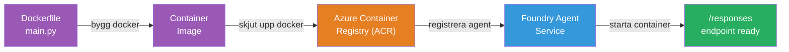
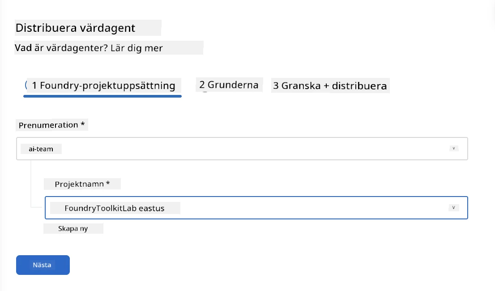
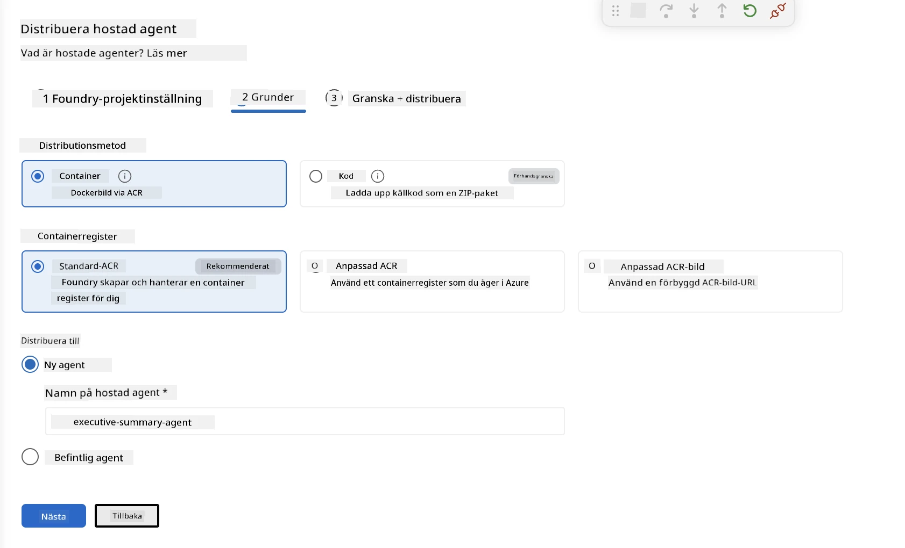
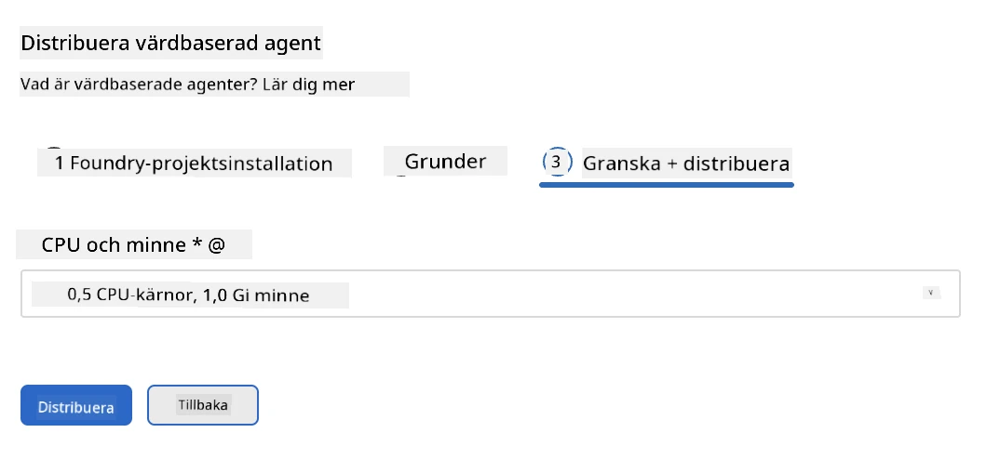
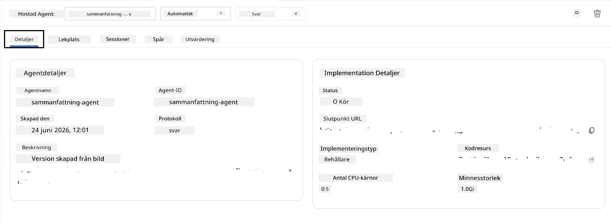

# Modul 5 - Distribuera till Foundry Agent Service

⏱️ ~10 min

> ⚠️ **Användare av Sökväg B:** Denna modul kräver en Foundry-prenumeration. Om du använder Foundry Local, hoppa till [Modul 07 - Sammanfattning](07-summary.md). Du har framgångsrikt slutfört den lokala utvecklingsarbetsflödet!

I denna modul distribuerar du din lokalt testade agent till Microsoft Foundry som en **Hosted Agent**. Distributionen bygger en containerimage, skjuter upp den till Azure Container Registry och startar agenten i Foundrys hanterade infrastruktur.

### Distributionspipeline

---

## Kontroll av förutsättningar

Innan distribution, verifiera:

- [ ] Agenten klarar alla 3 lokala scenarier från [Modul 04](04-test-locally.md)
- [ ] Du har rollen **Azure AI User** på projektnivån ([Modul 01, Tilldela RBAC](01-setup.md#deploy-a-model--assign-rbac))
- [ ] Du är inloggad på Azure i VS Code (Kontikonen visar ditt namn)

---

## Steg 1: Starta distributionen

### Alternativ A: Distribuera från Agent Inspector (rekommenderat)

Om Agent Inspector är öppen (från testning):
1. Klicka på **Deploy**-knappen uppe till höger (molnikon ↑).

### Alternativ B: Distribuera från Kommandopaletten

1. Tryck på `Ctrl+Shift+P` → **Foundry Toolkit: Deploy Hosted Agent**.

---

## Steg 2: Konfigurera distributionen

Guiden ber dig om:

| Prompt | Val |
|--------|-----------|
| **Prenumeration** | Din Azure-prenumeration |
| **Målprojekt** | Ditt Foundry-projekt (t.ex. `workshop-agents`) |

Klicka på **nästa** för att konfigurera din agent.

| Prompt | Val |
|--------|-----------|
| **Distributionsmetod** | Container |
| **Containerregister** | **Standard ACR** (Microsoft Foundry skapar och hanterar ett åt dig) |
| **Distribuera till** | Ny Agent (namn, `executive-summary-agent`) |

Klicka på **nästa** för att granska och distribuera din agent.

| Prompt | Val |
|--------|-----------|
| **CPU och minne** | **0.25 CPU-kärnor, 0.5 Gi minne** (tillräckligt för workshopen) |

---

## Steg 3: Distribuera och övervaka

1. Klicka på **Deploy**.
2. Titta på panelen **Output** (välj **Microsoft Foundry** från rullgardinsmenyn).
3. Distributionen går igenom följande steg:
   - **Docker build** - bygger container från din Dockerfile
   - **Docker push** - skjuter upp bilden till ACR (1–3 min vid första distribution)
   - **Agentregistrering** - skapar hostad agent i Foundry
   - **Container start** - startar med systemhanterad identitet

4. När den är klar visas en notifiering:
   > **my-agent är distribuerad framgångsrikt.** `Visa loggar` `Kör agent`

5. Klicka på **Kör agent** för att öppna Agent Playground.

### Distributionsstatusvärden

| Status | Betydelse |
|--------|---------|
| **Running** | Container redo, agent svarar |
| **Pending** | Container startar - vänta 30–60 sekunder |
| **Failed** | Kontrollera loggar (se felsökning nedan) |

---

## Vanliga distributionsfel

| Fel | Grundorsak | Lösning |
|-------|-----------|-----|
| `agents/write` behörighet nekad | Saknas rollen **Azure AI User** på projektnivån | [Modul 01, Tilldela RBAC](01-setup.md#deploy-a-model--assign-rbac) |
| Docker körs inte | Docker Desktop är inte startat | Starta Docker Desktop → verifiera `docker info` |
| ACR-auktorisation | Hanterad identitet kan inte hämta bilden | Se [Modul 08 - Felsökning](08-troubleshooting.md) |

---

### ✅ Kontrollpunkt

- [ ] Distribution slutförd utan fel
- [ ] Agenten visas under **Hosted Agents (Preview)** i Foundry-sidebar
- [ ] Containerstatus visar **Running**
- [ ] Fliken Agent Playground öppnades och visar agentdetaljer och slutpunkt-URL

---

**Föregående:** [04 - Testa Lokalt](04-test-locally.md) · **Nästa:** [06 - Verifiera i Playground →](06-verify-in-playground.md)

---

<!-- CO-OP TRANSLATOR DISCLAIMER START -->
**Ansvarsfriskrivning**:
Detta dokument har översatts med hjälp av AI-översättningstjänsten [Co-op Translator](https://github.com/Azure/co-op-translator). Även om vi strävar efter noggrannhet, var vänlig notera att automatiska översättningar kan innehålla fel eller brister. Det ursprungliga dokumentet på dess modersmål bör betraktas som den auktoritativa källan. För kritisk information rekommenderas professionell mänsklig översättning. Vi ansvarar inte för några missförstånd eller feltolkningar som uppstår till följd av användningen av denna översättning.
<!-- CO-OP TRANSLATOR DISCLAIMER END -->