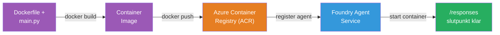
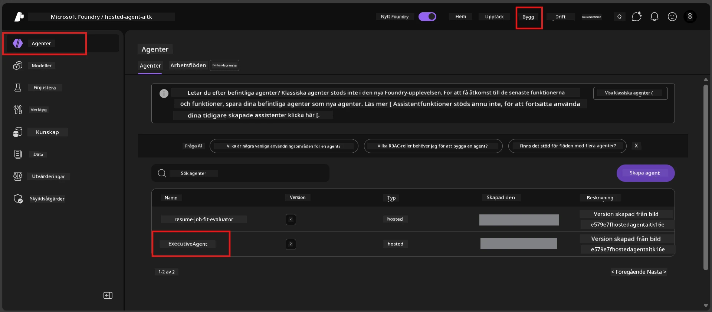

# Modul 6 - Distribuera till Foundry Agent Service

I denna modul distribuerar du din lokalt testade agent till Microsoft Foundry som en [**Hosted Agent**](https://learn.microsoft.com/azure/foundry/agents/concepts/hosted-agents). Distribueringsprocessen bygger en Docker-containerbild från ditt projekt, pushar den till [Azure Container Registry (ACR)](https://learn.microsoft.com/azure/container-registry/container-registry-intro) och skapar en värdbaserad agentversion i [Foundry Agent Service](https://learn.microsoft.com/azure/foundry/agents/overview).

### Distribueringspipeline


---

## Kontroll av förutsättningar

Innan du distribuerar, verifiera varje punkt nedan. Att hoppa över dessa är den vanligaste orsaken till distributionsfel.

1. **Agenten klarar lokala grundtester:**
   - Du har slutfört alla 4 tester i [Modul 5](05-test-locally.md) och agenten svarade korrekt.

2. **Du har rollen [Azure AI User](https://learn.microsoft.com/azure/foundry/concepts/rbac-foundry#built-in-roles):**
   - Den tilldelades i [Modul 2, Steg 3](02-create-foundry-project.md). Om du är osäker, kontrollera nu:
   - Azure Portal → din Foundry **projekt** resurs → **Åtkomstkontroll (IAM)** → **Rolltilldelningar**-fliken → sök efter ditt namn → bekräfta att **Azure AI User** finns med.

3. **Du är inloggad i Azure i VS Code:**
   - Kontrollera kontotikon längst ned till vänster i VS Code. Ditt kontonamn ska synas.

4. **(Valfritt) Docker Desktop körs:**
   - Docker behövs endast om Foundry-tillägget frågar efter lokal build. I de flesta fall hanterar tillägget containerbyggen automatiskt vid distribution.
   - Om du har Docker installerat, verifiera att det körs: `docker info`

---

## Steg 1: Starta distributionen

Du har två sätt att distribuera - båda leder till samma resultat.

### Alternativ A: Distribuera från Agent Inspector (rekommenderas)

Om du kör agenten med debuggern (F5) och Agent Inspector är öppet:

1. Titta i **övre högra hörnet** av Agent Inspector-panelen.
2. Klicka på **Deploy**-knappen (molnikon med en uppåtpil ↑).
3. Distributionsguiden öppnas.

### Alternativ B: Distribuera från Kommandopaletten

1. Tryck `Ctrl+Shift+P` för att öppna **Kommandopaletten**.
2. Skriv: **Microsoft Foundry: Deploy Hosted Agent** och välj det.
3. Distributionsguiden öppnas.

---

## Steg 2: Konfigurera distributionen

Distributionsguiden leder dig genom konfigurationen. Fyll i varje fråga:

### 2.1 Välj målprojekt

1. En dropdown visar dina Foundry-projekt.
2. Välj projektet du skapade i Modul 2 (t.ex., `workshop-agents`).

### 2.2 Välj containeragentfil

1. Du blir ombedd att välja agentens startpunkt.
2. Välj **`main.py`** (Python) - detta är filen som guiden använder för att identifiera ditt agentprojekt.

### 2.3 Konfigurera resurser

| Inställning | Rekommenderat värde | Anmärkningar |
|-------------|---------------------|--------------|
| **CPU** | `0.25` | Standard, tillräckligt för workshop. Öka för produktionsbelastningar |
| **Minne** | `0.5Gi` | Standard, tillräckligt för workshop |

Dessa matchar värdena i `agent.yaml`. Du kan acceptera standardvärdena.

---

## Steg 3: Bekräfta och distribuera

1. Guiden visar en sammanfattning av distributionen med:
   - Målprojektnamn
   - Agentnamn (från `agent.yaml`)
   - Containerfil och resurser
2. Granska sammanfattningen och klicka på **Confirm and Deploy** (eller **Deploy**).
3. Följ framstegen i VS Code.

### Vad händer under distributionen (steg för steg)

Distributionen är en flerstegsprocess. Följ VS Code **Output**-panelen (välj "Microsoft Foundry" från dropdown) för att följa med:

1. **Docker build** - VS Code bygger en Docker-containerbild från din `Dockerfile`. Du kommer att se meddelanden om Docker-lager:
   ```
   Step 1/6 : FROM python:<version>-slim
   Step 2/6 : WORKDIR /app
   ...
   Successfully built abc123def456
   ```

2. **Docker push** - Bilden pushas till **Azure Container Registry (ACR)** som är kopplat till ditt Foundry-projekt. Detta kan ta 1-3 minuter vid första distributionen (basbilden är >100MB).

3. **Agentregistrering** - Foundry Agent Service skapar en ny värdbaserad agent (eller en ny version om agenten redan finns). Agentens metadata från `agent.yaml` används.

4. **Containerstart** - Containern startar på Foundrys hanterade infrastruktur. Plattformen tilldelar en [systemhanterad identitet](https://learn.microsoft.com/azure/foundry/agents/concepts/agent-identity) och exponerar `/responses`-endpointen.

> **Första distributionen är långsammare** (Docker måste pusha alla lager). Efterföljande distributioner går snabbare tack vare lagring av lager i cache.

---

## Steg 4: Verifiera distributionsstatus

När distributionskommandot är klart:

1. Öppna **Microsoft Foundry** sidofält genom att klicka på Foundry-ikonen i Aktivitetsfältet.
2. Expandera sektionen **Hosted Agents (Preview)** under ditt projekt.
3. Du ska se ditt agentnamn (t.ex. `ExecutiveAgent` eller namnet från `agent.yaml`).
4. **Klicka på agentnamnet** för att expandera det.
5. Du ser en eller flera **versioner** (t.ex. `v1`).
6. Klicka på versionen för att se **Container Details**.
7. Kontrollera fältet **Status**:

   | Status | Betydelse |
   |--------|-----------|
   | **Started** eller **Running** | Containern körs och agenten är redo |
   | **Pending** | Containern startar upp (vänta 30-60 sekunder) |
   | **Failed** | Containern kunde inte starta (kontrollera loggar - se felsökning nedan) |



> **Om du ser "Pending" i mer än 2 minuter:** Containern kan hålla på att hämta basbilden. Vänta lite längre. Om den ändå förblir pending, kontrollera containerloggarna.

---

## Vanliga distributionsfel och lösningar

### Fel 1: Behörighet nekad - `agents/write`

```
Error: lacks the required data action 
Microsoft.CognitiveServices/accounts/AIServices/agents/write 
to perform POST /api/projects/{projectName}/assistants operation.
```

**Rotorsak:** Du har inte rollen `Azure AI User` på **projektnivå**.

**Steg-för-steg-lösning:**

1. Öppna [https://portal.azure.com](https://portal.azure.com).
2. Skriv in namnet på ditt Foundry **projekt** i sökfältet och klicka på det.
   - **Viktigt:** Se till att du navigerar till **projektresursen** (typ: "Microsoft Foundry project"), INTE föräldrakontot eller hubbresursen.
3. Klicka på **Åtkomstkontroll (IAM)** i vänstermenyn.
4. Klicka **+ Lägg till** → **Lägg till rolltilldelning**.
5. I fliken **Roll**, sök efter [**Azure AI User**](https://learn.microsoft.com/azure/foundry/concepts/rbac-foundry#built-in-roles) och välj den. Klicka **Nästa**.
6. På fliken **Medlemmar** välj **Användare, grupp eller tjänstehuvud**.
7. Klicka **+ Välj medlemmar**, sök efter ditt namn/email, välj dig själv och klicka **Välj**.
8. Klicka **Granska + tilldela** → igen **Granska + tilldela**.
9. Vänta 1-2 minuter för att rolltilldelningen ska spridas.
10. **Försök distribuera igen** från Steg 1.

> Rollen måste vara på **projektscope**, inte bara kontots scope. Detta är den vanligaste orsaken till distributionsfel.

### Fel 2: Docker körs inte

```
Error: Docker build failed / Cannot connect to Docker daemon
```

**Lösning:**
1. Starta Docker Desktop (hitta det i Start-menyn eller systemfältet).
2. Vänta tills det visar "Docker Desktop is running" (30-60 sekunder).
3. Kontrollera med `docker info` i terminalen.
4. **Windows-specifikt:** Se till att WSL 2-backenden är aktiverad i Docker Desktop inställningar → **Allmänt** → **Använd WSL 2-baserade motorn**.
5. Försök distribuera igen.

### Fel 3: ACR-behörighet - `AcrPullUnauthorized`

```
Error: AcrPullUnauthorized
```

**Rotorsak:** Foundry-projektets hanterade identitet har inte pull-behörighet till containerregistret.

**Lösning:**
1. I Azure Portal, gå till din **[Container Registry](https://learn.microsoft.com/azure/container-registry/container-registry-intro)** (den finns i samma resursgrupp som ditt Foundry-projekt).
2. Gå till **Åtkomstkontroll (IAM)** → **Lägg till** → **Lägg till rolltilldelning**.
3. Välj rollen **[AcrPull](https://learn.microsoft.com/azure/container-registry/container-registry-roles)**.
4. Under Medlemmar, välj **Hanterad identitet** → hitta Foundry-projektets hanterade identitet.
5. **Granska + tilldela**.

> Detta ställs normalt in automatiskt av Foundry-tillägget. Om du får detta fel kan det innebära att den automatiska inställningen misslyckades.

### Fel 4: Containerplattformsmismatch (Apple Silicon)

Om du distribuerar från en Apple Silicon Mac (M1/M2/M3), måste containern byggas för `linux/amd64`:

```bash
docker build --platform linux/amd64 -t myagent:v1 .
```

> Foundry-tillägget hanterar detta automatiskt för de flesta användare.

---

### Kontrollpunkt

- [ ] Distribueringskommandot slutfördes utan fel i VS Code
- [ ] Agenten syns under **Hosted Agents (Preview)** i Foundry-sidofältet
- [ ] Du klickade på agenten → valde en version → såg **Container Details**
- [ ] Containerstatus visar **Started** eller **Running**
- [ ] (Om fel uppstod) Du identifierade felet, tillämpade lösningen och distribuerade framgångsrikt igen

---

**Föregående:** [05 - Testa lokalt](05-test-locally.md) · **Nästa:** [07 - Verifiera i Playground →](07-verify-in-playground.md)

---

<!-- CO-OP TRANSLATOR DISCLAIMER START -->
**Ansvarsfriskrivning**:
Detta dokument har översatts med hjälp av AI-översättningstjänsten [Co-op Translator](https://github.com/Azure/co-op-translator). Även om vi strävar efter noggrannhet, var vänlig uppmärksam på att automatiska översättningar kan innehålla fel eller brister. Det ursprungliga dokumentet på sitt modersmål bör betraktas som den auktoritativa källan. För kritisk information rekommenderas professionell mänsklig översättning. Vi tar inget ansvar för eventuella missförstånd eller feltolkningar som uppstår vid användning av denna översättning.
<!-- CO-OP TRANSLATOR DISCLAIMER END -->