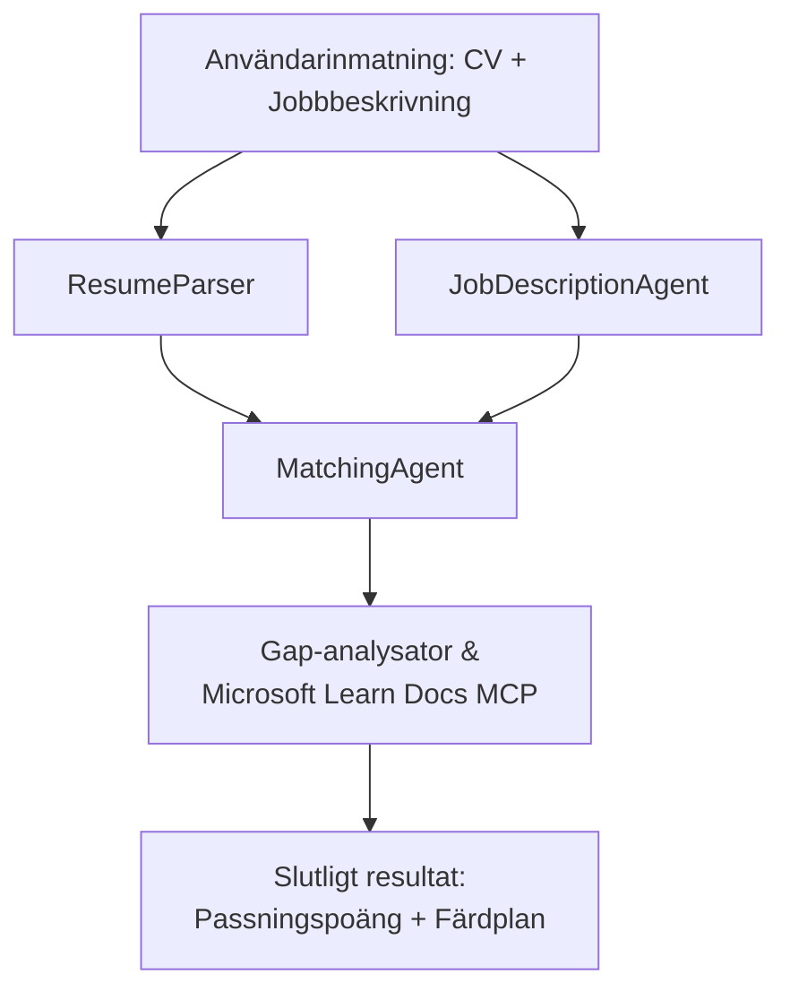

# PersonalCareerCopilot - CV → Jobbmatchningsutvärderare

Ett arbetsflöde med flera agenter som utvärderar hur väl ett CV matchar en jobbannons, och sedan genererar en personlig lärandeplan för att täppa till luckorna.

---

## Agenter

| Agent | Roll | Verktyg |
|-------|------|---------|
| **ResumeParser** | Extraherar strukturerade färdigheter, erfarenheter, certifieringar från CV-text | - |
| **JobDescriptionAgent** | Extraherar nödvändiga/önskade färdigheter, erfarenheter, certifieringar från en jobbannons | - |
| **MatchingAgent** | Jämför profil mot krav → matchningspoäng (0-100) + matchade/saknade färdigheter | - |
| **GapAnalyzer** | Skapar en personlig lärandeplan med Microsoft Learn-resurser | `search_microsoft_learn_for_plan` (MCP) |

## Arbetsflöde


---

## Kom igång snabbt

### 1. Ställ in miljön

```powershell
cd workshop\lab02-multi-agent\PersonalCareerCopilot
python -m venv .venv
.\.venv\Scripts\Activate.ps1          # Windows PowerShell
# source .venv/bin/activate            # macOS / Linux
pip install -r requirements.txt
```

### 2. Konfigurera uppgifter

Kopiera exempel-filen för miljövariabler och fyll i dina Foundry-projektdetaljer:

```powershell
cp .env.example .env
```

Redigera `.env`:

```env
PROJECT_ENDPOINT=https://<your-account>.services.ai.azure.com/api/projects/<your-project>
MODEL_DEPLOYMENT_NAME=gpt-4.1-mini
```

| Värde | Var du hittar det |
|-------|-------------------|
| `PROJECT_ENDPOINT` | Microsoft Foundry sidopanel i VS Code → högerklicka på ditt projekt → **Kopiera projektendpoint** |
| `MODEL_DEPLOYMENT_NAME` | Foundry sidopanel → expandera projekt → **Modeller + endpoints** → deploymentsnamn |

### 3. Kör lokalt

```powershell
python -m debugpy --listen 127.0.0.1:5679 -m agentdev run main.py --verbose --port 8088
```

Eller använd VS Code-uppgiften: `Ctrl+Shift+P` → **Tasks: Run Task** → **Run Lab02 HTTP Server**.

### 4. Testa med Agent Inspector

Öppna Agent Inspector: `Ctrl+Shift+P` → **Foundry Toolkit: Open Agent Inspector**.

Klistra in denna testprompt:

```
Resume:
Jane Doe
Senior Software Engineer with 5 years of experience in Python, Django, and AWS.
Built microservices handling 10K+ requests/second. Led a team of 4 developers.
Certifications: AWS Solutions Architect Associate.
Education: B.S. Computer Science, State University.

Job Description:
Senior Cloud Engineer at Contoso Ltd.
Required: Python, Azure, Kubernetes, Terraform, CI/CD pipelines.
Preferred: Go, monitoring (Prometheus/Grafana), cost optimization.
Experience: 5+ years in cloud infrastructure.
Certifications: Azure Solutions Architect Expert preferred.
```

**Förväntat:** En matchningspoäng (0-100), matchade/saknade färdigheter och en personlig lärandeplan med Microsoft Learn-URL:er.

### 5. Distribuera till Foundry

`Ctrl+Shift+P` → **Microsoft Foundry: Deploy Hosted Agent** → välj ditt projekt → bekräfta.

---

## Projektstruktur

```
PersonalCareerCopilot/
├── .env.example        ← Template for environment variables
├── .env                ← Your credentials (git-ignored)
├── agent.yaml          ← Hosted agent definition (name, resources, env vars)
├── Dockerfile          ← Container image for Foundry deployment
├── main.py             ← 4-agent workflow (instructions, MCP tool, WorkflowBuilder)
└── requirements.txt    ← Python dependencies
```

## Viktiga filer

### `agent.yaml`

Definierar den hostade agenten för Foundry Agent Service:
- `kind: hosted` - körs som en hanterad container
- `protocols: [responses v1]` - exponerar `/responses` HTTP-endpointen
- `environment_variables` - `PROJECT_ENDPOINT` och `MODEL_DEPLOYMENT_NAME` injiceras vid distribution

### `main.py`

Innehåller:
- **Agentinstruktioner** - fyra `*_INSTRUCTIONS` konstanter, en per agent
- **MCP-verktyg** - `search_microsoft_learn_for_plan()` anropar `https://learn.microsoft.com/api/mcp` via Streamable HTTP
- **Agentskapande** - `create_agents()` kontextmanager med `AzureAIAgentClient.as_agent()`
- **Arbetsflödesgraf** - `create_workflow()` använder `WorkflowBuilder` för att koppla agenter med fan-out/fan-in/sequensmönster
- **Serversstart** - `from_agent_framework(agent).run_async()` på port 8088

### `requirements.txt`

| Paket | Version | Syfte |
|-------|---------|-------|
| `agent-framework-azure-ai` | `1.0.0rc3` | Azure AI-integration för Microsoft Agent Framework |
| `agent-framework-core` | `1.0.0rc3` | Kärnruntime (inkluderar WorkflowBuilder) |
| `azure-ai-agentserver-agentframework` | `1.0.0b16` | Runtime för hostad agentserver |
| `azure-ai-agentserver-core` | `1.0.0b16` | Kärnabstraktioner för agentserver |
| `debugpy` | senast | Python-debugging (F5 i VS Code) |
| `agent-dev-cli` | `--pre` | Lokal utvecklings-CLI + Agent Inspector backend |

---

## Felsökning

| Problem | Lösning |
|---------|---------|
| `RuntimeError: Missing required environment variable(s)` | Skapa `.env` med `PROJECT_ENDPOINT` och `MODEL_DEPLOYMENT_NAME` |
| `ModuleNotFoundError: No module named 'agent_framework'` | Aktivera venv och kör `pip install -r requirements.txt` |
| Inga Microsoft Learn-URL:er i utdata | Kontrollera internetanslutningen till `https://learn.microsoft.com/api/mcp` |
| Endast 1 gap-kort (avkortat) | Kontrollera att `GAP_ANALYZER_INSTRUCTIONS` inkluderar `CRITICAL:`-blocket |
| Port 8088 används | Stäng andra servrar: `netstat -ano \| findstr :8088` |

För detaljerad felsökning, se [Modul 8 - Felsökning](../docs/08-troubleshooting.md).

---

**Full genomgång:** [Lab 02 Docs](../docs/README.md) · **Tillbaka till:** [Lab 02 README](../README.md) · [Workshop Start](../../../README.md)

---

<!-- CO-OP TRANSLATOR DISCLAIMER START -->
**Ansvarsfriskrivning**:  
Detta dokument har översatts med hjälp av AI-översättningstjänsten [Co-op Translator](https://github.com/Azure/co-op-translator). Även om vi eftersträvar noggrannhet, var vänlig observera att automatiska översättningar kan innehålla fel eller onoggrheter. Det ursprungliga dokumentet på dess modersmål bör betraktas som den auktoritativa källan. För kritisk information rekommenderas professionell mänsklig översättning. Vi ansvarar inte för eventuella missförstånd eller feltolkningar som uppstår vid användning av denna översättning.
<!-- CO-OP TRANSLATOR DISCLAIMER END -->