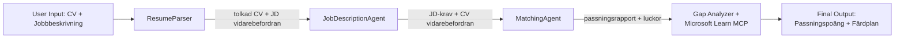

# PersonalCareerCopilot - CV → Jobbanpassningsbedömare

En arbetsflödes-först multi-agent app som utvärderar hur väl ett CV matchar en jobbannons, och sedan genererar en personlig lärandeplan för att täppa till luckorna.

---

## Agenter

| Agent | Roll | Verktyg |
|-------|------|-------|
| **ResumeParser** | Extraherar strukturerade färdigheter, erfarenhet, certifieringar från CV-text | - |
| **JobDescriptionAgent** | Extraherar krav/prefererade färdigheter, erfarenhet, certifieringar från en jobbannons | - |
| **MatchingAgent** | Jämför profil mot krav → poäng för matchning (0-100) + matchade/saknade färdigheter | - |
| **GapAnalyzer** | Skapar en personlig lärandeplan med Microsoft Learn-resurser | `search_microsoft_learn_for_plan` (MCP) |

## Arbetsflöde


```mermaid
flowchart LR
    UserInput["User Input: CV + Jobbbeskrivning"] --> ResumeParser
    ResumeParser -- "tolkad CV + JD vidarebefordran" --> JobDescriptionAgent
    JobDescriptionAgent -- "JD-krav + CV vidarebefordran" --> MatchingAgent
    MatchingAgent -- "passningsrapport + luckor" --> GapAnalyzerMCP["Gap Analyzer +\nMicrosoft Learn MCP"]
    GapAnalyzerMCP --> FinalOutput["Final Output:\nPassningspoäng + Färdplan"]
```

---

## Snabbstart

### 1. Sätt upp miljön

Den här mappen är referensimplementeringen för arbetsflödesbaserade Lab 02-stommen. Dess `main.py` använder befintliga prompt-block plus `WorkflowBuilder` för att koppla ihop de fyra agenterna.

```powershell
cd workshop\lab02-multi-agent\PersonalCareerCopilot
python -m venv .venv
.\.venv\Scripts\Activate.ps1          # Windows PowerShell
# source .venv/bin/activate            # macOS / Linux
pip install -r requirements.txt
```

### 2. Konfigurera autentiseringsuppgifter

Skapa en `.env`-fil i denna mapp:

```powershell
copy .env .env.bak 2>$null; echo $null > .env
```

Redigera `.env`:

```env
FOUNDRY_PROJECT_ENDPOINT=https://<your-account>.services.ai.azure.com/api/projects/<your-project>
AZURE_AI_MODEL_DEPLOYMENT_NAME=gpt-4.1-mini
```

| Värde | Var du hittar det |
|-------|------------------|
| `FOUNDRY_PROJECT_ENDPOINT` | Foundry Toolkit sidofält → högerklicka på ditt projekt → **Kopiera projekt-endpoint** |
| `AZURE_AI_MODEL_DEPLOYMENT_NAME` | Foundry sidofält → expandera projekt → **Modeller + endpoints** → deploymentsnamn |

### 3. Kör lokalt

```powershell
python -m debugpy --listen 127.0.0.1:5679 main.py --port 8088
```

Eller använd VS Code-uppgift: `Ctrl+Shift+P` → **Tasks: Run Task** → **Run Agent HTTP Server**.

För F5-debugging, använd **Debug Local Agent HTTP Server**.

### 4. Testa med Agent Inspector

Öppna Agent Inspector: `Ctrl+Shift+P` → **Foundry Toolkit: Open Agent Inspector**.

Klistra in denna testprompt:

```
Resume:
Jane Doe
Senior Software Engineer with 5 years of experience in Python, Django, and AWS.
Built microservices handling 10K+ requests/second. Led a team of 4 developers.
Certifications: AWS Solutions Architect Associate.
Education: B.S. Computer Science, State University.

Job Description:
Senior Cloud Engineer at Contoso Ltd.
Required: Python, Azure, Kubernetes, Terraform, CI/CD pipelines.
Preferred: Go, monitoring (Prometheus/Grafana), cost optimization.
Experience: 5+ years in cloud infrastructure.
Certifications: Azure Solutions Architect Expert preferred.
```

**Förväntat:** En matchningspoäng (0-100), matchade/saknade färdigheter och en personlig lärandeplan med Microsoft Learn-URL:er.

### 5. Distribuera till Foundry

`Ctrl+Shift+P` → **Foundry Toolkit: Deploy Hosted Agent** → välj ditt projekt → bekräfta.

---

## Projektstruktur

```
PersonalCareerCopilot/
├── .env                ← Your credentials (git-ignored)
├── agent.yaml          ← Hosted agent definition (name, resources, env vars)
├── Dockerfile          ← Container image for Foundry deployment
├── main.py             ← 4-agent workflow (instructions, MCP tool, WorkflowBuilder)
└── requirements.txt    ← Python dependencies
```

## Nyckelfiler

### `agent.yaml`

Definierar den hostade agenten för Foundry Agent Service:
- `kind: hosted` - körs som en hanterad container
- `protocols` - `responses` protokoll med `version: 1.0.0`, exponerar HTTP-endpoint `/responses`
- `environment_variables` - `AZURE_AI_MODEL_DEPLOYMENT_NAME` deklareras här; `FOUNDRY_PROJECT_ENDPOINT` injiceras automatiskt vid deploytid

### `main.py`

Innehåller:
- **Agentinstruktioner** - fyra `*_INSTRUCTIONS` konstanter, en per agent
- **MCP-verktyg** - `search_microsoft_learn_for_plan()` anropar `https://learn.microsoft.com/api/mcp` via Streamable HTTP
- **Agentskapande** - fyra `Agent()` + `AgentExecutor()` instanser som delar en `FoundryChatClient`
- **Arbetsflödesgraf** - `WorkflowBuilder` kopplar agenter som en sekventiell pipeline: ResumeParser → JD Agent → MatchingAgent → GapAnalyzer
- **Serverstart** - `ResponsesHostServer` körs på port 8088

### `requirements.txt`

| Paket | Syfte |
|---------|----------|
| `agent-framework-foundry` | Kärn-runtime: `Agent`, `AgentExecutor`, `WorkflowBuilder`, `@tool`, `FoundryChatClient` |
| `agent-framework-foundry-hosting` | `ResponsesHostServer` + Foundry hosting-integration |
| `mcp<2,>=1.24.0` | MCP-klient för GapAnalyzer (`streamable_http_client`) |
| `debugpy` | Python-debugging (F5 i VS Code) |

---

## Felsökning

| Problem | Åtgärd |
|-------|-----|
| `KeyError: 'FOUNDRY_PROJECT_ENDPOINT'` eller `KeyError: 'AZURE_AI_MODEL_DEPLOYMENT_NAME'` | Skapa `.env` med både `FOUNDRY_PROJECT_ENDPOINT` och `AZURE_AI_MODEL_DEPLOYMENT_NAME` satta |
| `ModuleNotFoundError: No module named 'agent_framework'` | Aktivera venv och kör `pip install -r requirements.txt` |
| Inga Microsoft Learn-URL:er i utskriften | Kontrollera internetanslutning till `https://learn.microsoft.com/api/mcp` |
| Endast 1 gap-kort (avkortat) | Verifiera att `GAP_ANALYZER_INSTRUCTIONS` inkluderar `CRITICAL:`-blocket |
| Port 8088 används | Stoppa andra servrar: `netstat -ano \| findstr :8088` |

För detaljerad felsökning, se [Module 8 - Troubleshooting](../docs/08-troubleshooting.md).

---

**Full genomgång:** [Lab 02 Docs](../docs/README.md) · **Tillbaka till:** [Lab 02 README](../README.md) · [Workshop Hem](../../../README.md)

---

<!-- CO-OP TRANSLATOR DISCLAIMER START -->
**Ansvarsfriskrivning**:
Detta dokument har översatts med hjälp av AI-översättningstjänsten [Co-op Translator](https://github.com/Azure/co-op-translator). Även om vi strävar efter noggrannhet, var vänlig notera att automatiska översättningar kan innehålla fel eller brister. Det ursprungliga dokumentet på dess modersmål bör betraktas som den auktoritativa källan. För kritisk information rekommenderas professionell mänsklig översättning. Vi ansvarar inte för några missförstånd eller feltolkningar som uppstår till följd av användningen av denna översättning.
<!-- CO-OP TRANSLATOR DISCLAIMER END -->