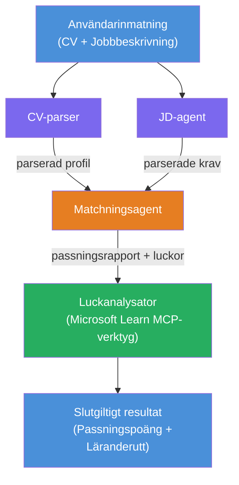

# Lab 02 - Multi-Agent Arbetsflöde: CV → Jobbmatchningsutvärderare

---

## Vad du kommer bygga

En **CV → Jobbmatchningsutvärderare** - ett multi-agent arbetsflöde där fyra specialiserade agenter samarbetar för att utvärdera hur väl en kandidats CV matchar en jobbannons, för att sedan generera en personlig lärandeplan för att täppa till luckorna.

### Agenterna

| Agent | Roll |
|-------|------|
| **CV-Parser** | Extraherar strukturerade färdigheter, erfarenheter, certifieringar från CV-text |
| **Jobbannonsagent** | Extraherar obligatoriska/önskade färdigheter, erfarenheter, certifieringar från en jobbannons |
| **Matchningsagent** | Jämför profil mot krav → matchningspoäng (0-100) + matchade/saknade färdigheter |
| **Luckanalysator** | Bygger en personlig lärandeplan med resurser, tidslinjer och snabba vinstprojekt |

### Demo-flöde

Ladda upp ett **CV + jobbannons** → få en **matchningspoäng + saknade färdigheter** → ta emot en **personlig lärandeplan**.

### Arbetsflödets arkitektur

> Lila = parallella agenter | Orange = aggregeringspunkt | Grön = slutlig agent med verktyg. Se [Modul 1 - Förstå arkitekturen](docs/01-understand-multi-agent.md) och [Modul 4 - Orkestreringsmönster](docs/04-orchestration-patterns.md) för detaljerade diagram och dataflöde.

### Behandlade ämnen

- Skapa ett multi-agent arbetsflöde med **WorkflowBuilder**
- Definiera agenternas roller och orkestreringsflöde (parallellt + sekventiellt)
- Kommunikationsmönster mellan agenter
- Lokal testning med Agent Inspector
- Distribuera multi-agent arbetsflöden till Foundry Agent Service

---

## Förutsättningar

Slutför först Lab 01:

- [Lab 01 - Enskild Agent](../lab01-single-agent/README.md)

---

## Kom igång

Se fullständiga installationsinstruktioner, genomgång av kod och testkommandon i:

- [Lab 2 Dokument - Förutsättningar](docs/00-prerequisites.md)
- [Lab 2 Dokument - Fullständig lärandeväg](docs/README.md)
- [PersonalCareerCopilot körguide](PersonalCareerCopilot/README.md)

## Orkestreringsmönster (alternativ för agentstyrning)

Lab 2 inkluderar standardflödet **parallellt → aggregator → planläggare**, och dokumentationen
beskriver även alternativa mönster för att visa på starkare agentbeteenden:

- **Fan-out/Fan-in med viktad konsensus**
- **Granskare/kritiker-pass före slutlig plan**
- **Villkorlig router** (vägvalsbaserad på matchningspoäng och saknade färdigheter)

Se [docs/04-orchestration-patterns.md](docs/04-orchestration-patterns.md).

---

**Föregående:** [Lab 01 - Enskild Agent](../lab01-single-agent/README.md) · **Tillbaka till:** [Workshop Hem](../../README.md)

---

<!-- CO-OP TRANSLATOR DISCLAIMER START -->
**Ansvarsfriskrivning**:  
Detta dokument har översatts med hjälp av AI-översättningstjänsten [Co-op Translator](https://github.com/Azure/co-op-translator). Även om vi strävar efter noggrannhet, var vänlig notera att automatiska översättningar kan innehålla fel eller brister. Det ursprungliga dokumentet på dess modersmål bör betraktas som den auktoritativa källan. För kritisk information rekommenderas professionell mänsklig översättning. Vi ansvarar inte för några missförstånd eller feltolkningar som uppstår på grund av användningen av denna översättning.
<!-- CO-OP TRANSLATOR DISCLAIMER END -->