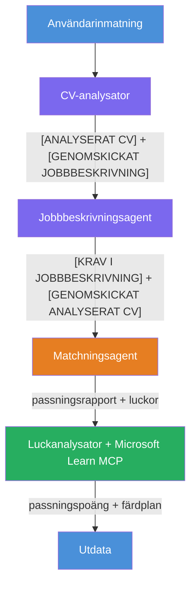

# Lab 02 - Multi-Agent Workflow: CV → Jobbmatchningsutvärderare

## Översikt

I denna praktiska labb bygger du en **workflow-först multi-agent-app** med Foundry Toolkit i VS Code och distribuerar den till Microsoft Foundry Agent Service.

**Vad du kommer att bygga:** en CV → Jobbmatchningsutvärderare som analyserar ett CV och en arbetsbeskrivning, poängsätter matchningen och skapar en personlig lärandekarta med Microsoft Learn-resurser.

---

## Arkitektur

```mermaid
flowchart TD
    A["Användarinmatning"] --> B["CV-analysator"]
    B -->|"[ANALYSERAT CV] + [GENOMSKICKAT JOBBBESKRIVNING]"| C["Jobbbeskrivningsagent"]
    C -->|"[KRAV I JOBBBESKRIVNING] + [GENOMSKICKAT ANALYSERAT CV]"| D["Matchningsagent"]
    D -->|passningsrapport + luckor| E["Luckanalysator + Microsoft Learn MCP"]
    E -->|passningspoäng + färdplan| F["Utdata"]

    style A fill:#4A90D9,color:#fff
    style B fill:#7B68EE,color:#fff
    style C fill:#7B68EE,color:#fff
    style D fill:#E67E22,color:#fff
    style E fill:#27AE60,color:#fff
    style F fill:#4A90D9,color:#fff
```

**Hur det fungerar:**
1. Användaren klistrar in ett CV och en arbetsbeskrivning.
2. **ResumeParser** analyserar CV:t och kopierar arbetsbeskrivningen ordagrant till en `[JOB DESCRIPTION PASS-THROUGH]` sektion.
3. **JD Agent** extraherar strukturerade krav från pass-through, och vidarebefordrar sedan `[PARSED RESUME]` som `[PARSED RESUME PASS-THROUGH]`.
4. **MatchingAgent** jämför `[PARSED RESUME PASS-THROUGH]` med `[JD REQUIREMENTS]` och ger en matchningspoäng.
5. **GapAnalyzer** omvandlar luckorna till en praktisk färdplan och hämtar riktiga Microsoft Learn-länkar via MCP.

---

## Förutsättningar

Slutför först Lab 01:

- [Lab 01 - Single Agent](../lab01-single-agent/README.md)

---

## Del 1: Läs modulerna i rätt ordning

Se hela lärandevägen i:

- [Lab 2 Docs - Förutsättningar](docs/00-prerequisites.md)
- [Lab 2 Docs - Fullständig lärandeväg](docs/README.md)
- [PersonalCareerCopilot körguide](PersonalCareerCopilot/README.md)

---

## Del 2: Bygg och testa workflowen

1. Använd Foundry Toolkit-wizarden för att skapa workflow-baserat projekt.
2. Kopiera prompt-blocken och workflow-grafen från `PersonalCareerCopilot/main.py` till din arbetsyta.
3. Kör lokalt med Agent Inspector och verifiera alla fyra agenter plus MCP-verktyget.
4. Distribuera den hostade agenten till Foundry när lokal testning lyckas.

---

## Orkestreringsmönster

Lab 02 innehåller standardflödet **fan-out → fan-in → sekventiellt**, och dokumentationen beskriver också alternativa orkestreringsmönster för experimentering.

- **Fan-out/Fan-in med viktad konsensus**
- **Granskare/kritikerrunda före slutgiltig färdplan**
- **Villkorlig router** baserat på matchningspoäng och saknade färdigheter

Se [docs/04-orchestration-patterns.md](docs/04-orchestration-patterns.md).

---

**Föregående:** [Lab 01 - Single Agent](../lab01-single-agent/README.md) · **Tillbaka till:** [Workshop Home](../../README.md)

---

<!-- CO-OP TRANSLATOR DISCLAIMER START -->
**Ansvarsfriskrivning**:
Detta dokument har översatts med hjälp av AI-översättningstjänsten [Co-op Translator](https://github.com/Azure/co-op-translator). Även om vi strävar efter noggrannhet, var vänlig notera att automatiska översättningar kan innehålla fel eller brister. Det ursprungliga dokumentet på dess modersmål bör betraktas som den auktoritativa källan. För kritisk information rekommenderas professionell mänsklig översättning. Vi ansvarar inte för några missförstånd eller feltolkningar som uppstår till följd av användningen av denna översättning.
<!-- CO-OP TRANSLATOR DISCLAIMER END -->