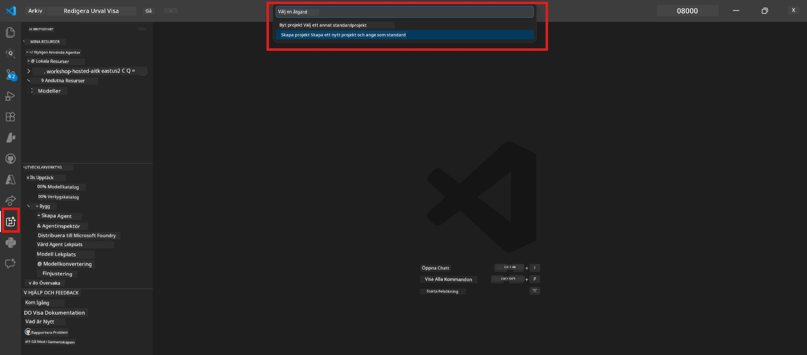

# Module 0 - Förutsättningar

Innan du börjar med Lab 02, bekräfta att du har slutfört följande. Denna labb bygger direkt på Lab 01 – hoppa inte över den.

---

## 1. Slutför Lab 01

Lab 02 förutsätter att du redan har:

- [x] Slutfört alla 8 moduler i [Lab 01 - Enkel Agent](../../lab01-single-agent/README.md)
- [x] Framgångsrikt distribuerat en enkel agent till Foundry Agent Service
- [x] Verifierat att agenten fungerar både i lokal Agent Inspector och Foundry Playground

Om du inte slutfört Lab 01, gå tillbaka och avsluta det nu: [Lab 01 Docs](../../lab01-single-agent/docs/00-prerequisites.md)

---

## 2. Verifiera befintlig installation

Alla verktyg från Lab 01 bör fortfarande vara installerade och fungera. Kör dessa snabba kontroller:

### 2.1 Azure CLI

```powershell
az account show --query "{name:name, id:id}" --output table
```

Förväntat: Visar ditt prenumerationsnamn och ID. Om detta misslyckas, kör [`az login`](https://learn.microsoft.com/cli/azure/authenticate-azure-cli-interactively).

### 2.2 VS Code-tillägg

1. Tryck `Ctrl+Shift+P` → skriv **"Microsoft Foundry"** → bekräfta att du ser kommandon (t.ex. `Microsoft Foundry: Create a New Hosted Agent`).
2. Tryck `Ctrl+Shift+P` → skriv **"Foundry Toolkit"** → bekräfta att du ser kommandon (t.ex. `Foundry Toolkit: Open Agent Inspector`).

### 2.3 Foundry-projekt och modell

1. Klicka på **Microsoft Foundry**-ikonen i VS Code Activity Bar.
2. Bekräfta att ditt projekt finns listat (t.ex. `workshop-agents`).
3. Expandera projektet → verifiera att en distribuerad modell finns (t.ex. `gpt-4.1-mini`) med status **Succeeded**.

> **Om din modell-distribution har gått ut:** Vissa gratistiersdistribueringar går automatiskt ut. Distribuera om från [Model Catalog](https://learn.microsoft.com/azure/foundry/foundry-models/concepts/models-sold-directly-by-azure) (`Ctrl+Shift+P` → **Microsoft Foundry: Open Model Catalog**).



### 2.4 RBAC-roller

Verifiera att du har **Azure AI User** på ditt Foundry-projekt:

1. [Azure Portal](https://portal.azure.com) → din Foundry **projekt**-resurs → **Access control (IAM)** → **[Rolltilldelningar](https://learn.microsoft.com/azure/foundry/concepts/rbac-foundry)**-fliken.
2. Sök efter ditt namn → bekräfta att **[Azure AI User](https://aka.ms/foundry-ext-project-role)** finns listad.

---

## 3. Förstå multi-agent-koncept (nytt för Lab 02)

Lab 02 introducerar koncept som ej täcktes i Lab 01. Läs igenom dessa innan du fortsätter:

### 3.1 Vad är ett multi-agent arbetsflöde?

Istället för att en agent hanterar allt, delar ett **multi-agent arbetsflöde** upp arbete över flera specialiserade agenter. Varje agent har:

- Sin egen **instruktion** (systemprompt)
- Sin egen **roll** (vad den ansvarar för)
- Valfria **verktyg** (funktioner den kan anropa)

Agenterna kommunicerar genom en **orkestreringsgraf** som definierar hur data flödar mellan dem.

### 3.2 WorkflowBuilder

[`WorkflowBuilder`](https://learn.microsoft.com/agent-framework/workflows/agents-in-workflows)-klassen från `agent_framework` är SDK-komponenten som kopplar samman agenter:

```python
from agent_framework import WorkflowBuilder

workflow = (
    WorkflowBuilder(
        name="MyWorkflow",
        start_executor=agent_a,
        output_executors=[agent_d],
    )
    .add_edge(agent_a, agent_b)
    .add_edge(agent_a, agent_c)
    .add_edge(agent_b, agent_d)
    .add_edge(agent_c, agent_d)
    .build()
)
```

- **`start_executor`** - Den första agenten som tar emot användarens indata
- **`output_executors`** - Agenten/agenternas utdata blir slutgiltigt svar
- **`add_edge(source, target)`** - Definierar att `target` tar emot `source`s utdata

### 3.3 MCP (Model Context Protocol) verktyg

Lab 02 använder ett **MCP-verktyg** som anropar Microsoft Learn API för att hämta lärresurser. [MCP (Model Context Protocol)](https://modelcontextprotocol.io/introduction) är ett standardiserat protokoll för att koppla AI-modeller till externa datakällor och verktyg.

| Term | Definition |
|------|------------|
| **MCP-server** | En tjänst som exponerar verktyg/resurser via [MCP-protokollet](https://learn.microsoft.com/azure/foundry/agents/how-to/tools/model-context-protocol) |
| **MCP-klient** | Din agentkod som kopplar upp sig mot en MCP-server och anropar dess verktyg |
| **[Streamable HTTP](https://learn.microsoft.com/agent-framework/agents/tools/hosted-mcp-tools)** | Transportmetoden som används för att kommunicera med MCP-servern |

### 3.4 Hur Lab 02 skiljer sig från Lab 01

| Aspekt | Lab 01 (Enkel Agent) | Lab 02 (Multi-Agent) |
|--------|---------------------|---------------------|
| Agenter | 1 | 4 (specialiserade roller) |
| Orkestrering | Ingen | WorkflowBuilder (parallell + sekventiell) |
| Verktyg | Valfri `@tool` funktion | MCP-verktyg (externt API-anrop) |
| Komplexitet | Enkel prompt → svar | CV + JD → poäng → roadmap |
| Kontextflöde | Direkt | Agent-till-agent överlämning |

---

## 4. Workshop-lagringsstruktur för Lab 02

Se till att du vet var Lab 02-filerna finns:

```
workshop/
└── lab02-multi-agent/
    ├── README.md                       ← Lab overview
    ├── docs/                           ← You are here
    │   ├── README.md                   ← Learning path index
    │   ├── 00-prerequisites.md         ← This file
    │   ├── 01-understand-multi-agent.md
    │   ├── ...
    │   └── 08-troubleshooting.md
    └── PersonalCareerCopilot/          ← The agent project
        ├── agent.yaml                  ← Agent definition
        ├── main.py                     ← 4-agent workflow code
        ├── Dockerfile                  ← Container configuration
        └── requirements.txt            ← Python dependencies
```

---

### Kontrollpunkt

- [ ] Lab 01 är fullständigt slutförd (alla 8 moduler, agent distribuerad och verifierad)
- [ ] `az account show` returnerar din prenumeration
- [ ] Microsoft Foundry och Foundry Toolkit-tillägg är installerade och svarar
- [ ] Foundry-projekt har en distribuerad modell (t.ex. `gpt-4.1-mini`)
- [ ] Du har rollen **Azure AI User** på projektet
- [ ] Du har läst avsnittet om multi-agent-koncept ovan och förstår WorkflowBuilder, MCP samt agentorkestrering

---

**Nästa:** [01 - Förstå Multi-Agent Arkitektur →](01-understand-multi-agent.md)

---

<!-- CO-OP TRANSLATOR DISCLAIMER START -->
**Ansvarsfriskrivning**:  
Detta dokument har översatts med hjälp av AI-översättningstjänsten [Co-op Translator](https://github.com/Azure/co-op-translator). Även om vi strävar efter noggrannhet, vänligen observera att automatiska översättningar kan innehålla fel eller brister. Det ursprungliga dokumentet på dess modersmål bör betraktas som den auktoritativa källan. För kritisk information rekommenderas professionell mänsklig översättning. Vi ansvarar inte för några missförstånd eller feltolkningar som uppstår från användningen av denna översättning.
<!-- CO-OP TRANSLATOR DISCLAIMER END -->