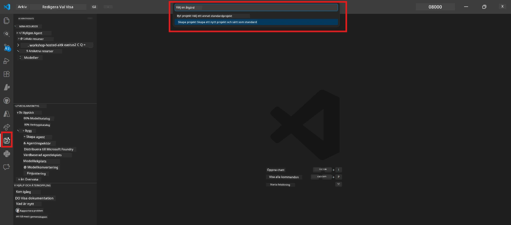

# Modul 0 - Introduktion

⏱️ ~10 min

> [!WARNING]
> **Förhandsgranskning & Begränsningar:** [Hosted Agents](https://learn.microsoft.com/azure/foundry/agents/concepts/hosted-agents) är för närvarande i **offentlig förhandsgranskning** - rekommenderas inte för produktionsarbetsbelastningar. Vissa funktioner som visas i denna workshop kan ändras när tjänsten närmar sig GA.

## Vad du kommer att bygga

I detta labb utökar du de enskilda agentfärdigheterna från Labb 01 för att bygga ett **flereagenters arbetsflöde** - Resume → Job Fit Evaluator.

Du klistrar in ett **CV** och en **jobbeskrivning**. Fyra specialiserade agenter bearbetar indata sekventiellt och returnerar sedan:
- En matchningspoäng (0–100 med poängdetaljer)
- En lista över färdighets- och certifieringsgap
- En personlig lärandeplan med riktiga Microsoft Learn-länkar för varje gap

**Arbetsflödet använder:**
- **Microsoft Agent Framework** - `WorkflowBuilder` för sekventiell pipelineorkestrering
- **Foundry Toolkit för VS Code** - scaffold, testa lokalt, distribuera
- **En AI-modell** (t.ex. `gpt-4.1-mini`) - används av alla fyra agenter
- **Microsoft Learn MCP-server** - tillhandahåller riktiga lärresurslänkar för varje färdighetsgap

---

## Välj din väg

> ⚠️ **Fortsätt med samma väg som du använde i Labb 01.**

<details open>
<summary><strong>🅰️ Väg A - Azure cloud (kräver Azure-abonnemang)</strong></summary>

| | Detaljer |
|---|---|
| **Vem är detta för?** | Du slutförde Labb 01 med ett Azure-abonnemang |
| **Modell** | Azure OpenAI via Foundry (t.ex. `gpt-4.1-mini`) |
| **Täcka moduler** | Alla moduler (00–09) |
| **Distribuera till molnet?** | ✅ Ja - fullständig slut-till-slut-distribution |

</details>

<details open>
<summary><strong>🅱️ Väg B - Foundry Local (ingen Azure-prenumeration behövs)</strong></summary>

| | Detaljer |
|---|---|
| **Vem är detta för?** | Du slutförde Labb 01 med Foundry Local |
| **Modell** | Foundry Local (gratis, körs på din dator) |
| **Täcka moduler** | Moduler 00–05 (hoppa över 06–07 - distribution och molnverifiering) |
| **Distribuera till molnet?** | ❌ Nej - lokal testning endast via Agent Inspector |

</details>

---

## Kontroll av Labb 01

Labb 02 bygger direkt på Labb 01. Slutför Labb 01 först innan du börjar här.

Har du inte gjort Labb 01 än? Börja här: [Labb 01 - Introduktion](../../lab01-single-agent/docs/00-prerequisites.md)

<details open>
<summary><strong>🅰️ Väg A - Azure cloud</strong></summary>

```powershell
az account show --query "{name:name, id:id}" --output table
```

Om detta misslyckas, kör `az login`. Verifiera sedan i VS Code:

1. `Ctrl+Shift+P` → skriv **Foundry Toolkit** → bekräfta att kommandon visas.
2. Klicka på **Foundry Toolkit**-ikonen → ditt projekt och distribuerade modell visas som **Lyckades**.



> **RBAC:** Du tilldelade **Foundry User** i Labb 01. Om du behöver tilldela om det, se [Labb 01, Modul 1](../../lab01-single-agent/docs/01-setup.md#deploy-a-model--assign-rbac). Rollen hette tidigare **Azure AI User** - samma rättigheter.

</details>

<details open>
<summary><strong>🅱️ Väg B - Foundry Local</strong></summary>

```powershell
Invoke-WebRequest -Uri "http://localhost:5273/v1/health" -UseBasicParsing | Select-Object StatusCode
```

Förväntat: `StatusCode: 200`. Om inte, starta om Foundry Local från Foundry Toolkit sidofält.

> All inferens körs på din dator. Det enda utgående anropet är MCP-verktyget till `https://learn.microsoft.com/api/mcp`.

</details>

---

## Vad är nytt i Labb 02

| | Labb 01 | Labb 02 |
|--|----------|---------|
| Agenter | 1 | 4 (kedjade med WorkflowBuilder) |
| Scaffold-mall | Grundläggande - Agent Framework | Arbetsflöden - Agent Framework |
| Nytt paket | - | `mcp` |
| Orkestrering | Enskild konversationsagent | Sekventiell pipeline (WorkflowBuilder) |
| Nytt verktyg | - | `search_microsoft_learn_for_plan` (MCP) |

---

**Nästa:** [01 - Förstå arkitekturen →](01-understand-multi-agent.md)

---

<!-- CO-OP TRANSLATOR DISCLAIMER START -->
**Ansvarsfriskrivning**:
Detta dokument har översatts med hjälp av AI-översättningstjänsten [Co-op Translator](https://github.com/Azure/co-op-translator). Även om vi strävar efter noggrannhet, var vänlig notera att automatiska översättningar kan innehålla fel eller brister. Det ursprungliga dokumentet på dess modersmål bör betraktas som den auktoritativa källan. För kritisk information rekommenderas professionell mänsklig översättning. Vi ansvarar inte för några missförstånd eller feltolkningar som uppstår till följd av användningen av denna översättning.
<!-- CO-OP TRANSLATOR DISCLAIMER END -->