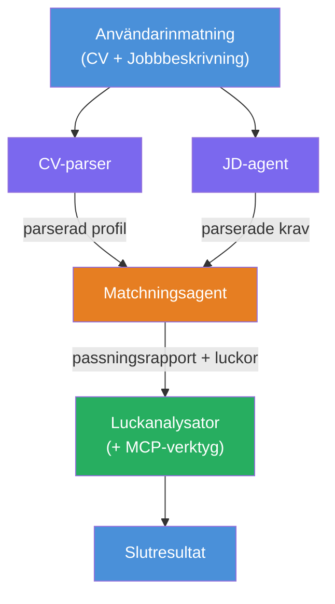
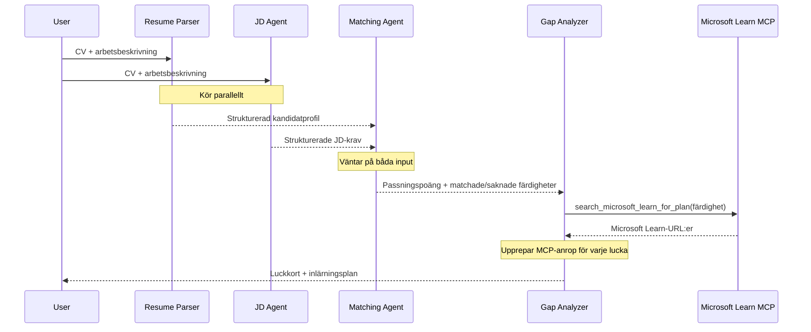
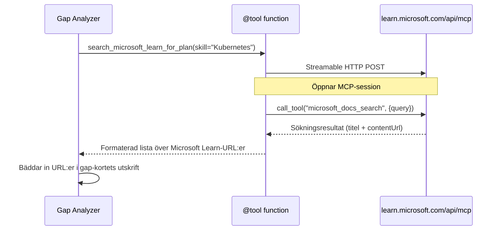

# Modul 1 - Förstå Multi-Agent Arkitekturen

I denna modul lär du dig arkitekturen för Resume → Job Fit Evaluator innan du skriver någon kod. Att förstå orkestreringsgrafen, agentrollerna och dataflödet är avgörande för felsökning och utbyggnad av [multi-agent arbetsflöden](https://learn.microsoft.com/azure/architecture/ai-ml/idea/multiple-agent-workflow-automation).

---

## Problemet detta löser

Att matcha ett CV med en jobbannons involverar flera olika färdigheter:

1. **Parsing** - Extrahera strukturerad data från ostrukturerad text (CV)
2. **Analys** - Extrahera krav från en jobbannons
3. **Jämförelse** - Poängsätta överensstämmelsen mellan de två
4. **Planering** - Skapa en lärandeplan för att täppa till luckor

En enda agent som gör alla fyra uppgifterna i en prompt producerar ofta:
- Ofullständig extraktion (den skyndar sig igenom parsning för att komma till poängen)
- Ytlig poängsättning (ingen evidensbaserad nedbrytning)
- Generiska lärandeplaner (inte anpassade till specifika luckor)

Genom att dela upp i **fyra specialiserade agenter** fokuserar varje en på sin uppgift med dedikerade instruktioner, vilket ger högre kvalitet i varje steg.

---

## De fyra agenterna

Varje agent är en fullständig [Microsoft Foundry](https://learn.microsoft.com/azure/foundry/agents/concepts/hosted-agents) agent skapad via `AzureAIAgentClient.as_agent()`. De delar samma modellutplacering men har olika instruktioner och (valfritt) olika verktyg.

| # | Agentnamn | Roll | Input | Output |
|---|-----------|------|-------|--------|
| 1 | **ResumeParser** | Extraherar strukturerad profil från CV-text | Rå CV-text (från användare) | Kandidatprofil, Tekniska färdigheter, Mjuka färdigheter, Certifieringar, Domänkompetens, Prestationer |
| 2 | **JobDescriptionAgent** | Extraherar strukturerade krav från en jobbannons | Rå JD-text (från användare, vidarebefordrad via ResumeParser) | Rollöversikt, Obligatoriska färdigheter, Föredragna färdigheter, Erfarenhet, Certifieringar, Utbildning, Ansvarsområden |
| 3 | **MatchingAgent** | Beräknar evidensbaserad poäng för passform | Output från ResumeParser + JobDescriptionAgent | Passformspoäng (0-100 med nedbrytning), Matchade färdigheter, Saknade färdigheter, Luckor |
| 4 | **GapAnalyzer** | Skapar personlig lärandeplan | Output från MatchingAgent | Luck-kort (per färdighet), Lärandeordning, Tidslinje, Resurser från Microsoft Learn |

---

## Orkestreringsgrafen

Arbetsflödet använder **parallell utgrenande** följt av **sekventiell aggregering**:


> **Legend:** Lila = parallella agenter, Orange = aggregeringspunkt, Grön = sista agent med verktyg

### Hur data flödar


1. **Användaren skickar** ett meddelande som innehåller ett CV och en jobbannons.
2. **ResumeParser** får hela användarens indata och extraherar en strukturerad kandidatprofil.
3. **JobDescriptionAgent** får användarens indata parallellt och extraherar strukturerade krav.
4. **MatchingAgent** får output från **både** ResumeParser och JobDescriptionAgent (ramverket väntar på att båda är klara innan MatchingAgent körs).
5. **GapAnalyzer** får MatchingAgents output och anropar **Microsoft Learn MCP-verktyget** för att hämta riktiga lärresurser för varje lucka.
6. **Slutresultatet** är GapAnalyzers svar som inkluderar passformspoäng, luck-kort och en komplett lärandeplan.

### Varför parallell utgrenande är viktigt

ResumeParser och JobDescriptionAgent körs **parallellt** eftersom ingen av dem är beroende av den andra. Detta:
- Minskar total latens (båda körs samtidigt istället för sekventiellt)
- Är en naturlig uppdelning (parsning av CV vs. parsning av JD är oberoende uppgifter)
- Visar ett vanligt multi-agentmönster: **fan-out → aggregera → agera**

---

## WorkflowBuilder i kod

Så här mappar grafen ovan till [`WorkflowBuilder`](https://learn.microsoft.com/agent-framework/workflows/agents-in-workflows) API-anrop i `main.py`:

```python
from agent_framework import WorkflowBuilder

workflow = (
    WorkflowBuilder(
        name="ResumeJobFitEvaluator",
        start_executor=resume_parser,       # Första agenten att ta emot användarinmatning
        output_executors=[gap_analyzer],     # Slutgiltiga agent vars utdata returneras
    )
    .add_edge(resume_parser, jd_agent)      # ResumeParser → JobDescriptionAgent
    .add_edge(resume_parser, matching_agent) # ResumeParser → MatchingAgent
    .add_edge(jd_agent, matching_agent)      # JobDescriptionAgent → MatchingAgent
    .add_edge(matching_agent, gap_analyzer)  # MatchingAgent → GapAnalyzer
    .build()
)
```

**Att förstå kopplingarna:**

| Kant | Vad det betyder |
|------|-----------------|
| `resume_parser → jd_agent` | JD Agent får ResumeParsers output |
| `resume_parser → matching_agent` | MatchingAgent får ResumeParsers output |
| `jd_agent → matching_agent` | MatchingAgent får även JD Agents output (väntar på båda) |
| `matching_agent → gap_analyzer` | GapAnalyzer får MatchingAgents output |

Eftersom `matching_agent` har **två inkommande kanter** (`resume_parser` och `jd_agent`) väntar ramverket automatiskt på att båda ska bli klara innan MatchingAgent körs.

---

## MCP-verktyget

GapAnalyzer-agenten har ett verktyg: `search_microsoft_learn_for_plan`. Detta är ett **[MCP-verktyg](https://learn.microsoft.com/agent-framework/agents/tools/hosted-mcp-tools)** som anropar Microsoft Learn API för att hämta utvalda lärresurser.

### Hur det fungerar

```python
@tool
async def search_microsoft_learn_for_plan(
    skill: str, role: str = "", max_results: int = 5
) -> str:
    """Search Microsoft Learn MCP and return curated official links."""
    # Ansluter till https://learn.microsoft.com/api/mcp via Streamable HTTP
    # Anropar verktyget 'microsoft_docs_search' på MCP-servern
    # Returnerar formaterad lista över Microsoft Learn-URL:er
```

### MCP-anropsflöde


1. GapAnalyzer bestämmer att den behöver lärresurser för en färdighet (t.ex. "Kubernetes")
2. Ramverket anropar `search_microsoft_learn_for_plan(skill="Kubernetes")`
3. Funktionen öppnar en [Streamable HTTP](https://learn.microsoft.com/agent-framework/agents/tools/hosted-mcp-tools) anslutning till `https://learn.microsoft.com/api/mcp`
4. Den anropar `microsoft_docs_search`-verktyget på [MCP-servern](https://learn.microsoft.com/azure/foundry/agents/how-to/tools/model-context-protocol)
5. MCP-servern returnerar sökresultat (titel + URL)
6. Funktionen formaterar resultaten och returnerar dem som en sträng
7. GapAnalyzer använder de returnerade URL:erna i sin luck-kort-output

### Förväntade MCP-loggar

När verktyget körs ser du loggposter som:

```
GET https://learn.microsoft.com/api/mcp → 405 (Method Not Allowed)
POST https://learn.microsoft.com/api/mcp → 200
DELETE https://learn.microsoft.com/api/mcp → 405 (Method Not Allowed)
```

**Dessa är normala.** MCP-klienten gör GET och DELETE probes under initiering - att de returnerar 405 är förväntat beteende. Det faktiska verktygsanropet använder POST och returnerar 200. Oroa dig bara om POST-anrop misslyckas.

---

## Agent-skapande mönster

Varje agent skapas med **[`AzureAIAgentClient.as_agent()`](https://learn.microsoft.com/python/api/overview/azure/ai-agents-readme) asynkron kontextmanager**. Detta är Foundry SDK:s mönster för att skapa agenter som automatiskt städas upp:

```python
async with (
    get_credential() as credential,
    AzureAIAgentClient(
        project_endpoint=PROJECT_ENDPOINT,
        model_deployment_name=MODEL_DEPLOYMENT_NAME,
        credential=credential,
    ).as_agent(
        name="ResumeParser",
        instructions=RESUME_PARSER_INSTRUCTIONS,
    ) as resume_parser,
    # ... upprepa för varje agent ...
):
    # Alla 4 agenter finns här
    workflow = create_workflow(resume_parser, jd_agent, matching_agent, gap_analyzer)
```

**Viktiga punkter:**
- Varje agent får sin egen `AzureAIAgentClient`-instans (SDK:n kräver agentnamn ska vara begränsat till klienten)
- Alla agenter delar samma `credential`, `PROJECT_ENDPOINT`, och `MODEL_DEPLOYMENT_NAME`
- `async with`-blocket säkerställer att alla agenter städas upp när servern stängs ner
- GapAnalyzer får dessutom `tools=[search_microsoft_learn_for_plan]`

---

## Serverstart

Efter att ha skapat agenterna och byggt arbetsflödet startar servern:

```python
from azure.ai.agentserver.agentframework import from_agent_framework

agent = create_workflow(resume_parser, jd_agent, matching_agent, gap_analyzer)
await from_agent_framework(agent).run_async()
```

`from_agent_framework()` omsluter arbetsflödet som en HTTP-server som exponerar `/responses`-endpointen på port 8088. Detta är samma mönster som Lab 01, men "agenten" är nu hela [arbetsflödets graf](https://learn.microsoft.com/agent-framework/workflows/as-agents).

---

### Checklista

- [ ] Du förstår 4-agenters arkitekturen och varje agents roll
- [ ] Du kan spåra dataflödet: Användare → ResumeParser → (parallellt) JD Agent + MatchingAgent → GapAnalyzer → Output
- [ ] Du förstår varför MatchingAgent väntar på både ResumeParser och JD Agent (två inkommande kanter)
- [ ] Du förstår MCP-verktyget: vad det gör, hur det anropas och att GET 405-loggar är normala
- [ ] Du förstår `AzureAIAgentClient.as_agent()`-mönstret och varför varje agent har sin egen klientinstans
- [ ] Du kan läsa `WorkflowBuilder`-koden och koppla den till den visuella grafen

---

**Föregående:** [00 - Förkunskaper](00-prerequisites.md) · **Nästa:** [02 - Skapa Multi-Agent Projektet →](02-scaffold-multi-agent.md)

---

<!-- CO-OP TRANSLATOR DISCLAIMER START -->
**Ansvarsfriskrivning**:  
Detta dokument har översatts med hjälp av AI-översättningstjänsten [Co-op Translator](https://github.com/Azure/co-op-translator). Även om vi strävar efter noggrannhet, vänligen var medveten om att automatiska översättningar kan innehålla fel eller felaktigheter. Det ursprungliga dokumentet på sitt modersmål bör betraktas som den auktoritativa källan. För kritisk information rekommenderas professionell mänsklig översättning. Vi ansvarar inte för eventuella missförstånd eller feltolkningar som uppstår till följd av användningen av denna översättning.
<!-- CO-OP TRANSLATOR DISCLAIMER END -->