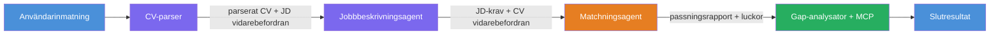

# Modul 1 - Förstå arkitekturen

⏱️ ~5 min

Innan du skriver någon kod, här är en snabb överblick över vad du bygger och hur det fungerar.

---

## Vad du bygger

Du klistrar in ett **CV** och en **jobbannons**. Arbetsflödet returnerar:

- En matchningspoäng (0–100 med en uppdelning)
- En lista över kompetens- och certifieringsluckor
- En personlig lärväg med länkar till Microsoft Learn för varje lucka

---

## De fyra agenterna

En enda agent som försöker tolka, poängsätta och planera allt på en gång tenderar att skynda och ge ytligt resultat. Att dela upp arbetet i fyra specialiserade agenter ger bättre resultat:

| Agent | Vad den gör |
|-------|-------------|
| **ResumeParser** | Tolkar CV:t; kopierar jobbannonsen ordagrant till `[JOB DESCRIPTION PASS-THROUGH]` för vidare agenter |
| **JobDescriptionAgent** | Extraherar krav från jobbannonsen; vidarebefordrar `[PARSED RESUME]` som `[PARSED RESUME PASS-THROUGH]` |
| **MatchingAgent** | Jämför båda märkta sektionerna; skapar en 0–100 matchningspoäng och en lista över luckor |
| **GapAnalyzer** | Skapar en lärväg; söker på Microsoft Learn för varje lucka |

---

## Orkestreringsgrafen

Arbetsflödet är en **sekventiell pipeline** - varje agent skickar sin output till nästa:


```mermaid
flowchart LR
    A["Användarinmatning"] --> B["CV-parser"]
    B -- "parserat CV + JD vidarebefordran" --> C["Jobbbeskrivningsagent"]
    C -- "JD-krav + CV vidarebefordran" --> D["Matchningsagent"]
    D -- "passningsrapport + luckor" --> E["Gap-analysator + MCP"]
    E --> F["Slutresultat"]

    style A fill:#4A90D9,color:#fff
    style B fill:#7B68EE,color:#fff
    style C fill:#7B68EE,color:#fff
    style D fill:#E67E22,color:#fff
    style E fill:#27AE60,color:#fff
    style F fill:#4A90D9,color:#fff
```

1. **ResumeParser** tar emot användarens input, tolkar CV:t och kopierar jobbannonsen till `[JOB DESCRIPTION PASS-THROUGH]`.
2. **JD Agent** extraherar strukturerade krav och skickar vidare `[PARSED RESUME PASS-THROUGH]`.
3. **MatchingAgent** jämför båda sektionerna och skapar en matchningspoäng och en lista över luckor.
4. **GapAnalyzer** bygger lärvägen och anropar Microsoft Learn MCP-verktyget för varje lucka.

---

## Hur detta motsvarar kod

I `main.py` beskriver du denna graf med `WorkflowBuilder`:

```python
workflow_agent = (
    WorkflowBuilder(
        start_executor=resume_executor,       # första agenten att ta emot användarens inmatning
        output_executors=[gap_executor],      # sista agent - dess utdata är svaret
    )
    .add_edge(resume_executor, jd_executor)       # ResumeParser → JD Agent
    .add_edge(jd_executor, matching_executor)     # JD Agent → MatchingAgent
    .add_edge(matching_executor, gap_executor)    # MatchingAgent → GapAnalyzer
    .build()
    .as_agent()
)
```

Varje `Agent` är innesluten i en `AgentExecutor`. `add_edge()`-anropen definierar en strikt sekventiell pipeline - varje agent tar emot output endast från sin direkta föregångare.

> `context_mode="last_agent"` betyder att varje exekverare endast ser sin direkta föregångares output. ResumeParser och JD Agent skickar vidare data i märkta sektioner så varje efterföljande agent har exakt det den behöver.

---

## MCP-verktyget

GapAnalyzer har ett verktyg: `search_microsoft_learn_for_plan`. Det ansluter till `https://learn.microsoft.com/api/mcp` och returnerar verkliga Microsoft Learn-länkar för varje kompetenslucka.

När verktyget körs ser du dessa loggar - allt förväntat:

```
GET  https://learn.microsoft.com/api/mcp → 405   ← connection probe, normal
POST https://learn.microsoft.com/api/mcp → 200   ← actual tool call
DELETE https://learn.microsoft.com/api/mcp → 405 ← cleanup probe, normal
```

Oroa dig bara om `POST`-anropet ger ett fel.

---

**Föregående:** [00 - Förutsättningar](00-prerequisites.md) · **Nästa:** [02 - Skapa projektstomme →](02-scaffold-multi-agent.md)

---

<!-- CO-OP TRANSLATOR DISCLAIMER START -->
**Ansvarsfriskrivning**:
Detta dokument har översatts med hjälp av AI-översättningstjänsten [Co-op Translator](https://github.com/Azure/co-op-translator). Även om vi strävar efter noggrannhet, var vänlig notera att automatiska översättningar kan innehålla fel eller brister. Det ursprungliga dokumentet på dess modersmål bör betraktas som den auktoritativa källan. För kritisk information rekommenderas professionell mänsklig översättning. Vi ansvarar inte för några missförstånd eller feltolkningar som uppstår till följd av användningen av denna översättning.
<!-- CO-OP TRANSLATOR DISCLAIMER END -->