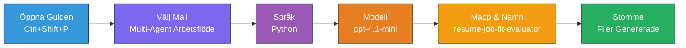
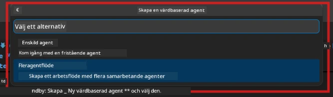

# Modul 2 - Skapa Multi-Agent-projektet

I denna modul använder du [Microsoft Foundry-tillägget](https://marketplace.visualstudio.com/items?itemName=TeamsDevApp.vscode-ai-foundry) för att **skapa ett arbetsflödesprojekt med flera agenter**. Tillägget genererar hela projektstrukturen – `agent.yaml`, `main.py`, `Dockerfile`, `requirements.txt`, `.env` och debugkonfiguration. Du anpassar sedan dessa filer i Modulerna 3 och 4.

> **Notera:** Mappen `PersonalCareerCopilot/` i denna labb är ett komplett, fungerande exempel på ett anpassat multi-agent-projekt. Du kan antingen skapa ett nytt projekt (rekommenderas för inlärning) eller studera den befintliga koden direkt.

---

## Steg 1: Öppna guiden Create Hosted Agent


1. Tryck `Ctrl+Shift+P` för att öppna **Command Palette**.
2. Skriv: **Microsoft Foundry: Create a New Hosted Agent** och välj det.
3. Guiden för att skapa en hosted agent öppnas.

> **Alternativ:** Klicka på ikonen **Microsoft Foundry** i aktivitetsfältet → klicka på **+**-ikonen bredvid **Agents** → **Create New Hosted Agent**.

---

## Steg 2: Välj Multi-Agent Workflow-mallen

Guiden ber dig välja en mall:

| Mall | Beskrivning | När den ska användas |
|----------|-------------|-------------|
| Single Agent | En agent med instruktioner och valfria verktyg | Labb 01 |
| **Multi-Agent Workflow** | Flera agenter som samarbetar via WorkflowBuilder | **Denna labb (Labb 02)** |

1. Välj **Multi-Agent Workflow**.
2. Klicka **Nästa**.



---

## Steg 3: Välj programmeringsspråk

1. Välj **Python**.
2. Klicka på **Nästa**.

---

## Steg 4: Välj din modell

1. Guiden visar modeller som är distribuerade i ditt Foundry-projekt.
2. Välj samma modell som du använde i Labb 01 (t.ex. **gpt-4.1-mini**).
3. Klicka på **Nästa**.

> **Tips:** [`gpt-4.1-mini`](https://learn.microsoft.com/azure/foundry/foundry-models/concepts/models-sold-directly-by-azure#gpt-41-series) rekommenderas för utveckling – den är snabb, billig och hanterar multi-agent-arbetsflöden väl. Byt till `gpt-4.1` för produktion om du vill ha högre kvalitet på utsignalen.

---

## Steg 5: Välj mappplats och agentnamn

1. En fil-dialog öppnas. Välj en målplats:
   - Om du följer med workshop-repot: navigera till `workshop/lab02-multi-agent/` och skapa en ny undermapp
   - Om du startar från början: välj valfri mapp
2. Ange ett **namn** för den hosted agent (t.ex. `resume-job-fit-evaluator`).
3. Klicka på **Create**.

---

## Steg 6: Vänta på att scaffolding ska slutföras

1. VS Code öppnar ett nytt fönster (eller uppdaterar det nuvarande) med det genererade projektet.
2. Du ska se denna filstruktur:

```
resume-job-fit-evaluator/
├── .env                ← Environment variables (placeholders)
├── .vscode/
│   └── launch.json     ← Debug configuration
├── agent.yaml          ← Agent definition (kind: hosted)
├── Dockerfile          ← Container configuration
├── main.py             ← Multi-agent workflow code (scaffold)
└── requirements.txt    ← Python dependencies
```

> **Workshop-notis:** I workshop-repositoriet finns `.vscode/`-mappen i **arbetsytans rot** med delade `launch.json` och `tasks.json`. Debug-konfigurationerna för Labb 01 och Labb 02 är båda inkluderade. När du trycker på F5, välj **"Lab02 - Multi-Agent"** i rullgardinsmenyn.

---

## Steg 7: Förstå de genererade filerna (multi-agent-specifika)

Multi-agent-scaffold skiljer sig från single-agent-scaffold i flera viktiga avseenden:

### 7.1 `agent.yaml` - Agentdefinition

```yaml
kind: hosted
name: resume-job-fit-evaluator
description: >
  A multi-agent workflow that evaluates resume-to-job fit.
metadata:
  authors:
    - Microsoft
  tags:
    - Multi-Agent Workflow
    - Resume Evaluator
protocols:
  - protocol: responses
    version: v1
environment_variables:
  - name: PROJECT_ENDPOINT
    value: ${PROJECT_ENDPOINT}
  - name: MODEL_DEPLOYMENT_NAME
    value: ${MODEL_DEPLOYMENT_NAME}
```

**Viktig skillnad från Labb 01:** Avsnittet `environment_variables` kan innehålla ytterligare variabler för MCP-endpoints eller annan verktygskonfiguration. `name` och `description` speglar multi-agent-användningsfallet.

### 7.2 `main.py` - Multi-agent arbetsflödeskod

Scaffolden inkluderar:
- **Flera agentinstruktionssträngar** (en const per agent)
- **Flera [`AzureAIAgentClient.as_agent()`](https://learn.microsoft.com/python/api/overview/azure/ai-agents-readme) context managers** (en per agent)
- **[`WorkflowBuilder`](https://learn.microsoft.com/agent-framework/workflows/agents-in-workflows)** för att koppla samman agenter
- **`from_agent_framework()`** för att exponera arbetsflödet som en HTTP-endpoint

```python
from agent_framework import WorkflowBuilder, tool
from agent_framework.azure import AzureAIAgentClient
from azure.ai.agentserver.agentframework import from_agent_framework
```

Den extra importen [`WorkflowBuilder`](https://learn.microsoft.com/agent-framework/workflows/agents-in-workflows) är ny jämfört med Labb 01.

### 7.3 `requirements.txt` - Ytterligare beroenden

Multi-agent-projektet använder samma baspaket som i Labb 01, plus alla MCP-relaterade paket:

```
agent-framework-azure-ai==1.0.0rc3
agent-framework-core==1.0.0rc3
azure-ai-agentserver-agentframework==1.0.0b16
azure-ai-agentserver-core==1.0.0b16
debugpy
agent-dev-cli --pre
```

> **Viktig versionsnotering:** Paketet `agent-dev-cli` kräver flaggan `--pre` i `requirements.txt` för att installera den senaste förhandsversionen. Detta krävs för kompatibilitet med Agent Inspector och `agent-framework-core==1.0.0rc3`. Se [Modul 8 - Felsökning](08-troubleshooting.md) för versionsdetaljer.

| Paket | Version | Syfte |
|---------|---------|---------|
| [`agent-framework-azure-ai`](https://learn.microsoft.com/agent-framework/overview/) | `1.0.0rc3` | Azure AI-integration för [Microsoft Agent Framework](https://github.com/microsoft/agent-framework) |
| [`agent-framework-core`](https://learn.microsoft.com/agent-framework/overview/) | `1.0.0rc3` | Kärn-runtime (inkluderar WorkflowBuilder) |
| `azure-ai-agentserver-agentframework` | `1.0.0b16` | Hosted agent server runtime |
| `azure-ai-agentserver-core` | `1.0.0b16` | Kärnabstraktioner för agentserver |
| `debugpy` | senaste | Python-debugging (F5 i VS Code) |
| `agent-dev-cli` | `--pre` | Lokalt utvecklings-CLI + Agent Inspector-backend |

### 7.4 `Dockerfile` - Samma som i Labb 01

Dockerfile är identisk med den i Labb 01 - den kopierar filer, installerar beroenden från `requirements.txt`, exposar port 8088 och kör `python main.py`.

```dockerfile
FROM python:3.14-slim
WORKDIR /app
COPY ./ .
RUN pip install --upgrade pip && \
    if [ -f requirements.txt ]; then \
        pip install -r requirements.txt; \
    else \
      echo "No requirements.txt found" >&2; exit 1; \
    fi
EXPOSE 8088
CMD ["python", "main.py"]
```

---

### Kontrollpunkt

- [ ] Guider för scaffolding är genomförd → ny projektstruktur syns
- [ ] Du kan se alla filer: `agent.yaml`, `main.py`, `Dockerfile`, `requirements.txt`, `.env`
- [ ] `main.py` inkluderar import av `WorkflowBuilder` (bekräftar att multi-agent-mallen valdes)
- [ ] `requirements.txt` innehåller både `agent-framework-core` och `agent-framework-azure-ai`
- [ ] Du förstår hur multi-agent-scaffolding skiljer sig från single-agent (flera agenter, WorkflowBuilder, MCP-verktyg)

---

**Föregående:** [01 - Förstå Multi-Agent-arkitektur](01-understand-multi-agent.md) · **Nästa:** [03 - Konfigurera Agenter & Miljö →](03-configure-agents.md)

---

<!-- CO-OP TRANSLATOR DISCLAIMER START -->
**Ansvarsfriskrivning**:  
Detta dokument har översatts med hjälp av AI-översättningstjänsten [Co-op Translator](https://github.com/Azure/co-op-translator). Även om vi eftersträvar noggrannhet, vänligen var medveten om att automatiska översättningar kan innehålla fel eller brister. Det ursprungliga dokumentet på dess modersmål bör betraktas som den auktoritativa källan. För kritisk information rekommenderas professionell mänsklig översättning. Vi ansvarar inte för några missförstånd eller feltolkningar som uppstår från användningen av denna översättning.
<!-- CO-OP TRANSLATOR DISCLAIMER END -->