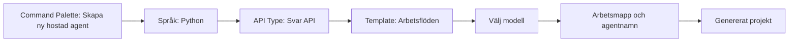
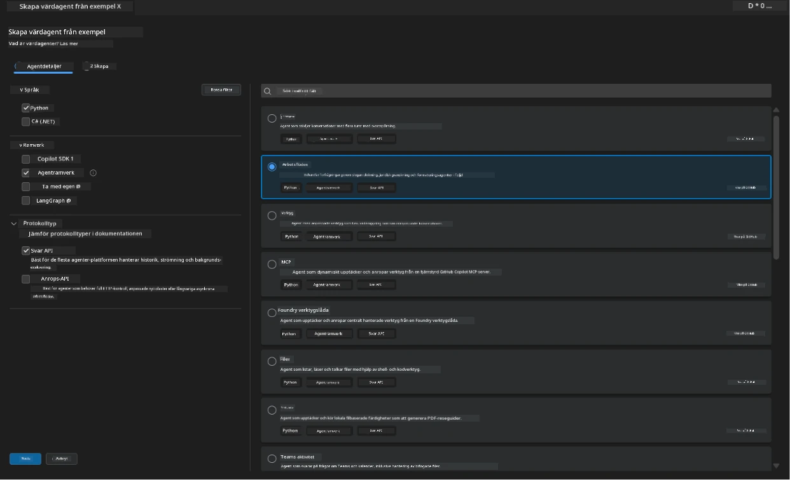
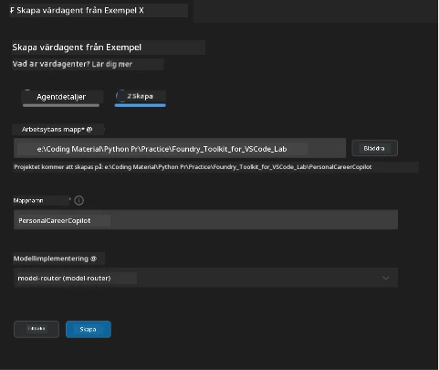

# Modul 2 - Bygg upp Multi-Agent-projektet

⏱️ ~5 min

I denna modul använder du [Foundry Toolkit för VS Code](https://aka.ms/foundrytk) för att **skapa grunden för ett multi-agent-projekt**. Guiden genererar `agent.yaml`, `main.py`, `Dockerfile`, `requirements.txt`, `.env` och VS Code debug-konfiguration - så att du kan fokusera på att koppla ihop arbetsflödet för 4 agenter i Modul 3.

> **Nyckelkoncept:** Grundstrukturen är en fungerande stub med en agent. Du ersätter platshållarlogiken med `WorkflowBuilder`-grafen i Modul 3. Du behöver inte skriva grundkoden från början.

> **Referensimplementation:** [`PersonalCareerCopilot/`](../../../../../workshop/lab02-multi-agent/PersonalCareerCopilot) är ett komplett, fungerande exempel. Använd det för att jämföra ditt arbete under tiden.

### Flöde för scaffold-guiden


```mermaid
flowchart LR
    A[Command Palette: Skapa ny hostad agent] --> B[Språk: Python]
    B --> C[API Type: Svar API]
    C --> D[Template: Arbetsflöden]
    D --> E[Välj modell]
    E --> F[Arbetsmapp och agentnamn]
    F --> G[Genererat projekt]
```

---

## Steg 1: Öppna Create Hosted Agent-guiden

1. Tryck `Ctrl+Shift+P` för att öppna **Command Palette**.
2. Skriv: **Foundry Toolkit: Create a New Hosted Agent** och välj det.
3. Guiden öppnas på fliken **Agent Details**.

> **Alternativ:** Klicka på **Foundry Toolkit**-ikonen i aktivitetsfältet → klicka på **+**-ikonen bredvid **Hosted Agents** → **Create New Hosted Agent**.

---

## Steg 2: Välj inställningar



1. I navigerings-/valsektionen till vänster välj följande:

| Meny | Val | Anteckningar |
|--------|-----------|-------|
| **Language** | Python | C# (.NET) stöds också |
| **Framework** | Agent Framework | Tillhandahåller `Agent`, `AgentExecutor`, `WorkflowBuilder` |
| **API type** | Response API | `POST /responses` - plattformshanterad historik, supports för streaming |
| **Template** | **Workflows** | Behandlar förfrågningar via flera agenter i sekvens |

2. När valt, klicka på **Next**



3. I nästa fönster, välj följande:

| Meny | Val | Anteckningar |
|--------|-----------|-------|
| **Workspace folder** | Bläddra till mål-mappen | t.ex. `workshop/lab02-multi-agent/` i detta repo |
| **Agent name** | `PersonalCareerCopilot` | Detta blir projektets mappnamn |
| **Model Deployment** | Välj ditt deployade modell | t.ex. `gpt-4.1-mini` från Lab 01 |

4. Klicka **Create** för att skapa projektstrukturen. VS Code genererar filerna och öppnar mappen.

> **Tips:** [`gpt-4.1-mini`](https://learn.microsoft.com/azure/foundry/foundry-models/concepts/models-sold-directly-by-azure#gpt-41-series) balanserar bra mellan hastighet och kvalitet för multi-agent-utveckling.

---

## Steg 3: Inspektera det genererade projektet

Efter att scaffolding är klar, verifiera att du ser dessa filer i Utforskaren (`Ctrl+Shift+E`):

```
📂 <your-agent-name>/
├── .azdignore          ← Files excluded from Azure Developer CLI deployments
├── .dockerignore       ← Files excluded from Docker builds
├── .env                ← Environment variables (placeholders - fill in Module 3)
├── .vscode/
│   ├── launch.json     ← Debug config (F5 → run + Agent Inspector)
│   └── tasks.json      ← VS Code task definitions
├── agent.yaml          ← Agent definition (kind: hosted, protocol: responses)
├── Dockerfile          ← Container config for deployment
├── main.py             ← Stub agent entry point (replace with WorkflowBuilder in Module 3)
└── requirements.txt    ← Python dependencies
```

> **Viktigt:** Öppna denna scaffoldade mapp direkt i VS Code så att `.vscode/launch.json` och `tasks.json` används korrekt vid F5-debugging.

### Förklaringar av viktiga filer

| Fil | Syfte |
|------|---------|
| `agent.yaml` | Deklarerar `kind: hosted`, mappar miljövariabler, definierar `/responses`-protokollet |
| `main.py` | Stub: en `FoundryChatClient` → `Agent` → `ResponsesHostServer`. Detta ersätts med 4 agenter + `WorkflowBuilder` i Modul 3 |
| `Dockerfile` | `python:3.12-slim`, installerar `requirements.txt`, exponerar port 8088, kör `python main.py` |
| `requirements.txt` | `agent-framework-foundry`, `agent-framework-foundry-hosting`, `mcp<2,>=1.24.0`, `debugpy` |

> **Referens:** Se [`PersonalCareerCopilot/agent.yaml`](../../../../../workshop/lab02-multi-agent/PersonalCareerCopilot/agent.yaml) och [`PersonalCareerCopilot/requirements.txt`](../../../../../workshop/lab02-multi-agent/PersonalCareerCopilot/requirements.txt) för komplett genererat innehåll.

---

### ✅ Kontrollpunkt

- [ ] Scaffold-guiden är slutförd - ny projektmapp syns i Utforskaren
- [ ] Alla förväntade filer finns: `agent.yaml`, `main.py`, `Dockerfile`, `requirements.txt`, `.env`
- [ ] `agent.yaml` visar `kind: hosted` och `protocol: responses`
- [ ] `main.py` importerar `Agent`, `FoundryChatClient`, `ResponsesHostServer`
- [ ] Scaffoldad mapp är öppen som VS Code arbetsytans rot
- [ ] Du förstår att `main.py` är en stub - `WorkflowBuilder` tillkommer i Modul 3

---

**Föregående:** [01 - Förstå multi-agent-arkitektur](01-understand-multi-agent.md) · **Nästa:** [03 - Konfigurera agenter & miljö →](03-configure-agents.md)

---

<!-- CO-OP TRANSLATOR DISCLAIMER START -->
**Ansvarsfriskrivning**:
Detta dokument har översatts med hjälp av AI-översättningstjänsten [Co-op Translator](https://github.com/Azure/co-op-translator). Även om vi strävar efter noggrannhet, var vänlig notera att automatiska översättningar kan innehålla fel eller brister. Det ursprungliga dokumentet på dess modersmål bör betraktas som den auktoritativa källan. För kritisk information rekommenderas professionell mänsklig översättning. Vi ansvarar inte för några missförstånd eller feltolkningar som uppstår till följd av användningen av denna översättning.
<!-- CO-OP TRANSLATOR DISCLAIMER END -->