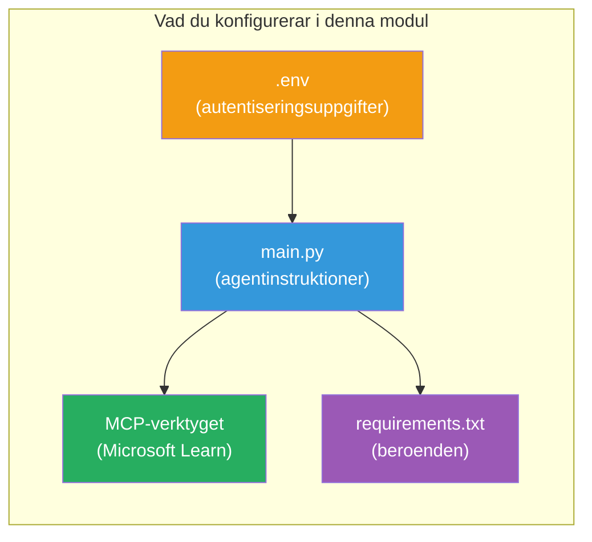

# Modul 3 - Konfigurera agenter, MCP-verktyg och miljö

I denna modul anpassar du det scaffoldade multi-agent-projektet. Du skriver instruktioner för alla fyra agenter, ställer in MCP-verktyget för Microsoft Learn, konfigurerar miljövariabler och installerar beroenden.


> **Referens:** Den kompletta fungerande koden finns i [`PersonalCareerCopilot/main.py`](../../../../../workshop/lab02-multi-agent/PersonalCareerCopilot/main.py). Använd den som referens när du bygger din egen.

---

## Steg 1: Konfigurera miljövariabler

1. Öppna filen **`.env`** i projektets rotmapp.  
2. Fyll i dina Foundry-projektdetaljer:

   ```env
   PROJECT_ENDPOINT=https://<your-account>.services.ai.azure.com/api/projects/<your-project>
   MODEL_DEPLOYMENT_NAME=gpt-4.1-mini
   ```

3. Spara filen.

### Var hittar du dessa värden

| Värde | Hur man hittar det |
|-------|--------------------|
| **Projekt-endpoint** | Microsoft Foundry sidofält → klicka på ditt projekt → endpoint-URL i detaljerad vy |
| **Namn på modelldistribution** | Foundry sidofält → expandera projekt → **Modeller + endpoints** → namn bredvid distribuerad modell |

> **Säkerhet:** Lägg aldrig upp `.env` i versionskontroll. Lägg till det i `.gitignore` om det inte redan finns där.

### Mappning av miljövariabler

Multi-agentens `main.py` läser både standard och workshop-specifika namn på miljövariabler:

```python
PROJECT_ENDPOINT = os.getenv("AZURE_AI_PROJECT_ENDPOINT") or os.getenv("PROJECT_ENDPOINT")
MODEL_DEPLOYMENT_NAME = os.getenv(
    "AZURE_AI_MODEL_DEPLOYMENT_NAME",
    os.getenv("MODEL_DEPLOYMENT_NAME", "gpt-4.1-mini"),
)
MICROSOFT_LEARN_MCP_ENDPOINT = os.getenv(
    "MICROSOFT_LEARN_MCP_ENDPOINT", "https://learn.microsoft.com/api/mcp"
)
```

MCP-endpointen har ett vettigt standardvärde – du behöver inte sätta det i `.env` om du inte vill skriva över det.

---

## Steg 2: Skriv agentinstruktioner

Detta är det mest kritiska steget. Varje agent behöver noggrant utformade instruktioner som definierar dess roll, utdataformat och regler. Öppna `main.py` och skapa (eller ändra) instruktionskonstanter.

### 2.1 Resume Parser Agent

```python
RESUME_PARSER_INSTRUCTIONS = """\
You are the Resume Parser.
Extract resume text into a compact, structured profile for downstream matching.

Output exactly these sections:
1) Candidate Profile
2) Technical Skills (grouped categories)
3) Soft Skills
4) Certifications & Awards
5) Domain Experience
6) Notable Achievements

Rules:
- Use only explicit or strongly implied evidence.
- Do not invent skills, titles, or experience.
- Keep concise bullets; no long paragraphs.
- If input is not a resume, return a short warning and request resume text.
"""
```

**Varför dessa sektioner?** MatchingAgent behöver strukturerad data att poängsätta mot. Konsekventa sektioner gör överlämning mellan agenter pålitlig.

### 2.2 Job Description Agent

```python
JOB_DESCRIPTION_INSTRUCTIONS = """\
You are the Job Description Analyst.
Extract a structured requirement profile from a JD.

Output exactly these sections:
1) Role Overview
2) Required Skills
3) Preferred Skills
4) Experience Required
5) Certifications Required
6) Education
7) Domain / Industry
8) Key Responsibilities

Rules:
- Keep required vs preferred clearly separated.
- Only use what the JD states; do not invent hidden requirements.
- Flag vague requirements briefly.
- If input is not a JD, return a short warning and request JD text.
"""
```

**Varför separera obligatoriska och önskade?** MatchingAgent använder olika viktningar för varje (Obligatoriska färdigheter = 40 poäng, Önskade färdigheter = 10 poäng).

### 2.3 Matching Agent

```python
MATCHING_AGENT_INSTRUCTIONS = """\
You are the Matching Agent.
Compare parsed resume output vs JD output and produce an evidence-based fit report.

Scoring (100 total):
- Required Skills 40
- Experience 25
- Certifications 15
- Preferred Skills 10
- Domain Alignment 10

Output exactly these sections:
1) Fit Score (with breakdown math)
2) Matched Skills
3) Missing Skills
4) Partially Matched
5) Experience Alignment
6) Certification Gaps
7) Overall Assessment

Rules:
- Be objective and evidence-only.
- Keep partial vs missing separate.
- Keep Missing Skills precise; it feeds roadmap planning.
"""
```

**Varför explicit poängsättning?** Reproducerbar poängsättning möjliggör att jämföra körningar och felsöka. Skalan på 100 poäng är lätt för slutanvändare att förstå.

### 2.4 Gap Analyzer Agent

```python
GAP_ANALYZER_INSTRUCTIONS = """\
You are the Gap Analyzer and Roadmap Planner.
Create a practical upskilling plan from the matching report.

Microsoft Learn MCP usage (required):
- For EVERY High and Medium priority gap, call tool `search_microsoft_learn_for_plan`.
- Use returned Learn links in Suggested Resources.
- Prefer Microsoft Learn for free resources.

CRITICAL: You MUST produce a SEPARATE detailed gap card for EVERY skill listed in
the Missing Skills and Certification Gaps sections of the matching report. Do NOT
skip or combine gaps. Do NOT summarize multiple gaps into one card.

Output format:
1) Personalized Learning Roadmap for [Role Title]
2) One DETAILED card per gap (produce ALL cards, not just the first):
   - Skill
   - Priority (High/Medium/Low)
   - Current Level
   - Target Level
   - Suggested Resources (include Learn URL from tool results)
   - Estimated Time
   - Quick Win Project
3) Recommended Learning Order (numbered list)
4) Timeline Summary (week-by-week)
5) Motivational Note

Rules:
- Produce every gap card before writing the summary sections.
- Keep it specific, realistic, and actionable.
- Tailor to candidate's existing stack.
- If fit >= 80, focus on polish/interview readiness.
- If fit < 40, be honest and provide a staged path.
"""
```

**Varför betoning på "CRITICAL"?** Utan uttryckliga instruktioner att producera ALLA gapkort tenderar modellen att bara generera 1-2 kort och sammanfatta resten. "CRITICAL"-blocket förhindrar denna förkortning.

---

## Steg 3: Definiera MCP-verktyget

GapAnalyzer använder ett verktyg som anropar [Microsoft Learn MCP-servern](https://learn.microsoft.com/azure/foundry/agents/how-to/tools/model-context-protocol). Lägg till detta i `main.py`:

```python
import json
from agent_framework import tool
from mcp.client.session import ClientSession
from mcp.client.streamable_http import streamable_http_client

@tool
async def search_microsoft_learn_for_plan(
    skill: str, role: str = "", max_results: int = 5
) -> str:
    """Search Microsoft Learn MCP and return curated official links for roadmap planning."""
    query = " ".join(part for part in [skill, role, "learning path module"] if part).strip()
    query = query or "job skills learning path"

    try:
        async with streamable_http_client(MICROSOFT_LEARN_MCP_ENDPOINT) as (
            read_stream, write_stream, _,
        ):
            async with ClientSession(read_stream, write_stream) as session:
                await session.initialize()
                result = await session.call_tool(
                    "microsoft_docs_search", {"query": query}
                )

        if not result.content:
            return (
                "No results returned from Microsoft Learn MCP. "
                "Fallback: https://learn.microsoft.com/training/support/catalog-api"
            )

        payload_text = getattr(result.content[0], "text", "")
        data = json.loads(payload_text) if payload_text else {}
        items = data.get("results", [])[:max(1, min(max_results, 10))]

        if not items:
            return f"No direct Microsoft Learn results found for '{skill}'."

        lines = [f"Microsoft Learn resources for '{skill}':"]
        for i, item in enumerate(items, start=1):
            title = item.get("title") or item.get("url") or "Microsoft Learn Resource"
            url = item.get("url") or item.get("link") or ""
            lines.append(f"{i}. {title} - {url}".rstrip(" -"))
        return "\n".join(lines)
    except Exception as ex:
        return (
            f"Microsoft Learn MCP lookup unavailable. Reason: {ex}. "
            "Fallbacks: https://learn.microsoft.com/api/mcp"
        )
```

### Så fungerar verktyget

| Steg | Vad som händer |
|------|----------------|
| 1 | GapAnalyzer bestämmer att den behöver resurser för en färdighet (t.ex. "Kubernetes") |
| 2 | Ramverket anropar `search_microsoft_learn_for_plan(skill="Kubernetes")` |
| 3 | Funktionen öppnar [Streamable HTTP](https://learn.microsoft.com/agent-framework/agents/tools/hosted-mcp-tools)-anslutning till `https://learn.microsoft.com/api/mcp` |
| 4 | Anropar `microsoft_docs_search` på [MCP-servern](https://learn.microsoft.com/azure/foundry/agents/how-to/tools/model-context-protocol) |
| 5 | MCP-servern returnerar sökresultat (titel + URL) |
| 6 | Funktionen formaterar resultaten som en numrerad lista |
| 7 | GapAnalyzer införlivar URL:er i gapkortet |

### MCP-beroenden

MCP-klientbiblioteken är transitive inkluderade via [`agent-framework-core`](https://learn.microsoft.com/agent-framework/overview/). Du behöver **inte** lägga till dem i `requirements.txt` separat. Om du får importfel, kontrollera:

```powershell
pip list | Select-String "mcp"
```

Förväntat: `mcp`-paketet är installerat (version 1.x eller senare).

---

## Steg 4: Koppla ihop agenterna och arbetsflödet

### 4.1 Skapa agenter med context managers

```python
from contextlib import asynccontextmanager

@asynccontextmanager
async def create_agents():
    async with (
        get_credential() as credential,
        AzureAIAgentClient(
            project_endpoint=PROJECT_ENDPOINT,
            model_deployment_name=MODEL_DEPLOYMENT_NAME,
            credential=credential,
        ).as_agent(
            name="ResumeParser",
            instructions=RESUME_PARSER_INSTRUCTIONS,
        ) as resume_parser,
        AzureAIAgentClient(
            project_endpoint=PROJECT_ENDPOINT,
            model_deployment_name=MODEL_DEPLOYMENT_NAME,
            credential=credential,
        ).as_agent(
            name="JobDescriptionAgent",
            instructions=JOB_DESCRIPTION_INSTRUCTIONS,
        ) as jd_agent,
        AzureAIAgentClient(
            project_endpoint=PROJECT_ENDPOINT,
            model_deployment_name=MODEL_DEPLOYMENT_NAME,
            credential=credential,
        ).as_agent(
            name="MatchingAgent",
            instructions=MATCHING_AGENT_INSTRUCTIONS,
        ) as matching_agent,
        AzureAIAgentClient(
            project_endpoint=PROJECT_ENDPOINT,
            model_deployment_name=MODEL_DEPLOYMENT_NAME,
            credential=credential,
        ).as_agent(
            name="GapAnalyzer",
            instructions=GAP_ANALYZER_INSTRUCTIONS,
            tools=[search_microsoft_learn_for_plan],
        ) as gap_analyzer,
    ):
        yield resume_parser, jd_agent, matching_agent, gap_analyzer
```

**Nyckelpunkter:**
- Varje agent har en **egen** `AzureAIAgentClient`-instans  
- Endast GapAnalyzer får `tools=[search_microsoft_learn_for_plan]`  
- `get_credential()` returnerar [`ManagedIdentityCredential`](https://learn.microsoft.com/python/api/overview/azure/identity-readme#managed-identity-support) i Azure och [`DefaultAzureCredential`](https://learn.microsoft.com/azure/developer/python/sdk/authentication/credential-chains#defaultazurecredential-overview) lokalt  

### 4.2 Bygg arbetsflödesgrafen

```python
def create_workflow(resume_parser, jd_agent, matching_agent, gap_analyzer):
    workflow = (
        WorkflowBuilder(
            name="ResumeJobFitEvaluator",
            start_executor=resume_parser,
            output_executors=[gap_analyzer],
        )
        .add_edge(resume_parser, jd_agent)
        .add_edge(resume_parser, matching_agent)
        .add_edge(jd_agent, matching_agent)
        .add_edge(matching_agent, gap_analyzer)
        .build()
    )
    return workflow.as_agent()
```

> Se [Workflows as Agents](https://learn.microsoft.com/agent-framework/workflows/as-agents) för att förstå `.as_agent()`-mönstret.

### 4.3 Starta servern

```python
async def main() -> None:
    validate_configuration()
    async with create_agents() as (resume_parser, jd_agent, matching_agent, gap_analyzer):
        agent = create_workflow(resume_parser, jd_agent, matching_agent, gap_analyzer)
        from azure.ai.agentserver.agentframework import from_agent_framework
        await from_agent_framework(agent).run_async()

if __name__ == "__main__":
    asyncio.run(main())
```

---

## Steg 5: Skapa och aktivera den virtuella miljön

### 5.1 Skapa miljön

```powershell
cd workshop\lab02-multi-agent\PersonalCareerCopilot
python -m venv .venv
```

### 5.2 Aktivera den

**PowerShell (Windows):**
```powershell
.\.venv\Scripts\Activate.ps1
```

**macOS/Linux:**
```bash
source .venv/bin/activate
```

### 5.3 Installera beroenden

```powershell
pip install -r requirements.txt
```

> **Notera:** `agent-dev-cli --pre`-raden i `requirements.txt` säkerställer att senaste preview-versionen installeras. Detta krävs för kompatibilitet med `agent-framework-core==1.0.0rc3`.

### 5.4 Verifiera installationen

```powershell
pip list | Select-String "agent-framework|agentserver|agent-dev"
```

Förväntad utdata:
```
agent-dev-cli                  0.0.1b260316
agent-framework-azure-ai       1.0.0rc3
agent-framework-core            1.0.0rc3
azure-ai-agentserver-agentframework 1.0.0b16
azure-ai-agentserver-core      1.0.0b16
```

> **Om `agent-dev-cli` visar en äldre version** (exempelvis `0.0.1b260119`) kommer Agent Inspector att misslyckas med 403/404-fel. Uppgradera: `pip install agent-dev-cli --pre --upgrade`

---

## Steg 6: Verifiera autentisering

Kör samma autentiseringskontroll som i Lab 01:

```powershell
az account show --query "{name:name, id:id}" --output table
```

Om detta misslyckas, kör [`az login`](https://learn.microsoft.com/cli/azure/authenticate-azure-cli-interactively).

För multi-agent arbetsflöden delar alla fyra agenter samma autentiseringsuppgifter. Om autentisering fungerar för en fungerar den för alla.

---

### Kontrollpunkt

- [ ] `.env` har giltiga värden för `PROJECT_ENDPOINT` och `MODEL_DEPLOYMENT_NAME`  
- [ ] Alla 4 agentinstruktionskonstanter är definierade i `main.py` (ResumeParser, JD Agent, MatchingAgent, GapAnalyzer)  
- [ ] MCP-verktyget `search_microsoft_learn_for_plan` är definierat och registrerat med GapAnalyzer  
- [ ] `create_agents()` skapar alla 4 agenter med individuella `AzureAIAgentClient`-instanser  
- [ ] `create_workflow()` bygger korrekt graf med `WorkflowBuilder`  
- [ ] Den virtuella miljön är skapad och aktiverad (`(.venv)` synligt)  
- [ ] `pip install -r requirements.txt` slutförs utan fel  
- [ ] `pip list` visar alla förväntade paket på rätt versioner (rc3 / b16)  
- [ ] `az account show` returnerar din prenumeration  

---

**Föregående:** [02 - Scaffold Multi-Agent Project](02-scaffold-multi-agent.md) · **Nästa:** [04 - Orchestration Patterns →](04-orchestration-patterns.md)

---

<!-- CO-OP TRANSLATOR DISCLAIMER START -->
**Ansvarsfriskrivning**:
Detta dokument har översatts med hjälp av AI-översättningstjänsten [Co-op Translator](https://github.com/Azure/co-op-translator). Även om vi strävar efter noggrannhet, var vänlig uppmärksam på att automatiska översättningar kan innehålla fel eller brister. Det ursprungliga dokumentet på dess modersmål bör anses vara den auktoritativa källan. För kritisk information rekommenderas professionell mänsklig översättning. Vi ansvarar inte för eventuella missförstånd eller feltolkningar som uppstår från användningen av denna översättning.
<!-- CO-OP TRANSLATOR DISCLAIMER END -->