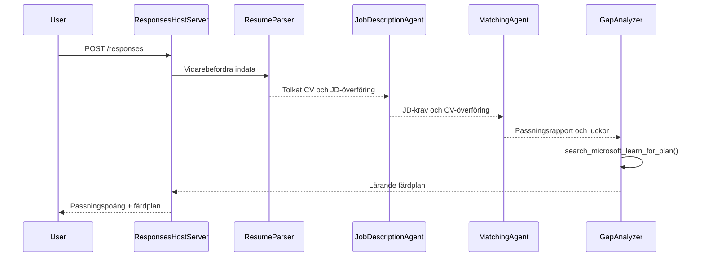

# Modul 3 - Konfigurera instruktioner, miljö & installera beroenden

⏱️ ~15 min

I denna modul omvandlar du den upprättade stommen till **ditt** multi-agent-flöde - genom att ställa in miljövariabler, skriva agentinstruktioner, lägga till MCP-verktyget, koppla arbetsflödets graf och installera beroenden.

> **Referens:** Den fullständiga fungerande koden finns i [`PersonalCareerCopilot/main.py`](../../../../../workshop/lab02-multi-agent/PersonalCareerCopilot/main.py). Använd den som referens när du bygger din egen arbetsflödesskarta och prompt-block.

---

## Hur de fyra agenterna samverkar


```mermaid
sequenceDiagram
    participant User
    participant Server as ResponsesHostServer
    participant RP as ResumeParser
    participant JD as JobDescriptionAgent
    participant MA as MatchingAgent
    participant GA as GapAnalyzer

    User->>Server: POST /responses
    Server->>RP: Vidarebefordra indata
    RP-->>JD: Tolkat CV och JD-överföring
    JD-->>MA: JD-krav och CV-överföring
    MA-->>GA: Passningsrapport och luckor
    GA->>GA: search_microsoft_learn_for_plan()
    GA-->>Server: Lärande färdplan
    Server-->>User: Passningspoäng + färdplan
```

---

## Steg 1: Konfigurera miljövariabler

1. Öppna **`.env`**-filen i projektets rotmapp (skapad av scaffold-guiden).
2. Ersätt platshållarna med dina faktiska värden från Lab 01.

<details open>
<summary><strong>🅰️ Väg A - Foundry-prenumeration</strong></summary>

```env
FOUNDRY_PROJECT_ENDPOINT=https://<your-account>.services.ai.azure.com/api/projects/<your-project>
AZURE_AI_MODEL_DEPLOYMENT_NAME=gpt-4.1-mini
```

> **Var man hittar värden:** Se [Lab 01, Modul 1](../../lab01-single-agent/docs/01-setup.md#deploy-a-model--assign-rbac).

</details>

<details open>
<summary><strong>🅱️ Väg B - Foundry Lokalt</strong></summary>

```env
FOUNDRY_PROJECT_ENDPOINT=http://localhost:5273/v1
AZURE_AI_MODEL_DEPLOYMENT_NAME=phi-4-mini
```

> All inferens körs på din maskin – inga data lämnar din enhet. Kör `foundry model list` för att bekräfta exakt modellalias. Det enda utgående anropet är MCP-verktygets anrop till `https://learn.microsoft.com/api/mcp`.

> **Var man hittar värden:** Se [Lab 01, Modul 1 - lokal väg](../../lab01-single-agent/docs/01-setup.md#step-2-set-up-based-on-your-access).

</details>

> **Säkerhet:** Lägg aldrig upp `.env` till versionshantering. Den bör redan finnas i `.gitignore`.

---

## Steg 2: Skriv agentinstruktioner

Instruktionerna definierar varje agents roll, utdataformat och regler. Öppna `main.py` och definiera (eller ersätt) de fyra instruktionskonstanterna - de kompletta strängarna finns i [`PersonalCareerCopilot/main.py`](../../../../../workshop/lab02-multi-agent/PersonalCareerCopilot/main.py).

### 2.1 `RESUME_PARSER_INSTRUCTIONS`
Tolkar CV:t till en strukturerad kandidatprofil **och** kopierar jobbannonsen ordagrant till `[JOB DESCRIPTION PASS-THROUGH]`. Båda märkta sektionerna måste finnas med i utdata.

> **Varför pass-through?** Med `context_mode="last_agent"` är ResumeParser den **enda** agenten som ser det ursprungliga användarmeddelandet. Om den inte kopierar JD vidare, ser aldrig de efterföljande agenterna det.

### 2.2 `JOB_DESCRIPTION_INSTRUCTIONS`
Läser `[PARSED RESUME]` och `[JOB DESCRIPTION PASS-THROUGH]` från ResumeParser-utdata. Producerar `[JD REQUIREMENTS]` (strukturerade krav) och `[PARSED RESUME PASS-THROUGH]` (ordagrann kopia av CV för MatchingAgent).

### 2.3 `MATCHING_AGENT_INSTRUCTIONS`
Läser `[JD REQUIREMENTS]` och `[PARSED RESUME PASS-THROUGH]`. Producerar en poängsatt passande rapport (0–100) med genomgång av matematik, matchade färdigheter, saknade färdigheter och erfarenhetsanpassning.

### 2.4 `GAP_ANALYZER_INSTRUCTIONS`
Läser passande rapporten. För **varje** saknad färdighet anropar den `search_microsoft_learn_for_plan` för att hämta Microsoft Learn-resurser. Producerar ett detaljerat gapkort per färdighet plus en veckovis lärväg.

---

## Steg 3: Lägg till MCP-verktyget

GapAnalyzer anropar [Microsoft Learn MCP-servern](https://learn.microsoft.com/azure/foundry/agents/how-to/tools/model-context-protocol) för att hämta riktiga lärresurser för varje färdighetslucka. Den fullständiga funktionen `search_microsoft_learn_for_plan` finns i [`PersonalCareerCopilot/main.py`](../../../../../workshop/lab02-multi-agent/PersonalCareerCopilot/main.py).

Registrera verktyget på GapAnalyzer när agenten skapas:

```python
gap_analyzer = Agent(
    client=client,
    instructions=GAP_ANALYZER_INSTRUCTIONS,
    name="GapAnalyzer",
    tools=[search_microsoft_learn_for_plan],
)
```

> Se [`PersonalCareerCopilot/main.py`](../../../../../workshop/lab02-multi-agent/PersonalCareerCopilot/main.py) för den kompletta `WorkflowBuilder`-grafen med `FoundryChatClient`, `AgentExecutor` och alla `add_edge()`-anrop.

---

## Steg 4: Skapa virtuell miljö & installera beroenden

> ⚠️ **Hoppa inte över detta steg.** Utan installerade beroenden kommer F5-debuggning att misslyckas.

### 4.1 Skapa den virtuella miljön

```powershell
python -m venv .venv
```

### 4.2 Aktivera den

| OS | Kommando |
|----|---------|
| **Windows (PowerShell)** | `.\.venv\Scripts\Activate.ps1` |
| **Windows (CMD)** | `.venv\Scripts\activate.bat` |
| **macOS / Linux** | `source .venv/bin/activate` |

Du bör se `(.venv)` i din terminalprompt.

### 4.3 Installera beroenden

```powershell
pip install -r requirements.txt
```

### 4.4 Verifiera

```powershell
pip list | Select-String "agent-framework|mcp|debugpy"
```

Förväntat: `agent-framework-foundry`, `agent-framework-foundry-hosting`, `mcp` och `debugpy` listas.

---

## Steg 5: Verifiera autentisering

<details open>
<summary><strong>🅰️ Väg A - Azure-uppgifter</strong></summary>

```powershell
az account show --query "{name:name, id:id}" --output table
```

Om detta misslyckas, kör [`az login`](https://learn.microsoft.com/cli/azure/authenticate-azure-cli-interactively).

Alla fyra agenter delar en `FoundryChatClient` och en `DefaultAzureCredential`. Om autentisering fungerar för en, fungerar den för alla.

</details>

<details open>
<summary><strong>🅱️ Väg B - Foundry Lokalt</strong></summary>

Ingen autentisering krävs vid lokal testning.

</details>

---

### ✅ Kontrollpunkt

> Gå **inte** vidare till Modul 04 förrän: **(1)** `(.venv)` syns i din prompt OCH **(2)** `pip install -r requirements.txt` slutfördes utan fel.

- [ ] `.env` har giltig endpoint och modellimplementeringsnamn (inte platshållare)
- [ ] Alla 4 agentinstruktionskonstanter definierade i `main.py` (ResumeParser, JD Agent, MatchingAgent, GapAnalyzer)
- [ ] `search_microsoft_learn_for_plan` MCP-verktyg definierat och registrerat på GapAnalyzer
- [ ] `FoundryChatClient` + 4 `Agent` + 4 `AgentExecutor` objekt skapade i `main()`
- [ ] `WorkflowBuilder` bygger korrekt sekventiell graf med alla 3 `add_edge()` anrop
- [ ] Virtuell miljö skapad och aktiverad (`(.venv)` synligt i prompten)
- [ ] `pip install -r requirements.txt` slutfördes utan fel
- [ ] **Väg A:** `az account show` lyckas ELLER VS Code Accounts-ikonen visar inloggad användare

---

**Föregående:** [02 - Scaffold Multi-Agent Project](02-scaffold-multi-agent.md) · **Nästa:** [04 - Orkestreringsmönster →](04-orchestration-patterns.md)

---

<!-- CO-OP TRANSLATOR DISCLAIMER START -->
**Ansvarsfriskrivning**:
Detta dokument har översatts med hjälp av AI-översättningstjänsten [Co-op Translator](https://github.com/Azure/co-op-translator). Även om vi strävar efter noggrannhet, var vänlig notera att automatiska översättningar kan innehålla fel eller brister. Det ursprungliga dokumentet på dess modersmål bör betraktas som den auktoritativa källan. För kritisk information rekommenderas professionell mänsklig översättning. Vi ansvarar inte för några missförstånd eller feltolkningar som uppstår till följd av användningen av denna översättning.
<!-- CO-OP TRANSLATOR DISCLAIMER END -->