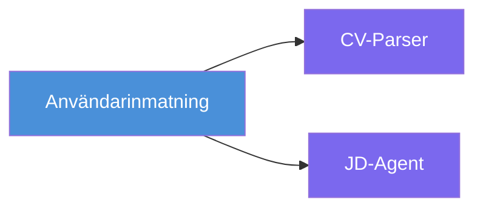
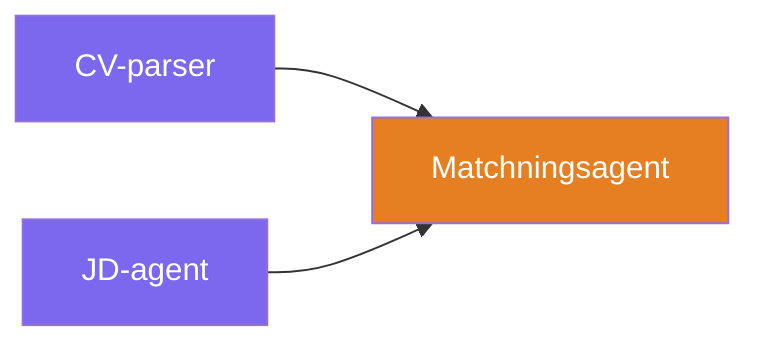
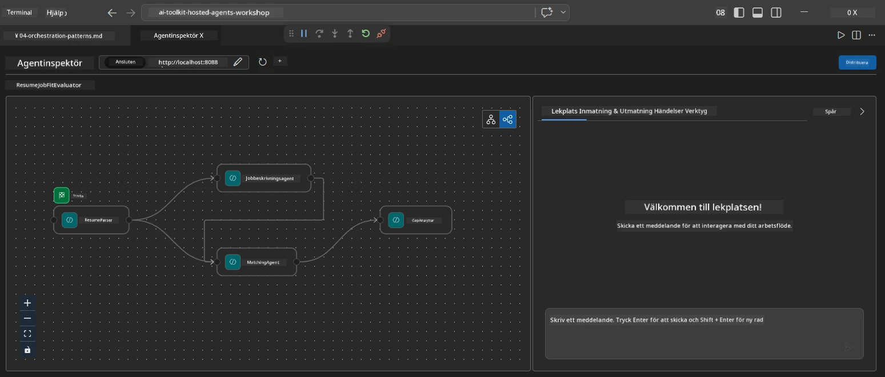
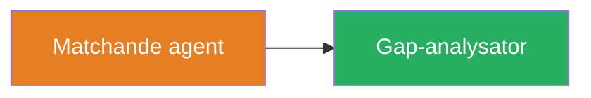
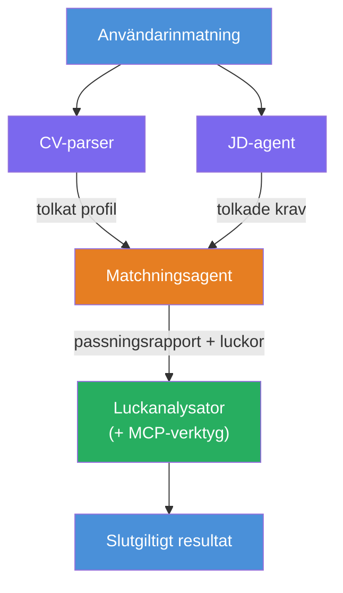
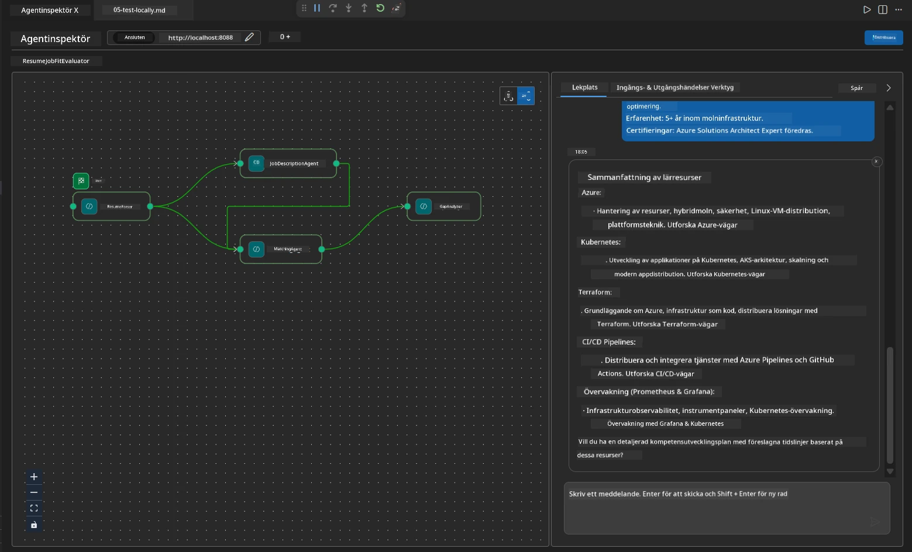

# Modul 4 - Orkestreringsmönster

I denna modul utforskar du orkestreringsmönstren som används i Resume Job Fit Evaluator och lär dig hur du läser, modifierar och utökar arbetsflödesgrafen. Att förstå dessa mönster är viktigt för att felsöka dataflödesproblem och bygga dina egna [multi-agent arbetsflöden](https://learn.microsoft.com/agent-framework/workflows/).

---

## Mönster 1: Fan-out (parallell uppdelning)

Det första mönstret i arbetsflödet är **fan-out** - en enda ingång skickas till flera agenter samtidigt.


I koden händer detta eftersom `resume_parser` är `start_executor` - den tar emot användarens meddelande först. Sedan, eftersom både `jd_agent` och `matching_agent` har kanter från `resume_parser`, dirigerar ramverket `resume_parser`s utdata till båda agenterna:

```python
.add_edge(resume_parser, jd_agent)         # ResumeParser-utdata → JD Agent
.add_edge(resume_parser, matching_agent)   # ResumeParser-utdata → MatchingAgent
```

**Varför detta fungerar:** ResumeParser och JD Agent bearbetar olika aspekter av samma indata. Att köra dem parallellt minskar den totala latensen jämfört med att köra dem sekventiellt.

### När man använder fan-out

| Användningsfall | Exempel |
|-----------------|---------|
| Oberoende deluppgifter | Parsning av CV vs. parsning av JD |
| Redundans / omröstning | Två agenter analyserar samma data, en tredje väljer bästa svaret |
| Multi-format output | En agent genererar text, en annan genererar strukturerad JSON |

---

## Mönster 2: Fan-in (aggregation)

Det andra mönstret är **fan-in** - flera agenters utdata samlas in och skickas till en enda efterföljande agent.


I koden:

```python
.add_edge(resume_parser, matching_agent)   # ResumeParser-utdata → MatchingAgent
.add_edge(jd_agent, matching_agent)        # JD Agent-utdata → MatchingAgent
```

**Nyckelbeteende:** När en agent har **två eller fler inkommande kanter**, väntar ramverket automatiskt på att **alla** uppströmsagenters ska slutföras innan den efterföljande agenten körs. MatchingAgent startar inte förrän både ResumeParser och JD Agent har avslutats.

### Vad MatchingAgent tar emot

Ramverket sammanfogar utdata från alla uppströmsagenter. MatchingAgents indata ser ut som:

```
[ResumeParser output]
---
Candidate Profile:
  Name: Jane Doe
  Technical Skills: Python, Azure, Kubernetes, ...
  ...

[JobDescriptionAgent output]
---
Role Overview: Senior Cloud Engineer
Required Skills: Python, Azure, Terraform, ...
...
```

> **Notera:** Det exakta sammanfogningsformatet beror på ramverksversionen. Agentens instruktioner bör vara skrivna för att hantera både strukturerad och ostrukturerad uppströmsutdata.



---

## Mönster 3: Sekventiell kedja

Det tredje mönstret är **sekventiell kedjning** - en agents utdata matas direkt till nästa.


I koden:

```python
.add_edge(matching_agent, gap_analyzer)    # MatchingAgent utdata → GapAnalyzer
```

Detta är det enklaste mönstret. GapAnalyzer tar emot MatchingAgents fit-poäng, matchade/ saknade färdigheter och luckor. Sedan anropar den [MCP-verktyget](https://learn.microsoft.com/azure/foundry/agents/how-to/tools/model-context-protocol) för varje lucka för att hämta Microsoft Learn-resurser.

---

## Den kompletta grafen

Genom att kombinera alla tre mönster skapas hela arbetsflödet:


### Exekveringstidslinje

```mermaid
gantt
    title Agentens exekveringstidslinje
    dateFormat X
    axisFormat %s

    section Parallell
    Resume Parser       :rp, 0, 3
    JD Agent            :jd, 0, 2

    section Sekventiell
    Matching Agent      :ma, 3, 5
    Gap Analyzer        :ga, 5, 9
```


> Den totala väggklocktiden är ungefär `max(ResumeParser, JD Agent) + MatchingAgent + GapAnalyzer`. GapAnalyzer är vanligtvis den långsammaste eftersom den gör flera MCP-verktygsanrop (ett per lucka).

---

## Att läsa WorkflowBuilder-koden

Här är den kompletta funktionen `create_workflow()` från `main.py`, med kommentarer:

```python
def create_workflow(resume_parser, jd_agent, matching_agent, gap_analyzer):
    workflow = (
        WorkflowBuilder(
            name="ResumeJobFitEvaluator",

            # Den första agenten att ta emot användarinmatning
            start_executor=resume_parser,

            # Agenten/-erna vars output blir det slutgiltiga svaret
            output_executors=[gap_analyzer],
        )
        # Fan-out: ResumeParser-utdata går till både JD Agent och MatchingAgent
        .add_edge(resume_parser, jd_agent)
        .add_edge(resume_parser, matching_agent)

        # Fan-in: MatchingAgent väntar på både ResumeParser och JD Agent
        .add_edge(jd_agent, matching_agent)

        # Sekventiell: MatchingAgent-output matar GapAnalyzer
        .add_edge(matching_agent, gap_analyzer)

        .build()
    )
    return workflow.as_agent()
```

### Sammanfattningstabell för kanter

| # | Kant | Mönster | Effekt |
|---|------|---------|--------|
| 1 | `resume_parser → jd_agent` | Fan-out | JD Agent tar emot ResumeParser's utdata (plus originalinput från användaren) |
| 2 | `resume_parser → matching_agent` | Fan-out | MatchingAgent tar emot ResumeParser's utdata |
| 3 | `jd_agent → matching_agent` | Fan-in | MatchingAgent tar också emot JD Agent's utdata (väntar på båda) |
| 4 | `matching_agent → gap_analyzer` | Sekventiell | GapAnalyzer tar emot fit-rapport + lucklista |

---

## Modifiera grafen

### Lägga till en ny agent

För att lägga till en femte agent (t.ex. en **InterviewPrepAgent** som genererar intervjufrågor baserat på luckanalysen):

```python
# 1. Definiera instruktioner
INTERVIEW_PREP_INSTRUCTIONS = """\
You are the Interview Prep Agent.
Given a gap analysis and fit report, generate 10 targeted interview questions
the candidate should prepare for.
"""

# 2. Skapa agenten (inne i async with-blocket)
AzureAIAgentClient(
    project_endpoint=PROJECT_ENDPOINT,
    model_deployment_name=MODEL_DEPLOYMENT_NAME,
    credential=credential,
).as_agent(
    name="InterviewPrepAgent",
    instructions=INTERVIEW_PREP_INSTRUCTIONS,
) as interview_prep,

# 3. Lägg till kanter i create_workflow()
.add_edge(matching_agent, interview_prep)   # tar emot fit-rapport
.add_edge(gap_analyzer, interview_prep)     # tar också emot gap-kort

# 4. Uppdatera output_executors
output_executors=[interview_prep],  # nu den slutliga agenten
```

### Ändra exekveringsordning

För att få JD Agent att köra **efter** ResumeParser (sekventiellt istället för parallellt):

```python
# Ta bort: .add_edge(resume_parser, jd_agent)  ← finns redan, behåll den
# Ta bort den implicita parallellismen genom att INTE låta jd_agent ta emot användarinmatning direkt
# start_executor skickar först till resume_parser, och jd_agent får bara
# resume_parser:s output via kanten. Detta gör dem sekventiella.
```

> **Viktigt:** `start_executor` är den enda agenten som tar emot rå användarinput. Alla andra agenter tar emot utdata från sina uppströmskanter. Om du vill att en agent också ska ta emot rå användarinput måste den ha en kant från `start_executor`.

---

## Vanliga grafmisstag

| Misstag | Symptom | Lösning |
|---------|---------|---------|
| Saknad kant till `output_executors` | Agent körs men utdata är tomt | Säkerställ att det finns en väg från `start_executor` till varje agent i `output_executors` |
| Cirkulärt beroende | Oändlig loop eller timeout | Kontrollera att ingen agent matar tillbaka till en uppströmsagent |
| Agent i `output_executors` utan inkommande kant | Tomt utdata | Lägg till minst en `add_edge(source, that_agent)` |
| Flera `output_executors` utan fan-in | Utdatan innehåller endast en agents svar | Använd en enda output-agent som aggregerar, eller acceptera flera utdata |
| Saknad `start_executor` | `ValueError` vid byggtid | Ange alltid `start_executor` i `WorkflowBuilder()` |

---

## Felsöka grafen

### Använda Agent Inspector

1. Starta agenten lokalt (F5 eller terminal - se [Modul 5](05-test-locally.md)).
2. Öppna Agent Inspector (`Ctrl+Shift+P` → **Foundry Toolkit: Open Agent Inspector**).
3. Skicka ett testmeddelande.
4. I Inspektörens svarspanel, leta efter **strömmande utdata** - den visar varje agents bidrag i sekvens.



### Använda loggning

Lägg till loggning i `main.py` för att spåra dataflödet:

```python
import logging
logger = logging.getLogger("resume-job-fit")

# I create_workflow(), efter att ha byggt:
logger.info("Workflow graph built with edges: RP→JD, RP→MA, JD→MA, MA→GA")
```

Serverloggen visar agentkörningsordning och MCP-verktygsanrop:

```
INFO:resume-job-fit:Starting Resume -> Job Fit Evaluator HTTP server...
INFO:resume-job-fit:Server running on http://localhost:8088
INFO:agent_framework:Executing agent: ResumeParser
INFO:agent_framework:Executing agent: JobDescriptionAgent
INFO:agent_framework:Waiting for upstream agents: ResumeParser, JobDescriptionAgent
INFO:agent_framework:Executing agent: MatchingAgent
INFO:agent_framework:Executing agent: GapAnalyzer
INFO:agent_framework:Tool call: search_microsoft_learn_for_plan(skill="Kubernetes")
POST https://learn.microsoft.com/api/mcp → 200
INFO:agent_framework:Tool call: search_microsoft_learn_for_plan(skill="Terraform")
POST https://learn.microsoft.com/api/mcp → 200
```

---

### Checkpunkt

- [ ] Du kan identifiera de tre orkestreringsmönstren i arbetsflödet: fan-out, fan-in och sekventiell kedja
- [ ] Du förstår att agenter med flera inkommande kanter väntar på att alla uppströmsagenter ska slutföras
- [ ] Du kan läsa `WorkflowBuilder`-koden och koppla varje `add_edge()`-anrop till den visuella grafen
- [ ] Du förstår exekveringstidslinjen: parallella agenter körs först, sedan aggregering, sedan sekventiellt
- [ ] Du vet hur du lägger till en ny agent i grafen (definiera instruktioner, skapa agent, lägg till kanter, uppdatera output)
- [ ] Du kan identifiera vanliga grafmisstag och deras symptom

---

**Föregående:** [03 - Konfigurera agenter & miljö](03-configure-agents.md) · **Nästa:** [05 - Testa lokalt →](05-test-locally.md)

---

<!-- CO-OP TRANSLATOR DISCLAIMER START -->
**Ansvarsfriskrivning**:  
Detta dokument har översatts med hjälp av AI-översättningstjänsten [Co-op Translator](https://github.com/Azure/co-op-translator). Även om vi strävar efter noggrannhet, var god notera att automatiska översättningar kan innehålla fel eller brister. Det ursprungliga dokumentet på dess modersmål ska betraktas som den auktoritativa källan. För kritisk information rekommenderas professionell mänsklig översättning. Vi ansvarar inte för eventuella missförstånd eller feltolkningar som uppstår till följd av användningen av denna översättning.
<!-- CO-OP TRANSLATOR DISCLAIMER END -->