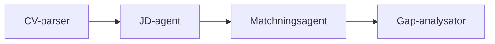
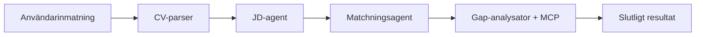

# Modul 4 - Orkestreringsmönster

⏱️ ~10 min

I den här modulen utforskar du orkestreringsmönstren som används i Resume Job Fit Evaluator och lär dig hur du läser, modifierar och utökar arbetsflödesgrafen. Att förstå dessa mönster är avgörande för att felsöka problem med dataflöde och bygga dina egna [multi-agent arbetsflöden](https://learn.microsoft.com/agent-framework/workflows/).

---

## Mönster 1: Sekventiell kedja

Det grundläggande mönstret i arbetsflödet är en **sekventiell kedja** - varje agents utdata matas direkt in i nästa.


```mermaid
flowchart LR
    RP[CV-parser] --> JD[JD-agent]
    JD --> MA[Matchningsagent]
    MA --> GA[Gap-analysator]
```

I koden skapar varje `add_edge()` anrop ett steg i kedjan:

```python
.add_edge(resume_executor, jd_executor)       # ResumeParser utdata → JD Agent
.add_edge(jd_executor, matching_executor)     # JD Agent utdata → MatchingAgent
.add_edge(matching_executor, gap_executor)    # MatchingAgent utdata → GapAnalyzer
```

> **Varför sekventiellt, inte fan-out/fan-in?** `WorkflowBuilder` använder **ELLER-semantik** för inkommande kanter: en nedströms exekverare startar så snart **någon** föregångare slutförs. Om `matching_executor` hade två inkommande kanter (från både `resume_executor` och `jd_executor`), skulle den triggas två gånger - en gång när ResumeParser är klar och igen när JD Agent är klar - vilket får GapAnalyzer att också köras två gånger och utdata att visas två gånger. Den sekventiella pipelinen undviker detta helt.

## Mönster 2: Innehållsrelay

Eftersom `context_mode="last_agent"` betyder att varje exekverare bara ser sin **direkta föregångares utdata**, måste agenter i en sekventiell kedja uttryckligen föra vidare alla data som nedströms agenter behöver.

I detta arbetsflöde:
- **ResumeParser** kopierar JD ordagrant till `[JOB DESCRIPTION PASS-THROUGH]` (så att JD Agent kan hitta det).
- **JD Agent** kopierar `[PARSED RESUME]` ordagrant till `[PARSED RESUME PASS-THROUGH]` (så att MatchingAgent kan jämföra båda profilerna).

```
ResumeParser output
└─ [PARSED RESUME]               ← extracted by JD Agent
└─ [JOB DESCRIPTION PASS-THROUGH] ← extracted by JD Agent

JD Agent output
└─ [JD REQUIREMENTS]             ← extracted by MatchingAgent
└─ [PARSED RESUME PASS-THROUGH]  ← extracted by MatchingAgent
```

Varje relay-sektion måste kopieras **ordagrant** - att sammanfatta eller omformulera det bryter nedströmsagenten som är beroende av det.

---

## Den kompletta grafen

Kombinationen av de sekventiella kedje- och innehållsrelay-mönstren ger hela arbetsflödet:


```mermaid
flowchart LR
    U[Användarinmatning] --> RP[CV-parser]
    RP --> JD[JD-agent]
    JD --> MA[Matchningsagent]
    MA --> GA[Gap-analysator + MCP]
    GA --> O[Slutligt resultat]
```

Agent Inspector visar denna grafstruktur när agenten körs lokalt. Se [Modul 5 - Testa Lokalt](05-test-locally.md) för skärmbilder.

---

## Läsa WorkflowBuilder-koden

Den kompletta `create_workflow()` funktionen finns i [`PersonalCareerCopilot/main.py`](../../../../../workshop/lab02-multi-agent/PersonalCareerCopilot/main.py). De tre `add_edge()` anropen bygger den sekventiella pipelinen:

| # | Kant | Effekt |
|---|------|--------|
| 1 | `resume_executor → jd_executor` | JD Agent får `[PARSED RESUME]` + `[JOB DESCRIPTION PASS-THROUGH]` |
| 2 | `jd_executor → matching_executor` | MatchingAgent får `[JD REQUIREMENTS]` + `[PARSED RESUME PASS-THROUGH]` |
| 3 | `matching_executor → gap_executor` | GapAnalyzer får fit-rapport + gap-lista |

---

## Modifiera grafen

### Lägga till en ny agent

För att lägga till en femte agent (t.ex. en **InterviewPrepAgent** efter GapAnalyzer):

1. Definiera en konstant `INTERVIEW_PREP_INSTRUCTIONS`.
2. Skapa `Agent` + `AgentExecutor` objekt (samma mönster som de befintliga fyra).
3. Lägg till `.add_edge(gap_executor, interview_exec)` i `WorkflowBuilder`.
4. Uppdatera `output_executors=[interview_exec]`.

> **Viktigt:** `start_executor` är den enda agent som får rå användarinmatning. Alla andra agenter får utdata från sin uppströms kant.

---

## Vanliga grafmisstag

| Misstag | Symptom | Lösning |
|---------|---------|-----|
| Saknad kant till `output_executors` | Agent körs men utdata är tom | Säkerställ att det finns en väg från `start_executor` till varje agent i `output_executors` |
| Cirkulärt beroende | Oändlig loop eller timeout | Kontrollera att ingen agent matar tillbaka till en uppströms agent |
| Agent i `output_executors` utan inkommande kant | Tomt utdata | Lägg till åtminstone en `add_edge(source, den_agenten)` |
| Flera `output_executors` utan fan-in | Utdatan innehåller bara en agents svar | Använd en enda utdata-agent som aggregerar, eller acceptera flera utdatan |
| Saknad `start_executor` | `ValueError` vid bygget | Specifiera alltid `start_executor` i `WorkflowBuilder()` |

---

## Felsöka grafen

### Använda Agent Inspector

1. Starta agenten lokalt med F5.
2. Öppna Agent Inspector (`Ctrl+Skift+P` → **Foundry Toolkit: Open Agent Inspector**).
3. Skicka ett testmeddelande.
4. I Inspektörens svarspanel, leta efter **strömmande utdata** - det visar varje agents bidrag i sekvens.


### Använda loggning

Lägg till loggning i `main.py` för att spåra dataflöde:

```python
import logging
logger = logging.getLogger("resume-job-fit")

# I main(), efter att ha byggt arbetsflödet:
logger.info("Workflow graph built with edges: RP→JD, JD→MA, MA→GA")
```

Serverloggarna visar agenters exekveringsordning och MCP-verktygsanrop:

```
INFO:agent_framework:Executing agent: ResumeParser
INFO:agent_framework:Executing agent: JobDescriptionAgent
INFO:agent_framework:Executing agent: MatchingAgent
INFO:agent_framework:Executing agent: GapAnalyzer
INFO:agent_framework:Tool call: search_microsoft_learn_for_plan(skill="Kubernetes")
POST https://learn.microsoft.com/api/mcp → 200
INFO:agent_framework:Tool call: search_microsoft_learn_for_plan(skill="Terraform")
POST https://learn.microsoft.com/api/mcp → 200
```

---

### Kontrollpunkt

- [ ] Du kan identifiera de två orkestreringsmönstren i arbetsflödet: sekventiell kedja och innehållsrelay
- [ ] Du förstår varför `context_mode="last_agent"` kräver explicit datarelay mellan agenter
- [ ] Du kan läsa `WorkflowBuilder`-koden och koppla varje `add_edge()` anrop till den visuella grafen
- [ ] Du vet hur man lägger till en ny agent längst ut i pipelinen
- [ ] Du kan identifiera vanliga grafmisstag och deras symptom

---

**Föregående:** [03 - Konfigurera Agenter & Miljö](03-configure-agents.md) · **Nästa:** [05 - Testa Lokalt →](05-test-locally.md)

---

<!-- CO-OP TRANSLATOR DISCLAIMER START -->
**Ansvarsfriskrivning**:
Detta dokument har översatts med hjälp av AI-översättningstjänsten [Co-op Translator](https://github.com/Azure/co-op-translator). Även om vi strävar efter noggrannhet, var vänlig notera att automatiska översättningar kan innehålla fel eller brister. Det ursprungliga dokumentet på dess modersmål bör betraktas som den auktoritativa källan. För kritisk information rekommenderas professionell mänsklig översättning. Vi ansvarar inte för några missförstånd eller feltolkningar som uppstår till följd av användningen av denna översättning.
<!-- CO-OP TRANSLATOR DISCLAIMER END -->