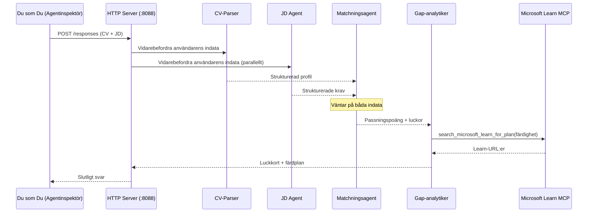
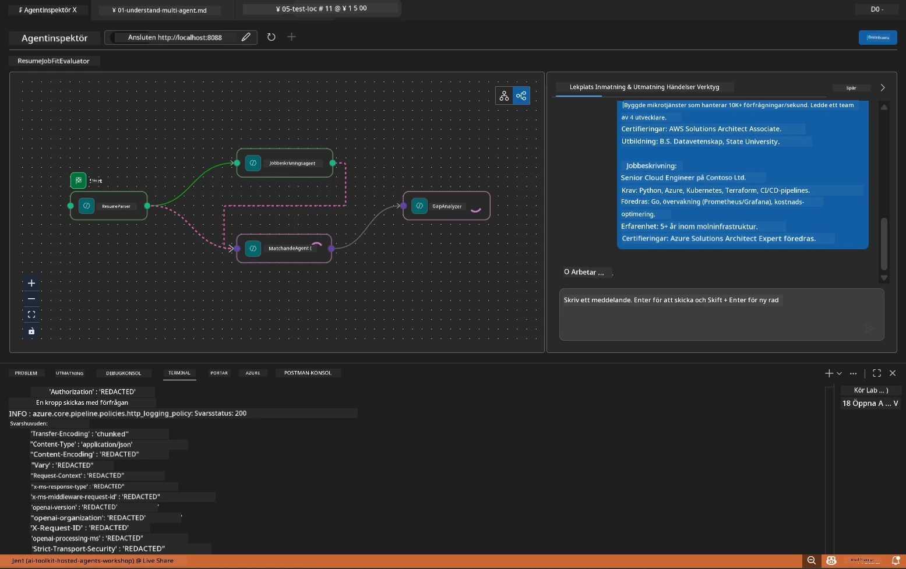

# Modul 5 - Testa lokalt (multagent)

I denna modul kör du multi-agentarbetsflödet lokalt, testar det med Agent Inspector och verifierar att alla fyra agenter och MCP-verktyget fungerar korrekt innan du distribuerar till Foundry.

### Vad som händer under ett lokalt testkörning


---

## Steg 1: Starta agentservern

### Alternativ A: Använda VS Code-tasken (rekommenderat)

1. Tryck `Ctrl+Shift+P` → skriv **Tasks: Run Task** → välj **Run Lab02 HTTP Server**.
2. Tasken startar servern med debugpy kopplat på port `5679` och agenten på port `8088`.
3. Vänta tills utskriften visar:

```
INFO:resume-job-fit:Starting Resume -> Job Fit Evaluator HTTP server...
INFO:resume-job-fit:Server running on http://localhost:8088
```

### Alternativ B: Använd terminalen manuellt

```powershell
cd workshop\lab02-multi-agent\PersonalCareerCopilot
```

Aktivera den virtuella miljön:

**PowerShell (Windows):**
```powershell
.\.venv\Scripts\Activate.ps1
```

**macOS/Linux:**
```bash
source .venv/bin/activate
```

Starta servern:

```powershell
python -m debugpy --listen 127.0.0.1:5679 -m agentdev run main.py --verbose --port 8088
```

### Alternativ C: Använd F5 (debugläge)

1. Tryck `F5` eller gå till **Run and Debug** (`Ctrl+Shift+D`).
2. Välj startkonfigurationen **Lab02 - Multi-Agent** i rullgardinsmenyn.
3. Servern startar med full brytpunktstöd.

> **Tips:** Debugläge låter dig sätta brytpunkter inuti `search_microsoft_learn_for_plan()` för att inspektera MCP-responser, eller inuti agentinstruktionssträngar för att se vad varje agent får.

---

## Steg 2: Öppna Agent Inspector

1. Tryck `Ctrl+Shift+P` → skriv **Foundry Toolkit: Open Agent Inspector**.
2. Agent Inspector öppnas i en webbläsarflik på `http://localhost:5679`.
3. Du bör se agentgränssnittet redo att ta emot meddelanden.

> **Om Agent Inspector inte öppnas:** Kontrollera att servern är helt startad (du ser loggen "Server running"). Om port 5679 är upptagen, se [Modul 8 - Felsökning](08-troubleshooting.md).

---

## Steg 3: Kör rökprov

Kör dessa tre tester i ordning. Varje test täcker allt mer av arbetsflödet.

### Test 1: Grundläggande CV + arbetsbeskrivning

Klistra in följande i Agent Inspector:

```
Resume:
Jane Doe
Senior Software Engineer with 5 years of experience in Python, Django, and AWS.
Built microservices handling 10K+ requests/second. Led a team of 4 developers.
Certifications: AWS Solutions Architect Associate.
Education: B.S. Computer Science, State University.

Job Description:
Senior Cloud Engineer at Contoso Ltd.
Required: Python, Azure, Kubernetes, Terraform, CI/CD pipelines.
Preferred: Go, monitoring (Prometheus/Grafana), cost optimization.
Experience: 5+ years in cloud infrastructure.
Certifications: Azure Solutions Architect Expert preferred.
```

**Förväntad utdata struktur:**

Svaret bör innehålla output från alla fyra agenter i ordning:

1. **Resume Parser output** - Strukturerad kandidatprofil med färdigheter grupperade per kategori
2. **JD Agent output** - Strukturerade krav med separering av obligatoriska och önskvärda färdigheter
3. **Matching Agent output** - Passningspoäng (0-100) med uppdelning, matchade färdigheter, saknade färdigheter, luckor
4. **Gap Analyzer output** - Individuella luckkort för varje saknad färdighet, var och en med Microsoft Learn-URL:er



### Vad att verifiera i Test 1

| Kontroll | Förväntat | Godkänt? |
|----------|-----------|----------|
| Svaret innehåller en passningspoäng | Nummer mellan 0-100 med uppdelning | |
| Matchade färdigheter listas | Python, CI/CD (delvis), etc. | |
| Saknade färdigheter listas | Azure, Kubernetes, Terraform, etc. | |
| Luckkort finns för varje saknad färdighet | Ett kort per färdighet | |
| Microsoft Learn-URL:er finns med | Riktiga `learn.microsoft.com` länkar | |
| Inga felmeddelanden i svaret | Rent strukturerat output | |

### Test 2: Verifiera MCP-verktygets körning

Medan Test 1 körs, kontrollera **serverterminalen** för MCP-loggposter:

```
GET https://learn.microsoft.com/api/mcp → 405 (Method Not Allowed)
POST https://learn.microsoft.com/api/mcp → 200
DELETE https://learn.microsoft.com/api/mcp → 405 (Method Not Allowed)
```

| Loggpost | Betydelse | Förväntat? |
|----------|-----------|------------|
| `GET ... → 405` | MCP-klient provar med GET under initialisering | Ja - normalt |
| `POST ... → 200` | Verkligt verktygskall till Microsoft Learn MCP-server | Ja - detta är det verkliga anropet |
| `DELETE ... → 405` | MCP-klient provar med DELETE vid städning | Ja - normalt |
| `POST ... → 4xx/5xx` | Verktygskall misslyckades | Nej - se [Felsökning](08-troubleshooting.md) |

> **Viktig punkt:** Raderna `GET 405` och `DELETE 405` är **förväntat beteende**. Oroa dig bara om `POST`-anrop returnerar statuskoder som inte är 200.

### Test 3: Gränsfall - kandidat med hög passning

Klistra in ett CV som mycket väl matchar arbetsbeskrivningen för att verifiera att GapAnalyzer hanterar högpassningssituationer:

```
Resume:
Alex Chen
Senior Cloud Engineer with 7 years of experience.
Skills: Python, Azure (AKS, Functions, DevOps), Kubernetes, Terraform, CI/CD (GitHub Actions, Azure Pipelines), Go, Prometheus, Grafana, cost optimization.
Certifications: Azure Solutions Architect Expert, Azure DevOps Engineer Expert.
Led infrastructure migration to Azure for 3 enterprise clients.
Education: M.S. Computer Science, Tech University.

Job Description:
Senior Cloud Engineer at Contoso Ltd.
Required: Python, Azure, Kubernetes, Terraform, CI/CD pipelines.
Preferred: Go, monitoring (Prometheus/Grafana), cost optimization.
Experience: 5+ years in cloud infrastructure.
Certifications: Azure Solutions Architect Expert preferred.
```

**Förväntat beteende:**
- Passningspoängen bör vara **80+** (de flesta färdigheter matchar)
- Luckkorten bör fokusera på finslipning/intervjuförberedelse snarare än grundläggande lärande
- GapAnalyzer-instruktionerna säger: "Om passning >= 80, fokusera på finslipning/intervjuförberedelse"

---

## Steg 4: Verifiera att utdata är fullständig

Efter att ha kört testerna, verifiera att utdata uppfyller följande kriterier:

### Checklista för utdatastruktur

| Sektion | Agent | Finns? |
|---------|-------|--------|
| Kandidatprofil | Resume Parser | |
| Tekniska färdigheter (grupperade) | Resume Parser | |
| Rollöversikt | JD Agent | |
| Obligatoriska vs. önskade färdigheter | JD Agent | |
| Passningspoäng med uppdelning | Matching Agent | |
| Matchade / saknade / delvisa färdigheter | Matching Agent | |
| Luckkort per saknad färdighet | Gap Analyzer | |
| Microsoft Learn-URL:er i luckkort | Gap Analyzer (MCP) | |
| Lärandeordning (nummererad) | Gap Analyzer | |
| Tidslinjesammanfattning | Gap Analyzer | |

### Vanliga problem i detta skede

| Problem | Orsak | Lösning |
|---------|-------|---------|
| Endast 1 luckkort (resten trunkeras) | GapAnalyzer-instruktioner saknar CRITICAL-block | Lägg till `CRITICAL:`-stycket i `GAP_ANALYZER_INSTRUCTIONS` - se [Modul 3](03-configure-agents.md) |
| Inga Microsoft Learn-URL:er | MCP-endpoint otillgänglig | Kontrollera internetanslutningen. Verifiera att `MICROSOFT_LEARN_MCP_ENDPOINT` i `.env` är `https://learn.microsoft.com/api/mcp` |
| Tomt svar | `PROJECT_ENDPOINT` eller `MODEL_DEPLOYMENT_NAME` är inte satt | Kontrollera värden i `.env`. Kör `echo $env:PROJECT_ENDPOINT` i terminal |
| Passningspoäng är 0 eller saknas | MatchingAgent fick ingen data från uppströms | Kontrollera att `add_edge(resume_parser, matching_agent)` och `add_edge(jd_agent, matching_agent)` finns i `create_workflow()` |
| Agent startar men avslutas direkt | Importfel eller saknad beroende | Kör `pip install -r requirements.txt` igen. Kontrollera terminalen för stacktraces |
| `validate_configuration`-fel | Saknade miljövariabler | Skapa `.env` med `PROJECT_ENDPOINT=<your-endpoint>` och `MODEL_DEPLOYMENT_NAME=<your-model>` |

---

## Steg 5: Testa med dina egna data (valfritt)

Försök klistra in ditt eget CV och en verklig arbetsbeskrivning. Detta hjälper till att verifiera:

- Att agenterna hanterar olika CV-format (kronologiskt, funktionellt, hybrid)
- JD Agent hanterar olika arbetsbeskrivningsstilar (punktlistor, stycken, strukturerade)
- MCP-verktyget returnerar relevanta resurser för verkliga färdigheter
- Luckkorten är personligt anpassade till din specifika bakgrund

> **Integritetsnotis:** Vid lokal testning stannar dina data på din dator och skickas endast till din Azure OpenAI-distribution. De loggas eller lagras inte av workshopinfrastrukturen. Använd gärna platshållarnamn om du föredrar (t.ex. "Jane Doe" istället för ditt riktiga namn).

---

### Kontrollpunkt

- [ ] Servern startade framgångsrikt på port `8088` (loggen visar "Server running")
- [ ] Agent Inspector öppnades och kopplade mot agenten
- [ ] Test 1: Komplett svar med passningspoäng, matchade/saknade färdigheter, luckkort och Microsoft Learn-URL:er
- [ ] Test 2: MCP-loggar visar `POST ... → 200` (verktygskall lyckades)
- [ ] Test 3: Kandidat med hög passning får poäng 80+ med finslipningsinriktade rekommendationer
- [ ] Alla luckkort finns (ett per saknad färdighet, ingen trunkering)
- [ ] Inga fel eller stacktraces i serverterminalen

---

**Föregående:** [04 - Orkestreringsmönster](04-orchestration-patterns.md) · **Nästa:** [06 - Distribuera till Foundry →](06-deploy-to-foundry.md)

---

<!-- CO-OP TRANSLATOR DISCLAIMER START -->
**Ansvarsfriskrivning**:
Detta dokument har översatts med hjälp av AI-översättningstjänsten [Co-op Translator](https://github.com/Azure/co-op-translator). Även om vi strävar efter noggrannhet, vänligen observera att automatiska översättningar kan innehålla fel eller brister. Originaldokumentet på dess ursprungliga språk bör betraktas som den auktoritativa källan. För kritisk information rekommenderas professionell mänsklig översättning. Vi ansvarar inte för några missförstånd eller feltolkningar som uppstår till följd av användningen av denna översättning.
<!-- CO-OP TRANSLATOR DISCLAIMER END -->