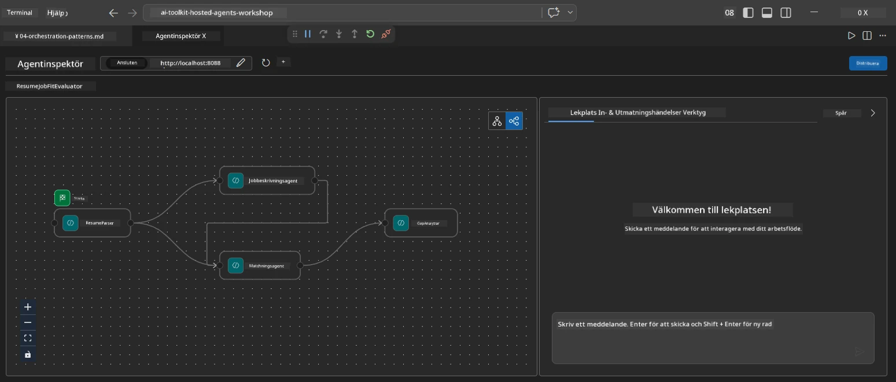
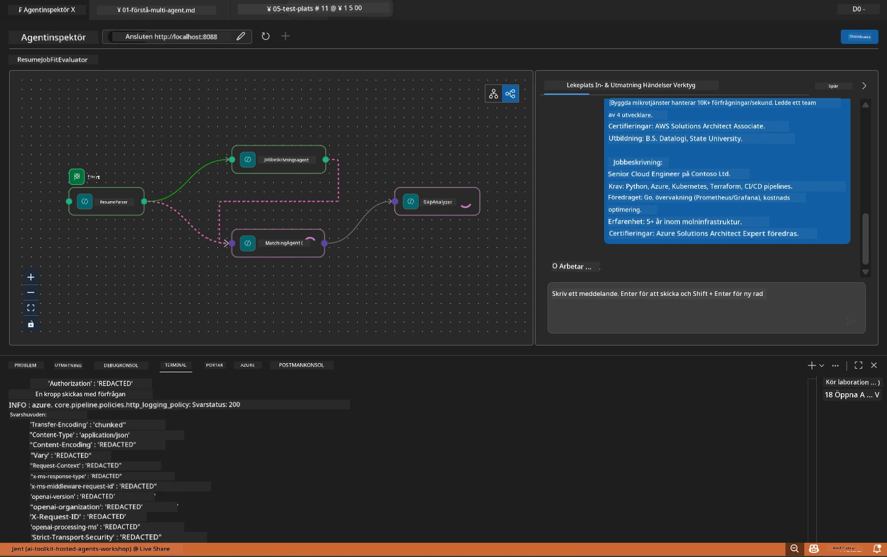
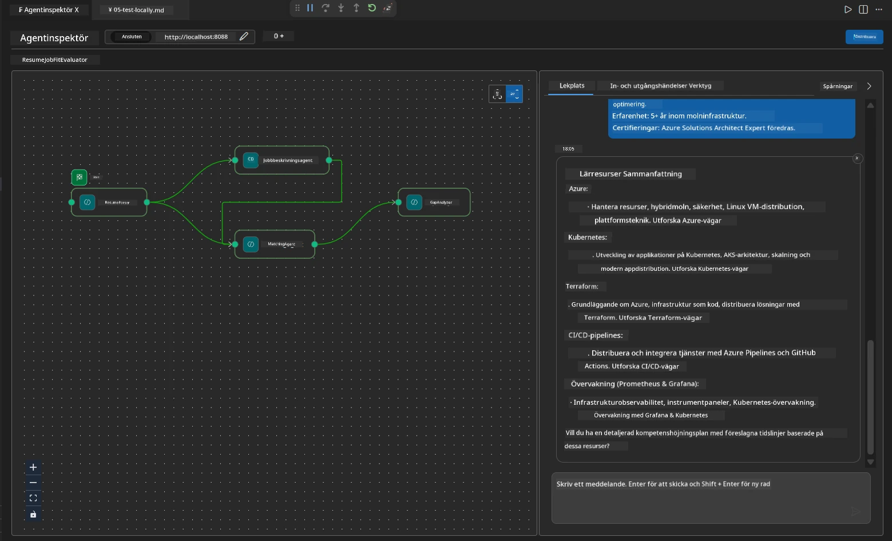

# Modul 5 - Testa lokalt

⏱️ ~15 min

I den här modulen kör du multiagent-flödet lokalt, testar det med Agent Inspector och verifierar att alla fyra agenter och MCP-verktyget fungerar korrekt innan du distribuerar.

---

## Steg 1: Starta agentservern

### Alternativ A: Använda VS Code-uppgift (rekommenderat)

1. Öppna `workshop/lab02-multi-agent/PersonalCareerCopilot/` som din VS Code-mapp.
2. Tryck `Ctrl+Shift+P` → skriv **Tasks: Run Task** → välj **Run Agent HTTP Server**.
3. Uppgiften startar servern med debugpy fäst på port `5679` och agenten på port `8088`.
4. Vänta tills utskriften visar:

```
INFO:resume-job-fit:Starting Resume -> Job Fit Evaluator HTTP server...
INFO:resume-job-fit:Server running on http://localhost:8088
```

### Alternativ B: Använda F5 (debugläge)

1. Tryck `F5` → välj **Debug Local Agent HTTP Server**.
2. Servern startar med full brytpunktsstöd – användbart för att inspektera MCP-svar eller agentutdata.

---

## Steg 2: Öppna Agent Inspector

1. Tryck `Ctrl+Shift+P` → skriv **Foundry Toolkit: Open Agent Inspector**.
2. Agent Inspector öppnas som en VS Code-panel ansluten till `http://localhost:8088`.
3. Du bör se agentgränssnittet redo att ta emot meddelanden.



> **Om Agent Inspector inte öppnas:** Se till att servern är helt startad (du ser loggen "Server running"). Om port 5679 är upptagen, se [Modul 8 - Felsökning](08-troubleshooting.md).

---

## Steg 2b: (Valfritt) Öppna Workflow Visualizer

Foundry Toolkit inkluderar en realtids-**Workflow Visualizer** som visar hur agenter samverkar medan grafen körs. Detta är särskilt användbart för multiagent-felsökning.

1. Tryck `Ctrl+Shift+P` → skriv **Foundry Toolkit: Open Visualizer for Hosted Agents**.
2. En ny flik i VS Code öppnas som visar den live körande grafen.
3. När du skickar meddelanden i Agent Inspector uppdateras visualizern automatiskt – gröna noder indikerar avslutade agenter och animerade kanter visar dataflöde mellan dem.

> **Portkonflikt:** Om visualizer-porten redan används, ändra den i VS Code-inställningar → **Extensions** → **Microsoft Foundry Configuration** → **Hosted Agents: Visualizer Port**.

---

## Steg 3: Kör röktester

Kör dessa tre tester i ordning. Varje test täcker successivt mer av arbetsflödet.

### Test 1: Grundläggande CV + jobbannons

Klistra in följande i Agent Inspector:

```
Resume:
Jane Doe
Senior Software Engineer with 5 years of experience in Python, Django, and AWS.
Built microservices handling 10K+ requests/second. Led a team of 4 developers.
Certifications: AWS Solutions Architect Associate.
Education: B.S. Computer Science, State University.

Job Description:
Senior Cloud Engineer at Contoso Ltd.
Required: Python, Azure, Kubernetes, Terraform, CI/CD pipelines.
Preferred: Go, monitoring (Prometheus/Grafana), cost optimization.
Experience: 5+ years in cloud infrastructure.
Certifications: Azure Solutions Architect Expert preferred.
```

**Förväntad utdata struktur:**

Svaret bör innehålla utdata från alla fyra agenter i sekvens:

1. **Resume Parser output** – Två märkta sektioner: `[PARSED RESUME]` (kandidatprofil med grupperade färdigheter) och `[JOB DESCRIPTION PASS-THROUGH]` (bokstavlig JD-text som matas till JD Agent)
2. **JD Agent output** – Strukturerade krav med separerade obligatoriska och önskade färdigheter
3. **Matching Agent output** – Passningspoäng (0-100) med fördelning, matchade färdigheter, saknade färdigheter, luckor
4. **Gap Analyzer output** – Individuella gapkort för varje saknad färdighet, var och en med Microsoft Learn-URL:er





### Vad att verifiera i Test 1

| Kontrollera | Förväntat | Godkänd? |
|-------|----------|-------|
| Svaret innehåller en passningspoäng | Nummer mellan 0-100 med fördelning | |
| Matchade färdigheter listas | Python, CI/CD (delvis), osv. | |
| Saknade färdigheter listas | Azure, Kubernetes, Terraform, osv. | |
| Gapkort finns för varje saknad färdighet | Ett kort per färdighet | |
| Microsoft Learn URL:er finns | Äkta `learn.microsoft.com`-länkar | |
| Inga felmeddelanden i svaret | Ren strukturerad utdata | |

### Test 2: Extremfall – kandidat med hög passning

Klistra in ett CV som matchar jobbannonsen väl för att verifiera att GapAnalyzer hanterar högpassningssituationer:

```
Resume:
Alex Chen
Senior Cloud Engineer with 7 years of experience.
Skills: Python, Azure (AKS, Functions, DevOps), Kubernetes, Terraform, CI/CD (GitHub Actions, Azure Pipelines), Go, Prometheus, Grafana, cost optimization.
Certifications: Azure Solutions Architect Expert, Azure DevOps Engineer Expert.
Led infrastructure migration to Azure for 3 enterprise clients.
Education: M.S. Computer Science, Tech University.

Job Description:
Senior Cloud Engineer at Contoso Ltd.
Required: Python, Azure, Kubernetes, Terraform, CI/CD pipelines.
Preferred: Go, monitoring (Prometheus/Grafana), cost optimization.
Experience: 5+ years in cloud infrastructure.
Certifications: Azure Solutions Architect Expert preferred.
```

**Förväntat beteende:**
- Passningspoängen bör vara **80+** (flertalet färdigheter matchar)
- Gapkort bör fokusera på finslipning/intervjuförberedelse snarare än grundläggande inlärning
- GapAnalyzer-instruktionerna säger: "Om passning >= 80, fokusera på finslipning/intervjuförberedelse"

---

## Steg 4: Testa med dina egna data (valfritt)

Prova att klistra in ditt eget CV och en verklig jobbannons. Detta hjälper till att verifiera:

- Att agenterna hanterar olika CV-format (kronologiskt, funktionellt, hybrid)
- Att JD Agent hanterar olika JD-stilar (punkter, stycken, strukturerat)
- Att MCP-verktyget återvänder relevanta resurser för verkliga färdigheter
- Att gapkorten är personanpassade för din specifika bakgrund

> **Integritet – Väg A (Foundry moln):** CV- och JD-text skickas till din Azure OpenAI-distribution för inferens. De loggas eller lagras inte av workshop-infrastrukturen. Använd platshållarnamn (t.ex. "Jane Doe") om du föredrar.
>
> **Integritet – Väg B (Foundry Lokal):** Alla fyra agentinferenser körs helt på din enhet. Ditt CV och jobbannons-text **lämnar aldrig din maskin**. Det enda utgående anropet är att MCP-verktyget hämtar resurser från `https://learn.microsoft.com/api/mcp`; den förfrågan innehåller endast färdighetsnamnet, inte dina personuppgifter.

---

### Kontrollpunkt

- [ ] Servern startade framgångsrikt på port `8088` (loggen visar "Server running")
- [ ] Agent Inspector öppnades och anslöts till agenten
- [ ] Test 1: Komplett svar med passningspoäng, matchade/saknade färdigheter, gapkort och Microsoft Learn URL:er
- [ ] Test 2: Kandidat med hög passning får poäng 80+ med finslipsfokuserade rekommendationer
- [ ] Alla gapkort är närvarande (ett per saknad färdighet, ingen avkortning)
- [ ] Inga fel eller stackspår i serverns terminal

---

**Föregående:** [04 - Orkestreringsmönster](04-orchestration-patterns.md) · **Nästa:** [06 - Distribuera till Foundry →](06-deploy-to-foundry.md)

---

<!-- CO-OP TRANSLATOR DISCLAIMER START -->
**Ansvarsfriskrivning**:
Detta dokument har översatts med hjälp av AI-översättningstjänsten [Co-op Translator](https://github.com/Azure/co-op-translator). Även om vi strävar efter noggrannhet, var vänlig notera att automatiska översättningar kan innehålla fel eller brister. Det ursprungliga dokumentet på dess modersmål bör betraktas som den auktoritativa källan. För kritisk information rekommenderas professionell mänsklig översättning. Vi ansvarar inte för några missförstånd eller feltolkningar som uppstår till följd av användningen av denna översättning.
<!-- CO-OP TRANSLATOR DISCLAIMER END -->