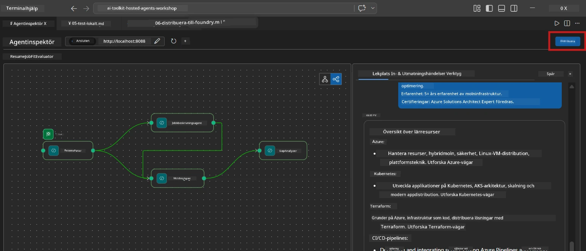
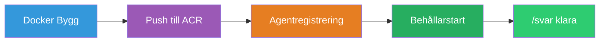
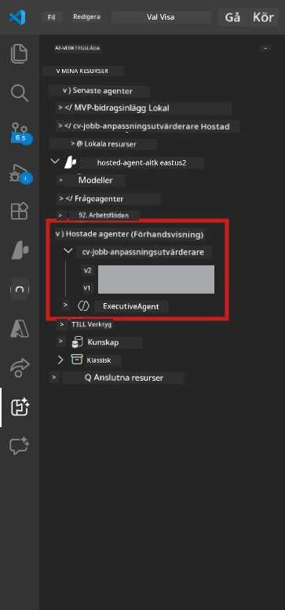

# Module 6 - Distribuera till Foundry Agent Service

I den här modulen distribuerar du ditt lokalt testade multi-agent-flöde till [Microsoft Foundry](https://learn.microsoft.com/azure/foundry/agents/concepts/hosted-agents) som en **Hosted Agent**. Distribueringsprocessen bygger en Docker-containerbild, pushar den till [Azure Container Registry (ACR)](https://learn.microsoft.com/azure/container-registry/container-registry-intro) och skapar en värdbaserad agentversion i [Foundry Agent Service](https://learn.microsoft.com/azure/foundry/agents/how-to/publish-agent).

> **Viktig skillnad från Lab 01:** Distribueringsprocessen är identisk. Foundry behandlar ditt multi-agent-flöde som en enda värddriven agent - komplexiteten finns inuti containern, men distributionsytan är samma `/responses`-endpoint.

---

## Kontroll av förutsättningar

Innan du distribuerar, verifiera alla nedanstående punkter:

1. **Agenten klarar lokala snabbtester:**
   - Du har genomfört alla 3 tester i [Modul 5](05-test-locally.md) och arbetsflödet genererade komplett utdata med gap cards och Microsoft Learn-URL:er.

2. **Du har rollen [Azure AI User](https://learn.microsoft.com/azure/foundry/concepts/rbac-foundry):**
   - Tilldelad i [Lab 01, Modul 2](../../lab01-single-agent/docs/02-create-foundry-project.md). Verifiera:
   - [Azure Portal](https://portal.azure.com) → din Foundry **project**-resurs → **Access control (IAM)** → **Role assignments** → bekräfta att **[Azure AI User](https://aka.ms/foundry-ext-project-role)** finns listad för ditt konto.

3. **Du är inloggad i Azure i VS Code:**
   - Kontrollera kontots ikon längst ned till vänster i VS Code. Ditt kontonamn ska vara synligt.

4. **`agent.yaml` har korrekta värden:**
   - Öppna `PersonalCareerCopilot/agent.yaml` och verifiera:
     ```yaml
     environment_variables:
       - name: PROJECT_ENDPOINT
         value: ${PROJECT_ENDPOINT}
       - name: MODEL_DEPLOYMENT_NAME
         value: ${MODEL_DEPLOYMENT_NAME}
     ```
   - Dessa måste matcha de miljövariabler som din `main.py` läser.

5. **`requirements.txt` har korrekta versioner:**
   ```
   agent-framework-azure-ai==1.0.0rc3
   agent-framework-core==1.0.0rc3
   azure-ai-agentserver-agentframework==1.0.0b16
   azure-ai-agentserver-core==1.0.0b16
   debugpy
   agent-dev-cli --pre
   ```

---

## Steg 1: Starta distributionen

### Alternativ A: Distribuera från Agent Inspector (rekommenderas)

Om agenten körs via F5 med Agent Inspector öppen:

1. Titta i **övre högra hörnet** av Agent Inspector-panelen.
2. Klicka på **Deploy**-knappen (molnikon med en uppåtpil ↑).
3. Distributionsguiden öppnas.



### Alternativ B: Distribuera från Command Palette

1. Tryck `Ctrl+Shift+P` för att öppna **Command Palette**.
2. Skriv: **Microsoft Foundry: Deploy Hosted Agent** och välj det.
3. Distributionsguiden öppnas.

---

## Steg 2: Konfigurera distributionen

### 2.1 Välj målprojekt

1. En dropdown visar dina Foundry-projekt.
2. Välj det projekt du använt under hela workshopen (t.ex., `workshop-agents`).

### 2.2 Välj containeragentfilen

1. Du kommer att uppmanas att välja agentens startpunkt.
2. Navigera till `workshop/lab02-multi-agent/PersonalCareerCopilot/` och välj **`main.py`**.

### 2.3 Konfigurera resurser

| Inställning | Rekommenderat värde | Noteringar |
|-------------|---------------------|------------|
| **CPU**    | `0.25`              | Standard. Multi-agent-flöden behöver inte mer CPU eftersom modellanrop är I/O-bundna |
| **Minne**   | `0.5Gi`             | Standard. Öka till `1Gi` om du lägger till stora datahanteringsverktyg |

---

## Steg 3: Bekräfta och distribuera

1. Guiden visar en sammanfattning av distributionen.
2. Granska och klicka på **Confirm and Deploy**.
3. Följ framstegen i VS Code.

### Vad som händer under distributionen

Följ VS Code **Output**-panelen (välj "Microsoft Foundry" i dropdownmenyn):


1. **Docker build** - Bygger containern från din `Dockerfile`:
   ```
   Step 1/6 : FROM python:3.14-slim
   Step 2/6 : WORKDIR /app
   ...
   Successfully built abc123def456
   ```

2. **Docker push** - Pushar bilden till ACR (1-3 minuter vid första distributionen).

3. **Agentregistrering** - Foundry skapar en värdbaserad agent med metadata från `agent.yaml`. Agentens namn är `resume-job-fit-evaluator`.

4. **Containerstart** - Containern startar i Foundrys hanterade infrastruktur med en systemhanterad identitet.

> **Första distributionen är långsammare** (Docker pushar alla lager). Efterföljande distributioner återanvänder cachade lager och går snabbare.

### Specifika anteckningar för multi-agent

- **Alla fyra agenter finns i en och samma container.** Foundry ser en enda värdbaserad agent. WorkflowBuilder-grafen körs internt.
- **MCP-anrop går utåt.** Containern behöver internetåtkomst för att nå `https://learn.microsoft.com/api/mcp`. Foundrys hanterade infrastruktur tillhandahåller detta som standard.
- **[Managed Identity](https://learn.microsoft.com/python/api/overview/azure/identity-readme#managed-identity-support).** I den värdbaserade miljön returnerar `get_credential()` i `main.py` `ManagedIdentityCredential()` (eftersom `MSI_ENDPOINT` är satt). Detta sker automatiskt.

---

## Steg 4: Verifiera distributionsstatus

1. Öppna **Microsoft Foundry**-sidopanelen (klicka på Foundry-ikonen i aktivitetsfältet).
2. Expandera **Hosted Agents (Preview)** under ditt projekt.
3. Hitta **resume-job-fit-evaluator** (eller ditt agentnamn).
4. Klicka på agentnamnet → expandera versionerna (t.ex., `v1`).
5. Klicka på versionen → kontrollera **Container Details** → **Status**:



| Status | Betydelse |
|--------|-----------|
| **Started** / **Running** | Containern körs, agenten är redo |
| **Pending** | Containern startar (vänta 30–60 sekunder) |
| **Failed** | Containern kunde inte starta (kolla loggar - se nedan) |

> **Multi-agent startar långsammare** än single-agent eftersom containern skapar 4 agentinstanser vid start. "Pending" i upp till 2 minuter är normalt.

---

## Vanliga distributionsfel och lösningar

### Fel 1: Permission denied - `agents/write`

```
Error: lacks the required data action 
Microsoft.CognitiveServices/accounts/AIServices/agents/write
```

**Lösning:** Tilldela rollen **[Azure AI User](https://learn.microsoft.com/azure/foundry/concepts/rbac-foundry)** på **projekt**-nivå. Se [Modul 8 - Felsökning](08-troubleshooting.md) för steg-för-steg instruktioner.

### Fel 2: Docker körs inte

```
Error: Docker build failed / Cannot connect to Docker daemon
```

**Lösning:**
1. Starta Docker Desktop.
2. Vänta tills "Docker Desktop is running".
3. Verifiera: `docker info`
4. **Windows:** Säkerställ att WSL 2-backend är aktiverad i Docker Desktop-inställningar.
5. Försök igen.

### Fel 3: pip install misslyckas under Docker build

```
Error: Could not find a version that satisfies the requirement agent-dev-cli
```

**Lösning:** `--pre` flaggan i `requirements.txt` hanteras annorlunda i Docker. Säkerställ att din `requirements.txt` innehåller:
```
agent-dev-cli --pre
```

Om Docker fortfarande misslyckas, skapa en `pip.conf` eller skicka `--pre` via en byggparameter. Se [Modul 8](08-troubleshooting.md).

### Fel 4: MCP-verktyget misslyckas i värdbaserad agent

Om Gap Analyzer slutar producera Microsoft Learn-URL:er efter distribution:

**Rotorsak:** Nätverkspolicy kan blockera utgående HTTPS från containern.

**Lösning:**
1. Detta är vanligtvis inget problem med Foundrys standardkonfiguration.
2. Om det inträffar, kontrollera om Foundry-projektets virtuella nätverk har en NSG som blockerar utgående HTTPS.
3. MCP-verktyget har inbyggda reserv-URL:er, så agenten kommer ändå producera utdata (utan live-URL:er).

---

### Checkpunkt

- [ ] Distributionskommandot slutfördes utan fel i VS Code
- [ ] Agenten syns under **Hosted Agents (Preview)** i Foundry sidopanel
- [ ] Agentnamnet är `resume-job-fit-evaluator` (eller ditt valda namn)
- [ ] Containerstatus visar **Started** eller **Running**
- [ ] (Om fel) Du identifierade felet, applicerade lösningen och distribuerade om framgångsrikt

---

**Föregående:** [05 - Testa lokalt](05-test-locally.md) · **Nästa:** [07 - Verifiera i Playground →](07-verify-in-playground.md)

---

<!-- CO-OP TRANSLATOR DISCLAIMER START -->
**Ansvarsfriskrivning**:  
Detta dokument har översatts med hjälp av AI-översättningstjänsten [Co-op Translator](https://github.com/Azure/co-op-translator). Även om vi strävar efter noggrannhet, vänligen observera att automatiska översättningar kan innehålla fel eller brister. Det ursprungliga dokumentet på originalspråket bör betraktas som den auktoritativa källan. För kritisk information rekommenderas professionell mänsklig översättning. Vi ansvarar inte för några missförstånd eller feltolkningar som uppstår vid användning av denna översättning.
<!-- CO-OP TRANSLATOR DISCLAIMER END -->