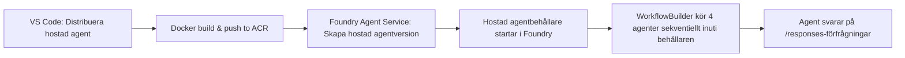
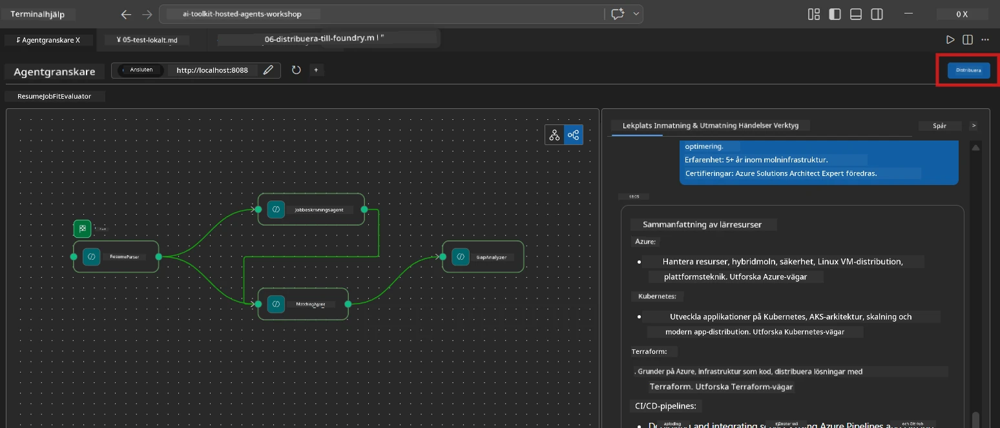
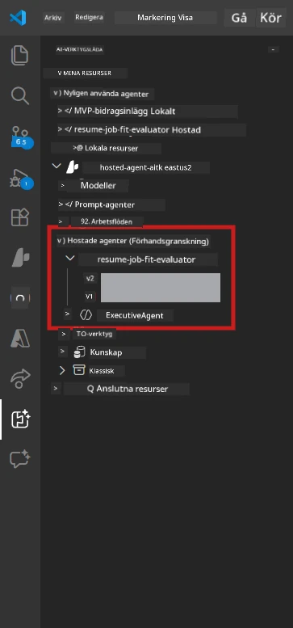

# Modul 6 - Distribuera till Foundry Agent Service

⏱️ ~10 min

I denna modul distribuerar du ditt lokalt testade multi-agent-flöde till [Microsoft Foundry](https://learn.microsoft.com/azure/foundry/agents/concepts/hosted-agents) som en **Hosted Agent**. Distribueringsprocessen bygger en Docker containerbild, pushar den till [Azure Container Registry (ACR)](https://learn.microsoft.com/azure/container-registry/container-registry-intro), och skapar en hosted agent-version i [Foundry Agent Service](https://learn.microsoft.com/azure/foundry/agents/how-to/publish-agent).

> **Viktig skillnad från Lab 01:** Distribueringsprocessen är identisk. Foundry behandlar ditt multi-agent-flöde som en enda hosted agent - komplexiteten är inuti containern, men distribueringsytan är samma `/responses` endpoint.

### Distribueringspipeline


```mermaid
flowchart LR
    A[VS Code: Distribuera hostad agent] --> B[Docker build & push to ACR]
    B --> C[Foundry Agent Service: Skapa hostad agentversion]
    C --> D[Hostad agentbehållare startar i Foundry]
    D --> E[WorkflowBuilder kör 4 agenter sekventiellt inuti behållaren]
    E --> F[Agent svarar på /responses-förfrågningar]
```

---

## Kontroll av förutsättningar

Innan du distribuerar, verifiera varje punkt nedan:

1. **Agenten klarar lokala röktester:**
   - Du slutförde alla 3 tester i [Modul 5](05-test-locally.md) och flödet producerade komplett output med gapkort och Microsoft Learn-URL:er.

2. **Du har rollen [Foundry User](https://learn.microsoft.com/azure/foundry/concepts/rbac-foundry)** (för att distribuera behöver du minst **Foundry Project Manager** på projekt nivå):

   > **Notera:** Foundry RBAC-rollerna har nyligen fått nya namn - **Foundry User**, **Foundry Owner**, och **Foundry Project Manager** hette tidigare Azure AI User, Azure AI Owner och Azure AI Project Manager. Roll-ID:n och behörigheter är oförändrade.

   - Verifiera i [Azure Portal](https://portal.azure.com) → din Foundry **projekt**-resurs → **Åtkomstkontroll (IAM)** → **Rolltilldelningar** → bekräfta att **Foundry User** (eller högre) är listad för ditt konto.

3. **Du är inloggad i Azure i VS Code:**
   - Kolla ikonen för Konton längst ner till vänster i VS Code. Ditt kontonamn bör vara synligt.

4. **`agent.yaml` har korrekta värden:**
   - Öppna `PersonalCareerCopilot/agent.yaml` och verifiera:
     ```yaml
     environment_variables:
       - name: AZURE_AI_MODEL_DEPLOYMENT_NAME
         value: ${AZURE_AI_MODEL_DEPLOYMENT_NAME}
     ```
   - `FOUNDRY_PROJECT_ENDPOINT` ska **inte** listas här - Foundry injicerar det vid körning. Endast `AZURE_AI_MODEL_DEPLOYMENT_NAME` behöver deklareras.

5. **`requirements.txt` har korrekta versioner:**
   ```
   agent-framework-foundry
   agent-framework-foundry-hosting
   mcp<2,>=1.24.0
   debugpy
   ```

---

## Steg 1: Starta distributionen

### Alternativ A: Distribuera från Agent Inspector (rekommenderat)

Om agenten körs via F5 med Agent Inspector öppen:

1. Titta i **övre högra hörnet** på Agent Inspector-panelen.
2. Klicka på **Deploy**-knappen (molnikon med en uppåtpil ↑).
3. Distributionsguiden öppnas.



### Alternativ B: Distribuera från kommando-paletten

1. Tryck `Ctrl+Shift+P` för att öppna **Command Palette**.
2. Skriv: **Foundry Toolkit: Deploy Hosted Agent** och välj det.
3. Distributionsguiden öppnas.

---

## Steg 2: Konfigurera distributionen

### 2.1 Välj målprojektet

1. En dropdown visar dina Foundry-projekt.
2. Välj det projekt du använde under hela workshopen (t.ex. `workshop-agents`).

### 2.2 Välj container-agentfilen

1. Du blir ombedd att välja agentens startpunkt.
2. Navigera till `workshop/lab02-multi-agent/PersonalCareerCopilot/` och välj **`main.py`**.

### 2.3 Konfigurera resurser

| Inställning | Rekommenderat värde | Anteckningar |
|---------|------------------|-------|
| **Distribueringsmetod** | **Container** (rekommenderat) eller **Kod** | Container bygger en Docker-bild; Kod laddar upp källkod som ZIP (förhandsgranskning) |
| **Container Registry** | **Standard ACR** | Foundry skapar och hanterar ett åt dig |
| **CPU** | `0.25` | Standard. Multi-agent-flöden behöver inte mer CPU eftersom modellanrop är I/O-bundna |
| **Minne** | `0.5Gi` | Standard. Öka till `1Gi` om du lägger till stora databehandlingsverktyg |

---

## Steg 3: Bekräfta och distribuera

1. Guiden visar en sammanfattning av distributionen.
2. Granska och klicka på **Confirm and Deploy**.
3. Följ framstegen i VS Code.

### Vad händer under distributionen

Titta på VS Code-panelen **Output** (välj "Microsoft Foundry" i dropdown):

1. **Docker build** - Bygger containern från din `Dockerfile`
   ```
   Step 1/6 : FROM python:3.12-slim
   Step 2/6 : WORKDIR /app
   ...
   Successfully built abc123def456
   ```

2. **Docker push** - Pushar bilden till ACR (1-3 minuter vid första distributionen).

3. **Agentregistrering** - Foundry skapar en hosted agent med metadatan i `agent.yaml`. Agentnamnet är `resume-job-fit-evaluator`.

4. **Container start** - Containern startar i Foundrys hanterade infrastruktur med en systemhanterad identitet.

> **Första distributionen är långsammare** (Docker pushar alla lager). Efterföljande distributioner återanvänder cachelagrade lager och går snabbare.

### Anteckningar specifika för multi-agent

- **Alla fyra agenter är i en och samma container.** Foundry ser en enda hosted agent. WorkflowBuilder-grafen körs internt.
- **MCP-anrop går utåt.** Containern behöver internetåtkomst för att nå `https://learn.microsoft.com/api/mcp`. Foundrys hanterade infrastruktur tillhandahåller detta som standard.
- **[Hantera identitet](https://learn.microsoft.com/azure/foundry/agents/concepts/agent-identity).** Foundry skapar automatiskt en **dedikerad Entra-identitet per agent** för varje Hosted agent vid distribuering. I hosted-miljön löser `DefaultAzureCredential` automatiskt ut till denna agentidentitet – ingen manuell konfiguration av hanterad identitet behövs.

---

## Steg 4: Verifiera distributionsstatus

1. Öppna **Microsoft Foundry** sidofält (klicka på Foundry-ikonen i aktivitetsfältet).
2. Expandera **Hosted Agents (Preview)** under ditt projekt.
3. Hitta **resume-job-fit-evaluator** (eller ditt agentnamn).
4. Klicka på agentnamnet → expandera versioner (t.ex. `v1`).
5. Klicka på versionen → kolla **Container Details** → **Status**:



| Status | Betydelse |
|--------|---------|
| **active** | Agenten kör och är redo att ta emot förfrågningar |
| **creating** | Containern startar (vänta 30–60 sekunder) |
| **failed** | Containern kunde inte starta (kolla loggar - se nedan) |

> **Notera:** VS Code sidofält kan visa etiketter som "Running" eller "Started" medan underliggande API-status använder `active`/`creating`. Båda indikerar samma tillstånd.

> **Multi-agent-start tar längre tid** än single-agent eftersom containern skapar 4 agentinstanser vid start. `creating` upp till 2 minuter är normalt.

---

## Vanliga distributionsfel och lösningar

### Fel 1: Behörighet nekad - `agents/write`

```
Error: lacks the required data action 
Microsoft.CognitiveServices/accounts/AIServices/agents/write
```

**Lösning:** Tilldela rollen **[Foundry User](https://learn.microsoft.com/azure/foundry/concepts/rbac-foundry)** (tidigare **Azure AI User**) på **projektnivå**. Se [Modul 8 - Felsökning](08-troubleshooting.md) för steg-för-steg-instruktioner.

### Fel 2: Docker körs inte

```
Error: Docker build failed / Cannot connect to Docker daemon
```

**Lösning:**
1. Starta Docker Desktop.
2. Vänta tills "Docker Desktop is running".
3. Verifiera: `docker info`
4. **Windows:** Säkerställ att WSL 2-backend är aktiverat i Docker Desktop-inställningar.
5. Försök igen.

### Fel 3: pip install misslyckas under Docker-build

```
Error: Could not find a version that satisfies the requirement agent-framework-foundry
```

**Lösning:** Kontrollera att `requirements.txt` matchar:
```
agent-framework-foundry
agent-framework-foundry-hosting
mcp<2,>=1.24.0
debugpy
```

Om bygget fortfarande misslyckas kan din Docker-nätverksmiljö blockera PyPI. Kolla `docker info` för proxyinställningar.

### Fel 4: MCP-verktyget misslyckas i hosted agent

Om Gap Analyzer slutar generera Microsoft Learn-URL:er efter distribution:

**Orsak:** Nätverkspolicy kan blockera utgående HTTPS från containern.

**Lösning:**
1. Detta är oftast inte ett problem med Foundrys standardkonfiguration.
2. Om det uppstår, kontrollera om Foundry-projektets virtuella nätverk har en NSG som blockerar utgående HTTPS.
3. MCP-verktyget har inbyggda reserv-URL:er, så agenten producerar ändå output (utan live-URL:er).

---

### Kontrollpunkt

- [ ] Distribueringskommandot slutfördes utan fel i VS Code
- [ ] Agenten syns under **Hosted Agents (Preview)** i Foundry sidofältet
- [ ] Agentnamnet är `resume-job-fit-evaluator` (eller ditt valda namn)
- [ ] Containerstatus visar **Started** eller **Running**
- [ ] (Om fel) Du identifierade felet, tillämpade lösningen och distribuerade om lyckat

---

**Föregående:** [05 - Testa lokalt](05-test-locally.md) · **Nästa:** [07 - Verifiera i Playground →](07-verify-in-playground.md)

---

<!-- CO-OP TRANSLATOR DISCLAIMER START -->
**Ansvarsfriskrivning**:
Detta dokument har översatts med hjälp av AI-översättningstjänsten [Co-op Translator](https://github.com/Azure/co-op-translator). Även om vi strävar efter noggrannhet, var vänlig notera att automatiska översättningar kan innehålla fel eller brister. Det ursprungliga dokumentet på dess modersmål bör betraktas som den auktoritativa källan. För kritisk information rekommenderas professionell mänsklig översättning. Vi ansvarar inte för några missförstånd eller feltolkningar som uppstår till följd av användningen av denna översättning.
<!-- CO-OP TRANSLATOR DISCLAIMER END -->