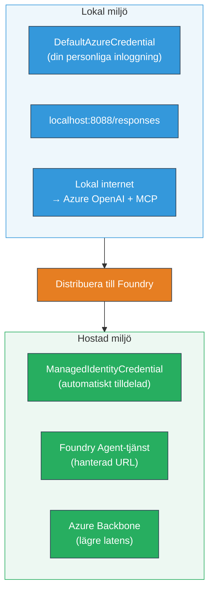

# Modul 7 - Verifiera i Playground

I denna modul testar du ditt distribuerade multi-agentflöde både i **VS Code** och **[Foundry Portal](https://ai.azure.com)**, och bekräftar att agenten beter sig identiskt som vid lokal testning.

---

## Varför verifiera efter distribution?

Ditt multi-agentflöde fungerade perfekt lokalt, så varför testa igen? Den hostade miljön skiljer sig på flera sätt:


| Skillnad | Lokalt | Hostat |
|-----------|-------|--------|
| **Identitet** | [`DefaultAzureCredential`](https://learn.microsoft.com/azure/developer/python/sdk/authentication/credential-chains#defaultazurecredential-overview) (din personliga inloggning) | [`ManagedIdentityCredential`](https://learn.microsoft.com/python/api/overview/azure/identity-readme#managed-identity-support) (auto-provisionerad) |
| **Endpoint** | `http://localhost:8088/responses` | [Foundry Agent Service](https://learn.microsoft.com/azure/foundry/agents/concepts/hosted-agents) endpoint (hanterad URL) |
| **Nätverk** | Lokal dator → Azure OpenAI + MCP utgående | Azure backbone (lägre latens mellan tjänster) |
| **MCP-konnektivitet** | Lokalt internet → `learn.microsoft.com/api/mcp` | Container utgående → `learn.microsoft.com/api/mcp` |

Om någon miljövariabel är felkonfigurerad, RBAC skiljer sig, eller MCP utgående är blockerat, upptäcker du det här.

---

## Alternativ A: Testa i VS Code Playground (rekommenderas först)

[Foundry-tillägget](https://marketplace.visualstudio.com/items?itemName=TeamsDevApp.vscode-ai-foundry) inkluderar en integrerad Playground som låter dig chatta med din distribuerade agent utan att lämna VS Code.

### Steg 1: Navigera till din hostade agent

1. Klicka på **Microsoft Foundry**-ikonen i VS Codes **Aktivitetsfält** (vänster sidofält) för att öppna Foundry-panelen.
2. Expandera ditt anslutna projekt (t.ex. `workshop-agents`).
3. Expandera **Hosted Agents (Preview)**.
4. Du bör se agentens namn (t.ex. `resume-job-fit-evaluator`).

### Steg 2: Välj en version

1. Klicka på agentens namn för att expandera dess versioner.
2. Klicka på den version du distribuerade (t.ex. `v1`).
3. En **detaljpanel** öppnas som visar containeruppgifter.
4. Verifiera att status är **Started** eller **Running**.

### Steg 3: Öppna Playground

1. I detaljpanelet, klicka på **Playground**-knappen (eller högerklicka på versionen → **Open in Playground**).
2. Ett chattgränssnitt öppnas i en VS Code-flik.

### Steg 4: Kör dina röktester

Använd samma 3 tester från [Modul 5](05-test-locally.md). Skriv varje meddelande i Playgrounds inmatningsfält och tryck på **Send** (eller **Enter**).

#### Test 1 - Fullständigt CV + JD (standardflöde)

Klistra in hela CV + JD-prompten från Modul 5, Test 1 (Jane Doe + Senior Cloud Engineer på Contoso Ltd).

**Förväntat:**
- Passningspoäng med matematisk nedbrytning (100-punkts skala)
- Matchede färdigheter sektion
- Saknade färdigheter sektion
- **Ett gap-kort per saknad färdighet** med Microsoft Learn-URL:er
- Lärandestig med tidslinje

#### Test 2 - Snabbt kort test (minimal input)

```
RESUME: 3 years Python developer, knows Django and PostgreSQL, no cloud experience.

JOB: Cloud DevOps Engineer requiring AWS, Kubernetes, Terraform, CI/CD. 5 years needed.
```

**Förväntat:**
- Lägre passningspoäng (< 40)
- Ärlig bedömning med planerad inlärningsväg
- Flera gap-kort (AWS, Kubernetes, Terraform, CI/CD, brist på erfarenhet)

#### Test 3 - Kandidat med hög passform

```
RESUME:
10 years Azure Cloud Architect. AZ-305 certified. Expert in AKS, Terraform, Azure DevOps, 
Azure Functions, Helm, Prometheus, Grafana, Python, Go. Led platform team of 8.

JOB:
Senior Cloud Engineer. Required: AKS, Terraform, Azure DevOps, Python. Preferred: Helm, Go.
5+ years experience. AZ-305 preferred.
```

**Förväntat:**
- Hög passningspoäng (≥ 80)
- Fokus på intervjuförberedelse och finslipning
- Få eller inga gap-kort
- Kort tidslinje med fokus på förberedelse

### Steg 5: Jämför med lokala resultat

Öppna dina anteckningar eller webbläsarflik från Modul 5 där du sparade lokala svar. För varje test:

- Har svaret **samma struktur** (passningspoäng, gap-kort, roadmap)?
- Följer det **samma poängsättningsschema** (100-punkts nedbrytning)?
- Finns **Microsoft Learn-URL:er** fortfarande i gap-korten?
- Är det **ett gap-kort per saknad färdighet** (inte trunkerat)?

> **Små skillnader i ordval är normala** - modellen är icke-deterministisk. Fokusera på struktur, konsekvent poängsättning och MCP-verktygsanvändning.

---

## Alternativ B: Testa i Foundry Portal

[Foundry Portal](https://ai.azure.com) erbjuder en webb-baserad playground som är användbar för delning med teammedlemmar eller intressenter.

### Steg 1: Öppna Foundry Portal

1. Öppna din webbläsare och gå till [https://ai.azure.com](https://ai.azure.com).
2. Logga in med samma Azure-konto som du har använt under hela workshopen.

### Steg 2: Navigera till projektet

1. På startsidan, leta efter **Recent projects** på vänster sidofält.
2. Klicka på ditt projektnamn (t.ex. `workshop-agents`).
3. Om du inte ser det, klicka på **All projects** och sök efter det.

### Steg 3: Hitta din distribuerade agent

1. I projektets vänstra navigering, klicka på **Build** → **Agents** (eller leta efter **Agents**-sektionen).
2. Du bör se en lista över agenter. Hitta din distribuerade agent (t.ex. `resume-job-fit-evaluator`).
3. Klicka på agentens namn för att öppna dess detaljsida.

### Steg 4: Öppna Playground

1. På agentens detaljsida, titta i den övre verktygsraden.
2. Klicka på **Open in playground** (eller **Try in playground**).
3. Ett chattgränssnitt öppnas.

### Steg 5: Kör samma röktester

Upprepa alla 3 tester från VS Code Playground-avsnittet ovan. Jämför varje svar med både lokala resultat (Modul 5) och VS Code Playground-resultat (Alternativ A ovan).

---

## Verifiering specifik för multi-agent

Utöver grundläggande korrekthet, verifiera dessa multi-agent-specifika beteenden:

### MCP-verktygsexekvering

| Kontroll | Hur verifiera | Godkännandevillkor |
|-------|---------------|----------------|
| MCP-anrop lyckas | Gap-kort innehåller `learn.microsoft.com` URL:er | Riktiga URL:er, inte reservmeddelanden |
| Flera MCP-anrop | Varje hög/medel-prioriterat gap har resurser | Inte bara det första gap-kortet |
| MCP fallback fungerar | Om URL:er saknas, kolla efter reservtext | Agenten producerar fortfarande gap-kort (med eller utan URL) |

### Agentkoordination

| Kontroll | Hur verifiera | Godkännandevillkor |
|-------|---------------|----------------|
| Alla 4 agenter kördes | Utdata innehåller passningspoäng OCH gap-kort | Poäng från MatchingAgent, kort från GapAnalyzer |
| Parallell utspridning | Responstid är rimlig (< 2 min) | Om > 3 min, parallell exekvering fungerar kanske inte |
| Dataintegritet | Gap-kort refererar färdigheter från matchningsrapporten | Inga hallucinerade färdigheter som inte finns i JD |

---

## Valideringsmatris

Använd denna matris för att utvärdera ditt multi-agentflödes hostade beteende:

| # | Kriterium | Godkännandevillkor | Godkänt? |
|---|----------|---------------|-------|
| 1 | **Funktionell korrekthet** | Agent svarar på CV + JD med passningspoäng och gap-analys | |
| 2 | **Poängsättningens konsekvens** | Passningspoäng använder 100-punkts skala med matematisk nedbrytning | |
| 3 | **Kompletthet av gap-kort** | Ett kort per saknad färdighet (inte trunkerat eller kombinerat) | |
| 4 | **MCP-verktygsintegration** | Gap-kort inkluderar riktiga Microsoft Learn-URL:er | |
| 5 | **Strukturell konsistens** | Utdata-strukturen matchar mellan lokal och hostad körning | |
| 6 | **Responstid** | Hostad agent svarar inom 2 minuter för full bedömning | |
| 7 | **Inga fel** | Inga HTTP 500-fel, timeout eller tomma svar | |

> Ett "godkänt" innebär att alla 7 kriterier är uppfyllda för alla 3 röktester i minst en playground (VS Code eller Portal).

---

## Felsökning av playground-problem

| Symptom | Trolig orsak | Åtgärd |
|---------|-------------|-----|
| Playground laddas inte | Containerstatus är inte "Started" | Gå tillbaka till [Modul 6](06-deploy-to-foundry.md), verifiera distributionsstatus. Vänta om "Pending" |
| Agent returnerar tomt svar | Modellens distributionsnamn matchar inte | Kontrollera `agent.yaml` → `environment_variables` → `MODEL_DEPLOYMENT_NAME` matchar din distribuerade modell |
| Agent returnerar felmeddelande | [RBAC](https://learn.microsoft.com/azure/foundry/concepts/rbac-foundry) behörighet saknas | Tilldela **[Azure AI User](https://aka.ms/foundry-ext-project-role)** på projektomfånget |
| Inga Microsoft Learn-URL:er i gap-kort | MCP utgående är blockerat eller MCP-server otillgänglig | Kontrollera om containern kan nå `learn.microsoft.com`. Se [Modul 8](08-troubleshooting.md) |
| Endast 1 gap-kort (trunkerat) | GapAnalyzer-instruktioner saknar "CRITICAL"-block | Granska [Modul 3, Steg 2.4](03-configure-agents.md) |
| Passningspoäng skiljer sig kraftigt från lokalt | Annan modell eller instruktioner distribuerade | Jämför `agent.yaml` env vars med lokal `.env`. Distribuera om vid behov |
| "Agent not found" i Portalen | Distributionen sprids fortfarande eller misslyckades | Vänta 2 minuter, uppdatera sidan. Om fortfarande saknas, distribuera om från [Modul 6](06-deploy-to-foundry.md) |

---

### Kontrollpunkt

- [ ] Testat agent i VS Code Playground - alla 3 röktester godkända
- [ ] Testat agent i [Foundry Portal](https://ai.azure.com) Playground - alla 3 röktester godkända
- [ ] Svaren är strukturellt konsekventa med lokal testning (passningspoäng, gap-kort, roadmap)
- [ ] Microsoft Learn-URL:er finns i gap-kort (MCP-verktyg fungerar i hostad miljö)
- [ ] Ett gap-kort per saknad färdighet (ingen trunkering)
- [ ] Inga fel eller timeout under testning
- [ ] Färdigställt valideringsmatris (alla 7 kriterier godkända)

---

**Föregående:** [06 - Deploy to Foundry](06-deploy-to-foundry.md) · **Nästa:** [08 - Troubleshooting →](08-troubleshooting.md)

---

<!-- CO-OP TRANSLATOR DISCLAIMER START -->
**Ansvarsfriskrivning**:
Detta dokument har översatts med hjälp av AI-översättningstjänsten [Co-op Translator](https://github.com/Azure/co-op-translator). Även om vi strävar efter noggrannhet, vänligen var medveten om att automatiska översättningar kan innehålla fel eller un准确igheter. Det ursprungliga dokumentet på dess modersmål bör betraktas som den auktoritativa källan. För kritisk information rekommenderas professionell mänsklig översättning. Vi ansvarar inte för några missförstånd eller feltolkningar som uppstår till följd av användningen av denna översättning.
<!-- CO-OP TRANSLATOR DISCLAIMER END -->