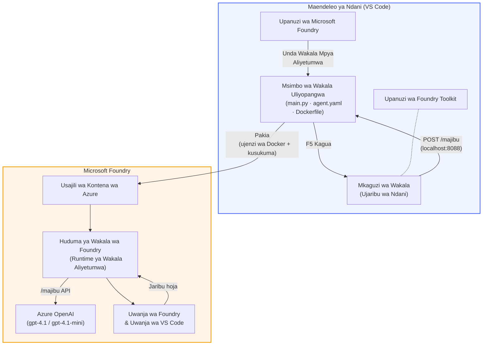

# Foundry Toolkit + Warsha ya Mawakala Wenyeji wa Foundry

[](https://www.python.org/)
[](https://github.com/microsoft/agents)
[](https://learn.microsoft.com/azure/ai-foundry/agents/concepts/hosted-agents/)
[](https://ai.azure.com/)
[](https://learn.microsoft.com/azure/ai-services/openai/)
[](https://learn.microsoft.com/cli/azure/install-azure-cli)
[](https://learn.microsoft.com/azure/developer/azure-developer-cli/install-azd)
[](https://www.docker.com/)
[](https://marketplace.visualstudio.com/items?itemName=ms-windows-ai-studio.windows-ai-studio)
[](LICENSE)

Jenga, jaribu, na sambaza mawakala wa AI kwa **Huduma ya Mwakala wa Microsoft Foundry** kama **Mawakala Wenyeji** - yote kutoka VS Code kwa kutumia **nyongeza ya Microsoft Foundry** na **Foundry Toolkit**.

> **Mawakala Wenyeji kwa sasa yako katika awamu ya maonyesho (preview).** Maeneo yanayounga mkono ni machache - ona [upatikanaji wa maeneo](https://learn.microsoft.com/azure/foundry/agents/concepts/hosted-agents#region-availability).

> Folda `agent/` ndani ya kila maabara huundwa **moja kwa moja** na nyongeza ya Foundry - kisha unaibadilisha msimbo, upime ndani ya eneo lako, na usambaze.

### 🌐 Usaidizi wa Lugha Nyingi

#### Unaungwa mkono kupitia Kitendo cha GitHub (Kifanyike moja kwa moja & Sahihi kila wakati)

<!-- CO-OP TRANSLATOR LANGUAGES TABLE START -->
[Arabic](../ar/README.md) | [Bengali](../bn/README.md) | [Bulgarian](../bg/README.md) | [Burmese (Myanmar)](../my/README.md) | [Chinese (Simplified)](../zh-CN/README.md) | [Chinese (Traditional, Hong Kong)](../zh-HK/README.md) | [Chinese (Traditional, Macau)](../zh-MO/README.md) | [Chinese (Traditional, Taiwan)](../zh-TW/README.md) | [Croatian](../hr/README.md) | [Czech](../cs/README.md) | [Danish](../da/README.md) | [Dutch](../nl/README.md) | [Estonian](../et/README.md) | [Finnish](../fi/README.md) | [French](../fr/README.md) | [German](../de/README.md) | [Greek](../el/README.md) | [Hebrew](../he/README.md) | [Hindi](../hi/README.md) | [Hungarian](../hu/README.md) | [Indonesian](../id/README.md) | [Italian](../it/README.md) | [Japanese](../ja/README.md) | [Kannada](../kn/README.md) | [Khmer](../km/README.md) | [Korean](../ko/README.md) | [Lithuanian](../lt/README.md) | [Malay](../ms/README.md) | [Malayalam](../ml/README.md) | [Marathi](../mr/README.md) | [Nepali](../ne/README.md) | [Nigerian Pidgin](../pcm/README.md) | [Norwegian](../no/README.md) | [Persian (Farsi)](../fa/README.md) | [Polish](../pl/README.md) | [Portuguese (Brazil)](../pt-BR/README.md) | [Portuguese (Portugal)](../pt-PT/README.md) | [Punjabi (Gurmukhi)](../pa/README.md) | [Romanian](../ro/README.md) | [Russian](../ru/README.md) | [Serbian (Cyrillic)](../sr/README.md) | [Slovak](../sk/README.md) | [Slovenian](../sl/README.md) | [Spanish](../es/README.md) | [Swahili](./README.md) | [Swedish](../sv/README.md) | [Tagalog (Filipino)](../tl/README.md) | [Tamil](../ta/README.md) | [Telugu](../te/README.md) | [Thai](../th/README.md) | [Turkish](../tr/README.md) | [Ukrainian](../uk/README.md) | [Urdu](../ur/README.md) | [Vietnamese](../vi/README.md)

> **Unapendelea Kukopa Kwenye Kompyuta Yako?**
>
> Hifadhi hii ina tafsiri za lugha 50+ ambazo huongeza sana ukubwa wa kupakua. Ili kopesha bila tafsiri, tumia sparse checkout:
>
> **Bash / macOS / Linux:**
> ```bash
> git clone --filter=blob:none --sparse https://github.com/microsoft-foundry/Foundry_Toolkit_for_VSCode_Lab.git
> cd Foundry_Toolkit_for_VSCode_Lab
> git sparse-checkout set --no-cone '/*' '!translations' '!translated_images'
> ```
>
> **CMD (Windows):**
> ```cmd
> git clone --filter=blob:none --sparse https://github.com/microsoft-foundry/Foundry_Toolkit_for_VSCode_Lab.git
> cd Foundry_Toolkit_for_VSCode_Lab
> git sparse-checkout set --no-cone "/*" "!translations" "!translated_images"
> ```
>
> Hii inakupa kila kitu unachohitaji kukamilisha kozi kwa upakuaji wa haraka zaidi.
<!-- CO-OP TRANSLATOR LANGUAGES TABLE END -->

---

## Mimarisho


**Mtiririko:** Nyongeza ya Foundry huunda mwakala → unaibadilisha msimbo & maagizo → jaribu ndani ya eneo lako kwa Agent Inspector → sambaza kwenye Foundry (picha ya Docker hutumwa ACR) → hakiki kwenye Playground.

---

## Kile utakachojenga

| Maabara | Maelezo | Hali |
|-----|-------------|--------|
| **Maabara 01 - Mwakala Mmoja** | Jenga **"Fafanua Kama Mimi ni Mtendaji" Mwakala**, jaribu ndani ya eneo lako, na sambaza kwenye Foundry | ✅ Inapatikana |
| **Maabara 02 - Mtiririko wa Mawakala Wengi** | Jenga **"Tathmini ya Resume → Ulinganifu wa Kazi"** - mawakala 4 wanafanya kazi pamoja kwa kutoa alama ya ulinganifu wa resume na kutengeneza ramani ya kujifunza | ✅ Inapatikana |

---

## Kutana na Mwakala Mtendaji

Katika warsha hii utajenga **"Fafanua Kama Mimi ni Mtendaji" Mwakala** - wakala wa AI ambaye hubadilisha istilahi za kiufundi ngumu na kuzitafsiri katika muhtasari tulivu unaotegemewa bungeni. Maana tukiri ukweli, hakuna mtu ndani ya ngazi ya uongozi anayetaka kusikia kuhusu "uchovu wa thread pool uliosababishwa na miito ya synchronous iliyotangazwa kwenye v3.2."

Niliunda wakala huyu baada ya matukio mingi ambapo maelezo yangu kamili ya tatizo yalijibiwa: *"Basi... tovuti haifanyi kazi au siyo?"*

### Inavyofanya kazi

Unamlisha taarifa za kiufundi. Anakutoa muhtasari wa mtendaji - vidokezo vitatu, hakuna istilahi ngumu, hakuna vidokezo vya makosa, hakuna wasiwasi mkubwa. Ni tu **kile kilichotokea**, **athari kwa biashara**, na **hatua inayofuata**.

### Uone akifanya kazi

**Unasema:**
> "Kuongezeka kwa ucheleweshaji wa API kulisababishwa na uchovu wa thread pool uliosababishwa na miito ya synchronous iliyotangazwa katika v3.2."

**Mwakala anajibu:**

> **Muhtasari wa Mtendaji:**
> - **Kile kilichotokea:** Baada ya toleo jipya, mfumo ulachelewa.
> - **Athari kwa biashara:** Watumiaji wengine walikumbwa na ucheleweshaji wakati wa kutumia huduma.
> - **Hatua inayofuata:** Mabadiliko yamerudishwa na utatuzi unafanywa kabla ya kusambazwa tena.

### Kwa nini wakala huyu?

Ni wakala rahisi sana, mwenye kazi moja - bora kwa kujifunza mtiririko wa wakala mwenyeji kutoka mwanzo hadi mwisho bila kuwa kwenye mkanganyiko wa zana tata. Na ukweli? Kila timu ya uhandisi ingeweza kutumia wakala kama huyu.

---

## Muundo wa warsha

```
📂 Foundry_Toolkit_for_VSCode_Lab/
├── 📄 README.md                      ← You are here
├── 📂 ExecutiveAgent/                ← Standalone hosted agent project
│   ├── agent.yaml
│   ├── Dockerfile
│   ├── main.py
│   └── requirements.txt
└── 📂 workshop/
    ├── 📂 lab01-single-agent/        ← Full lab: docs + agent code
    │   ├── README.md                 ← Hands-on lab instructions
    │   ├── 📂 docs/                  ← Step-by-step tutorial modules
    │   │   ├── 00-prerequisites.md
    │   │   ├── 01-install-foundry-toolkit.md
    │   │   ├── 02-create-foundry-project.md
    │   │   ├── 03-create-hosted-agent.md
    │   │   ├── 04-configure-and-code.md
    │   │   ├── 05-test-locally.md
    │   │   ├── 06-deploy-to-foundry.md
    │   │   ├── 07-verify-in-playground.md
    │   │   └── 08-troubleshooting.md
    │   └── 📂 agent/                 ← Reference solution (auto-scaffolded by Foundry extension)
    │       ├── agent.yaml
    │       ├── Dockerfile
    │       ├── main.py
    │       └── requirements.txt
    └── 📂 lab02-multi-agent/         ← Resume → Job Fit Evaluator
        ├── README.md                 ← Hands-on lab instructions (end-to-end)
        ├── 📂 docs/                  ← Step-by-step tutorial modules
        │   ├── 00-prerequisites.md
        │   ├── 01-understand-multi-agent.md
        │   ├── 02-scaffold-multi-agent.md
        │   ├── 03-configure-agents.md
        │   ├── 04-orchestration-patterns.md
        │   ├── 05-test-locally.md
        │   ├── 06-deploy-to-foundry.md
        │   ├── 07-verify-in-playground.md
        │   └── 08-troubleshooting.md
        └── 📂 PersonalCareerCopilot/ ← Reference solution (multi-agent workflow)
            ├── agent.yaml
            ├── Dockerfile
            ├── main.py
            └── requirements.txt
```

> **Kumbuka:** Folda `agent/` ndani ya kila maabara ndio ile **nyongeza ya Microsoft Foundry** huizalisha unapotekeleza `Microsoft Foundry: Create a New Hosted Agent` kutoka kwenye Command Palette. Faili husahihishwa kisha kwa maagizo, zana, na usanidi wa wakala wako. Maabara 01 inakuongoza kuunda hii kutoka mwanzo.

---

## Kuanzia

### 1. Nakili hifadhi hii

```bash
git clone https://github.com/microsoft-foundry/Foundry_Toolkit_for_VSCode_Lab.git
cd Foundry_Toolkit_for_VSCode_Lab
```

### 2. Tengeneza mazingira ya virtual ya Python

```bash
python -m venv venv
```

Izindue:

- **Windows (PowerShell):**
  ```powershell
  .\venv\Scripts\Activate.ps1
  ```
- **macOS / Linux:**
  ```bash
  source venv/bin/activate
  ```

### 3. Sakinisha mahitaji

```bash
pip install -r workshop/lab01-single-agent/agent/requirements.txt
```

### 4. Sanidi mabadiliko ya mazingira

Nakili faili mfano `.env` ndani ya folda ya wakala na jaza maadili yako:

```bash
cp workshop/lab01-single-agent/agent/.env.example workshop/lab01-single-agent/agent/.env
```

Hariri `workshop/lab01-single-agent/agent/.env`:

```env
AZURE_AI_PROJECT_ENDPOINT=https://<your-account>.services.ai.azure.com/api/projects/<your-project>
MODEL_DEPLOYMENT_NAME=<your-model-deployment-name>
```

### 5. Fuata maabara za warsha

Kila maabara ni ya kujitegemea na moduli zake. Anza na **Maabara 01** kujifunza misingi, kisha endelea na **Maabara 02** kwa mtiririko wa mawakala wengi.

#### Maabara 01 - Mwakala Mmoja ([maelekezo kamili](workshop/lab01-single-agent/README.md))

| # | Moduli | Kiungo |
|---|--------|------|
| 1 | Soma mahitaji ya awali | [00-prerequisites.md](workshop/lab01-single-agent/docs/00-prerequisites.md) |
| 2 | Sakinisha Foundry Toolkit & nyongeza ya Foundry | [01-install-foundry-toolkit.md](workshop/lab01-single-agent/docs/01-install-foundry-toolkit.md) |
| 3 | Unda mradi wa Foundry | [02-create-foundry-project.md](workshop/lab01-single-agent/docs/02-create-foundry-project.md) |
| 4 | Unda mwakala mwenyeji | [03-create-hosted-agent.md](workshop/lab01-single-agent/docs/03-create-hosted-agent.md) |
| 5 | Sanidi maagizo & mazingira | [04-configure-and-code.md](workshop/lab01-single-agent/docs/04-configure-and-code.md) |
| 6 | Jaribu ndani ya eneo lako | [05-test-locally.md](workshop/lab01-single-agent/docs/05-test-locally.md) |
| 7 | Sambaza kwenye Foundry | [06-deploy-to-foundry.md](workshop/lab01-single-agent/docs/06-deploy-to-foundry.md) |
| 8 | Hakiki kwenye playground | [07-verify-in-playground.md](workshop/lab01-single-agent/docs/07-verify-in-playground.md) |
| 9 | Kutatuza matatizo | [08-troubleshooting.md](workshop/lab01-single-agent/docs/08-troubleshooting.md) |

#### Maabara 02 - Mtiririko wa Mawakala Wengi ([maelekezo kamili](workshop/lab02-multi-agent/README.md))

| # | Moduli | Kiungo |
|---|--------|------|
| 1 | Mahitaji ya awali (Maabara 02) | [00-prerequisites.md](workshop/lab02-multi-agent/docs/00-prerequisites.md) |
| 2 | Elewa usanifu wa mawakala wengi | [01-understand-multi-agent.md](workshop/lab02-multi-agent/docs/01-understand-multi-agent.md) |
| 3 | Unda mradi wa mawakala wengi | [02-scaffold-multi-agent.md](workshop/lab02-multi-agent/docs/02-scaffold-multi-agent.md) |
| 4 | Sanidi mawakala & mazingira | [03-configure-agents.md](workshop/lab02-multi-agent/docs/03-configure-agents.md) |
| 5 | Mifumo ya upangaji | [04-orchestration-patterns.md](workshop/lab02-multi-agent/docs/04-orchestration-patterns.md) |
| 6 | Jaribu ndani ya eneo lako (mawakala wengi) | [05-test-locally.md](workshop/lab02-multi-agent/docs/05-test-locally.md) |
| 7 | Weka kwenye Foundry | [06-deploy-to-foundry.md](workshop/lab02-multi-agent/docs/06-deploy-to-foundry.md) |
| 8 | Thibitisha kwenye uwanja wa michezo | [07-verify-in-playground.md](workshop/lab02-multi-agent/docs/07-verify-in-playground.md) |
| 9 | Utatuzi wa matatizo (wakala wengi) | [08-troubleshooting.md](workshop/lab02-multi-agent/docs/08-troubleshooting.md) |

---

## Msimamizi

<table>
<tr>
    <td align="center"><a href="https://github.com/ShivamGoyal03">
        <br />
        <sub><b>Shivam Goyal</b></sub>
    </a><br />
    </td>
</tr>
</table>

---

## Ruhusa zinazohitajika (marejeleo ya haraka)

| Hali | Nafasi zinazohitajika |
|----------|---------------|
| Unda mradi mpya wa Foundry | **Azure AI Owner** kwenye rasilimali ya Foundry |
| Weka kwenye mradi uliopo (rasilimali mpya) | **Azure AI Owner** + **Contributor** kwenye usajili |
| Weka kwenye mradi uliopangwa kikamilifu | **Reader** kwenye akaunti + **Azure AI User** kwenye mradi |

> **Muhimu:** Nafasi za Azure `Owner` na `Contributor` ni pamoja na ruhusa za *usimamizi* tu, si ruhusa za *maendeleo* (hatua za data). Unahitaji **Azure AI User** au **Azure AI Owner** kuunda na kuweka mawakala.

---

## Marejeleo

- [Anza haraka: Weka wakala wako wa kwanza mwenye mwenyeji (VS Code)](https://learn.microsoft.com/azure/foundry/agents/quickstarts/quickstart-hosted-agent)
- [Nini maana ya mawakala wenye mwenyeji?](https://learn.microsoft.com/azure/foundry/agents/concepts/hosted-agents)
- [Unda shughuli za wakala wenye mwenyeji katika VS Code](https://learn.microsoft.com/azure/foundry/agents/how-to/vs-code-agents-workflow-pro-code)
- [Weka wakala mwenye mwenyeji](https://learn.microsoft.com/azure/foundry/agents/how-to/deploy-hosted-agent)
- [RBAC kwa Microsoft Foundry](https://learn.microsoft.com/azure/foundry/concepts/rbac-foundry)
- [Mfano wa Wakaguzi wa Miundo wa Mawakala](https://github.com/Azure-Samples/agent-architecture-review-sample) - Wakala halisi mwenye mwenyeji na zana za MCP, michoro ya Excalidraw, na uwekaji mara mbili

---


## Leseni

[MIT](../../LICENSE)

---

<!-- CO-OP TRANSLATOR DISCLAIMER START -->
**Kumbusho**:  
Hati hii imetafsiriwa kwa kutumia huduma ya tafsiri ya AI [Co-op Translator](https://github.com/Azure/co-op-translator). Ingawa tunajitahidi kwa usahihi, tafadhali fahamu kwamba tafsiri za moja kwa moja zinaweza kuwa na makosa au upungufu wa usahihi. Hati ya asili katika lugha yake ya asili inapaswa kuzingatiwa kama chanzo cha mamlaka. Kwa taarifa muhimu, tafsiri ya kitaalamu ya binadamu inapendekezwa. Hatuna dhamana kwa kutoelewana au tafsiri potofu zitakazotokea kutoka kwa matumizi ya tafsiri hii.
<!-- CO-OP TRANSLATOR DISCLAIMER END -->