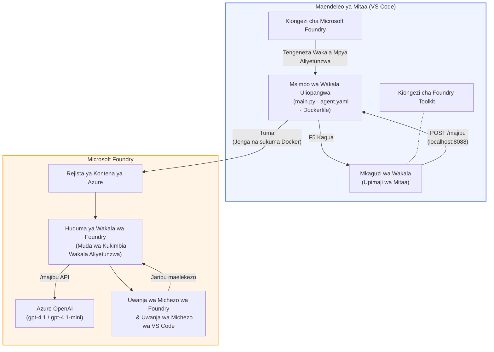

# Foundry Toolkit + Warsha ya Maajenti walioandaliwa na Foundry

[](https://www.python.org/)
[](https://github.com/microsoft/agents)
[](https://learn.microsoft.com/azure/ai-foundry/agents/concepts/hosted-agents/)
[](https://ai.azure.com/)
[](https://learn.microsoft.com/azure/ai-services/openai/)
[](https://learn.microsoft.com/cli/azure/install-azure-cli)
[](https://learn.microsoft.com/azure/developer/azure-developer-cli/install-azd)
[](https://www.docker.com/)
[](https://marketplace.visualstudio.com/items?itemName=ms-windows-ai-studio.windows-ai-studio)
[](LICENSE)

Jenga, jaribu, na tuma maajenti wa AI kwa **Huduma ya Maajenti ya Microsoft Foundry** kama **Maajenti Waliotangazwa** - yote kupitia VS Code ukiwa unatumia **ongeza la Microsoft Foundry** na **Foundry Toolkit**.

> **Maajenti Waliotangazwa kwa sasa yapo katika toleo la mtihani.** Eneo zilizokubalika ni chache - angalia [upatikanaji wa eneo](https://learn.microsoft.com/azure/foundry/agents/concepts/hosted-agents#region-availability).

> Folda ya `agent/` ndani ya kila kazi ni **imeundwa kiatomati** na kuongeza la Foundry - kisha badilisha msimbo, jaribu ndani, na tuma.

<!-- CO-OP TRANSLATOR LANGUAGES TABLE START -->
[Arabic](../ar/README.md) | [Bengali](../bn/README.md) | [Bulgarian](../bg/README.md) | [Burmese (Myanmar)](../my/README.md) | [Chinese (Simplified)](../zh-CN/README.md) | [Chinese (Traditional, Hong Kong)](../zh-HK/README.md) | [Chinese (Traditional, Macau)](../zh-MO/README.md) | [Chinese (Traditional, Taiwan)](../zh-TW/README.md) | [Croatian](../hr/README.md) | [Czech](../cs/README.md) | [Danish](../da/README.md) | [Dutch](../nl/README.md) | [Estonian](../et/README.md) | [Finnish](../fi/README.md) | [French](../fr/README.md) | [German](../de/README.md) | [Greek](../el/README.md) | [Hebrew](../he/README.md) | [Hindi](../hi/README.md) | [Hungarian](../hu/README.md) | [Indonesian](../id/README.md) | [Italian](../it/README.md) | [Japanese](../ja/README.md) | [Kannada](../kn/README.md) | [Khmer](../km/README.md) | [Korean](../ko/README.md) | [Lithuanian](../lt/README.md) | [Malay](../ms/README.md) | [Malayalam](../ml/README.md) | [Marathi](../mr/README.md) | [Nepali](../ne/README.md) | [Nigerian Pidgin](../pcm/README.md) | [Norwegian](../no/README.md) | [Persian (Farsi)](../fa/README.md) | [Polish](../pl/README.md) | [Portuguese (Brazil)](../pt-BR/README.md) | [Portuguese (Portugal)](../pt-PT/README.md) | [Punjabi (Gurmukhi)](../pa/README.md) | [Romanian](../ro/README.md) | [Russian](../ru/README.md) | [Serbian (Cyrillic)](../sr/README.md) | [Slovak](../sk/README.md) | [Slovenian](../sl/README.md) | [Spanish](../es/README.md) | [Swahili](./README.md) | [Swedish](../sv/README.md) | [Tagalog (Filipino)](../tl/README.md) | [Tamil](../ta/README.md) | [Telugu](../te/README.md) | [Thai](../th/README.md) | [Turkish](../tr/README.md) | [Ukrainian](../uk/README.md) | [Urdu](../ur/README.md) | [Vietnamese](../vi/README.md)

> **Ungependa Kufanya Nakala Mbali na Kompyuta Yako?**
>
> Hifadhi hii ina tafsiri za lugha zaidi ya 50 ambazo huongeza ukubwa wa kupakua. Ili kunakili bila tafsiri, tumia sparse checkout:
>
> **Bash / macOS / Linux:**
> ```bash
> git clone --filter=blob:none --sparse https://github.com/microsoft-foundry/Foundry_Toolkit_for_VSCode_Lab.git
> cd Foundry_Toolkit_for_VSCode_Lab
> git sparse-checkout set --no-cone '/*' '!translations' '!translated_images'
> ```
>
> **CMD (Windows):**
> ```cmd
> git clone --filter=blob:none --sparse https://github.com/microsoft-foundry/Foundry_Toolkit_for_VSCode_Lab.git
> cd Foundry_Toolkit_for_VSCode_Lab
> git sparse-checkout set --no-cone "/*" "!translations" "!translated_images"
> ```
>
> Hii inakupa kila kitu unachohitaji kukamilisha kozi kwa upakuaji wa kasi zaidi.
<!-- CO-OP TRANSLATOR LANGUAGES TABLE END -->

---

## Mimarisho


**Mtiririko:** Ongeza la Foundry huunda muundo wa ajenti → wewe ubadilishe msimbo & maelekezo → jaribu ndani na Agent Inspector → tuma kwa Foundry (picha ya Docker itumwa kwa ACR) → hakiki katika Playground.

---

## Unachojenga

| Kifundi | Maelezo | Hali |
|---------|----------|------|
| **Kifundi 01 - Ajenti Mmoja** | Jenga **"Elezea Kama Mimi Ni Mkuu" Ajenti**, jaribu ndani, na tuma kwa Foundry | ✅ Inapatikana |
| **Kifundi 02 - Mtiririko wa Maajenti Wengi** | Jenga **"Mrekebishaji wa Wasifu → Uendeshaji Kazi"** - maajenti 4 hushirikiana kupata alama ya mrekebishaji na kuzalisha ramani ya kujifunza | ✅ Inapatikana |

---

## Kutana na Ajenti Mkuu

Katika warsha hii utajenga **"Elezea Kama Mimi Ni Mkuu" Ajenti** - ajenti wa AI anayeweza kuchukua lugha tata za kiufundi na kuzitafsiri kuwa muhtasari tulivu, unaofaa kwa mikutano ya bodi. Kwa kweli, hakuna mtu aliyepo kwenye hadhi ya juu anayetaka kusikia kuhusu "kuchoka kwa thread pool kwa sababu ya miito ya synchronous iliyotangazwa katika v3.2."

Nimemjengea ajenti huyu baada ya matukio mengi ambapo taarifa yangu iliyorekebishwa vizuri ilipokelewa kwa jibu: *"Basi... tovuti iko chini au haiko?"*

### Inavyofanya kazi

Unampa taarifa ya kiufundi. Aanza kutoa muhtasari wa mkuu - vidokezo vitatu, bila lugha tata, bila methali za stack, bila hofu ya kimsingi. Ni kuhusu **kilichotokea**, **athari za biashara**, na **hatua inayofuata**.

### Uone inavyofanya kazi

**Unasema:**
> "Muda wa majibu wa API uliongezeka kutokana na kuchoka kwa thread pool uliosababishwa na miito ya synchronous iliyotangazwa katika v3.2."

**Ajenti anajibu:**

> **Muhtasari wa Mkuu:**
> - **Kilichotokea:** Baada ya toleo jipya, mfumo ulichelewa.
> - **Athari za biashara:** Wengine walikumbwa na kucheleweshwa kwa huduma.
> - **Hatua inayofuata:** Mabadiliko yamerejeshwa nyuma na marekebisho yanatayarishwa kabla ya kusambazwa tena.

### Kwa nini ajenti huyu?

Ni ajenti rahisi kabisa, wa kazi moja - bora kwa kujifunza mtiririko wa ajenti waliotangazwa kutoka mwanzo hadi mwisho bila kuchanganyikiwa na zana tata. Na kwa kweli? Kila timu ya uhandisi inaweza kutumia ajenti kama huyu.

---

## Muundo wa warsha

```
📂 Foundry_Toolkit_for_VSCode_Lab/
├── 📄 README.md                      ← You are here
├── 📂 ExecutiveAgent/                ← Standalone hosted agent project
│   ├── agent.yaml
│   ├── Dockerfile
│   ├── main.py
│   └── requirements.txt
└── 📂 workshop/
    ├── 📂 lab01-single-agent/        ← Full lab: docs + agent code
    │   ├── README.md                 ← Hands-on lab instructions
    │   ├── 📂 docs/                  ← Step-by-step tutorial modules
    │   │   ├── 00-prerequisites.md
    │   │   ├── 01-install-foundry-toolkit.md
    │   │   ├── 02-create-foundry-project.md
    │   │   ├── 03-create-hosted-agent.md
    │   │   ├── 04-configure-and-code.md
    │   │   ├── 05-test-locally.md
    │   │   ├── 06-deploy-to-foundry.md
    │   │   ├── 07-verify-in-playground.md
    │   │   └── 08-troubleshooting.md
    │   └── 📂 agent/                 ← Reference solution (auto-scaffolded by Foundry extension)
    │       ├── agent.yaml
    │       ├── Dockerfile
    │       ├── main.py
    │       └── requirements.txt
    └── 📂 lab02-multi-agent/         ← Resume → Job Fit Evaluator
        ├── README.md                 ← Hands-on lab instructions (end-to-end)
        ├── 📂 docs/                  ← Step-by-step tutorial modules
        │   ├── 00-prerequisites.md
        │   ├── 01-understand-multi-agent.md
        │   ├── 02-scaffold-multi-agent.md
        │   ├── 03-configure-agents.md
        │   ├── 04-orchestration-patterns.md
        │   ├── 05-test-locally.md
        │   ├── 06-deploy-to-foundry.md
        │   ├── 07-verify-in-playground.md
        │   └── 08-troubleshooting.md
        └── 📂 PersonalCareerCopilot/ ← Reference solution (multi-agent workflow)
            ├── agent.yaml
            ├── Dockerfile
            ├── main.py
            └── requirements.txt
```

> **Kumbuka:** Folda ya `agent/` ndani ya kila kazi ni kile **ongeza la Microsoft Foundry** linalotengeneza wakati unapotumia `Microsoft Foundry: Create a New Hosted Agent` kutoka Command Palette. Faili hubadilishwa kisha na maagizo, zana, na usanidi wa ajenti yako. Kazi 01 inakuongoza jinsi ya kuunda hii kutoka mwanzo.

---

## Kuanzia

### 1. Nakili hifadhi (repository)

```bash
git clone https://github.com/microsoft-foundry/Foundry_Toolkit_for_VSCode_Lab.git
cd Foundry_Toolkit_for_VSCode_Lab
```

### 2. Tengeneza mazingira ya Python ya virtual

```bash
python -m venv venv
```

Iwasha:

- **Windows (PowerShell):**
  ```powershell
  .\venv\Scripts\Activate.ps1
  ```
- **macOS / Linux:**
  ```bash
  source venv/bin/activate
  ```

### 3. Sakinisha utegemezi

```bash
pip install -r workshop/lab01-single-agent/agent/requirements.txt
```

### 4. Sanidi mabadiliko ya mazingira

Nakili mfano wa faili `.env` ndani ya folda ya ajenti na ujaze thamani zako:

```bash
cp workshop/lab01-single-agent/agent/.env.example workshop/lab01-single-agent/agent/.env
```

Hariri `workshop/lab01-single-agent/agent/.env`:

```env
AZURE_AI_PROJECT_ENDPOINT=https://<your-account>.services.ai.azure.com/api/projects/<your-project>
MODEL_DEPLOYMENT_NAME=<your-model-deployment-name>
```

### 5. Fuata mafunzo ya warsha

Kila kazi ni huru na ina moduli zake. Anza na **Kifundi 01** kujifunza misingi, kisha endelea na **Kifundi 02** kwa mtiririko wa maajenti wengi.

#### Kifundi 01 - Ajenti Mmoja ([uelekevu kamili](workshop/lab01-single-agent/README.md))

| # | Moduli | Kiungo |
|---|--------|--------|
| 1 | Soma mahitaji ya awali | [00-prerequisites.md](workshop/lab01-single-agent/docs/00-prerequisites.md) |
| 2 | Sakinisha Foundry Toolkit & kuongeza la Foundry | [01-install-foundry-toolkit.md](workshop/lab01-single-agent/docs/01-install-foundry-toolkit.md) |
| 3 | Unda mradi wa Foundry | [02-create-foundry-project.md](workshop/lab01-single-agent/docs/02-create-foundry-project.md) |
| 4 | Unda ajenti aliyeandaliwa | [03-create-hosted-agent.md](workshop/lab01-single-agent/docs/03-create-hosted-agent.md) |
| 5 | Sanidi maagizo & mazingira | [04-configure-and-code.md](workshop/lab01-single-agent/docs/04-configure-and-code.md) |
| 6 | Jaribu ndani | [05-test-locally.md](workshop/lab01-single-agent/docs/05-test-locally.md) |
| 7 | Tuma kwa Foundry | [06-deploy-to-foundry.md](workshop/lab01-single-agent/docs/06-deploy-to-foundry.md) |
| 8 | Hakiki kwenye playground | [07-verify-in-playground.md](workshop/lab01-single-agent/docs/07-verify-in-playground.md) |
| 9 | Utatuzi wa matatizo | [08-troubleshooting.md](workshop/lab01-single-agent/docs/08-troubleshooting.md) |

#### Kifundi 02 - Mtiririko wa Maajenti Wengi ([uelekevu kamili](workshop/lab02-multi-agent/README.md))

| # | Moduli | Kiungo |
|---|--------|--------|
| 1 | Mahitaji ya awali (Kifundi 02) | [00-prerequisites.md](workshop/lab02-multi-agent/docs/00-prerequisites.md) |
| 2 | Elewa muundo wa maajenti wengi | [01-understand-multi-agent.md](workshop/lab02-multi-agent/docs/01-understand-multi-agent.md) |
| 3 | Unda mradi wa maajenti wengi | [02-scaffold-multi-agent.md](workshop/lab02-multi-agent/docs/02-scaffold-multi-agent.md) |
| 4 | Sanidi maajenti & mazingira | [03-configure-agents.md](workshop/lab02-multi-agent/docs/03-configure-agents.md) |
| 5 | Mitindo ya kupanga kazi | [04-orchestration-patterns.md](workshop/lab02-multi-agent/docs/04-orchestration-patterns.md) |
| 6 | Jaribu ndani (maajenti wengi) | [05-test-locally.md](workshop/lab02-multi-agent/docs/05-test-locally.md) |
| 7 | Sambaza kwa Foundry | [06-deploy-to-foundry.md](workshop/lab02-multi-agent/docs/06-deploy-to-foundry.md) |
| 8 | Thibitisha kwenye uwanja wa michezo | [07-verify-in-playground.md](workshop/lab02-multi-agent/docs/07-verify-in-playground.md) |
| 9 | Utatuzi wa matatizo (wakala wengi) | [08-troubleshooting.md](workshop/lab02-multi-agent/docs/08-troubleshooting.md) |

---

## Msimamizi

<table>
<tr>
    <td align="center"><a href="https://github.com/ShivamGoyal03">
        <br />
        <sub><b>Shivam Goyal</b></sub>
    </a><br />
    </td>
</tr>
</table>

---

## Ruhusa zinazohitajika (marejeo ya haraka)

| Hali | Nafasi zinazohitajika |
|----------|---------------|
| Unda mradi mpya wa Foundry | **Azure AI Owner** kwenye rasilimali ya Foundry |
| Sambaza kwenye mradi uliopo (rasilimali mpya) | **Azure AI Owner** + **Contributor** kwenye usajili |
| Sambaza kwenye mradi uliofungwa kikamilifu | **Reader** kwenye akaunti + **Azure AI User** kwenye mradi |

> **Muhimu:** Nafasi za Azure `Owner` na `Contributor` zinajumuisha ruhusa za *usimamizi* tu, si ruhusa za *maendeleo* (kitendo cha data). Unahitaji **Azure AI User** au **Azure AI Owner** kujenga na kusambaza mawakala.

---

## Marejeo

- [Mwanzo wa haraka: Sambaza wakala wako wa kwanza mwenye mwenyeji (VS Code)](https://learn.microsoft.com/azure/foundry/agents/quickstarts/quickstart-hosted-agent)
- [Mawakala wenye mwenyeji ni nini?](https://learn.microsoft.com/azure/foundry/agents/concepts/hosted-agents)
- [Unda mtiririko wa kazi wa wakala mwenye mwenyeji katika VS Code](https://learn.microsoft.com/azure/foundry/agents/how-to/vs-code-agents-workflow-pro-code)
- [Sambaza wakala mwenye mwenyeji](https://learn.microsoft.com/azure/foundry/agents/how-to/deploy-hosted-agent)
- [RBAC kwa Microsoft Foundry](https://learn.microsoft.com/azure/foundry/concepts/rbac-foundry)
- [Mfano wa Wakala wa Mapitio ya Usanifu](https://github.com/Azure-Samples/agent-architecture-review-sample) - Wakala halisi mwenye mwenyeji na zana za MCP, michoro ya Excalidraw, na ugawaji mara mbili

---


## Leseni

[MIT](../../LICENSE)

---

<!-- CO-OP TRANSLATOR DISCLAIMER START -->
**Tangazo la Kutokujali**:
Hati hii imetafsiriwa kwa kutumia huduma ya kutafsiri ya AI [Co-op Translator](https://github.com/Azure/co-op-translator). Ingawa tunajitahidi kwa usahihi, tafadhali fahamu kwamba tafsiri za moja kwa moja zinaweza kuwa na makosa au ukosefu wa usahihi. Hati ya asili katika lugha yake ya mama inapaswa kuchukuliwa kama chanzo cha mamlaka. Kwa taarifa muhimu, tafsiri ya kitaalamu ya binadamu inashauriwa. Hatutawajibika kwa kuelewa vibaya au tafsiri zisizo sahihi zinazotokana na matumizi ya tafsiri hii.
<!-- CO-OP TRANSLATOR DISCLAIMER END -->