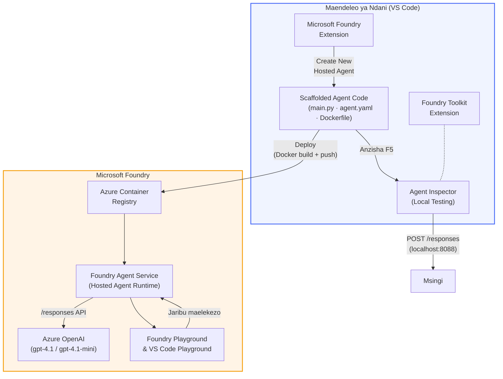

# Zana za Foundry + Warsha za Maajenti Waliohudhuriwa na Foundry

[](https://www.python.org/)
[](https://github.com/microsoft/agents)
[](https://learn.microsoft.com/azure/foundry/agents/concepts/hosted-agents)
[](https://ai.azure.com/)
[](https://learn.microsoft.com/azure/ai-services/openai/)
[](https://learn.microsoft.com/cli/azure/install-azure-cli)
[](https://learn.microsoft.com/azure/developer/azure-developer-cli/install-azd)
[](https://www.docker.com/)
[](https://marketplace.visualstudio.com/items?itemName=ms-windows-ai-studio.windows-ai-studio)
[](LICENSE)

Jenga, jaribu, na sambaza maajenti wa AI kwa **Huduma ya Maajenti ya Microsoft Foundry** kama **Maajenti Waliohudhuriwa** - yote kabisa kutoka VS Code ukitumia **kiongezaji cha Microsoft Foundry** na **Zana za Foundry**.

> **Maajenti Waliohudhuriwa kwa sasa yako katika awamu ya onyesho.** Maeneo yanayounga mkono ni chache - tazama [upatikanaji wa eneo](https://learn.microsoft.com/azure/foundry/agents/concepts/hosted-agents#region-availability).

> Folda ya `agent/` ndani ya kila maabara hutengenezwa **kihalisi na kiongezaji cha Foundry** - kisha unabadilisha msimbo, kujaribu kwa mtaa, na kusambaza.

### 🌐 Msaada wa Lugha Nyingi

#### Unaungwa mkono kupitia Kitendo cha GitHub (Kifautomati na Kila Wakati Kikiwa Hakiifanyika)

<!-- CO-OP TRANSLATOR LANGUAGES TABLE START -->
[Kiarabu](../ar/README.md) | [Kibengali](../bn/README.md) | [Kibulgaria](../bg/README.md) | [Kiburma (Myanmare)](../my/README.md) | [Kichina (Rahisi)](../zh-CN/README.md) | [Kichina (Kawaida, Hong Kong)](../zh-HK/README.md) | [Kichina (Kawaida, Macau)](../zh-MO/README.md) | [Kichina (Kawaida, Taiwan)](../zh-TW/README.md) | [Kikroeshia](../hr/README.md) | [Kicheki](../cs/README.md) | [Kidenmaki](../da/README.md) | [Kiholanzi](../nl/README.md) | [Kiestonia](../et/README.md) | [Kifini](../fi/README.md) | [Kifaransa](../fr/README.md) | [Kijerumani](../de/README.md) | [Kigreki](../el/README.md) | [Kihibru](../he/README.md) | [Kihindi](../hi/README.md) | [Kihungari](../hu/README.md) | [Kiindonesia](../id/README.md) | [Kiitaliano](../it/README.md) | [Kijapani](../ja/README.md) | [Kikannada](../kn/README.md) | [Kikmeri](../km/README.md) | [Kikorea](../ko/README.md) | [Kilithuania](../lt/README.md) | [Kimelayu](../ms/README.md) | [Kimalayalam](../ml/README.md) | [Kimarathi](../mr/README.md) | [Kinepali](../ne/README.md) | [Pidgin ya Nigeria](../pcm/README.md) | [Kinorwe](../no/README.md) | [Kifarisi (Farsi)](../fa/README.md) | [Kipolandi](../pl/README.md) | [Kireno (Brazil)](../pt-BR/README.md) | [Kireno (Ureno)](../pt-PT/README.md) | [Kipunjabi (Gurmukhi)](../pa/README.md) | [Kiromania](../ro/README.md) | [Kirusi](../ru/README.md) | [Kiserbia (Cyrillic)](../sr/README.md) | [Kislovak](../sk/README.md) | [Kislovenia](../sl/README.md) | [Kihispania](../es/README.md) | [Kiswahili](./README.md) | [Kiswidi](../sv/README.md) | [Kitagalogi (Kifilipino)](../tl/README.md) | [Kitamili](../ta/README.md) | [Kitelugu](../te/README.md) | [Kithai](../th/README.md) | [Kituruki](../tr/README.md) | [Kiukrania](../uk/README.md) | [Kiurdu](../ur/README.md) | [Kivietinamu](../vi/README.md)

> **Unapendelea Kukopa Kwenye Kifaa Chako?**
>
> Hifadhidata hii ina tafsiri za lugha 50+ ambazo huongeza kwa kiasi kikubwa ukubwa wa kupakua. Ili kunakili bila tafsiri, tumia sparse checkout:
>
> **Bash / macOS / Linux:**
> ```bash
> git clone --filter=blob:none --sparse https://github.com/microsoft-foundry/Foundry_Toolkit_for_VSCode_Lab.git
> cd Foundry_Toolkit_for_VSCode_Lab
> git sparse-checkout set --no-cone '/*' '!translations' '!translated_images'
> ```
>
> **CMD (Windows):**
> ```cmd
> git clone --filter=blob:none --sparse https://github.com/microsoft-foundry/Foundry_Toolkit_for_VSCode_Lab.git
> cd Foundry_Toolkit_for_VSCode_Lab
> git sparse-checkout set --no-cone "/*" "!translations" "!translated_images"
> ```
>
> Hii inakupa kila kitu unachohitaji kukamilisha kozi kwa upakuaji wa kasi zaidi.
<!-- CO-OP TRANSLATOR LANGUAGES TABLE END -->

---

## Muundo wa Mfumo


```mermaid
flowchart TB
    subgraph Local["Maendeleo ya Ndani (VS Code)"]
        direction TB
        FE["Microsoft Foundry
        Extension"]
        FoundryToolkit["Foundry Toolkit
        Extension"]
        Scaffold["Scaffolded Agent Code
        (main.py · agent.yaml · Dockerfile)"]
        Inspector["Agent Inspector
        (Local Testing)"]
        FE -- "Create New
        Hosted Agent" --> Scaffold
        Scaffold -- "Anzisha F5" --> Inspector
        FoundryToolkit -.- Inspector
    end

    subgraph Cloud["Microsoft Foundry"]
        direction TB
        ACR["Azure Container
        Registry"]
        AgentService["Foundry Agent Service
        (Hosted Agent Runtime)"]
        Model["Azure OpenAI
        (gpt-4.1 / gpt-4.1-mini)"]
        Playground["Foundry Playground
        & VS Code Playground"]
        ACR --> AgentService
        AgentService -- "/responses API" --> Model
        AgentService --> Playground
    end

    Scaffold -- "Deploy
    (Docker build + push)" --> ACR
    Inspector -- "POST /responses
    (localhost:8088)" --> Msingi
    Playground -- "Jaribu maelekezo" --> AgentService

    style Local fill:#f0f4ff,stroke:#4a6cf7,stroke-width:2px
    style Cloud fill:#fff4e6,stroke:#f59e0b,stroke-width:2px
```

**Mtiririko:** Kiongezaji cha Foundry hutengeneza maajenti → unabadili msimbo na maagizo → jaribu nyumbani kwa Inspekta wa Maajenti → sambaza kwenye Foundry (picha ya Docker huwasilishwa kwa ACR) → thibitisha katika Playground.

---

## Utajenga Nini

| Maabara | Maelezo | Hali |
|-----|-------------|--------|
| **Maabara 01 - Maajenti Mmoja** | Jenga **"Eleza Kama Mimi ni Mtendaji" Maajenti**, jaribu kwa mtaa, na sambaza kwenye Foundry | ✅ Inapatikana |
| **Maabara 02 - Mtiririko wa Maajenti Wengi** | Jenga **"CV → Mkadiriaji wa Kustahiki Kazi"** - maajenti 4 wanashirikiana kupima ustahiki wa CV na kutengeneza ramani ya kujifunza | ✅ Inapatikana |

---

## Kutana na Maajenti Mtendaji

Katika warsha hii utajenga **"Eleza Kama Mimi ni Mtendaji" Maajenti** - maajenti wa AI anayechukua maneno magumu ya kiufundi na kuyaeleza kwa muhtasari mtulivu, mzuri kwa mkutano wa bodi. Kwa kweli, hakuna mtu katika ngazi ya juu anayetaka kusikia kuhusu "ukosefu wa thread pool ulio sababishwa na simu sambamba zilizoletwa katika v3.2."

Nilijenga maajenti huyu baada ya matukio mengi ambapo taarifa yangu ya marekebisho ilipokelewa na majibu: *"Basi... tovuti imesimama au la?"*

### Jinsi Inavyofanya Kazi

Unamlisha taarifa ya kiufundi. Anakutolea muhtasari wa mtendaji - vidokezo vitatu, hakuna maneno magumu, hakuna data za makosa za stack, hakuna hofu ya maisha. Ni tu **kilichotokea**, **athari za biashara**, na **hatua inayofuata**.

### Inaoeza Katika Vitendo

**Unasema:**
> "Usumbufu wa API uliongezeka kutokana na ukosefu wa thread pool ulio sababishwa na simu sambamba zilizojumuishwa katika v3.2."

**Maajenti yanajibu:**

> **Muhtasari wa Mtendaji:**
> - **Kilichotokea:** Baada ya toleo jipya, mfumo umepungua kasi.
> - **Athari za biashara:** Watumiaji wengine walikumbwa na ucheleweshaji walipotumia huduma.
> - **Hatua inayofuata:** Mabadiliko yamerudishwa na marekebisho yanaandaliwa kabla ya kusambazwa upya.

### Kwa Nini Maajenti Huyu?

Ni maajenti rahisi sana, yenye kusudi moja - bora kwa kujifunza mtiririko wa maajenti waliohudhuriwa kutoka mwanzo hadi mwisho bila kuchanganyikiwa na zana ngumu. Na kweli? Kila timu ya uhandisi ingeweza kutumia moja ya haya.

---

## Muundo wa Warsha

```
📂 Foundry_Toolkit_for_VSCode_Lab/
├── 📄 README.md                      ← You are here
└── 📂 workshop/
    ├── 📂 lab01-single-agent/        ← Full lab: docs + agent code
    │   ├── README.md                 ← Hands-on lab instructions
    │   ├── 📂 docs/                  ← Step-by-step tutorial modules
    │   │   ├── 00-prerequisites.md
    │   │   ├── 01-setup.md
    │   │   ├── 02-create-hosted-agent.md
    │   │   ├── 03-configure-and-code.md
    │   │   ├── 04-test-locally.md
    │   │   ├── 05-deploy-to-foundry.md
    │   │   ├── 06-verify-in-playground.md
    │   │   ├── 07-summary.md
    │   │   └── 08-troubleshooting.md
    │   └── 📂 agent/                 ← Reference solution (auto-scaffolded by Foundry extension)
    │       ├── agent.yaml
    │       ├── Dockerfile
    │       ├── main.py
    │       └── requirements.txt
    └── 📂 lab02-multi-agent/         ← Resume → Job Fit Evaluator
        ├── README.md                 ← Hands-on lab instructions (end-to-end)
        ├── 📂 docs/                  ← Step-by-step tutorial modules
        │   ├── 00-prerequisites.md
        │   ├── 01-understand-multi-agent.md
        │   ├── 02-scaffold-multi-agent.md
        │   ├── 03-configure-agents.md
        │   ├── 04-orchestration-patterns.md
        │   ├── 05-test-locally.md
        │   ├── 06-deploy-to-foundry.md
        │   ├── 07-verify-in-playground.md
        │   └── 08-troubleshooting.md
        └── 📂 PersonalCareerCopilot/ ← Reference solution (multi-agent workflow)
            ├── agent.yaml
            ├── Dockerfile
            ├── main.py
            └── requirements.txt
```

> **Kumbuka:** Folda ya `agent/` ndani ya kila maabara ndiyo inayo tengenezwa na **kiongezaji cha Microsoft Foundry** unaporusha amri ya `Microsoft Foundry: Create a New Hosted Agent` kutoka kwenye Command Palette. Faili husasishwa kisha kwa maagizo, zana, na usanidi wa maajenti yako. Maabara 01 inakuongoza hatua kwa hatua kuunda hivi kutoka mwanzo.

---

## Kuanzia

### 1. Nakili hifadhidata

```bash
git clone https://github.com/microsoft-foundry/Foundry_Toolkit_for_VSCode_Lab.git
cd Foundry_Toolkit_for_VSCode_Lab
```

### 2. Tengeneza mazingira ya sarafu ya Python

```bash
python -m venv venv
```

Shirikisha:

- **Windows (PowerShell):**
  ```powershell
  .\venv\Scripts\Activate.ps1
  ```
- **macOS / Linux:**
  ```bash
  source venv/bin/activate
  ```

### 3. Sakinisha utegemezi

```bash
pip install -r workshop/lab01-single-agent/agent/requirements.txt
```

### 4. Sanidi vigezo vya mazingira

Nakili mfano wa faili `.env` ndani ya folda ya maajenti na jaza thamani zako:

```bash
cp workshop/lab01-single-agent/agent/.env.example workshop/lab01-single-agent/agent/.env
```

Hariri `workshop/lab01-single-agent/agent/.env`:

```env
AZURE_AI_PROJECT_ENDPOINT=https://<your-account>.services.ai.azure.com/api/projects/<your-project>
AZURE_AI_MODEL_DEPLOYMENT_NAME=<your-model-deployment-name>
```

### 5. Fuata maabara za warsha

Kila maabara ni huru na ina moduli zake. Anza na **Maabara 01** kujifunza misingi, kisha endelea na **Maabara 02** kwa mtiririko wa maajenti wengi.

#### Maabara 01 - Maajenti Mmoja ([maelezo kamili](workshop/lab01-single-agent/README.md))

| # | Moduli | Kihusishi |
|---|--------|------|
| 1 | Soma mahitaji | [00-prerequisites.md](workshop/lab01-single-agent/docs/00-prerequisites.md) |
| 2 | Sakinisha Zana za Foundry & kiongezaji cha Foundry | [01-setup.md](workshop/lab01-single-agent/docs/01-setup.md) |
| 3 | Tengeneza mradi wa Foundry | [01-setup.md](workshop/lab01-single-agent/docs/01-setup.md) |
| 4 | Tengeneza maajenti waliohudhuriwa | [02-create-hosted-agent.md](workshop/lab01-single-agent/docs/02-create-hosted-agent.md) |
| 5 | Sanidi maagizo & mazingira | [03-configure-and-code.md](workshop/lab01-single-agent/docs/03-configure-and-code.md) |
| 6 | Jaribu nyumbani | [04-test-locally.md](workshop/lab01-single-agent/docs/04-test-locally.md) |
| 7 | Sambaza kwenye Foundry | [05-deploy-to-foundry.md](workshop/lab01-single-agent/docs/05-deploy-to-foundry.md) |
| 8 | Thibitisha katika playground | [06-verify-in-playground.md](workshop/lab01-single-agent/docs/06-verify-in-playground.md) |
| 9 | Tatua matatizo | [08-troubleshooting.md](workshop/lab01-single-agent/docs/08-troubleshooting.md) |

#### Maabara 02 - Mtiririko wa Maajenti Wengi ([maelezo kamili](workshop/lab02-multi-agent/README.md))

| # | Moduli | Kihusishi |
|---|--------|------|
| 1 | Mahitaji (Maabara 02) | [00-prerequisites.md](workshop/lab02-multi-agent/docs/00-prerequisites.md) |
| 2 | Elewa muundo wa maajenti wengi | [01-understand-multi-agent.md](workshop/lab02-multi-agent/docs/01-understand-multi-agent.md) |
| 3 | Tengeneza mradi wa maajenti wengi | [02-scaffold-multi-agent.md](workshop/lab02-multi-agent/docs/02-scaffold-multi-agent.md) |
| 4 | Sanidi maajenti & mazingira | [03-configure-agents.md](workshop/lab02-multi-agent/docs/03-configure-agents.md) |
| 5 | Mifumo ya upangaji | [04-orchestration-patterns.md](workshop/lab02-multi-agent/docs/04-orchestration-patterns.md) |
| 6 | Jaribu nyumbani (maajenti wengi) | [05-test-locally.md](workshop/lab02-multi-agent/docs/05-test-locally.md) |

| 7 | Weka kwenye Foundry | [06-deploy-to-foundry.md](workshop/lab02-multi-agent/docs/06-deploy-to-foundry.md) |
| 8 | Thibitisha kwenye playground | [07-verify-in-playground.md](workshop/lab02-multi-agent/docs/07-verify-in-playground.md) |
| 9 | Utatuzi wa matatizo (wakala wengi) | [08-troubleshooting.md](workshop/lab02-multi-agent/docs/08-troubleshooting.md) |

---

## Msimamizi

<table>
<tr>
    <td align="center"><a href="https://github.com/ShivamGoyal03">
        <br />
        <sub><b>Shivam Goyal</b></sub>
    </a><br />
    </td>
</tr>
</table>

---

## Idhini zinazohitajika (marejeo ya haraka)

| Muktadha | Nafasi zinazohitajika |
|----------|---------------|
| Tengeneza mradi mpya wa Foundry | **Azure AI Owner** kwenye rasilimali ya Foundry |
| Weka kwenye mradi uliopo (rasilimali mpya) | **Azure AI Owner** + **Contributor** kwenye usajili |
| Weka kwenye mradi uliowekwa kikamilifu | **Reader** kwenye akaunti + **Azure AI User** kwenye mradi |

> **Muhimu:** Nafasi za Azure `Owner` na `Contributor` zinajumuisha tu idhini za *usimamizi*, sio idhini za *maendeleo* (hatua za data). Unahitaji **Azure AI User** au **Azure AI Owner** ili kujenga na kuweka mawakala.

---

## Marejeo

- [Mwongozo wa Haraka: Weka wakala wako wa kwanza mwenye mwenyeji (VS Code)](https://learn.microsoft.com/azure/foundry/agents/quickstarts/quickstart-hosted-agent)
- [Mawakala wenye mwenyeji ni nini?](https://learn.microsoft.com/azure/foundry/agents/concepts/hosted-agents)
- [Tengeneza michakato ya wakala mwenye mwenyeji ndani ya VS Code](https://learn.microsoft.com/azure/foundry/agents/how-to/vs-code-agents-workflow-pro-code)
- [Weka wakala mwenye mwenyeji](https://learn.microsoft.com/azure/foundry/agents/how-to/deploy-hosted-agent)
- [RBAC kwa Microsoft Foundry](https://learn.microsoft.com/azure/foundry/concepts/rbac-foundry)
- [Mfano wa Wakala wa Mapitio ya Majiundo](https://github.com/Azure-Samples/agent-architecture-review-sample) - Wakala halisi mwenye mwenyeji akiwa na zana za MCP, michoro ya Excalidraw, na uenezaji mara mbili

---


## Leseni

[MIT](../../LICENSE)

---

<!-- CO-OP TRANSLATOR DISCLAIMER START -->
**Kionyozo**:
Hati hii imetafsiriwa kwa kutumia huduma ya tafsiri ya AI [Co-op Translator](https://github.com/Azure/co-op-translator). Ingawa tunajitahidi kupata usahihi, tafadhali fahamu kwamba tafsiri za kiotomatiki zinaweza kuwa na makosa au upungufu wa usahihi. Hati ya asili katika lugha yake halisi inapaswa kuchukuliwa kama chanzo cha mamlaka. Kwa taarifa muhimu, tafsiri ya kitaalamu inayofanywa na binadamu inapendekezwa. Hatutojibu kwa kuelewa vibaya au tafsiri potofu zinazotokea kutokana na matumizi ya tafsiri hii.
<!-- CO-OP TRANSLATOR DISCLAIMER END -->