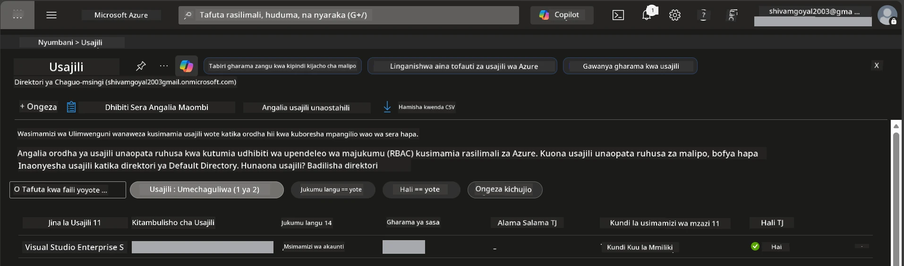

# Module 0 - Masharti ya Msingi

Kabla ya kuanza warsha, thibitisha kuwa una zana, ufikiaji, na mazingira yafuatayo tayari. Fuata kila hatua yenyewe chini - usiruke mbele.

---

## 1. Akaunti ya Azure & usajili

### 1.1 Unda au thibitisha usajili wako wa Azure

1. Fungua kivinjari na nenda kwenye [https://azure.microsoft.com/free/](https://azure.microsoft.com/free/).
2. Ikiwa huna akaunti ya Azure, bofya **Anza bure** na fuata mchakato wa usajili. Utahitaji akaunti ya Microsoft (au unda moja) na kadi ya mkopo kwa ajili ya kuthibitisha utambulisho.
3. Ikiwa tayari una akaunti, ingia kwenye [https://portal.azure.com](https://portal.azure.com).
4. Katika Portal, bofya blade ya **Usajili** upande wa kushoto wa urambazaji (au tafuta "Subscriptions" katika upau wa juu wa utafutaji).
5. Thibitisha unaona angalau usajili mmoja **Unaofanya kazi**. Andika chini **Kitambulisho cha Usajili** - utahitaji baadaye.



### 1.2 Elewa majukumu ya RBAC yanayohitajika

Usambazaji wa [Hosted Agent](https://learn.microsoft.com/azure/foundry/agents/concepts/hosted-agents) unahitaji ruhusa za **kitendo cha data** ambayo majukumu ya kawaida ya Azure `Owner` na `Contributor` hayajumuishi. Utahitaji moja ya [mchanganyiko wa majukumu](https://learn.microsoft.com/azure/foundry/concepts/rbac-foundry#built-in-roles) haya:

| Hali | Majukumu yanayohitajika | Mahali pa kuyahitaji |
|----------|---------------|----------------------|
| Unda mradi mpya wa Foundry | **Azure AI Owner** kwenye rasilimali ya Foundry | Rasilimali ya Foundry katika Azure Portal |
| Sambaza kwenye mradi uliopo (rasilimali mpya) | **Azure AI Owner** + **Contributor** kwenye usajili | Usajili + Rasilimali ya Foundry |
| Sambaza kwenye mradi ulio kamilika | **Reader** kwenye akaunti + **Azure AI User** kwenye mradi | Akaunti + Mradi katika Azure Portal |

> **Kitu muhimu:** Majukumu ya Azure `Owner` na `Contributor` yanashughulikia tu ruhusa za *usimamizi* (operesheni za ARM). Unahitaji [**Azure AI User**](https://learn.microsoft.com/azure/foundry/concepts/rbac-foundry#built-in-roles) (au zaidi) kwa *vitendo vya data* kama `agents/write` ambavyo vinahitajika kuunda na kusambaza mawakala. Utayateua majukumu haya katika [Moduli 2](02-create-foundry-project.md).

---

## 2. Sakinisha zana za ndani

Sakinisha kila zana iliyo hapa chini. Baada ya kusakinisha, hakikisha inafanya kazi kwa kuendesha amri ya ukaguzi.

### 2.1 Visual Studio Code

1. Nenda kwenye [https://code.visualstudio.com/](https://code.visualstudio.com/).
2. Pakua msakinishaji kwa mfumo wako wa uendeshaji (Windows/macOS/Linux).
3. Endesha msakinishaji kwa mipangilio ya chaguo-msingi.
4. Fungua VS Code ili kuthibitisha inaanza.

### 2.2 Python 3.10+

1. Nenda kwenye [https://www.python.org/downloads/](https://www.python.org/downloads/).
2. Pakua Python 3.10 au zaidi (3.12+ inapendekezwa).
3. **Windows:** Wakati wa usakinishaji, hakikisha umechagua **"Add Python to PATH"** kwenye skrini ya kwanza.
4. Fungua terminal na thibitisha:

   ```powershell
   python --version
   ```

   Matokeo yanayotarajiwa: `Python 3.10.x` au zaidi.

### 2.3 Azure CLI

1. Nenda kwenye [https://learn.microsoft.com/cli/azure/install-azure-cli](https://learn.microsoft.com/cli/azure/install-azure-cli).
2. Fuata maelekezo ya usakinishaji kwa mfumo wako wa uendeshaji.
3. Thibitisha:

   ```powershell
   az --version
   ```

   Kinachotarajiwa: `azure-cli 2.80.0` au zaidi.

4. Ingia:

   ```powershell
   az login
   ```

### 2.4 Azure Developer CLI (azd)

1. Nenda kwenye [https://learn.microsoft.com/azure/developer/azure-developer-cli/install-azd](https://learn.microsoft.com/azure/developer/azure-developer-cli/install-azd).
2. Fuata maelekezo ya usakinishaji kwa mfumo wako. Kwa Windows:

   ```powershell
   winget install microsoft.azd
   ```

3. Thibitisha:

   ```powershell
   azd version
   ```

   Kinachotarajiwa: `azd version 1.x.x` au zaidi.

4. Ingia:

   ```powershell
   azd auth login
   ```

### 2.5 Docker Desktop (hiari)

Docker inahitajika tu ikiwa unataka kujenga na kujaribu picha ya konterena kwenye kompyuta kabla ya kusambaza. Kiendelezi cha Foundry kinahusika na ujenzi wa konterena wakati wa usambazaji moja kwa moja.

1. Nenda kwenye [https://docs.docker.com/get-docker/](https://docs.docker.com/get-docker/).
2. Pakua na usakinishe Docker Desktop kwa mfumo wako.
3. **Windows:** Hakikisha Backend ya WSL 2 imechaguliwa wakati wa usakinishaji.
4. Anzisha Docker Desktop na subiri ikoni katika tray ya mfumo ionyeshe **"Docker Desktop is running"**.
5. Fungua terminal na thibitisha:

   ```powershell
   docker info
   ```

   Hii inapaswa kuchapisha habari za mfumo wa Docker bila makosa. Ikiwa unaona `Cannot connect to the Docker daemon`, subiri sekunde chache zaidi kwa Docker kuanza kikamilifu.

---

## 3. Sakinisha viendelezi vya VS Code

Unahitaji viendelezi vitatu. Sakinisha kabla warsha inaanza.

### 3.1 Microsoft Foundry kwa VS Code

1. Fungua VS Code.
2. Bonyeza `Ctrl+Shift+X` kufungua paneli ya Viendelezi.
3. Katika kisanduku cha utafutaji, andika **"Microsoft Foundry"**.
4. Tafuta **Microsoft Foundry for Visual Studio Code** (mchapishaji: Microsoft, ID: `TeamsDevApp.vscode-ai-foundry`).
5. Bonyeza **Sakinisha**.
6. Baada ya usakinishaji, unapaswa kuona ikoni ya **Microsoft Foundry** inaonekana kwenye Bar ya Shughuli ( upande wa kushoto).

### 3.2 Foundry Toolkit

1. Katika paneli ya Viendelezi (`Ctrl+Shift+X`), tafuta **"Foundry Toolkit"**.
2. Tafuta **Foundry Toolkit** (mchapishaji: Microsoft, ID: `ms-windows-ai-studio.windows-ai-studio`).
3. Bonyeza **Sakinisha**.
4. Ikoni ya **Foundry Toolkit** inapaswa kuonekana kwenye Bar ya Shughuli.

### 3.3 Python

1. Katika paneli ya Viendelezi, tafuta **"Python"**.
2. Tafuta **Python** (mchapishaji: Microsoft, ID: `ms-python.python`).
3. Bonyeza **Sakinisha**.

---

## 4. Ingia kwenye Azure kutoka VS Code

[Microsoft Agent Framework](https://learn.microsoft.com/agent-framework/overview/) inatumia [`DefaultAzureCredential`](https://learn.microsoft.com/azure/developer/python/sdk/authentication/credential-chains#defaultazurecredential-overview) kwa uthibitishaji. Unahitaji kuingia katika Azure ndani ya VS Code.

### 4.1 Ingia kupitia VS Code

1. Tazama kona ya chini kushoto ya VS Code na bonyeza ikoni ya **Akaunti** (mchoro wa mtu).
2. Bonyeza **Ingia ili kutumia Microsoft Foundry** (au **Ingia na Azure**).
3. Dirisha la kivinjari linafunguka - ingia kwa akaunti ya Azure inayoweza kufikia usajili wako.
4. Rudi VS Code. Unapaswa kuona jina la akaunti yako chini kushoto.

### 4.2 (Hiari) Ingia kupitia Azure CLI

Kama umetumia Azure CLI na unapendelea uthibitishaji wa CLI:

```powershell
az login
```

Hii inafungua kivinjari kwa ajili ya kuingia. Baada ya kuingia, weka usajili sahihi:

```powershell
az account set --subscription "<your-subscription-id>"
```

Thibitisha:

```powershell
az account show --query "{name:name, id:id, state:state}" --output table
```

Unapaswa kuona jina la usajili, Kitambulisho, na hali = `Enabled`.

### 4.3 (Mbali) Uthibitishaji wa mthibitishaji wa huduma

Kwa CI/CD au mazingira ya pamoja, weka badala hayo mabadiliko ya mazingira:

```powershell
$env:AZURE_TENANT_ID = "<your-tenant-id>"
$env:AZURE_CLIENT_ID = "<your-client-id>"
$env:AZURE_CLIENT_SECRET = "<your-client-secret>"
```

---

## 5. Mipaka ya onyesho awali

Kabla ya kuendelea, fahamu mipaka ya sasa:

- [**Mawakala Waliohifadhiwa**](https://learn.microsoft.com/azure/foundry/agents/concepts/hosted-agents) kwa sasa wako katika **onyesho la umma** - hawapendekezwi kwa mzigo wa uzalishaji.
- Eneo lililoungwa mkono ni **ndogo** - angalia [upatikanaji wa eneo](https://learn.microsoft.com/azure/foundry/agents/concepts/hosted-agents#region-availability) kabla ya kuunda rasilimali. Ikiwa unachagua eneo lisiloungwa mkono, usambazaji utashindwa.
- Pakiti `azure-ai-agentserver-agentframework` ni toleo la kabla ya kutolewa (`1.0.0b16`) - API zinaweza kubadilika.
- Mipaka ya kiwango: mawakala waliowekwa husaidia nakala 0-5 (ikiwa ni pamoja na kiwango hadi sifuri).

---

## 6. Orodha ya ukaguzi wa kabla ya ndege

Pitia kila kipengele chini. Ikiwa hatua yoyote inashindwa, rudi na ifanye kabla ya kuendelea.

- [ ] VS Code inafunguka bila makosa
- [ ] Python 3.10+ ipo kwenye PATH yako (`python --version` inachapisha `3.10.x` au zaidi)
- [ ] Azure CLI imesakinishwa (`az --version` inachapisha `2.80.0` au zaidi)
- [ ] Azure Developer CLI imesakinishwa (`azd version` inachapisha taarifa za toleo)
- [ ] Kiendelezi cha Microsoft Foundry kimesakinishwa (ikoni inaonekana kwenye Bar ya Shughuli)
- [ ] Kiendelezi cha Foundry Toolkit kimesakinishwa (ikoni inaonekana kwenye Bar ya Shughuli)
- [ ] Kiendelezi cha Python kimesakinishwa
- [ ] Umeingia ndani ya Azure katika VS Code (angalia ikoni ya Akaunti, chini kushoto)
- [ ] `az account show` inarudisha usajili wako
- [ ] (Hiari) Docker Desktop inaendesha (`docker info` inarudisha habari za mfumo bila makosa)

### Kidokezo

Fungua Bar ya Shughuli ya VS Code na thibitisha unaona maoni ya upande wa **Foundry Toolkit** na **Microsoft Foundry**. Bonyeza kila moja kuhakikisha zinapakia bila makosa.

---

**Ifuatayo:** [01 - Sakinisha Foundry Toolkit & Kiendelezi cha Foundry →](01-install-foundry-toolkit.md)

---

<!-- CO-OP TRANSLATOR DISCLAIMER START -->
**Kumbusha**:
Hati hii imetafsiriwa kwa kutumia huduma ya tafsiri ya AI [Co-op Translator](https://github.com/Azure/co-op-translator). Ingawa tunajitahidi kwa usahihi, tafadhali kumbuka kuwa tafsiri za moja kwa moja zinaweza kuwa na makosa au kutokukamilika. Hati ya asili katika lugha yake ya asili inapaswa kuchukuliwa kama chanzo cha mamlaka. Kwa taarifa muhimu, tafsiri ya kitaalamu ya binadamu inashauriwa. Hatukubali lawama kwa maelewano mabaya au tafsiri zisizo sahihi zinazotokana na matumizi ya tafsiri hii.
<!-- CO-OP TRANSLATOR DISCLAIMER END -->