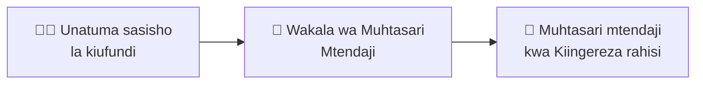

# Moduli 0 - Utangulizi

⏱️ ~10 dakika

> [!WARNING]
> **Utangulizi & Mipaka:** [Wakala Wanaohudumiwa](https://learn.microsoft.com/azure/foundry/agents/concepts/hosted-agents) kwa sasa wako katika **utangulizi wa umma** - hawapendekezwi kwa kazi za uzalishaji. Fahamu yafuatayo:
> - **Mikoa inayoungwa mkono ni michache** - angalia [upatikanaji wa mikoa](https://learn.microsoft.com/azure/foundry/agents/concepts/hosted-agents#region-availability) kabla ya kuunda rasilimali. Ikiwa uta-chagua kanda isiyo supported, usambazaji utaacha.
> - Kifurushi `azure-ai-agentserver-agentframework` ni toleo la awali - API zinaweza kubadilika kati ya toleo.
> - Mipaka ya upanuzi: mawakala wanaohudumiwa wanaunga mkono nakala 0–5 (ikiwa ni pamoja na upanuzi hadi sifuri).
> - Baadhi ya vipengele vinavyoonyeshwa katika warsha hii vinaweza kubadilika wakati huduma inapoelekea GA.

## Utatengeneza nini

Katika warsha hii, utatengeneza wakala wa **"Eleza Kama Mimi Ni Mkurugenzi Mtendaji"** - wakala wa AI anayehudumiwa anayechukua masasisho ya kiufundi tata na kuyaandika upya kama muhtasari rahisi wa kiingereza kwa wakurugenzi.

```mermaid
flowchart LR
    A["🧑‍💻 Unatuma sasisho\nla kiufundi"] --> B["🤖 Wakala wa Muhtasari\nMtendaji"]
    B --> C["📝 Muhtasari mtendaji\nkwa Kiingereza rahisi"]
```

**Wakala hutumia:**
- **Microsoft Agent Framework** - kwa mantiki na muundo wa wakala
- **Foundry Toolkit kwa VS Code** - kuanzisha, kujaribu k lokal, na kusambaza
- **Mfano wa AI** (mfano, `gpt-4.1-mini/gpt-5-mini`) - kutoa muhtasari

Mwisho wa mazoezi haya, utakuwa na wakala anayeweza kufanya kazi ambao unaweza kujaribu lokal kupitia Agent Inspector, na hiari unaweza kusambaza katika wingu.

---

## Wakala wanaohudumiwa ni nini?

**Wakala anaye hudumiwa** ni wakala wa AI anayofanya kazi kama huduma inayosimamiwa katika Microsoft Foundry. Badala ya kusimamia miundombinu yako mwenyewe, unapaketi msimbo wako wa wakala katika kontena na Foundry inashughulikia upanuzi, uendeshaji, na kuufungua kupitia kiungo cha HTTP cha kawaida.

| Dhana | Inamaanisha nini |
|---------|--------------|
| **Wakala** | Msimbo wako wa Python unaopokea ujumbe wa mtumiaji, hupiga mfano wa AI, na hurudisha jibu lililopangwa |
| **Anayehudumiwa** | Foundry inaendesha kontena lako kwa niaba yako - hakuna VM, hakuna Kubernetes, hakuna miundombinu ya kusimamia |
| **Itifaki za majibu** | API ya kawaida ya HTTP (`POST /responses`) ambayo mteja yeyote anaweza kuitumia kuwasiliana na wakala wako |
| **Agent Inspector** | UI ya kujaribu lokal (imejumuishwa katika Foundry Toolkit) inayokuwezesha kuzungumza na wakala wako kabla ya kusambaza |

Katika warsha hii, utaenda kutoka sifuri hadi wakala aliyehudumiwa kabisa - au utasimama katika majaribio lokal ikiwa unapendelea.

---

## Chagua njia yako

> ⚠️ **Chagua njia moja kabla ya kuendelea.** Chaguo lako litaamua zana gani utaweka na moduli gani zitahusika. Unaweza kubadilisha kutoka Njia B → Njia A baadaye ikiwa utapata usajili.

<strong>🅰️ Njia A - Wingu la Azure (inahitaji usajili wa Azure)</strong>

| | Maelezo |
|---|---|
| **Hii ni kwa nani?** | Una usajili wa Azure unaofanya kazi na unaweza kuunda rasilimali za Foundry |
| **Mfano** | Azure OpenAI kupitia Foundry (mfano, `gpt-4.1-mini/gpt-5-mini`) |
| **Moduli zinazohusika** | Moduli zote (00–07) |
| **Kusambaza kwa wingu?** | ✅ Ndiyo - usambazaji kamili wa mwisho hadi mwisho |

<strong>🅱️ Njia B - Lokal / kiwango cha bure (haitaji usajili wa Azure)</strong>

| | Maelezo |
|---|---|
| **Hii ni kwa nani?** | MVPs, wanafunzi, au mtu yeyote asiyekuwa na ufikiaji wa Azure |
| **Mfano** | **Foundry Lokal** (bure, inaendesha kwenye mashine yako) |
| **Moduli zinazohusika** | Moduli 00–04 (ruka usambazaji & uhakiki wa wingu) |
| **Kusambaza kwa wingu?** | ❌ Hapana - majaribio lokal tu kupitia Agent Inspector |

---

## Njia zote: Zana zinazohitajika

Sakinisha kila chombo hapa chini. Baada ya kusakinisha, hakiki inavyofanya kazi kwa kuendesha amri ya ukaguzi.

| # | Chombo | Toleo | Usakinishaji | Hakiki (Matokeo Yanayotarajiwa) |
|---|------|---------|---------|---------------------------|
| 1 | **Visual Studio Code** | Zaidi Zaidi | [code.visualstudio.com](https://code.visualstudio.com/) | Hufunguka bila makosa |
| 2 | **Python** | 3.12 au zaidi| [python.org/downloads](https://www.python.org/downloads/) | `python --version` $\rightarrow$ `Python 3.12.x` |
| 3 | **Foundry Toolkit kwa VS Code** | Zaidi Zaidi | Extension ID: `ms-windows-ai-studio.windows-ai-studio` | Ikoni ya Foundry kwenye Bar ya Shughuli |
| 4 | **Kiongezaji cha Python kwa VS Code** | Zaidi Zaidi | Extension ID: `ms-python.python` | Imesakinishwa kwenye paneli ya Extensions |

> [!TIP]
> **Vidokezo vya kitaalamu kwa usakinishaji:**
> - **Njia ya Python (Windows):** Daima hakikisha umechagua **"Add Python to PATH"** kwenye skrini ya kwanza ya msakinishaji wa Python. Bila hii, `python` haitatambulika kwenye terminal yako.
> - **Matoleo mengi ya Python:** Ikiwa una Python 3.10 na 3.12 zimesakinishwa, tumia `python3.12 -m venv .venv` kuhakikisha toleo sahihi linatumika kwa mazingira ya virtual.
> - **Docker WSL 2 (Windows):** Wakati wa usakinishaji wa Docker Desktop, hakikisha backend ya **WSL 2** imechaguliwa. Docker na Hyper-V ni polepole na inaweza kusababisha matatizo na ujenzi wa kontena za Foundry.
> - **Docker haianzishi?** Subiri sekunde 30–60 baada ya kuanzisha Docker Desktop. Endesha `docker info` - kama unaona "Cannot connect to the Docker daemon," Docker bado inaanzisha.
> - **Virutubisho vya VS Code havijiandiki?** Baada ya kusanikisha virutubisho, fanyia upya dirisha: `Ctrl+Shift+P` → `Developer: Reload Window`.

> **Watumiaji wa Windows:** Hakikisha umechagua **"Add Python to PATH"** wakati wa usakinishaji wa Python.

**Ifuatayo:** [01 - Setup →](01-setup.md)

---

<!-- CO-OP TRANSLATOR DISCLAIMER START -->
**Kionyozo**:
Hati hii imetafsiriwa kwa kutumia huduma ya tafsiri ya AI [Co-op Translator](https://github.com/Azure/co-op-translator). Ingawa tunajitahidi kupata usahihi, tafadhali fahamu kwamba tafsiri za kiotomatiki zinaweza kuwa na makosa au upungufu wa usahihi. Hati ya asili katika lugha yake halisi inapaswa kuchukuliwa kama chanzo cha mamlaka. Kwa taarifa muhimu, tafsiri ya kitaalamu inayofanywa na binadamu inapendekezwa. Hatutojibu kwa kuelewa vibaya au tafsiri potofu zinazotokea kutokana na matumizi ya tafsiri hii.
<!-- CO-OP TRANSLATOR DISCLAIMER END -->