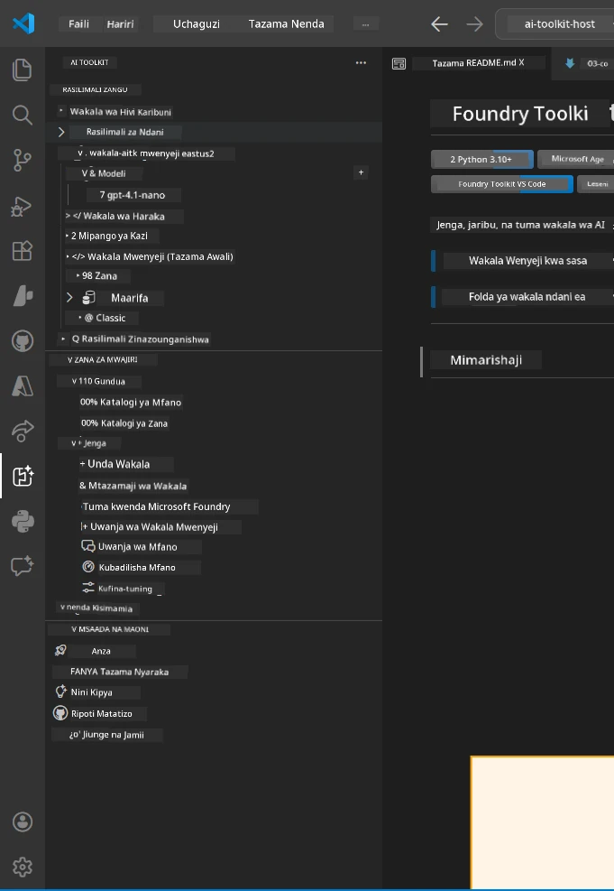
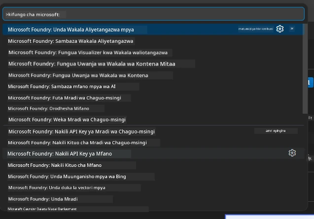

# Module 1 - Sasisha Foundry Toolkit & Ugani wa Foundry

Moduli hii inakuongoza jinsi ya kusanidi na kuthibitisha ugani kuu wawili wa VS Code kwa warsha hii. Ikiwa tayari umevisanidua wakati wa [Module 0](00-prerequisites.md), tumia moduli hii kuthibitisha kwamba vinafanya kazi ipasavyo.

---

## Hatua 1: Sanidi Ugani wa Microsoft Foundry

Ugani wa **Microsoft Foundry kwa VS Code** ni chombo chako kikuu cha kuunda miradi ya Foundry, kuweka mifano, kutengeneza mawakala wanaohudumiwa, na kuweka moja kwa moja kutoka VS Code.

1. Fungua VS Code.
2. Bonyeza `Ctrl+Shift+X` kufungua paneli ya **Extensions**.
3. Katika kisanduku cha utafutaji juu, andika: **Microsoft Foundry**
4. Tafuta matokeo yenye kichwa **Microsoft Foundry for Visual Studio Code**.
   - Mchapishaji: **Microsoft**
   - Kitambulisho cha Ugani: `TeamsDevApp.vscode-ai-foundry`
5. Bonyeza kitufe cha **Install**.
6. Subiri usakinishaji ukamilike (utaona kiashiria kidogo cha maendeleo).
7. Baada ya usakinishaji, angalia **Activity Bar** (mstari wa alama wima upande wa kushoto wa VS Code). Unapaswa kuona alama mpya ya **Microsoft Foundry** (inaonekana kama almasi/alama ya AI).
8. Bonyeza alama ya **Microsoft Foundry** kufungua sehemu yake ya pembeni. Unapaswa kuona sehemu za:
   - **Resources** (au Miradi)
   - **Agents**
   - **Models**

> **Kama alama haionekani:** Jaribu kupakia upya VS Code (`Ctrl+Shift+P` → `Developer: Reload Window`).

---

## Hatua 2: Sanidi Ugani wa Foundry Toolkit

Ugani wa **Foundry Toolkit** hutoa [**Agent Inspector**](https://learn.microsoft.com/azure/foundry/agents/how-to/vs-code-agents-workflow-pro-code) - kiolesura cha kuona kwa majaribio na utatuzi wa mawakala ndani ya eneo la kompyuta - pamoja na sehemu za playground, usimamizi wa mifano, na zana za tathmini.

1. Katika paneli ya Extensions (`Ctrl+Shift+X`), fafanua kisanduku cha utafutaji na andika: **Foundry Toolkit**
2. Tafuta **Foundry Toolkit** katika matokeo.
   - Mchapishaji: **Microsoft**
   - Kitambulisho cha Ugani: `ms-windows-ai-studio.windows-ai-studio`
3. Bonyeza **Install**.
4. Baada ya usakinishaji, alama ya **Foundry Toolkit** itaonekana katika Activity Bar (inaonekana kama roboti/alama ya mwanga).
5. Bonyeza alama ya **Foundry Toolkit** kufungua sehemu yake ya pembeni. Unapaswa kuona skrini ya kuukaribisha ya Foundry Toolkit yenye chaguzi za:
   - **Models**
   - **Playground**
   - **Agents**

---

## Hatua 3: Thibitisha kila ugani unafanya kazi

### 3.1 Thibitisha Ugani wa Microsoft Foundry

1. Bonyeza alama ya **Microsoft Foundry** katika Activity Bar.
2. Ikiwa umeingia kwenye Azure (kutoka Module 0), unapaswa kuona miradi yako imeorodheshwa chini ya **Resources**.
3. Ikiwa utaombwa kuingia, bonyeza **Sign in** na fuata mchakato wa uthibitishaji.
4. Thibitisha unaweza kuona sehemu ya pembeni bila makosa.

### 3.2 Thibitisha Ugani wa Foundry Toolkit

1. Bonyeza alama ya **Foundry Toolkit** katika Activity Bar.
2. Thibitisha mwonekano wa kuukaribisha au paneli kuu inapakia bila makosa.
3. Huhitaji kusanidi chochote bado - tutatumia Agent Inspector katika [Module 5](05-test-locally.md).

### 3.3 Thibitisha kupitia Command Palette

1. Bonyeza `Ctrl+Shift+P` kufungua Command Palette.
2. Andika **"Microsoft Foundry"** - unapaswa kuona amri kama:
   - `Microsoft Foundry: Create a New Hosted Agent`
   - `Microsoft Foundry: Deploy Hosted Agent`
   - `Microsoft Foundry: Open Model Catalog`
3. Bonyeza `Escape` kufunga Command Palette.
4. Fungua Command Palette tena na andika **"Foundry Toolkit"** - unapaswa kuona amri kama:
   - `Foundry Toolkit: Open Agent Inspector`

> Ikiwa hauoni amri hizi, ugani haujasanidi vizuri. Jaribu kuufuta kisha kuuisanidi tena.

---

## Mambo yanayofanywa na ugani huu katika warsha hii

| Ugani | Kinachofanya | Utakitumia lini |
|-----------|-------------|-------------------|
| **Microsoft Foundry kwa VS Code** | Unda miradi ya Foundry, weka mifano, **tengeneza [mawakala wanaohudumiwa](https://learn.microsoft.com/azure/foundry/agents/concepts/hosted-agents)** (hutengeneza moja kwa moja `agent.yaml`, `main.py`, `Dockerfile`, `requirements.txt`), weka kwenye [Foundry Agent Service](https://learn.microsoft.com/azure/foundry/agents/overview) | Modules 2, 3, 6, 7 |
| **Foundry Toolkit** | Agent Inspector kwa majaribio/utatuzi wa ndani, kiolesura cha playground, usimamizi wa mifano | Modules 5, 7 |

> **Ugani wa Foundry ni chombo muhimu zaidi katika warsha hii.** Hudumia mzunguko wote kuanzia kutengeneza → kusanidi → kuweka → kuthibitisha. Foundry Toolkit unasaidia kwa kutoa mtazamaji wa Agent kwa majaribio ya ndani.

---

### Sehemu ya Kukagua

- [ ] Alama ya Microsoft Foundry inaonekana katika Activity Bar
- [ ] Kubofya ina Fungua sehemu ya pembeni bila makosa
- [ ] Alama ya Foundry Toolkit inaonekana katika Activity Bar
- [ ] Kubofya ina Fungua sehemu ya pembeni bila makosa
- [ ] `Ctrl+Shift+P` → kuandika "Microsoft Foundry" inaonyesha amri zinazoonekana
- [ ] `Ctrl+Shift+P` → kuandika "Foundry Toolkit" inaonyesha amri zinazoonekana

---

**Iliyotangulia:** [00 - Prerequisites](00-prerequisites.md) · **Ifuatayo:** [02 - Create Foundry Project →](02-create-foundry-project.md)

---

<!-- CO-OP TRANSLATOR DISCLAIMER START -->
**Kataa**:
Hati hii imetafsiriwa kwa kutumia huduma ya utafsiri ya AI [Co-op Translator](https://github.com/Azure/co-op-translator). Ingawa tunajitahidi kwa usahihi, tafadhali fahamu kwamba tafsiri za kiotomatiki zinaweza kuwa na makosa au upotoshaji. Hati ya asili katika lugha yake ya asili inapaswa kuzingatiwa kama chanzo cha mamlaka. Kwa taarifa muhimu, tafsiri ya kitaalamu iliyofanywa na binadamu inashauriwa. Hatuna dhamana kwa uelewa au tafsiri potofu zinazotokana na matumizi ya tafsiri hii.
<!-- CO-OP TRANSLATOR DISCLAIMER END -->