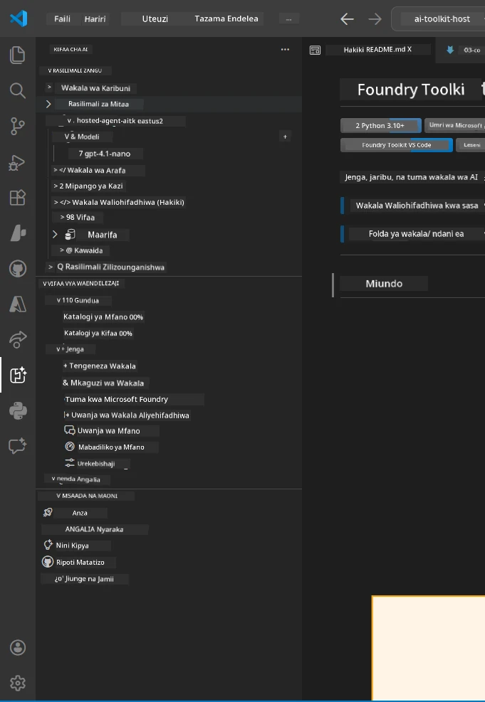
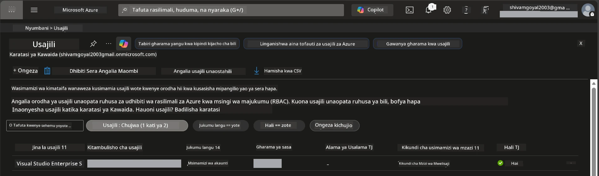
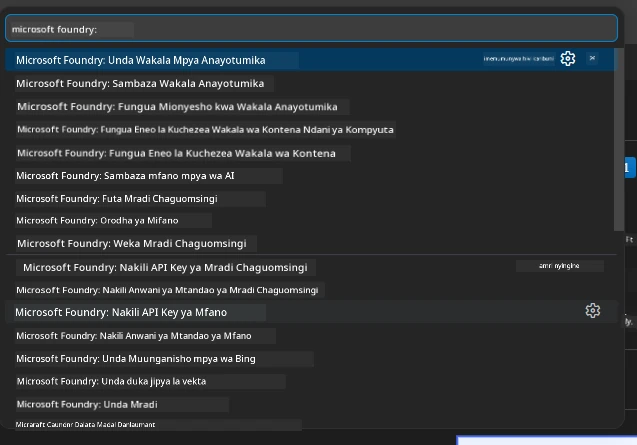
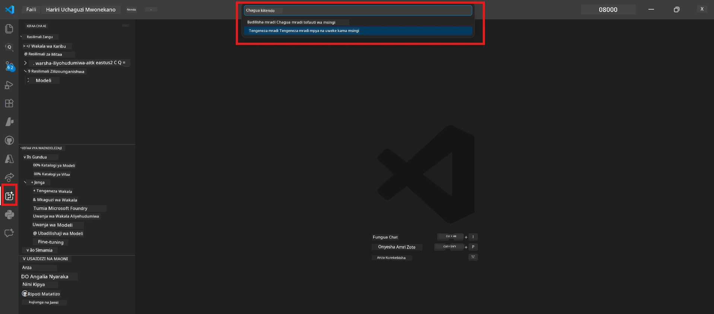
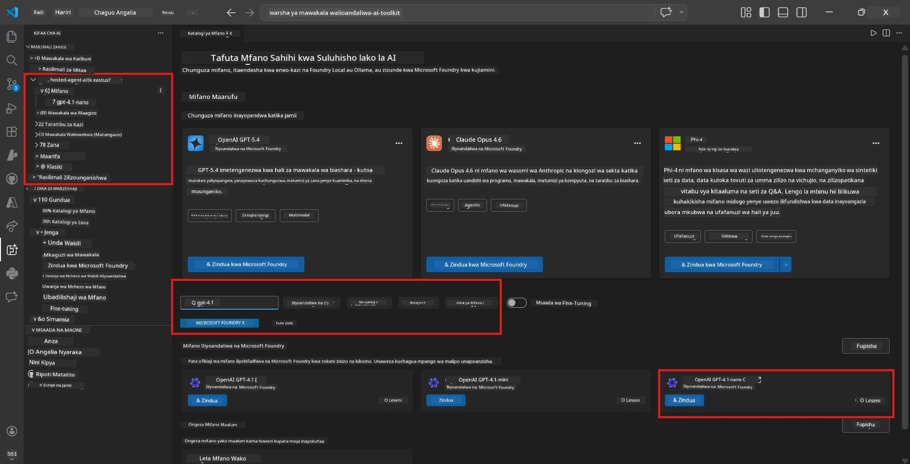
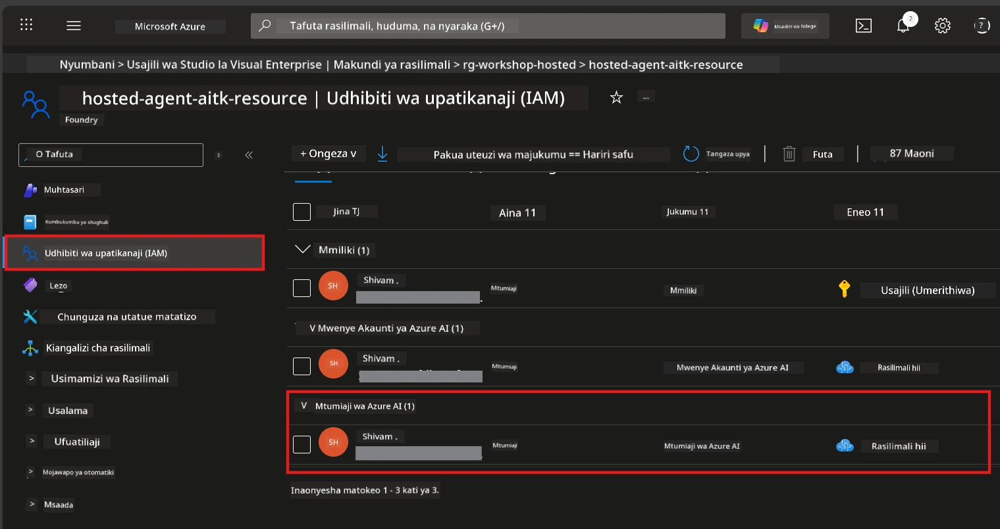

# Mipangilio: Kiongezi, Mradi & Mfano

⏱️ ~15 min

Katika moduli hii, unasanidua na kuthibitisha kiongezi cha Foundry Toolkit, unda (au unganisha na) mradi wa Foundry, na weka mfano ambao wakala wako atatumia.

## Hatua 1: Sanidi Foundry Toolkit

**Foundry Toolkit kwa VS Code** ni kiongezi kuu cha warsha hii. Kinatoa uundaji wa miradi, kuwekwa mifano, usanifu wa wakala, majaribio ya ndani (Kukagua Wakala), na uwekaji wingu - yote kutoka VS Code.

1. Fungua VS Code kisha bonyeza `Ctrl+Shift+X` kufungua jopo la **Extensions**.
2. Tafuta **Foundry Toolkit**.
3. Sakinisha **Foundry Toolkit kwa VS Code** (Mchapishaji: Microsoft, ID: `ms-windows-ai-studio.windows-ai-studio`).
4. Baada ya usakinishaji, ikoni ya **Foundry Toolkit** itaonekana kwenye Ukanda wa Shughuli (kilembo cha sidebar kushoto).

> *Kumbuka: Ukanda wa Shughuli unaweza kuonyesha "AI TOOLKIT" katika matoleo ya zamani ya kiongezi. Kazi ni sawa kabisa.*



## Hatua 2: Sanidi kulingana na upatikanaji wako

> **Chagua njia yako:** Panua sehemu hapa chini inayolingana na mipangilio yako. Unahitaji tu kukamilisha **njia moja**.

<details>
<summary><strong>🅰️ Njia A - Wingu la Azure (inahitaji usajili wa Azure)</strong></summary>

### Azure CLI

1. Sakinisha kutoka [learn.microsoft.com/cli/azure/install-azure-cli](https://learn.microsoft.com/cli/azure/install-azure-cli).
2. Thibitisha: `az --version` (tarajia 2.80.0+).
3. Ingia: `az login`

### Chaguzi za Uthibitishaji

[Microsoft Agent Framework](https://learn.microsoft.com/agent-framework/overview/) hutumia [`DefaultAzureCredential`](https://learn.microsoft.com/azure/developer/python/sdk/authentication/credential-chains#defaultazurecredential-overview) ambayo hujaribu mbinu mbalimbali za uthibitishaji kwa mfuatano. Chagua ile inayofaa mazingira yako:

#### Chaguo 1: Akaunti za VS Code (inapendekezwa kwa warsha)
1. Bonyeza ikoni ya **Akaunti** (silhouette ya mtu) pembeni ya chini kushoto ya VS Code.
2. Chagua **Ingia kutumia Microsoft Foundry** (au **Ingia na Azure**).
3. Kivinjari kinateka dirisha - ingia na akaunti ya Azure inayomiliki usajili wako.
4. Rudi VS Code. Unapaswa kuona jina la akaunti yako chini kushoto.

#### Chaguo 2: Azure CLI
```bash
az login
az account set --subscription "<your-subscription-id>"
```

#### Chaguo 3: Mwakilishi wa Huduma (Enterprise/CI)
Kwa mazingira yaliyofungwa au viunganishi vya CI/CD, weka vigezo hivi vya mazingira kwenye faili yako `.env`:
```env
AZURE_TENANT_ID=<your-tenant-id>
AZURE_CLIENT_ID=<your-client-id>
AZURE_CLIENT_SECRET=<your-client-secret>
```

> **Jinsi `DefaultAzureCredential` inavyofanya kazi:** Hujaribu vigezo vya mazingira kwanza, kisha kitambulisho kilichosimamiwa, kisha kuingia kwa VS Code, kisha Azure CLI - na hutumia ile inayofaulu kwanza. Angalia [nyaraka za mnyororo wa vyeti](https://learn.microsoft.com/azure/developer/python/sdk/authentication/credential-chains#defaultazurecredential-overview).

### Azure Developer CLI (azd)

1. Sakinisha: `winget install microsoft.azd` (Windows) au angalia [nyaraka za usakinishaji](https://learn.microsoft.com/azure/developer/azure-developer-cli/install-azd).
2. Thibitisha: `azd version`
3. Ingia: `azd auth login`

### Docker Desktop (hiari)

Docker inahitajika tu ikiwa unataka kujenga kontena kwa ndani. Kiongezi cha Foundry hufanya ujenzi kiotomatiki wakati wa uwekaji.

1. Sakinisha kutoka [docs.docker.com/get-docker](https://docs.docker.com/get-docker/).
2. Thibitisha: `docker info`

### Usajili wa Azure & RBAC

1. Ingia kwenye [portal.azure.com](https://portal.azure.com).
2. Nenda kwenye **Subscriptions** na thibitisha angalau moja ni **Inayofanya kazi**.
3. Kumbuka **Subscription ID** yako - utahitaji kwenye Moduli 01.



#### Jedwali la Muktadha wa RBAC

Uwekaji wa [Hosted Agent](https://learn.microsoft.com/azure/foundry/agents/concepts/hosted-agents) unahitaji ruhusa za *kitendo cha data* ambazo majukumu ya kawaida ya Azure `Owner` na `Contributor` hayajumlishwi. Tumia jedwali hapo chini kubaini majukumu unayohitaji:

| Muktadha | Majukumu Yanayohitajika | Mahali pa kupewa |
|----------|------------------------|----------------------|
| Tengeneza mradi mpya wa Foundry | **Azure AI Owner** kwenye rasilimali ya Foundry | Rasilimali ya Foundry katika Azure Portal |
| Weka kwenye mradi uliopo (rasilimali mpya) | **Azure AI Owner** + **Contributor** kwenye usajili | Usajili + Rasilimali ya Foundry |
| Weka kwenye mradi ulio songezwa kikamilifu | **Reader** kwenye akaunti + **Azure AI User** kwenye mradi | Akaunti + Mradi katika Azure Portal |
| Majaribio ya ndani tu (hakuna uwekaji) | **Azure AI User** kwenye mradi | Mradi katika Azure Portal |

> **Kidokezo Muhimu:** Majukumu ya Azure `Owner` na `Contributor` yanahusiana tu na ruhusa za usimamizi (operesheni za ARM). Unahitaji [**Azure AI User**](https://learn.microsoft.com/azure/foundry/concepts/rbac-foundry#built-in-roles) (au zaidi) kwa *matendo ya data* kama `agents/write` ambayo yanahitajika kuunda na kuweka wakala.

## Unganisha au unda mradi wa Foundry



1. Bonyeza `Ctrl+Shift+P` → andika **Foundry Toolkit: Create Project** → chagua.
2. Chagua **usajili wa Azure** kutoka menyu kunjuzi.
3. Chagua au unda **kundi la rasilimali** (mfano, `rg-hosted-agents-workshop`).
4. Chagua **mkoa** unaounga mkono wakala waliowekwa: `East US`, `West US 2`, au `Sweden Central`. Angalia [upatikanaji wa mkoa](https://learn.microsoft.com/azure/foundry/agents/concepts/hosted-agents#region-availability).
5. Ingiza jina la mradi (mfano, `workshop-agents`).
6. Subiri dakika 2–5 kwa upangaji. Arifa ya maendeleo itaonekana katika VS Code.
7. Ukimaliza, mradi wako utaonekana katika sidebar ya **Foundry Toolkit** chini ya **VYANZO VYANGU**.



## Weka mfano & toa jukumu la RBAC

Wakala wako aliyehifadhiwa anahitaji mfano wa AI kutoa majibu.

#### Matabua ya Uchaguzi wa Mfano
Kulingana na mahitaji yako, unaweza kuchagua kutoka ngazi tofauti za mifano:

| Mfano | Bora kwa | Gharama | Maelezo |
|-------|-----------|--------|---------|
| `gpt-4.1` | Majibu ya ubora wa juu, yaliyo na undani | Zaidi | Matokeo bora, yanapendekezwa kwa majaribio ya mwisho |
| `gpt-4.1-mini/gpt-5-mini` | Mzunguko wa haraka, gharama chini | Chini | Nzuri kwa maendeleo ya warsha na majaribio ya haraka |
| `gpt-4.1-nano` | Majukumu mepesi | Chini Sana | Gharama nafuu zaidi, lakini majibu ni rahisi |

1. Bonyeza `Ctrl+Shift+P` → **Foundry Toolkit: Open Model Catalog** (au bonyeza **Model Catalog** katika sidebar chini ya VIFAA VYA MWENYEJI → Gundua).
2. Tafuta **gpt-4.1** katika katalogi.
3. Tafuta **OpenAI GPT-4.1-mini** (au `gpt-5-mini` kwa ubora bora) na bonyeza **Deploy**.



4. Katika usanidi wa uwekaji:
   - **Jina la Uwekaji:** Acha la awali au ingiza jina lako. **Kumbuka jina hili.**
   - **Lengo:** Chagua **Deploy to Foundry Toolkit** → chagua mradi wako.
5. Bonyeza **Deploy** na subiri 1–3 dakika.

> **Mapendekezo:** Tumia `gpt-4.1-mini/gpt-5-mini` kwa warsha - haraka, nafuu, na hutoa matokeo mazuri.

### Kumbuka thamani zako

Baada ya uwekaji, kumbuka thamani hizi mbili (utazihitaji katika Moduli 03):

| Thamani | Mahali pa kuipata |
|--------|-------------------|
| **Kituo cha mradi** | Bonyeza mradi wako kwenye sidebar → maelezo yanaonyesha URL (mfano, `https://<account>.services.ai.azure.com/api/projects/<project>`) |
| **Jina la uwekaji wa mfano** | Panua mradi → **Models** → jina karibu na mfano uliowekwa (mfano, `gpt-4.1-mini/gpt-5-mini`) |

### Toa jukumu la RBAC

> ⚠️ **Huu ni hatua inayosahaulika mara nyingi zaidi.** Bila jukumu sahihi, uwekaji katika Moduli 05 utashindwa.

#### Jukumu gani linahitajika?
Kulingana na muktadha wako, unahitaji mchanganyiko wa majukumu ufuatao:

| Muktadha | Majukumu Yanayohitajika | Mahali pa kupewa |
|----------|------------------------|----------------------|
| Tengeneza mradi mpya wa Foundry | **Azure AI Owner** kwenye rasilimali ya Foundry | Rasilimali ya Foundry katika Azure Portal |
| Weka kwenye mradi uliopo (rasilimali mpya) | **Azure AI Owner** + **Contributor** kwenye usajili | Usajili + Rasilimali ya Foundry |
| Weka kwenye mradi ulio songezwa kikamilifu | **Reader** kwenye akaunti + **Azure AI User** kwenye mradi | Akaunti + Mradi katika Azure Portal |

**Kidokezo Muhimu:** Majukumu ya Azure `Owner` na `Contributor` yanahusiana tu na ruhusa za usimamizi. Unahitaji **Azure AI User** (au zaidi) kwa matendo ya data kama `agents/write` yanayohitajika kuunda na kuweka wakala.

1. Fungua [portal.azure.com](https://portal.azure.com).
2. Tafuta jina la **mradi wa Foundry** → bonyeza matokeo yenye aina **"Foundry Toolkit project"** (SIO akaunti mama).
3. Bonyeza **Access control (IAM)** katika utendaji wa kushoto.
4. Bonyeza **+ Add** → **Add role assignment**.
5. **Kichupo cha Jukumu:** Tafuta **Azure AI User**, ichague, bonyeza **Next**.
6. **Kichupo cha Wanachama:** Chagua **User, group, or service principal** → bonyeza **+ Select members** → tafuta na uchague wewe mwenyewe → bonyeza **Select**.
7. Bonyeza **Review + assign** → tena bonyeza **Review + assign**.
8. **Subiri 1–2 dakika** kwa maenea.

> **Kwa nini jukumu hili?** Azure `Owner`/`Contributor` hutoa ruhusa za usimamizi tu. Jukumu la **Azure AI User** hutoa kitendo cha data `agents/write` kinachohitajika kuunda na kuweka wakala. Angalia [nyaraka za Foundry RBAC](https://learn.microsoft.com/azure/foundry/concepts/rbac-foundry#built-in-roles).



</details>

<details>
<summary><strong>🅱️ Njia B - Ndani / kiwango cha bure (huna haja ya usajili wa Azure)</strong></summary>

### Foundry Local

Foundry Local hukuwezesha kuendesha mifano ya AI kwenye mashine yako mwenyewe - huna haja ya akaunti ya wingu. Unaweza kufikia mifano ya Foundry Local ukitumia Foundry Toolkit kupitia katalogi ya mfano kama ifuatavyo:

1. Nenda kwenye kiongezi cha Foundry Toolkit.
2. Katika urambazaji wa Foundry Toolkit nenda kwenye **Vifaa vya Mwanaendelezaji** > na chagua **Model Catalog**
3. Katika dirisha jipya, chagua **ndani** kutoka kwenye ukanda wa urambazaji.
4. Skrola chini kwa **Phi 4 Mini,** na bonyeza **kitufe cha kuongeza** dirisha litafunguka likionyesha mfano unapakuliwa.
5. Mara mfano unapopakuliwa, unaweza kuendelea na hatua inayofuata.

</details>

### ✅ Kagua


- [ ] `Ctrl+Shift+P` → "Foundry Toolkit" inaonyesha amri zinazopatikana
- [ ] Kiongezi cha Foundry Toolkit kimesakinishwa na sidebar inapakia bila makosa
- [ ] VS Code inafunguliwa na kuendesha vizuri
- [ ] `python --version` inaonyesha 3.10+
- [ ] Ikoni ya Foundry Toolkit inaonekana katika Ukanda wa Shughuli wa VS Code
- [ ] **Njia A:** `az login` imefanikiwa, usajili ni Hai
- [ ] **Njia B:** Foundry Local inaendesha (`foundry local status`)
- [ ] **Njia A:** Mradi wa Foundry unaonekana kwenye sidebar, mfano umewekwa, jukumu la Azure AI User limewekwa
- [ ] **Njia B:** Foundry Local inaendesha na mfano
- [ ] Umeandika **kituo** chako na **jina la uwekaji wa mfano**


**Iliyopita:** [00 - Mahitaji](00-prerequisites.md) · **Ifuatayo:** [02 - Unda Wakala Aliyehifadhiwa →](02-create-hosted-agent.md)

---

<!-- CO-OP TRANSLATOR DISCLAIMER START -->
**Kionyozo**:
Hati hii imetafsiriwa kwa kutumia huduma ya tafsiri ya AI [Co-op Translator](https://github.com/Azure/co-op-translator). Ingawa tunajitahidi kupata usahihi, tafadhali fahamu kwamba tafsiri za kiotomatiki zinaweza kuwa na makosa au upungufu wa usahihi. Hati ya asili katika lugha yake halisi inapaswa kuchukuliwa kama chanzo cha mamlaka. Kwa taarifa muhimu, tafsiri ya kitaalamu inayofanywa na binadamu inapendekezwa. Hatutojibu kwa kuelewa vibaya au tafsiri potofu zinazotokea kutokana na matumizi ya tafsiri hii.
<!-- CO-OP TRANSLATOR DISCLAIMER END -->