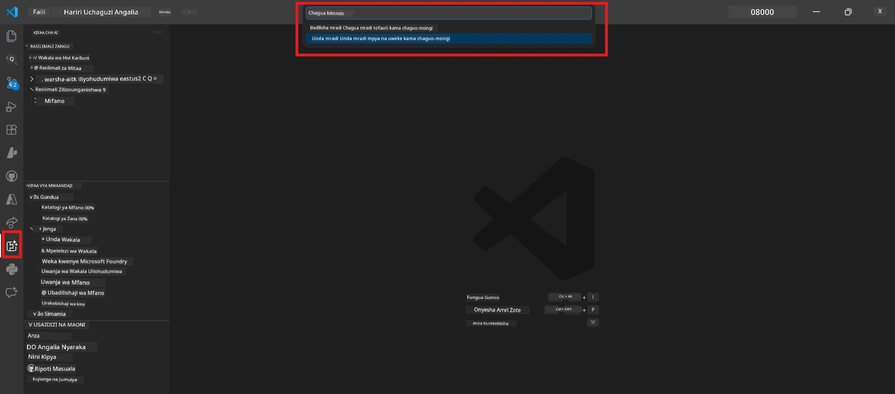
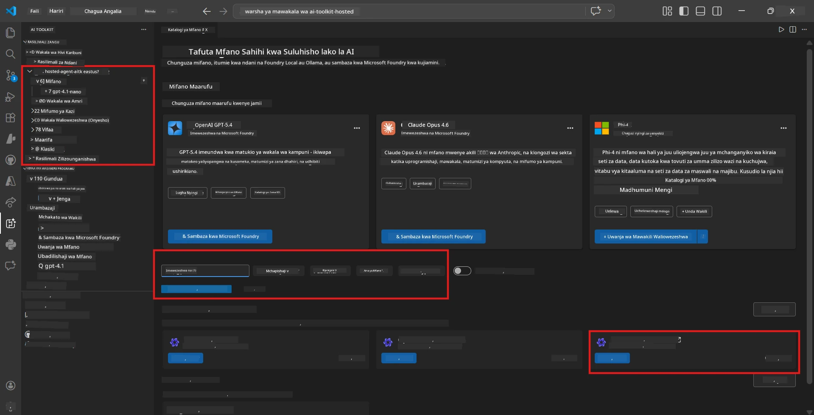
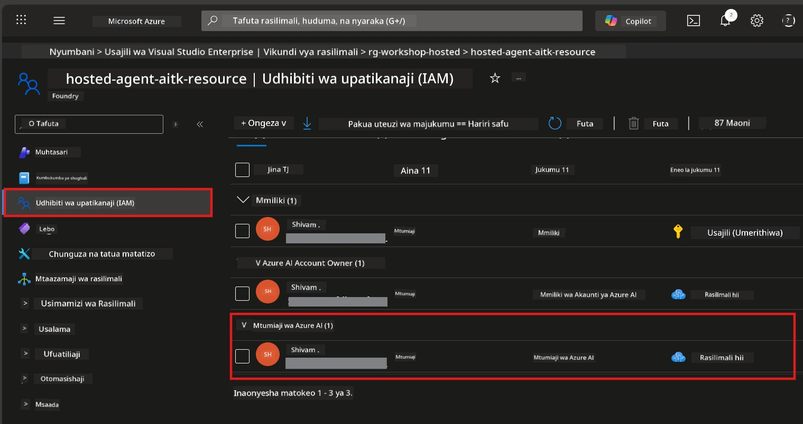

# Moduli 2 - Unda Mradi wa Foundry & Tuma Mfano

Katika moduli hii, utaunda (au kuchagua) mradi wa Microsoft Foundry na kuweka mfano ambao wakala wako atatumia. Kila hatua imeandikwa wazi - ifuate kwa mpangilio.

> Ikiwa tayari una mradi wa Foundry wenye mfano uliowekwa, ruka hadi [Moduli 3](03-create-hosted-agent.md).

---

## Hatua ya 1: Unda mradi wa Foundry kutoka VS Code

Utatumia ugani wa Microsoft Foundry kuunda mradi bila kuondoka VS Code.

1. Bonyeza `Ctrl+Shift+P` kufungua **Command Palette**.
2. Andika: **Microsoft Foundry: Create Project** na uchague.
3. Menyu ya kushuka itaonekana - chagua **Azure subscription** yako kutoka orodha.
4. Utaulizwa kuchagua au kuunda **resource group**:
   - Kuunda mpya: andika jina (km. `rg-hosted-agents-workshop`) kisha bonyeza Enter.
   - Kutumia iliyo tayari: chagua kutoka kwenye menyu ya kushuka.
5. Chagua **eneo** (region). **Muhimu:** Chagua eneo linalounga mkono baadhi ya wakala waliowekwa. Angalia [upatikanaji wa regio](https://learn.microsoft.com/azure/foundry/agents/concepts/hosted-agents#region-availability) - chaguzi za kawaida ni `East US`, `West US 2`, au `Sweden Central`.
6. Ingiza **jina** la mradi wa Foundry (km. `workshop-agents`).
7. Bonyeza Enter na subiri usambazaji ukamilike.

> **Usambazaji huchukua dakika 2-5.** Utaona taarifa ya maendeleo upande wa chini kulia wa VS Code. Usifunge VS Code wakati wa usambazaji.

8. Ukimaliza, pembeni ya Microsoft Foundry itaonyesha mradi wako mpya chini ya **Resources**.
9. Bonyeza jina la mradi kupanua na kuthibitisha ina sehemu kama **Models + endpoints** na **Agents**.



### Mbadala: Unda kupitia Portal ya Foundry

Ikiwa unapendelea kutumia kivinjari:

1. Fungua [https://ai.azure.com](https://ai.azure.com) na ingia.
2. Bonyeza **Create project** kwenye ukurasa wa mwanzo.
3. Ingiza jina la mradi, chagua usajili wako, kikundi cha rasilimali, na eneo.
4. Bonyeza **Create** na subiri usambazaji.
5. Mara mradi utakapoundwa, rudi VS Code - mradi utakuwa katika pembeni ya Foundry baada ya kusasisha (bonyeza ikoni ya kusasisha).

---

## Hatua ya 2: Weka mfano

[Wakala wako aliyepangwa](https://learn.microsoft.com/azure/foundry/agents/concepts/hosted-agents) anahitaji mfano wa Azure OpenAI kutengeneza majibu. Utauweka [mfano mmoja sasa](https://learn.microsoft.com/azure/ai-foundry/openai/how-to/create-resource#deploy-a-model).

1. Bonyeza `Ctrl+Shift+P` kufungua **Command Palette**.
2. Andika: **Microsoft Foundry: Open [Model Catalog](https://learn.microsoft.com/azure/ai-foundry/openai/concepts/models)** na ichague.
3. Muonekano wa Katalogi ya Mfano utafunguka ndani ya VS Code. Vinjari au tumia eneo la utafutaji kupata **gpt-4.1**.
4. Bonyeza kadi ya mfano **gpt-4.1** (au `gpt-4.1-mini` ikiwa unataka gharama ya chini).
5. Bonyeza **Deploy**.


6. Katika usanidi wa usambazaji:
   - **Jina la usambazaji**: Acha la msingi (km. `gpt-4.1`) au andika jina lako. **Kumbuka jina hili** - litahitajika katika Moduli 4.
   - **Target**: Chagua **Deploy to Microsoft Foundry** na uchague mradi uliounda.
7. Bonyeza **Deploy** na subiri usambazaji ukamilike (dakika 1-3).

### Kuchagua mfano

| Mfano | Bora kwa | Gharama | Maelezo |
|-------|----------|---------|---------|
| `gpt-4.1` | Majibu ya ubora wa juu, yenye maelezo | Juu zaidi | Matokeo bora, inapendekezwa kwa majaribio ya mwisho |
| `gpt-4.1-mini` | Mizunguko ya haraka, gharama ya chini | Chini zaidi | Nzuri kwa maendeleo ya warsha na majaribio ya haraka |
| `gpt-4.1-nano` | Kazi nyepesi | Chini kabisa | Gharama nafuu zaidi, lakini majibu rahisi |

> **Mapendekezo kwa warsha hii:** Tumia `gpt-4.1-mini` kwa maendeleo na majaribio. Ni haraka, bei rahisi, na huleta matokeo mazuri kwa mazoezi.

### Thibitisha usambazaji wa mfano

1. Katika pembeni ya **Microsoft Foundry**, panua mradi wako.
2. Angalia chini ya **Models + endpoints** (au sehemu inayofanana).
3. Unapaswa kuona mfano uliowekwa (km. `gpt-4.1-mini`) ikiwa na hali ya **Succeeded** au **Active**.
4. Bonyeza kwenye usambazaji wa mfano kuona maelezo yake.
5. **Kumbuka** hizi thamani mbili - utazihitaji Moduli 4:

   | Kiwango | Mahali pa kukipata | Thamani Mfano |
   |---------|--------------------|---------------|
   | **Kuingilio la mradi** | Bonyeza jina la mradi katika pembeni ya Foundry. URL ya kuingilio inaonyeshwa katika maelezo. | `https://<account>.services.ai.azure.com/api/projects/<project>` |
   | **Jina la usambazaji wa mfano** | Jina linaonyeshwa karibu na mfano uliowekwa. | `gpt-4.1-mini` |

---

## Hatua ya 3: Toa majukumu ya RBAC yanayohitajika

Hii ni **hatua inayokosewa mara kwa mara zaidi**. Bila majukumu sahihi, usambazaji katika Moduli 6 utashindwa na kosa la ruhusa.

### 3.1 Toa jukumu la Azure AI User kwako mwenyewe

1. Fungua kivinjari na nenda [https://portal.azure.com](https://portal.azure.com).
2. Katika eneo la utafutaji juu, andika jina la **mradi wako wa Foundry** na ubofye matokeo.
   - **Muhimu:** Nenda kwenye rasilimali ya **mradi** (aina: "Microsoft Foundry project"), sio akaunti mama/kituo.
3. Katika sehemu ya kushoto ya mradi, bonyeza **Access control (IAM)**.
4. Bonyeza kitufe cha **+ Add** juu → chagua **Add role assignment**.
5. Katika tabo la **Role**, tafuta [**Azure AI User**](https://learn.microsoft.com/azure/foundry/concepts/rbac-foundry#built-in-roles) na ichague. Bonyeza **Next**.
6. Katika tabo la **Members**:
   - Chagua **User, group, or service principal**.
   - Bonyeza **+ Select members**.
   - Tafuta jina lako au barua pepe, jiweke mwenyewe, kisha bonyeza **Select**.
7. Bonyeza **Review + assign** → kisha tena **Review + assign** kuthibitisha.



### 3.2 (Hiari) Toa jukumu la Azure AI Developer

Ikiwa unahitaji kuunda rasilimali za ziada ndani ya mradi au kusimamia usambazaji programmatically:

1. Rudia hatua hapo juu, lakini hatua ya 5 chagua **Azure AI Developer** badala yake.
2. Toa hii katika kiwango cha **Foundry resource (akaunti)**, sio tu kiwango cha mradi.

### 3.3 Thibitisha majukumu yako

1. Kwenye ukurasa wa **Access control (IAM)** wa mradi, bonyeza tabo ya **Role assignments**.
2. Tafuta jina lako.
3. Unapaswa kuona angalau **Azure AI User** ikiwa imetolewa kwa wigo wa mradi.

> **Kwa nini hili ni muhimu:** Jukumu la [`Azure AI User`](https://learn.microsoft.com/azure/foundry/concepts/rbac-foundry#built-in-roles) hutoa kitendo cha data `Microsoft.CognitiveServices/accounts/AIServices/agents/write`. Bila hilo, utaona kosa hili wakati wa usambazaji:
>
> ```
> Error: lacks the required data action 
> Microsoft.CognitiveServices/accounts/AIServices/agents/write 
> to perform POST /api/projects/{projectName}/assistants operation.
> ```
>
> Tazama [Moduli 8 - Kuondoa matatizo](08-troubleshooting.md) kwa maelezo zaidi.

---

### Kagua

- [ ] Mradi wa Foundry upo na unaonekana katika pembeni ya Microsoft Foundry ndani ya VS Code
- [ ] Angalau mfano mmoja umewekwa (km. `gpt-4.1-mini`) na hali ya **Succeeded**
- [ ] Umeandika URL ya **kuingilio la mradi** na **jina la usambazaji wa mfano**
- [ ] Una jukumu la **Azure AI User** katika kiwango cha **mradi** (thibitisha katika Azure Portal → IAM → Role assignments)
- [ ] Mradi uko katika [eneo linalotegemewa](https://learn.microsoft.com/azure/foundry/agents/concepts/hosted-agents#region-availability) kwa wakala waliowekwa

---

**Iliyopita:** [01 - Install Foundry Toolkit](01-install-foundry-toolkit.md) · **Ifuatayo:** [03 - Create a Hosted Agent →](03-create-hosted-agent.md)

---

<!-- CO-OP TRANSLATOR DISCLAIMER START -->
**Kasi ya Kukataa**:  
Hati hii imetafsiriwa kwa kutumia huduma ya tafsiri ya AI [Co-op Translator](https://github.com/Azure/co-op-translator). Ingawa tunajitahidi kwa usahihi, tafadhali fahamu kuwa tafsiri za kiotomatiki zinaweza kuwa na makosa au upungufu wa usahihi. Hati ya asili katika lugha yake ya asili inapaswa kuzingatiwa kama chanzo cha mamlaka. Kwa taarifa muhimu, tafsiri ya kitaalamu ya binadamu inashauriwa. Hatuelezaji kwa mabaya yoyote au maana potofu zinazotokana na matumizi ya tafsiri hii.
<!-- CO-OP TRANSLATOR DISCLAIMER END -->