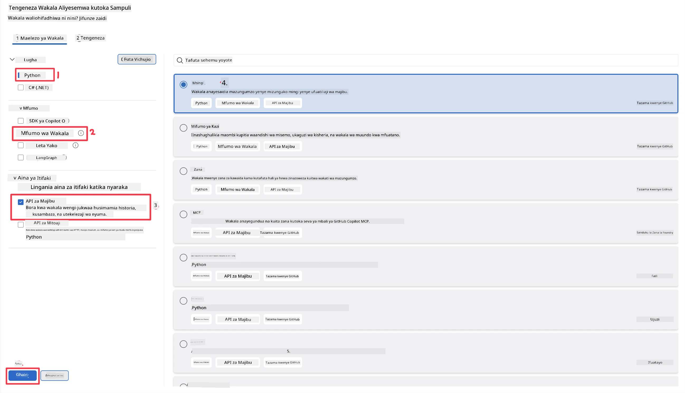
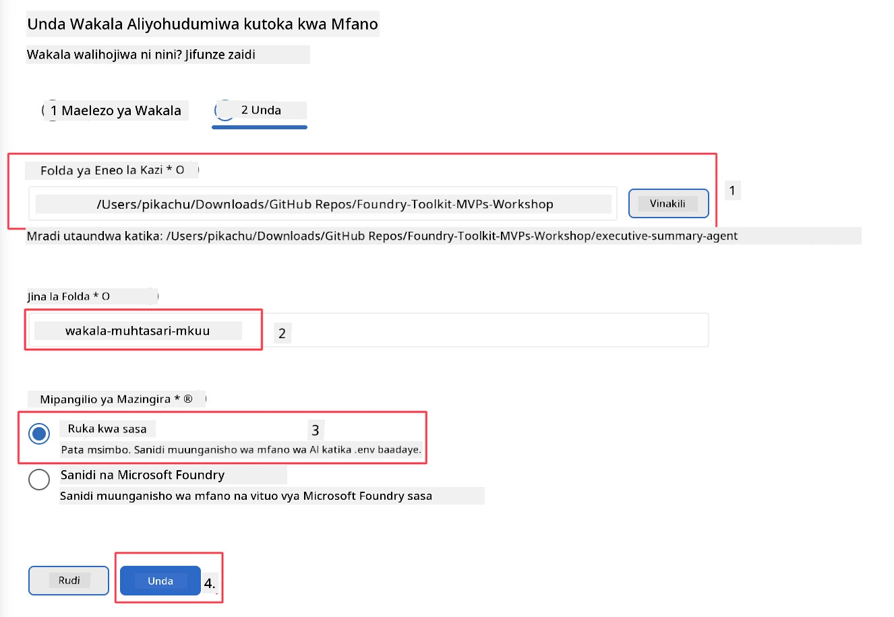

# Moduli 2 - Unda Wakala Mpya Aliyesimamiwa

⏱️ ~5 min

Katika moduli hii, unatumia Foundry Toolkit **kuunda mradi wa wakala aliyohudumiwa**. Mfumo huu huunda muundo mzima wa mradi - `agent.yaml`, `main.py`, `Dockerfile`, `requirements.txt`, na usanidi wa uingizaji wa VS Code - ili uweze kuzingatia kubadilisha tabia ya wakala.

> **Dhana muhimu:** Folda ya `agent/` katika mazoezi haya ni mfano wa kile ambacho Foundry Toolkit hutengeneza. Huwezi kuandika faili hizi kutoka mwanzo.

### Mtiririko wa Sihirizi ya Scaffold

```mermaid
flowchart LR
    A["Command Palette:
    Create new Hosted Agent"] --> B["Language:
    Python"]
    B --> C["API type:
    Response API"]
    C --> D["Template:
    Basic - Agent Framework"]
    D --> E["Chagua mfano"]
    E --> F["Workspace folder
    & agent name"]
    F --> G["Mradi uliotengenezwa"]

    style A fill:#4A90D9,color:#fff
    style B fill:#7B68EE,color:#fff
    style C fill:#7B68EE,color:#fff
    style D fill:#7B68EE,color:#fff
    style E fill:#7B68EE,color:#fff
    style F fill:#7B68EE,color:#fff
    style G fill:#27AE60,color:#fff
```



---

## Hatua 1: Fungua Sihirizi ya Unda Wakala Aliyesimamiwa

1. Bonyeza `Ctrl+Shift+P` kufungua **Command Palette**.
2. Andika: **Foundry Toolkit: Create new Hosted Agent** na uchague.

> **Mbadala: Unda kupitia Foundry Portal**
> Ikiwa unapendelea kivinjari, unaweza kuunda mradi wako kwenye [https://ai.azure.com](https://ai.azure.com). Mara mradi unapowekwa, rudi VS Code na tumia barani ya Foundry Toolkit kuunganisha nao.

> **Mbadala:** Bonyeza ikoni ya **+** karibu na **Hosted Agents (Preview)** kwenye barani ya Foundry Toolkit.

## Hatua 2: Chagua mipangilio



1. Katika sehemu ya urambazaji/kuchagua upande wa kushoto chagua yafuatayo:

| Menyu | Uchaguzi | Vidokezo |
|--------|-----------|-------|
| **Lugha** | Python | C# pia inasaidiwa |
| **Mfumo** | Agent Framework | Msingi rahisi kutumia Agent Framework SDK |
| **Aina ya API** | Response API | `POST /responses` - mazungumzo, na historia inayosimamiwa na jukwaa |
| **Kiolezo** | Msingi | Msingi rahisi kutumia Agent Framework SDK |

2. Mara uchaguzo utakapokamilika, bonyeza **Next**



3. Katika dirisha lijalo, chagua yafuatayo:

| Menyu | Uchaguzi | Vidokezo |
|--------|-----------|-------|
| **Folda ya kazi** | Chagua folda lengwa | mf. `/workspace/Foundry_Toolkit_for_VSCode_Lab/` au folda ndogo katika repo hii |
| **Jina la wakala** | Weka jina | mf. `executive-summary-agent` |
| **Mipangilio ya Mazingira** | ruka mipangilio kwa sasa |  |

Bonyeza **create** kuunda wakala wetu. Folda mpya itaundwa na jina la wakala aliyesimamiwa.

## Hatua 3: Angalia mradi uliotengenezwa

Baada ya kukamilika kwa scaffolding, hakikisha unaona faili hizi katika Explorer (`Ctrl+Shift+E`):

```
📂 my-agent/
├── .env                ← Environment variables (placeholders)
├── .vscode/
│   ├── launch.json     ← Debug config (F5 → run + Agent Inspector)
│   └── tasks.json      ← VS Code task definitions
├── agent.yaml          ← Agent definition (kind: hosted)
├── Dockerfile          ← Container config for deployment
├── main.py             ← Agent entry point (your main code)
└── requirements.txt    ← Python dependencies
```

### Faili Muhimu Elezewa

| Faili | Kusudi |
|------|---------|
| `agent.yaml` | Inaweka wakala kama `kind: hosted`, inaelekeza mabadiliko ya mazingira, inaainisha itifaki ya `/responses` |
| `main.py` | Unda `FoundryChatClient` → inazunguka ndani ya `Agent` na maelekezo → inahudumia kupitia `ResponsesHostServer` kwenye bandari 8088 |
| `Dockerfile` | Inatumia `python:3.12-slim`, inasakinisha utegemezi, inaonyesha bandari 8088, inaendesha `main.py` |
| `requirements.txt` | `agent-framework-foundry`, `agent-framework-foundry-hosting`, `mcp`, `debugpy` |

> **Muhimu:** Fungua folda ya wakala iliyosafishwa moja kwa moja ndani ya VS Code (folda ya `agent/` yenyewe) ili `.vscode/launch.json` na `tasks.json` zifanye kazi vizuri kwa uingizaji wa F5.

---

### ✅ Kituo cha Ukuaji

- [ ] Mradi uliosafishwa umeundwa na faili zote zilizoidhinishwa
- [ ] `agent.yaml` inaonyesha `kind: hosted` na `protocol: responses`
- [ ] `main.py` inaingiza `Agent`, `FoundryChatClient`, `ResponsesHostServer`
- [ ] Folda ya wakala imefunguliwa VS Code kama mizizi ya mazingira ya kazi

---

**Iliyotangulia:** [01 - Setup](01-setup.md) · **Inayofuata:** [03 - Configure & Code →](03-configure-and-code.md)

---

<!-- CO-OP TRANSLATOR DISCLAIMER START -->
**Kionyozo**:
Hati hii imetafsiriwa kwa kutumia huduma ya tafsiri ya AI [Co-op Translator](https://github.com/Azure/co-op-translator). Ingawa tunajitahidi kupata usahihi, tafadhali fahamu kwamba tafsiri za kiotomatiki zinaweza kuwa na makosa au upungufu wa usahihi. Hati ya asili katika lugha yake halisi inapaswa kuchukuliwa kama chanzo cha mamlaka. Kwa taarifa muhimu, tafsiri ya kitaalamu inayofanywa na binadamu inapendekezwa. Hatutojibu kwa kuelewa vibaya au tafsiri potofu zinazotokea kutokana na matumizi ya tafsiri hii.
<!-- CO-OP TRANSLATOR DISCLAIMER END -->