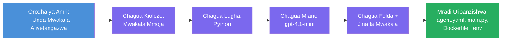

# Moduli 3 - Tengeneza Wakala Mpya Aliyetangazwa (Umeundwa Moja kwa Moja na Kiendelezi cha Foundry)

Katika moduli hii, utatumia kiendelezi cha Microsoft Foundry ili **kuunda mradi mpya wa [wakala aliyethibitishwa](https://learn.microsoft.com/azure/foundry/agents/concepts/hosted-agents)**. Kiendelezi kinaandika muundo mzima wa mradi kwa ajili yako - ikiwa ni pamoja na `agent.yaml`, `main.py`, `Dockerfile`, `requirements.txt`, faili ya `.env`, na usanidi wa urekebishaji wa VS Code. Baada ya kuunda muundo, ubadilishe faili hizi kwa maagizo, zana, na usanidi wa wakala wako.

> **Dhana kuu:** Folda ya `agent/` katika maabara hii ni mfano wa kile kinachoundwa na kiendelezi cha Foundry unapoendesha amri hii ya kuunda muundo. Huwezi kuandika faili hizi kutoka mwanzo - kiendelezi kinaanzisha faili hizi, na kisha wewe hubadilisha.

### Mtiririko wa kichawi cha kuunda muundo


---

## Hatua 1: Fungua kichawi cha Kuunda Wakala Aliyetangazwa

1. Bonyeza `Ctrl+Shift+P` kufungua **Command Palette**.
2. Andika: **Microsoft Foundry: Create a New Hosted Agent** na uchague.
3. Kichawi cha kuunda wakala uliohifadhiwa kinafunguka.

> **Njia mbadala:** Pia unaweza kufikia kichawi hiki kutoka upande wa Microsoft Foundry → bonyeza ikoni ya **+** karibu na **Agents** au bonyeza-kulia na uchague **Create New Hosted Agent**.

---

## Hatua 2: Chagua kiolezo chako

Kichawi kitakuuliza uchague kiolezo. Utaona chaguzi kama:

| Kiolezo | Maelezo | Wakati wa kutumia |
|----------|-------------|-------------|
| **Wakala Mmoja** | Wakala mmoja mwenye mfano wake, maagizo, na zana za hiari | Maabara hii (Lab 01) |
| **Mtiririko wa Wakala Wengi** | Wakala wengi wanaofanya kazi pamoja kwa mfuatano | Lab 02 |

1. Chagua **Wakala Mmoja**.
2. Bonyeza **Next** (au uteuzi unaendelea moja kwa moja).

---

## Hatua 3: Chagua lugha ya programu

1. Chagua **Python** (inapendekezwa kwa maabara hii).
2. Bonyeza **Next**.

> **C# pia inasaidia** kama unapendelea .NET. Muundo wa muundo ni sawa (hutumia `Program.cs` badala ya `main.py`).

---

## Hatua 4: Chagua mfano wako

1. Kichawi kinaonyesha mifano iliyowekwa kwenye mradi wako wa Foundry (kutoka Moduli 2).
2. Chagua mfano uliouweka - mfano, **gpt-4.1-mini**.
3. Bonyeza **Next**.

> Ikiwa hauoni mifano yoyote, rudi kwa [Moduli 2](02-create-foundry-project.md) na weka mfano kwanza.

---

## Hatua 5: Chagua eneo la folda na jina la wakala

1. Dirisha la faili linafunguka - chagua **folda lengwa** ambapo mradi utaanzishwa. Kwa maabara hii:
   - Ikiwa unaanza mpya: chagua folda yoyote (mfano, `C:\Projects\my-agent`)
   - Ikiwa unafanya kazi ndani ya repo ya maabara: tengeneza folda ndogo mpya chini ya `workshop/lab01-single-agent/agent/`
2. Ingiza **jina** la wakala aliyethibitishwa (mfano, `executive-summary-agent` au `my-first-agent`).
3. Bonyeza **Create** (au bonyeza Enter).

---

## Hatua 6: Subiri muundo ukamilike

1. VS Code inafungua **dirisha jipya** likiwa na mradi ulioundwa.
2. Subiri sekunde chache kwa mradi kupakia kikamilifu.
3. Unapaswa kuona faili zifuatazo katika paneli ya Explorer (`Ctrl+Shift+E`):

```
📂 my-first-agent/
├── .env                ← Environment variables (auto-generated with placeholders)
├── .vscode/
│   └── launch.json     ← Debug configuration (F5 to run + Agent Inspector)
├── agent.yaml          ← Agent definition (kind: hosted)
├── Dockerfile          ← Container configuration for deployment
├── main.py             ← Agent entry point (your main code file)
└── requirements.txt    ← Python dependencies
```

> **Huu ni muundo uleule wa folda ya `agent/`** katika maabara hii. Kiendelezi cha Foundry huunda faili hizi moja kwa moja - huwezi kuzitengeneza kwa mkono.

> **Kumbuka maabara:** Katika repo hii ya maabara, folda ya `.vscode/` iko kwenye **mzizi wa nafasi ya kazi** (si ndani ya kila mradi). Ina `launch.json` na `tasks.json` ya pamoja yenye usanidi wa urekebishaji mbili - **"Lab01 - Single Agent"** na **"Lab02 - Multi-Agent"** - kila moja ikielekeza kwa `cwd` ya maabara husika. Unapobonyeza F5, chagua usanidi unaolingana na maabara unayofanya kazi nayo kutoka kwenye menyu.

---

## Hatua 7: Elewa kila faili lililotengenezwa

Chukua muda ukague kila faili kichawi kiliunda. Kuelewa hii ni muhimu kwa Moduli 4 (kurekebisha).

### 7.1 `agent.yaml` - Ufafanuzi wa wakala

Fungua `agent.yaml`. Inaonekana hivi:

```yaml
# yaml-language-server: $schema=https://raw.githubusercontent.com/microsoft/AgentSchema/refs/heads/main/schemas/v1.0/ContainerAgent.yaml

kind: hosted
name: my-first-agent
description: >
  A hosted agent deployed to Microsoft Foundry Agent Service.
metadata:
  authors:
    - Microsoft
  tags:
    - Azure AI AgentServer
    - Microsoft Agent Framework
    - Hosted Agent
protocols:
  - protocol: responses
    version: v1
environment_variables:
  - name: AZURE_AI_PROJECT_ENDPOINT
    value: ${PROJECT_ENDPOINT}
  - name: AZURE_AI_MODEL_DEPLOYMENT_NAME
    value: ${MODEL_DEPLOYMENT_NAME}
dockerfile_path: Dockerfile
resources:
  cpu: '0.25'
  memory: 0.5Gi
```

**Sehemu muhimu:**

| Sehemu | Kusudi |
|-------|---------|
| `kind: hosted` | Inatangaza kuwa huyu ni wakala aliyepakiwa (anayetumia kontena, ameenezwa kwa [Foundry Agent Service](https://learn.microsoft.com/azure/foundry/agents/overview)) |
| `protocols: responses v1` | Wakala huwasiliana na kiungo cha HTTP `/responses` kinachozingatia OpenAI |
| `environment_variables` | Huanika thamani za `.env` kwa tofauti za mazingira ya kontena wakati wa uenezaji |
| `dockerfile_path` | Inaelekeza kwenye Dockerfile inayotumika kujenga picha ya kontena |
| `resources` | Ugawaji wa CPU na kumbukumbu kwa kontena (0.25 CPU, 0.5Gi kumbukumbu) |

### 7.2 `main.py` - Njia kuu ya kuingia wakala

Fungua `main.py`. Huu ni faili kuu la Python ambapo mantiki ya wakala ipo. Muundo unajumuisha:

```python
from agent_framework.azure import AzureAIAgentClient
from azure.ai.agentserver.agentframework import from_agent_framework
from azure.identity.aio import DefaultAzureCredential
```

**Inayoleta muhimu:**

| Kuleta | Kusudi |
|--------|--------|
| `AzureAIAgentClient` | Inakuunganisha na mradi wako wa Foundry na kuunda wakala kupitia `.as_agent()` |
| [`DefaultAzureCredential`](https://learn.microsoft.com/azure/developer/python/sdk/authentication/credential-chains#defaultazurecredential-overview) | Inasimamia uthibitisho (Azure CLI, kuingia VS Code, utambulisho uliodhibitiwa, au huduma ya mstari) |
| `from_agent_framework` | Hufunika wakala kama seva ya HTTP inayoweka kiungo cha `/responses` |

Mtiririko mkuu ni:
1. Tengeneza uthibitisho → tengeneza mteja → itaje `.as_agent()` kupata wakala (muktadha usio wa kawaida) → uifunge kama seva → endesha

### 7.3 `Dockerfile` - Picha ya kontena

```dockerfile
FROM python:3.14-slim

WORKDIR /app

COPY ./ .

RUN pip install --upgrade pip && \
    if [ -f requirements.txt ]; then \
        pip install -r requirements.txt; \
    else \
        echo "No requirements.txt found" >&2; exit 1; \
    fi

EXPOSE 8088

CMD ["python", "main.py"]
```

**Maelezo muhimu:**
- Inatumia `python:3.14-slim` kama picha msingi.
- Nakili faili zote za mradi ndani ya `/app`.
- Inaboresha `pip`, inaweka kutegemea kutoka `requirements.txt`, na inatumbukia haraka kama faili hilo halipo.
- **Inaonyesha bandari 8088** - hii ndiyo bandari inayohitajika kwa wakala waliotangazwa. Usibadilishe.
- Anaanzisha wakala kwa `python main.py`.

### 7.4 `requirements.txt` - Kutegemea

```
agent-framework-azure-ai==1.0.0rc3
agent-framework-core==1.0.0rc3
azure-ai-agentserver-agentframework==1.0.0b16
azure-ai-agentserver-core==1.0.0b16
debugpy
agent-dev-cli
```

| Kifurushi | Kusudi |
|---------|---------|
| `agent-framework-azure-ai` | Uunganisho wa Azure AI kwa Microsoft Agent Framework |
| `agent-framework-core` | Kitovu cha wakati wa kuendesha kujenga wakala (kinajumuisha `python-dotenv`) |
| `azure-ai-agentserver-agentframework` | Muda wa seva ya wakala waliothibitishwa kwa Foundry Agent Service |
| `azure-ai-agentserver-core` | Misingi ya seva ya wakala |
| `debugpy` | Msaada wa urekebishaji wa Python (inaruhusu urekebishaji wa F5 katika VS Code) |
| `agent-dev-cli` | CLI ya maendeleo ya ndani kwa ajili ya kujaribu wakala (inatumika na usanidi wa urekebishaji/kuendesha) |

---

## Kuelewa itifaki ya wakala

Wakala waliothibitishwa huwasiliana kupitia itifaki ya **OpenAI Responses API**. Wakati wakala anaendesha (kitaalamu au katika wingu), hutoa kiungo kimoja cha HTTP:

```
POST http://localhost:8088/responses
Content-Type: application/json

{
  "input": "Your prompt here",
  "stream": false
}
```

Foundry Agent Service hupiga simu kiungoni hapo kutuma maelekezo ya mtumiaji na kupokea majibu ya wakala. Hii ni itifaki ile ile inayotumika na API ya OpenAI, hivyo wakala wako anaendana na mteja yeyote anayezungumza kwa muundo wa OpenAI Responses.

---

### Kiwango cha kukagua

- [ ] Kichawi cha muundo kimekamilika kwa mafanikio na **dirisha jipya la VS Code** limefunguka
- [ ] Unaweza kuona faili zote 5: `agent.yaml`, `main.py`, `Dockerfile`, `requirements.txt`, `.env`
- [ ] Faili ya `.vscode/launch.json` ipo (inawezesha urekebishaji wa F5 - katika maabara hii iko mzizi wa nafasi ya kazi na usanidi maalum wa maabara)
- [ ] Umesoma kila faili na kuelewa kusudi lake
- [ ] Umeelewa kuwa bandari `8088` inahitajika na kiungo cha `/responses` ni itifaki

---

**Iliyotangulia:** [02 - Create Foundry Project](02-create-foundry-project.md) · **Inayofuata:** [04 - Configure & Code →](04-configure-and-code.md)

---

<!-- CO-OP TRANSLATOR DISCLAIMER START -->
**Kisahihi cha kutolewa kwa taarifa**:  
Hati hii imetafsiriwa kwa kutumia huduma ya utafsiri wa AI [Co-op Translator](https://github.com/Azure/co-op-translator). Ingawa tunajitahidi kwa usahihi, tafadhali fahamu kwamba tafsiri zinazotengenezwa kiotomatiki zinaweza kuwa na makosa au kasoro. Hati ya awali katika lugha yake asilia inapaswa kuchukuliwa kama chanzo cha mamlaka. Kwa taarifa muhimu, tafsiri ya kitaalamu inayofanywa na binadamu inapendekezwa. Hatuwajibiki kwa kutoelewana au tafsiri potofu zinazotokana na matumizi ya tafsiri hii.
<!-- CO-OP TRANSLATOR DISCLAIMER END -->